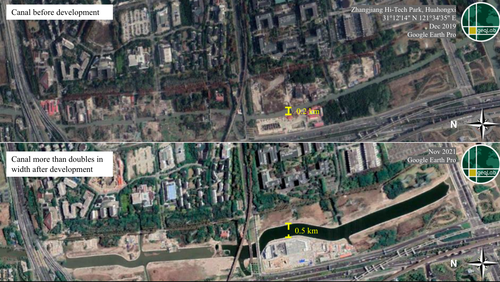
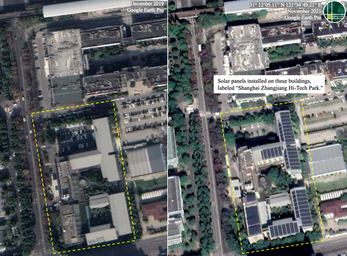
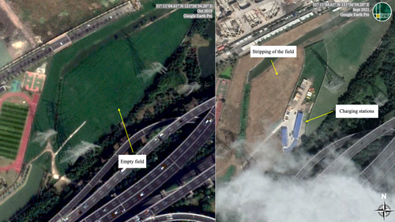

<!--
Allowed values:

type: district, plan

tags: Environment, Mobility, Buildings, Energy, InformationSystems, HealthEducation, InnovationSystems, CivicTech, CivicInnovation, Food

-->

## Overview

<!-- About 100 to 150 word summary of the case study. -->

Zhangjiang Hi-Tech Park in Shanghai’s Pudong district is a leading innovation hub aimed at positioning China at the forefront of high-tech industries. Launched in the 1990s and expanded under the "Made in China 2025" initiative, the park integrates advanced manufacturing, R&D, green technology, and digital infrastructure. It features strong transport connectivity via roads, ring roads, and canals to support trade and logistics, while promoting green development through solar energy, EV manufacturing, and charging infrastructure. Beyond tech, Zhangjiang contributes to economic growth, urban development, and environmental goals, serving as a testbed for smart city policies and global collaboration. However, concerns remain around affordability, long-term sustainability, and geopolitical uncertainty.

## Goals and Aspirations

<!-- What is the project trying to achieve? Identify 3-5 high-level goals that define the entire project.Replace the placeholder title with a succinct name for the goal. -->

**1. Promote Technological Innovation and Industrial Growth**  
The project aims to expand and strengthen the infrastructure of Zhangjiang Hi-Tech Park, with a particular focus on the high-tech and biopharmaceutical sectors, to promote innovation and attract both domestic and foreign investment. By focusing on the development of industries such as biotechnology, pharmaceuticals, and electric vehicles (EVs), the project seeks to accelerate technological breakthroughs and address emerging global challenges. By strengthening infrastructure, offering incentives for investment, and fostering a collaborative innovation ecosystem, Zhangjiang Hi-Tech Park will serve as a catalyst for technological progress, job creation, and sustainable economic growth.

**2. Strengthen Education and Talent Development**  
The establishment and growth of institutions like ShanghaiTech University within Zhangjiang Hi-Tech Park are designed to promote higher education and research, particularly in STEM fields. In addition to cultivating local talent, the park also attracts international professionals and experts, helping bridge knowledge gaps and create a dynamic, diverse intellectual ecosystem. The park has developed specialized programs, advanced research centers, and fostered collaboration with industries. By developing a skilled workforce and promoting collaboration between academia, research institutions, and industries, the park aims to accelerate technological breakthroughs, foster entrepreneurship, and establish a sustainable innovation ecosystem.

**3. Advance Green and Sustainable Development**  
A key objective of the project is to integrate sustainability and environmental consciousness across multiple sectors, particularly in manufacturing, energy production, and industrial development. By focusing on sustainable practices, the project aims to create a model for high-tech industries that not only drive innovation but also contribute to China’s long-term environmental and energy goals. By prioritizing green and sustainable development, the project aims to establish Zhangjiang Hi-Tech Park as a model for innovation that balances technological progress with environmental responsibility. This approach will not only contribute to China’s transition to a low-carbon economy but will also attract investment from environmentally-conscious businesses and international stakeholders, ensuring long-term economic and ecological sustainability.

## Key Characteristics

<!--  How is the project organized into specific activities that advance these goals? For plans: How does the plan address each of the three activities in digital master plans (development, engagement, implementation). For districts: How does the district employ 3-5 of the key characteristics of innovation hubs?
-->

**1. Concentration of Knowledge and Skills**  
Zhangjiang Hi-Tech Park strategically develops specialized clusters for industries such as biopharmaceuticals, semiconductors, and medical research. This clustering facilitates synergies among companies, accelerates technology transfer, and enhances sector competitiveness. ShanghaiTech University is central to the park’s emphasis on higher education and talent recruitment, driving research and development in high-demand fields like AI, biomedical engineering, and data science. Its collaboration with the Chinese Academy of Sciences further aligns education with innovation, helping to develop a skilled workforce that meets industry needs and supports growth. Additionally, the presence of research and development centers provides the necessary infrastructure for scientific breakthroughs. These R&D hubs support the innovation ecosystem by offering cutting-edge facilities and resources, ensuring that technology firms can thrive and continue to push the boundaries of innovation.

**2. Collaborative Ecosystem**  
The park’s emphasis on fostering synergies between industries, academic institutions, and foreign companies cultivates a collaborative environment that is conducive to innovation. By attracting multinational corporations and providing a supportive ecosystem for both foreign and domestic talent, the park encourages the exchange of ideas and knowledge, further driving technological advancements. The establishment of talent incubators attracts both overseas graduates and local technicians, underscores the park’s commitment to recruiting and developing skilled professionals. Moreover, the collaboration between Zhangjiang Park’s industries and academic institutions fosters an environment where new ideas and talent flow seamlessly between the two. This dynamic supports the development of research-driven enterprises and strengthens the intersection of academia and industry.

**3. Sustainability and Green Technologies**  
Zhangjiang Hi-Tech Park actively integrates green technologies to align with China’s national goals for carbon neutrality and sustainable development. The installation of solar panels on the rooftops of major buildings, such as those of Boehringer Ingelheim Pharmaceuticals, reflects the park’s commitment to environmentally conscious innovation. Furthermore, the development of infrastructure to support electric vehicles, including the construction of charging stations and dedicated EV manufacturing facilities, highlights its strategic focus on sustainable mobility and clean energy. These initiatives not only underscore the district’s prioritization of sustainability but also contribute to the growth of a robust green tech ecosystem. By fostering long-term environmental and technological solutions, Zhangjiang Park positions itself as a model for innovation that balances economic advancement with ecological responsibility.

## Stakeholders
<!--  Who initiated the project? Who is leading the project forward? Who else has a say in how it unfolds? Who is directly affected but marginalized? Identify 3-5 key stakeholder organizations or groups. Identify 3-5 key individuals. These are people who are associated with the project as leaders, supporters, critics, or regulators. They are likely to be members of the stakeholder groups identified above. These are people you should try to contact for one or more interviews.-->

**Organization 1: Shanghai Municipal Government**  
In August 1999, the Shanghai Municipal Committee and Municipal Government launched a strategic initiative report titled "Focus on Zhangjiang". The report identified the integrated circuit (IC), software, and biomedical industries as key drivers of innovation, economic growth, and job creation in Zhangjiang Town and the Hi-Tech Park. The Shanghai Municipal Government has played a vital role in shaping the park's strategic direction, guiding policy in talent recruitment, foreign investment, and infrastructure development. Meanwhile, they also provide funding, incentives, and long-term planning support, overseeing daily operations to ensure the park aligns with national and regional goals. [Shanghai Municipal Government](https://english.shanghai.gov.cn/)

**Organization 2: ShanghaiTech University**  
ShanghaiTech University, located at the southwestern corner of Zhangjiang Park, was established in 2013 through a partnership between the Shanghai Municipal Government and the Chinese Academy of Sciences - China's premier national research institution. As a leading academic hub, ShanghaiTech has a strong influence on research development, talent recruitment, and innovation within the park. The university actively promotes collaboration between local industries and international academic partners, helping to shape the talent pool and advance research and development aligned with the park's goals. It also contributes to elevating China's higher education landscope and strengthening its investment in science and technology. [ShanghaiTech University](https://www.shanghaitech.edu.cn/eng/)

**Organization 3: Roche Pharmaceuticals Co., Ltd.**  
In 1994, Roche became the first multinational pharmaceutical company to establish an overseas office in Zhangjiang Park, marking a significant milestone in the park's internationalization. With China as its key target market, Shanghai Roche has attracted foreign talent and investment, supporting the nation's broader goals of innovation and domestic development. Roche, alongside other major multinational contributors to Zhangjiang's innovation ecosystem, has helped drive the park's focus toward biotechnology, clean energy, and high-tech industries. Their continued investments, technological advancements, and strategic collaborators remain central to the park's sustained growth and global relevance. [Roche](https://www.roche.com/)

**Key Individual 1: President of ShanghaiTech University**  
In June 2024, Donglai Feng, a distinguished expert in condensed matter physics, became President of ShanghaiTech University. As the head of one of Zhangjiang Hi-Tech Park's most important academic institutions, Dr. Feng plays an important role in bridging research, education, and industry. Under his leadership, ShanghaiTech could contribute to the park's innovation system by talent development and research innovation. Dr. Feng is crucial in shaping both the intellectual capital and the innovation capacity of Zhangjiang Park, making him a key driver of its long-term success. [Donglai Feng](https://faculty.ustc.edu.cn/fengdonglai/en/index.htm)

**Key Individual 2: Mayor of Shanghai**  
Zheng Gong, the current Mayor of Shanghai, took office in March 2020. He holds a doctorate in economics and plays a central role in overseeing the operations of the municipal government. As the Mayor, Zheng has substantial influence over the formulation and implementation of city-level policies, infrastructure projects, and economic strategies that directly impact Zhangjiang Hi-Tech Park. His leadership is critical in shaping urban planning, guiding talent recruitment initiatives, and attracting foreign investment, making him a key policymaker in the park's continued development and integration into Shanghai's broader innovation agenda. [Zheng Gong](https://english.shanghai.gov.cn/en-MunicipalGovernmentLeaders/20231130/46a1e00ced864fb8bc37ebfa910cf532.html)

**Key Individual 3: Chairwoman of Shanghai Zhangjiang Group**  
Since May 2024, Weiwei Chen has served as the Chairwoman of Zhangjiang Group - the core organization responsible for the development and strategic management of Zhangjiang Hi-Tech Park. As the Group's highest-ranking official, Ms. Chen brings to the role a strong academic background, holding a Master's degree in Engineering and an EMBA. She has significant influence over the park's long-term vision, operational execution, and ecosystem coordination. Her responsibilities span land use planning, industrial layout, infrastructure development, and the attraction of domestic and international investment. In addition, she plays a strategic role in cultivating a talent-friendly and innovation-driven environment by supporting incubators, R&D platforms, and international collaborations. [Weiwei Chen](https://www.linkedin.com/in/%E5%BE%AE%E5%BE%AE-%E9%99%88-7231a2114/?originalSubdomain=cn)

## Technology Interventions
<!--  What specific technology-enabled interventions does the project propose? Identify 3-5 technology interventions. Describe use cases, value proposition, solution architecture, data created or consumed, key platforms and standards, business models, regulatory issues, etc. Separate into more than 1 paragraph as needed. This is a good place to insert additional images, be sure to include captions identifying the source and make sure to not use copyrighted images. -->

**1. Canal-Supported Smart Logistics**  
Canals have historically played a key role in diversifying China’s transportation networks. Zhangjiang Hi-Tech Park has significantly expanded its major canal systems, which were strategically designed to run parallel to key roadways, serving as a complementary logistics channel. These canals facilitate the movement of raw materials into the park and support trade across the Yangtze River Delta, a critical region that connects Shanghai to both domestic and international markets. This water-based infrastructure has strengthened Zhangjiang’s integration with global supply chains and enhanced its logistical resilience.
The core value proposition lies in reducing the carbon footprint of freight transport, diversifying logistics channels, and enhancing supply chain resilience. The solution architecture includes smart canal locks and navigation sensors, along with integration into IoT-enabled tracking systems and supply chain platforms. Data generated includes waterway traffic information, cargo tracking, and route efficiency metrics, while it consumes data such as weather conditions, tide patterns, and shipping schedules. The implementation relies on key platforms and standards such as Automatic Identification System (AIS) for inland shipping and standardized IoT protocols tailored to smart logistics. The business model follows a FaaS (Freight-as-a-Service) framework, with strategic logistics partnerships formed with industrial tenants. Regulatory considerations include obtaining environmental approvals for dredging and canal expansion, as well as compliance with navigation safety regulations and transport ministry guidelines.

**2. Solar Power Integration**  
Industrial buildings are installing solar panels to generate renewable energy onsite. This approach offers several benefits, including reducing the carbon footprint, lowering energy costs, and decreasing dependence on fossil fuels. The solution architecture includes hardware components such as solar photovoltaic (PV) panels, inverters, and smart meters, along with software in the form of energy management systems that monitor both energy generation and usage. The system generates data on energy production, consumption, and efficiency, while consuming data such as weather forecasts and historical energy usage patterns. Key platforms and standards for the project include integration with national smart grid standards and adherence to ISO 50001 for energy management. The business model follows an Energy-as-a-Service (EaaS) approach or involves rooftop leasing arrangements with solar providers. Regulatory considerations include obtaining local permits for installation and ensuring compliance with national grid feed-in tariff policies, which incentivize renewable energy contributions to the grid.

**3. Electric Vehicle Charging Infrastructure**  
The installation of electric vehicle (EV) charging stations is aimed at supporting the growing adoption of EVs. This initiative accelerates EV deployment and reduces range anxiety for drivers. The solution architecture includes charging hardware (AC/DC chargers), along with a backend management system that handles billing, reservations, and diagnostics. The system generates data on charger usage, user behavior, and load data, while consuming information such as grid capacity and real-time pricing. Key platforms and standards include China’s GB/T charging standard and the Open Charge Point Protocol (OCPP), which ensures interoperability across different EV charging networks. The business model includes pay-per-use charging or subscription options, with the potential for integration with ride-sharing fleets. Regulatory considerations involve obtaining land use approval and ensuring compliance with the national EV infrastructure roadmap.

## Financing
<!--  How are the technology interventions identified to be financed? How does this fit into financing of the larger project? Identify at least one financing mechanism that is being used. -->

**1. Government Grants and Subsidies**  
The Chinese government has allocated specific funds to support the development of green technologies and industrial upgrades through government grants and subsidies. These financial incentives are particularly relevant for green energy technologies and electric vehicle infrastructure, aligning with the national goals of sustainability and carbon neutrality. The Shanghai municipal government provides subsidies to companies that focus on electric vehicle manufacturing and other green technology initiatives. These subsidies help reduce the initial costs for businesses aiming to enter the green market, making it easier for them to adopt eco-friendly practices and technologies.

**2. Public-Private Partnership (PPP) Model**  
The overall project relies on a strategic combination of government investment and private sector participation. The government provides initial funding for key infrastructure projects, such as solar power systems, EV charging stations, and logistics improvements. Meanwhile, private companies invest in the implementation of technology, including research and development and equipment deployment. The private sector also plays an essential role in the ongoing maintenance and management of this infrastructure. In the case of developing EV charging stations, the government funds the initial infrastructure development, while private companies, such as charging station operators, manage the day-to-day operations. These operators generate revenue through service fees, ensuring the long-term sustainability of the investment and covering operational costs.

## Outcomes
<!-- What results has the project produced to date? What outcomes and impacts are anticipated? Identify 3-5 (anticipated) outcomes. What will/has the project achieved? Thes should not be the same or repeated from elsewhere. Use this space to emphasize something different. -->

**1. Increased Tourism and Cultural Attraction**  
As Zhangjiang Hi-Tech Park continues to evolve into a major global center for innovation, it is anticipated to become a key destination for business and tech tourism. The park's cutting-edge research, dynamic start-up ecosystem, and strong industry partnerships will attract a growing number of visitors for international conferences, trade exhibitions, business expos, and specialized events. This influx of tourists will not only strengthen the local economy by creating jobs in hospitality, transportation, and services but will also boost the city's reputation as a global tech hub. Additionally, the increased cultural exchange between international visitors and local entrepreneurs will foster a more connected, diverse, and innovative community. As the park gains prominence on the world stage, it will serve as a magnet for investment, talent, and collaboration, further cementing Shanghai’s position as a leading city in the global tech landscape.

**2. Improved Quality of Life for Residents**  
With the expansion of green spaces, the enhancement of infrastructure, and strategic investments in public amenities, the overall quality of life for residents within and around Zhangjiang Park is expected to improve significantly. The creation of more parks, walking paths, and recreational areas will provide residents with greater access to nature, promoting physical and mental well-being. Improved infrastructure will ensure smoother transportation and connectivity, while upgrades to schools, healthcare facilities, and public services will increase convenience and accessibility. These developments will make Zhangjiang Hi-Tech Park a more attractive place to live, drawing in professionals and families who seek a balanced and high-quality living environment. The area will become not just a hub for innovation and business, but also a desirable residential community where people can enjoy a fulfilling lifestyle. 

**3. Rising Housing Demand and Price**.  
As Zhangjiang Hi-Tech Park continues to attract more companies, research institutions, and international talent, the demand for housing in the surrounding areas is expected to grow significantly, especially for high-end housing designed for professionals. With a growing number of skilled workers, demand for both short-term and long-term residential options will increase, potentially driving up housing prices in the immediate vicinity of the park. However, this growth could also present challenges for local residents and workers who may find housing increasingly unaffordable. Without a sufficient supply of affordable housing options, the rising costs could lead to socioeconomic disparities, potentially causing tension between new arrivals and long-standing residents. While some may benefit from increased property values, others might face displacement or the strain of higher living costs, which could strain the community's overall balance.

## Open Questions
<!-- What is uncertain, unclear, or still unresolved about this project? Identify 1-3 open question(s). -->

**1. How will geopolitical tensions between China and Western countries affect the park's ability to attract and retain foreign companies and investors in the future?**  
With global politics constantly evolving, particularly regarding trade relations and access to technology, the long-term effects on foreign investment in Zhangjiang Hi-Tech Park remain uncertain. Geopolitical shifts, such as changing trade policies, tariffs, and international agreements, could impact the park's ability to attract foreign businesses, particularly those reliant on cross-border supply chains and international partnerships. Technological restrictions or trade barriers between countries may also influence the movement of innovation and capital into the park, potentially slowing down its growth trajectory. Additionally, the rise of economic nationalism and protectionist policies in some countries could lead to a rethinking of global investments, with foreign companies reassessing their strategies regarding offshore operations. Conversely, favorable trade agreements, the park’s ability to maintain a stable business environment, and its growing international reputation as a tech and innovation hub could continue to attract investment despite political uncertainties.

**2. How will the park ensure long-term retention of both foreign and domestic talent, especially as gloabal competition for skilled workers intensifies?**  
Although Zhangjiang Hi-Tech Park has seen an influx of skilled professionals, it remains uncertain what long-term strategies will be implemented to retain and nurture this talent beyond the early stages of attraction. Talent retention is a complex challenge that goes beyond offering competitive salaries. It requires creating an environment where professionals see long-term career development, personal growth, and quality of life. Without a clear roadmap for retention, there is a risk that Zhangjiang could face talent turnover or fail to establish a stable core workforce capable of driving long-term innovation.

**3. Will the development of the park lead to sufficient affordable housing for the growing population of employees and residents, or will rising property prices and rents create exclusionary pressures?**  
Despite the overall growth and modernization of Zhangjiang Hi-Tech Park and its surrounding areas, there is still limited evidence of large-scale affordable housing initiatives being implemented. Important questions are raised about inclusivity and long-term social sustainability. The lack of substantial affordable housing projects could lead to a widening gap between higher-income professionals and lower-income workers who both contribute significantly to the park’s ecosystem. If housing remains unaffordable for lower-income groups, it may result in longer commutes, increased pressure on public transportation, and a gradual displacement of local communities who can no longer afford to live near where they work.

## References

---

### Primary Sources

<!-- 3-5 project plans, audits, reports, etc. -->

- "Zhangjiang Hi-Tech Park." Wikipedia, Wikimedia Foundation, Retrieved 10 Apr, 2025. https://en.wikipedia.org/wiki/Zhangjiang_Hi-Tech_Park
- Morin, Caroline, et al. "Made in China 2025 and Shanghai's Zhangjiang High-Tech Industrial Park." China's Economy. Tearline, 2025. https://www.tearline.mil/public_page/tech-park-shanghai#article
- "Zhangjiang: A Testing Ground On The Rise For Drug Innovation." Zhangjiang Group. 10 Jan, 2024. https://www.zjpark.com/en/xinwen.html?id=xinwen/e2ee40de95fc4e7a9119f842b64da508.html

### Secondary Sources

<!-- 5-7 secondary source documents: news reports, blog posts, etc.. -->

- "About Zhangjiang Group." Zhangjiang Group. Retrieved 10 Apr, 2025. https://www.zjpark.com/en/guanyu.html
- ShanghaiTech University. Retrieved 10 Apr, 2025. https://www.shanghaitech.edu.cn/eng/
- Shanghai International Services. Shanghai Municipal Government Leaders. Retrieved 10 Apr, 2025. https://english.shanghai.gov.cn/en-Government/index.html
- "HUTCHMED Celebrates Completion Of Innovative Drug Production Base." Zhangjiang Group. 13 Dec, 2023. https://www.zjpark.com/en/xinwen.html?id=xinwen/2b9789ef4ae94bb699c986da2b8d2be4.html
- "New Maths Institute Unveiled In Zhangjiang." Zhangjiang Group. 28 Dec, 2023. https://www.zjpark.com/en/xinwen.html?id=xinwen/58ca6ccaef0840288f8c76a8e40eec8a.html
- "Shanghai Zhangjiang Hi-Tech Park." Shanghai International Talent. 26 Dec, 2016. https://en.sh-italent.com/2016-12/26/c_64631.htm
