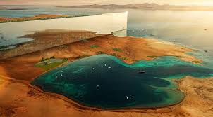

<!--
Allowed values:

type: district, plan

tags: Environment, Mobility, Buildings, Energy, InformationSystems, HealthEducation, InnovationSystems, CivicTech, CivicInnovation, Food

-->

## Overview

<!-- About 100 to 150 word summary of the case study. -->

NEOM is a visionary project transforming the northwest Saudi Arabian Red Sea coast into a unique futuristic city. As part of Saudi Vision 2030, it aims to diversify the economy and establish the nation as a leader in innovation and sustainability. Spanning 26,500 square kilometers, NEOM includes interconnected urban areas for enhanced livability, business opportunities, and environmental stewardship. Among its ambitious projects, The Line is a car-free, carbon-neutral city extending 170 kilometers from the Red Sea to NEOM's mountains. Covering 34 square kilometers, it intends to accommodate up to nine million residents in vertical communities that promote walkability and nature access. Powered by renewable energy, it utilizes advanced technologies like AI-driven governance and high-speed transit. As a prototype for cognitive, tech-enabled districts, The Line embodies sustainability, smart infrastructure, and data-driven services, reimagining urban life and establishing Saudi Arabia as a technological hub to tackle global urbanization and climate challenges.

## Goals and Aspirations

<!-- What is the project trying to achieve? Identify 3-5 high-level goals that define the entire project.Replace the placeholder title with a succinct name for the goal. -->

**Climate-Positive Urban Development**. The Line’s foremost goal is to redefine urban living in an environmentally sustainable way. It is envisioned as a zero-carbon city with 100% renewable energy, eliminating cars and roads to put nature first and preserve 95% of NEOM’s land.**[1]** The project aims to tackle climate change and urban pollution by pioneering a city free from carbon emissions and powered entirely by solar, wind, and other renewables.**[1]** The project sets a precedent for addressing climate change through urban form.

**Revolutionary Smart Urban Design & Livability (Radical Urban Innovation)**. 
The Line aspires to “a civilizational revolution that puts humans first” by radically rethinking city layout. Its linear, “vertical city” form (170 km long, 500 m high, 200 m wide) is designed to challenge traditional horizontal sprawl and provide an unprecedented quality of life.**[1]** All daily needs are within a five-minute walk, there are no cars or traffic, and high-speed transit can shuttle people end-to-end in 20 minutes.**[1]** This human-centric design promises more time for family and leisure, world-class preventive healthcare, and a community closely integrated with nature. 

**Human-Centered Global Prototype**. The Line aspires to be the world’s most livable city and a global model for future urban centers. It promises a quality of life characterized by zero pollution, zero congestion, and access to nature at every doorstep. By building from scratch instead of copying existing cities, the project aims to showcase alternative ways to live and address challenges such as sprawl, social disconnection, and resource depletion. More than a city, it’s intended as a scalable, tech-enabled prototype for future urban life — blending data, technology, nature, and human well-being into a cohesive urban ecosystem. In essence, it is intended as a blueprint for how future cities should look and function.

## Key Characteristics

<!--  How is the project organized into specific activities that advance these goals? For plans: How does the plan address each of the three activities in digital master plans (development, engagement, implementation). For districts: How does the district employ 3-5 of the key characteristics of innovation hubs?
-->

**Human-Centric, Layered Urban Structure**. The Line redefines city form by vertically layering its functions—businesses, residences, workplaces, green space, infrastructure—into a compact 200-meter-wide corridor stretching 170 kilometers. Unlike traditional horizontal cities, this “zero-gravity urbanism” ensures equitable access to natural light, green space, and public services across all floors. Every resident lives within a five-minute walk of daily needs, and every community module opens directly onto nature. This vertical design reduces urban sprawl, improves walkability, and contributes to climate goals by minimizing land use and car dependency.

**High-Tech Infrastructure & “Cognitive City” Concept**. The Line is being constructed as a fully smart city from the ground up, embedding advanced technology and data systems into its core infrastructure. Planners describe it as the world’s first “cognitive city,” meaning it will leverage AI, sensors, and robotics on an unprecedented scale to continuously enhance operations and services. The Line aims to create a cognitive city that "predicts and reacts to human needs, not the other way around." **[1]** Such pervasive integration of technology is a hallmark of innovation hubs, and it serves The Line’s goals by maximizing efficiency and personalizing the urban experience. Importantly, data governance is integral, with platforms for data consent and monetization (residents can choose to share data for rewards) to encourage participation in this data-driven ecosystem.**[5]** By regarding the city itself as a tech-enabled platform, The Line and NEOM seeks to attract tech companies and innovators eager to develop apps, services, and AI solutions on top of the city’s digital infrastructure. Services are personalized through data consent tools like M3LD, while immersive layers like the XVRS metaverse twin enable real-time interaction between the physical and digital city. Together, these technologies are designed to enhance livability, sustainability, and citywide coordination from Day 1.**[6]**

**Active Partnerships/Collaboration and Global Talent Magnet**. Attracting tech-driven businesses, researchers, and urban planners is another characteristic. The Line is positioned as a magnet for global talent and frontier industries. It is initiated and led by the Saudi Public Investment Fund and Crown Prince Mohammed bin Salman, with implementation led by international firms like AECOM, Bechtel, and Morphosis, while technology partnerships help establish a strong digital backbone. The Line is also strategically located along global trade and data routes, aiming to become a competitive R&D destination. To realize such an ambitious project, NEOM has assembled an international network of partners, experts, and corporate stakeholders, reflecting another key trait of innovation hubs: multi-stakeholder collaboration. World-renowned architects and engineers have been engaged to develop The Line’s revolutionary architecture. Global engineering firms like AECOM and Bechtel are contracted to manage construction and infrastructure, bringing expertise in mega-project delivery.**[7] [8]** NEOM has also formed joint ventures with technology leaders – for instance, NEOM Tech & Digital (now TONOMUS) partners with companies like Oracle (for cloud data centers) and OneWeb (for satellite broadband) to build the digital backbone.**[9] [10]** The project explicitly courts the “creative class” worldwide, inviting innovators, academics, and entrepreneurs to relocate to NEOM to help build and populate the city. By offering a futuristic environment with R&D centers, generous funding, and an attractive lifestyle, The Line is meant to be a magnet for global talent. This clustering of human capital and know-how is intended to jump-start an innovation ecosystem within the city – one where startups, established firms, and research institutions collaborate, experiment with new ideas, and turn The Line into a self-sustaining engine of innovation and economic diversification. 

**Advanced Construction and Planning Processes**. The implementation of The Line also leverages innovative project delivery methods appropriate for its scale. The city’s design and construction are digitized – relying on Building Information Modeling (BIM), digital twins, and simulation to plan everything virtually before physical build-out.

## Stakeholders
<!--  Who initiated the project? Who is leading the project forward? Who else has a say in how it unfolds? Who is directly affected but marginalized? Identify 3-5 key stakeholder organizations or groups. Identify 3-5 key individuals. These are people who are associated with the project as leaders, supporters, critics, or regulators. They are likely to be members of the stakeholder groups identified above. These are people you should try to contact for one or more interviews.-->

**Saudi Public Investment Fund (PIF)**. NEOM is primarily funded by the PIF, Saudi Arabia's sovereign wealth fund. PIF has committed massive capital to The Line and related NEOM projects, treating it as a strategic long-term investment. [PIF](https://www.pif.gov.sa/en/our-investments/giga-projects/neom/)

**NEOM Company**. In 2019, the Saudi government announced that it had established a closed joint-stock company named Neom, which is solely dedicated to developing the economic zone of Neom. This company is owned by the Public Investment Fund (PIF). [The NEOM Company](https://www.neom.com/en-us)

**Partner Companies (Technology, Infrastructure, Construction, Design, etc.)**
    - Delugan Meissl Associate Architects (DMAA), Gensler and Mott MacDonald 
    [THE LINE continues to accelerate from vision to reality with the appointment of city design and engineering partners](https://www.neom.com/en-us/newsroom/the-line-continues-to-accelerate-from-vision-to-reality)
    - Tonomus.NEOM 
    [NEOM Tech & Digital Company steps into the future as ‘Tonomus’](https://www.neom.com/en-us/newsroom/tonomus-launch)
    - Paradromics 
    [NEOM Investment Fund partners with Paradromics to drive innovation in neurotechnology healthcare](https://www.neom.com/en-us/newsroom/neom-investment-fund-partners-with-paradromics)
    - Samsung C&T 
    [NEOM and Samsung C&T commit to world’s largest deployment of rebar construction automation technology](https://www.neom.com/en-us/newsroom/neom-and-samsung-ct-jv-announcement)
    - and more.

**Key Individuals.**  
- HRH Mohammed bin Salman - Crown Prince of Saudi Arabia
- Denis Hickey - Chief Development Officer, THE LINE
- Aiman M. Al-Mudaifer - Acting CEO of NEOM
- Majid Mufti - NEOM Investment Fund CEO
- Giles Pendleton FRICS - Chief Operating Officer THE LINE - NEOM
[NEOM Leadership](https://www.neom.com/en-us/about/leadership)

## Technology Interventions
<!--  What specific technology-enabled interventions does the project propose? Identify 3-5 technology interventions. Describe use cases, value proposition, solution architecture, data created or consumed, key platforms and standards, business models, regulatory issues, etc. Separate into more than 1 paragraph as needed. This is a good place to insert additional images, be sure to include captions identifying the source and make sure to not use copyrighted images. -->
**Autonomous Mobility & High-Speed Transit Network.** 
*Use Case:* 
The Line envisions a city free of personal cars and road traffic, relying instead on a seamless, multi-layered transit system powered by automation and AI. The core of this system is a high-speed railway running the entire 170 km length of The Line, designed to enable end-to-end travel in just 20 minutes. This backbone will be complemented by autonomous electric shuttles, robo-taxis, and drones handling local transport, last-mile delivery, and logistics—promoting full urban mobility without emissions or congestion. While the autonomous elements remain in the conceptual phase in The Line, there is some progress on part of the physical infrastructure. In August 2023, a joint venture between Webuild and Shibh Al Jazira Contracting Company (SAJCO) signed a €1.4 billion contract to construct 57 kilometers of high-speed rail line in NEOM. This segment, referred to as the “Connector,” will link Oxagon (NEOM’s hub for clean industries) with The Line. The contract includes civil works for two high-speed and two freight rail tracks, viaducts, road bridges, and underpasses, designed to support train speeds up to 230 km/h. Webuild, which leads the execution, expects the project to generate over 4,000 jobs in Saudi Arabia.**[11]**

*Value Proposition:* 
Without cars, residents enjoy zero traffic and can reclaim time – commutes are drastically cut (20 minutes vs hours across a normal city). "Zero wait" public transit and AI-driven scheduling mean you never wait long for a ride. Autonomous pods and robo-taxis will offer point-to-point service for last-mile connectivity. Freight and deliveries can be automated via underground tunnels or drone corridors, reducing street congestion and 24/7 delivery capability. This system directly supports the goal of a car-free, pedestrian-friendly environment while still ensuring mobility. 

*Solution Architecture:* 
The transit system is multi-layered. A rail line (likely in a subsurface tunnel) provides long-haul rapid transit. On the “infrastructure layer” below ground, service vehicles and freight conveyances will operate autonomously. At the city surface, residents use autonomous electric shuttles or moving walkways to travel. All these are coordinated by the cognitive system: AI optimizes routes, and predictive algorithms position vehicles where needed. 

*Data Handling & Platforms:* 
The mobility network generates massive real-time data (vehicle telemetry, passenger counts, etc.) and likely uses standards such as VDX (vehicle data exchange) and V2X communications for interoperability. However, these projections need to be verified when real implementation occurs.

*Business Model:* 
Mobility in The Line may operate as a public utility funded by the city (with no fares mentioned so far) or through a mobility-as-a-service model offering subscriptions. By eliminating the need for private car ownership, residents can save on car-related expenses, which is presented as increasing disposable income. The city could also monetize certain logistics services (e.g., premium delivery). Additionally, technologies developed, such as autonomous control systems, might be exported to other cities in the future as a product of NEOM. 

*Regulatory Considerations:* 
Ensuring safety is paramount; the autonomous systems will require rigorous testing and adherence to whichever safety certification regimes emerge for AI-driven transport. It must meet international standards if it seeks certification- for instance, if the high-speed line is to interface with external networks or simply to reassure investors of its safety. Additionally, environmental regulators will assess the transit infrastructure’s impact (e.g., tunnel construction through sensitive areas). Overall, the autonomous mobility initiative is high-risk, high-reward: if it functions as planned, it provides a seamless, green transport system aligned with The Line’s vision; if not, any failure could paralyze a city with no alternative vehicles.  

**100% Renewable Energy System (Green Power & Hydrogen).** 
*Use Case:* 
To maintain zero emissions, The Line will be powered entirely by clean energy. NEOM is developing a mix of solar farms, wind parks, and advanced energy storage to supply continuous power. A signature project is the **world’s largest green hydrogen plant** at NEOM’s Oxagon, which will produce hydrogen for energy storage and as fuel.**[12]** This hydrogen (converted to green ammonia) can be exported or used for local clean transportation (e.g. hydrogen fuel cells for heavy vehicles).**[13] [14]** 

*Value Proposition:* 
A renewable energy system ensures The Line’s operations are carbon-neutral, supporting global climate goals and making the city more self-sufficient. Abundant renewable power will run not only the lights and AC, but also the electric transit, desalination plants, and industrial processes in NEOM. The integration of hydrogen provides long-duration storage (to balance solar/wind intermittency) and creates a new export commodity for Saudi Arabia’s post-oil economy. 

*Solution Architecture:* 
NEOM’s energy infrastructure will tie generation, storage, and smart grid technology. Up to 4 GW of solar and wind capacity is being built in phase one to feed the grid.**[12]** Excess renewable energy will drive electrolyzers in the hydrogen plant to produce ~600 tons of hydrogen per day by 2026.**[12]** This is stored as ammonia and can be shipped globally or reconverted to electricity/fuel locally. A high-voltage distribution network (likely underground along The Line’s length) will deliver electricity city-wide, managed by AI for efficiency. Buildings will be ultra-efficient and may generate solar power themselves (photovoltaics on facades). 

*Platforms & Standards:* 
The project adheres to green financing standards the \$8.4B hydrogen plant financing was certified as a Green Loan by S&P.**[12]** It likely follows international grid codes and hydrogen safety standards (ISO/IEC for hydrogen handling). NEOM is positioning as a global showcase for renewable integration at city scale, potentially setting new benchmarks for hybrid solar-wind-hydrogen systems. 

*Business Model:* 
The renewable energy intervention is financed through a public-private joint venture (NEOM Green Hydrogen Co. is a JV of NEOM, ACWA, Air Products**) with \$6.1B non-recourse project financing from banks.**[12]** Revenue will come from a 30-year offtake agreement selling green ammonia to Air Products,**[12]** which in turn supplies global markets. Within The Line, power could be provided at subsidized rates to attract businesses/residents, or eventually monetized if NEOM sells excess power to the national grid. The emphasis is on long-term sustainability rather than short-term profit, but NEOM’s model shows how partnering with industry and using export contracts can fund local clean energy for a city. 

*Regulatory Considerations:* 
NEOM’s energy plan must satisfy regulators and banks regarding safety and viability. The large-scale hydrogen facility underwent scrutiny for its environmental impact and received the necessary environmental permits. Operating a 100% renewable grid requires robust regulatory frameworks for reliability. NEOM will likely draft its own energy regulations but must coordinate with national bodies, particularly if connecting to the Saudi grid. On the international front, proving the green credentials, including the additionality of renewables, is crucial for maintaining investor confidence and meeting future carbon accounting standards. 

**Immersive Digital Twin & Metaverse (XVRS).** 
*Use Case:* 
NEOM is developing XVRS, described as a first-of-its-kind “mixed-reality metaverse” for The Line.**[15]** This platform will create a digital twin of the city that residents, planners, and visitors can interact with in real time. Use cases include virtual tourism (people worldwide can experience The Line in VR), community engagement (citizens can meet in a virtual city plaza or preview new amenities in XR), and design collaboration (engineers can visualize infrastructure in the metaverse to identify issues before building). It also aims to enhance daily life – for example, one could attend a meeting or a class in a virtual recreation of a real space, blurring physical and digital boundaries. 

*Value Proposition:* 
XVRS will augment the physical city by adding a persistent digital layer. This can improve services (training AI by simulating scenarios in the twin), and convenience. It’s also a draw for tech enthusiasts and businesses developing AR/VR content. By having a parallel digital city, NEOM can test changes virtually and engage global stakeholders in the planning process. 
*Solution Architecture:* 
XVRS combines 3D city modeling, real-time sensor data integration, and user interface technologies (VR headsets, AR devices). The Line’s entire physical structure is being modeled in high fidelity. IoT feeds from the city update the model continuously (making it a live digital twin).

*Data Handling:* 
The digital twin will mirror real-world data, raising privacy questions (e.g. will people be represented in real-time?). NEOM has indicated human needs are core, so presumably personal data in the metaverse is protected and opt-in. The system might anonymize real data for public experiences, while allowing authorized planners to see detailed data. 

*Platforms & Standards:* 
Based on projections, they may utilize gaming engines (Unreal or Unity) and comply with evolving metaverse standards for interoperability (allowing other metaverses to connect with NEOM’s). NEOM could establish a precedent in city-scale XR experiences. 

*Business Model:* 
XVRS could open new revenue streams: virtual real estate or advertising in the metaverse city, fees for premium VR experiences (imagine paying to virtually “tour” The Line’s attractions before you travel). It also aids marketing – a flashy way to attract tourists and investors by letting them walk through the future city digitally. Internally, it can save costs by finding design flaws early. 

*Regulatory Considerations:* 
Being largely virtual, it’s less about government regulation and more about digital governance – ensuring content moderation, cybersecurity, and that the platform doesn’t become a surveillance tool. Intellectual property of the virtual designs needs protection too. Since NEOM can craft its own digital policies, it might allow more experimental use of AR/VR (like citywide AR signage) that other cities might restrict. However, global norms (for example, around VR safety or crypto-commerce if used in the metaverse) will influence XVRS deployment.  

**Automated Services and Robotics.** 
*Use Case:* 
The Line plans to heavily utilize robotics and AI-driven services to handle tasks ranging from household deliveries to security patrols and infrastructure maintenance. Drones may deliver goods across the linear city, robots could handle waste collection and industrial tasks, and AI concierge systems might assist residents with daily needs. NEOM has mentioned that “automated services will be powered by artificial intelligence” to make life easier.[1] 

*Value Proposition:* 
By offloading menial or dangerous tasks to robots, The Line can operate more efficiently and safely. Residents benefit from convenience – e.g. ordering groceries and having them delivered via a small robot vehicle or drone within minutes, or enjoying 24/7 cleanliness as robots clean public areas continuously. These services also reduce human staffing needs (aligning with a high-tech economic model) and can function in the background without disturbing residents, thus maintaining the serene, traffic-free atmosphere. 

*Solution Architecture:* 
Projections: A network of service robots (on the “service layer” beneath the pedestrian layer) will navigate dedicated corridors. For instance, pipe-like tunnels could enable robotic pods to zip through while carrying deliveries. The city will likely feature centralized logistics hubs where AI schedules and dispatches drones and bots. For security, an array of sensors and AI surveillance (CCTV analytics, drone patrols) provides monitoring, with human oversight from a central command center only when necessary. Software platforms coordinate these devices as subsystems (e.g., a logistics management system for deliveries, a building management AI that controls HVAC, etc.). 

*Data and Standards:* 
These systems generate data on usage patterns, which feeds back to improve service. They must conform to safety standards (ISO standards for robotics safety, civil aviation authority rules for drones). NEOM’s cognitive security platform will ensure data from security robots is secured. **[16]** 

*Business Model:* 
Many of these services might be offered as part of living in The Line (adding to its allure). Some could be subscription-based (for premium home services) or outsourced to private providers operating under NEOM’s framework. NEOM could partner with robotics firms – essentially turning The Line into a massive testbed for automation technology, which could then be commercialized elsewhere. 

*Regulatory Considerations:* 
Because NEOM is a special zone, it can set rules for things like drone flights and autonomous robots that might be restricted elsewhere. Still, regulations for airspace and safety need to be defined – e.g. preventing drones from interfering with each other or with migratory birds (an environmental concern). Liability frameworks for AI decisions (if a security drone makes a mistake) have to be established. Additionally, employing robots at scale raises socio-economic questions (displacement of certain jobs, which Saudi regulators will watch in the context of employment for citizens). Balancing a high-tech automated environment with social acceptance will require careful policy – something NEOM’s governance will have to innovate on as well.  

Each of the above interventions is deeply interlinked and also connects to projects under NEOM. The cognitive platform ties together mobility, energy, and services, while the renewable energy system powers the transit and data centers. The Line’s innovation lies in treating the city as an integrated technological system – a sharp contrast to incremental smart city add-ons seen elsewhere. The success of these interventions will depend on rigorous implementation and the ability to harmonize technology with human-centered design.

## Financing
<!--  How are the technology interventions identified to be financed? How does this fit into financing of the larger project? Identify at least one financing mechanism that is being used. -->

**Financing Scheme**. 
Building The Line is a capital-intensive endeavor, and financing strategies are embedded within broader funding mechanisms for NEOM, from which The Line will draw resources. Saudi Arabia is leveraging a combination of state funding, global debt, private investment, and future revenue monetization to sustain development over the coming decades. Major Financing Scheme:

**Direct State Funding via Public Investment Fund.** In the initial phases, the Saudi government is majorly financing NEOM (and The Line) through the Public Investment Fund. PIF’s vast capital acts as equity funding for NEOM. This direct backing was crucial to kick-start construction, sign major contracts, and signal confidence to other investors. Essentially, PIF is front-loading the risk by pouring “hundreds of billions” into NEOM as a long-term development, expecting returns in decades. **[17]** This mechanism reflects government commitment and provides patient capital, but it also concentrates financial exposure on the state until other investors come on board.  

**Global Debt Financing and Credit Facilities.** NEOM has started tapping debt markets and bank loans to fund infrastructure, shifting some financing off government books. In 2024, NEOM secured a \$2.67 billion revolving credit facility from a consortium of Saudi and international banks and this represents another milestone for NEOM as it progresses with the development of major projects and will be used to support NEOM’s short-term financing requirements.**[18] [19]** Additionally, specific projects use project finance, for example The NEOM Green Hydrogen plant achieved an \$8.4 billion financial close, funded by \$6.1 billion in non-recourse loans from 23 banks **[12]** under green financing frameworks. Such loans are secured by the project assets and future revenue,**[12]** which limits risk to NEOM if the project fails. NEOM has also explored export credit agencies – e.g. a \$3 billion financing insured by Italy’s SACE was raised for infrastructure.**[20]** 

**Joint Ventures and Private Investments.** A key financing approach is to bring in private-sector partners via joint venture agreements, where costs and risks are shared. Neom are open for business, offering investment opportunities across the regions and economic sectors – including infrastructure, real estate, energy, water, mobility, technology, digital and more. They provide a comprehensive range of investment structures, including joint ventures (JV), build-operate-transfer (BOT) and public-private partnerships (PPP).**[21]** For example, NEOM formed a JV with local firm Ezditek/FAS Energy to build data centers, where NEOM holds 51% and the partner 49%.**[10]** This model means the partner finances a chunk of the investment in exchange for future revenue or strategic position. NEOM also offers stabilization guarantees and incentives to lure investors – reports say it’s providing guarantees on returns or offtake agreements to reduce investor risk. **[22]** By late 2023, Saudi officials noted "foreign investors are starting to channel capital" into NEOM, with some projects under PIF being financed via "global capital pools" and private capital already.**[17]** This mechanism aligns interests: private players bring efficiency and know-how, while NEOM provides an attractive platform and often subsidizes initial costs (like infrastructure). Over time, Saudi plans for NEOM’s IPO (plan stage, no action yet), and this strategy would effectively monetize a portion of PIF’s stake by selling it to global investors, injecting a massive sum to fund construction in the future.

**Land and Asset Leases, and Future Revenues.** Looking ahead, NEOM can also finance itself by leveraging its assets. For instance, it can lease land or space in The Line to developers (for residential, commercial, or research facilities). In tourism, agreements with hotel operators for resorts will likely involve upfront investments in exchange for long-term leases. Moreover, NEOM will eventually generate diverse revenue streams – city services, utilities fees, tourism income, and taxes. These future revenues can be securitized, for instance, NEOM could issue bonds backed by expected cash flows. While these mechanisms are prospective, they form part of the financing strategy: transitioning from reliance on government funds to self-sustaining financing.

In summary, The Line’s financing is a blend of state-led investment to launch the project, increasingly supplemented by private capital and innovative financing (green loans, JV equity) as the project matures. This approach spreads the enormous cost over many years and stakeholders. It is noteworthy that despite reports of cost challenges, Saudi officials insist NEOM’s projects “will go ahead as planned” and are calling NEOM a "generational investment" that requires patience.**[17]** The true test of the financing strategy will be whether NEOM can start generating returns (through its tech interventions, tourism, etc.) to justify ongoing investment and whether global capital sees The Line as a viable long-term bet rather than an over-ambitious gamble. 

## Outcomes and Impacts
<!-- What results has the project produced to date? What outcomes and impacts are anticipated? Identify 3-5 (anticipated) outcomes. What will/has the project achieved? Thes should not be the same or repeated from elsewhere. Use this space to emphasize something different. -->

Though The Line is still in early stages of development (with a target of partial opening by 2030 and full completion around 2045), several anticipated outcomes have been articulated, and some initial results have been achieved:

**Placemaking and Civic Identity**. One of The Line’s most distinctive goals is to redefine placemaking at a metropolitan scale. By compressing urban life into a 170-km linear form with car-free public realms and integrated vertical zoning, The Line aspires to foster dense, walkable, and culturally vibrant environments that blend nature with technology. Early visuals and planning documents suggest the creation of districts with distinct identities, with public spaces, art, and mobility infrastructure woven together to shape a new kind of place-based experience for residents and visitors. This is not just about aesthetics — it's about building civic identity in a completely new city, from scratch.

**Sustainable Living and Environmental Outcomes.** When complete, The Line is expected to house up to 9 million people in a carbon-neutral environment. The anticipated outcome is a city with zero carbon footprint and minimal impact on the surrounding ecosystems. If successful, The Line would drastically cut per-capita emissions and serve as a proof-of-concept for climate-friendly urbanization. To date, although it is not from The Line but NEOM has taken steps toward this outcome by launching its renewable energy projects (the green hydrogen plant is under construction after securing full financing **[12]**) and banning carbon-emitting vehicles from the site. Environmental monitoring frameworks are being established,**[23]** and 95% of NEOM’s land is to be set aside as natural reserve. While the ultimate environmental performance will only be known once the city is running, NEOM’s positioning of The Line has influenced other developments – it’s sparked global conversations on how to design net-zero cities in traditionally oil-dependent regions,**[24]** and has pressured the project team to innovate in materials and construction to reduce embodied carbon. There are also questioning voice about The Line’s design might disrupt biodiversity due to a greater edge effect impacting animal crossing.**[25]**

**Economic Diversification and Investment Outcomes.** The Line is projected to significantly contribute to Saudi Arabia’s economy by attracting new sectors and investments. Saudi authorities claim NEOM will create 380,000 to 460,000 jobs and add about $48 billion to GDP by 2030.**[26]** It’s also intended to boost sectors like tourism, technology, and clean energy. Early outcomes on this front include the successful attraction of foreign direct investment in specific ventures – for example, the $8.4B joint investment in green hydrogen,**[12]** and tech partnerships (Oracle’s cloud region, OneWeb’s satellite service) which bring capital and know-how.**[9]**

While The Line itself is far from generating profit, the economic outcome so far is momentum – NEOM has gone from a concept in 2017 to a mega-project that is actively injecting money into the economy via contracts and beginning to draw international funding interest. If NEOM’s first tourism venture (Sindalah island) is an indication, it was completed rapidly and is expected to draw luxury tourism revenue starting 2024,**[27]** showing the model of building economic engines alongside The Line.  

**Technological Innovation and Smart City Proof-point.** A major anticipated outcome is that The Line will establish Saudi Arabia as a smart city and urban technology leader. NEOM positions The Line as “the world’s first cognitive city”; its success will be measured by how effectively AI and technology improve urban life. **[15]** By 2022, NEOM had launched its first hyperscale data center (ZeroPoint DC) to underpin the city’s digital infrastructure.**[9]** It also announced that Oracle became the first tenant, signaling confidence in NEOM’s technological readiness. The Line’s ambitious transit goal of traversing its length in 20 minutes is driving research and development in high-speed rail. While no segment is operational yet, groundwork for stations and the central spine is reportedly underway. If the city achieves its promised technological outcomes, by 2030 we expect to see AI-run services (such as functional autonomous shuttles and possibly drones in regular use) and improvements in livability metrics (including negligible commute times and high renewable energy penetration). NEOM has already attained a “branding” outcome: it has positioned The Line in global media as a futuristic marvel (or experiment), which holds intrinsic value. NEOM’s exhibition at events (e.g., MIPIM 2024 real estate conference **[2]**) and a constant media presence mean that The Line has put Saudi Arabia on the map in technology circles – a soft power outcome where the kingdom is recognized for pushing the boundaries of innovation.

**Construction and Implementation Milestones.** Physically, one outcome aimed for 2030 is having a functioning ~5 km module of The Line, housing a few hundred thousand residents **[26] [28]** . While the full 170 km won’t be done by then, Saudi officials plan to demonstrate the concept at scale to prove viability. 

Progress to date: Construction on The Line officially broke ground in 2021, and by late 2022 extensive earthworks were visible via satellite – a massive linear excavation trench across the desert had been dug for foundational works. In 2023, cranes and construction teams were on-site building the first segments of the megastructure’s wall and infrastructure corridors. Aerial photos in 2023 showed a continuous trench and sections of concrete foundations being poured, indicating the project has moved beyond just promises.**[29]** Saudi Arabia has also completed some enabling projects: a new NEOM Bay Airport is operational to bring in materials and personnel, and base camps for workers are established. One delivered outcome within NEOM is the Sindalah Island resort, opened in October 2024 as NEOM’s first finished project.**[27]** While not part of The Line’s structure, Sindalah’s completion demonstrates NEOM’s ability to execute projects on schedule and is being used to bolster confidence (it was built in 2 years, offering a luxury marina and hotels).**[27]** For The Line itself, there are reports of delays in some engineering aspects – the initial plan has shifted due to the time needed to translate the futuristic concept into engineering reality. **[28]** Nonetheless, the commitment to have a substantial section inhabited by 2030 remains, meaning over the next few years we anticipate partial opening of residential and commercial spaces in the first segment (likely near the coast). The Line’s construction progress is now an outcome watched by the public.  

**Global Event Hosting and Tourism Outcomes.** By design, NEOM and The Line aim to create new tourist and event destinations, contributing to Saudi’s tourism goals. An early win in this regard is that *Trojena (NEOM’s mountain area) won the bid to host the 2029 Asian Winter Games* – a dramatic outcome given the city and ski resort are still being built.**[30]** This reflects confidence that NEOM will deliver the necessary facilities by then (Trojena is expected to finish by 2026). The outcome will be significant tourism influx and global attention during and after the event. For The Line specifically, once portions are complete, it’s expected to become a tourist attraction itself – an ultra-modern city for visitors to experience. Even in construction, The Line’s spectacle has drawn VIP visits and will likely draw more once demonstrable sections (like a show apartment or viewing gallery) are ready. In terms of demographic outcomes, The Line hopes to attract not just foreign tourists but also stem brain drain by keeping young Saudi talent in the country with an appealing lifestyle city.**[27]** It’s too early to measure population outcomes, but NEOM has already relocated thousands of workers and staff to the region to work on the project. The population of NEOM (including construction workers) increased as building ramped up, and by 2024 NEOM began marketing housing for future employees. Over the next decade, a successful outcome would be a growing resident population living and working in The Line, contributing to Saudi’s aim of increasing its overall population capacity. 

Overall, many of The Line’s intended outcomes remain aspirational at this stage. However, several tangible results – such as the completion of enabling projects (Sindalah, NEOM Airport), securing of large-scale financing deals, and visible construction progress – have been achieved, indicating that the project is moving forward albeit with adjustments. Additionally, The Line has already succeeded in one respect: igniting global discussion about the future of urban living. Whether seen as visionary or dystopian, it has put ideas like linear cities, AI governance, car-less design into the mainstream debate, which is an outcome that could influence urban planning beyond Saudi Arabia. The coming years will reveal more concrete outcomes as pilot sections of the city become operational and the lofty promises are tested in reality. 

## Open Questions
<!-- What is uncertain, unclear, or still unresolved about this project? Identify 1-3 open question(s). -->

**Feasibility & Phasing.** *Can the full 170 km vision be realized, or will The Line be substantially scaled down?* Delivering a mega-city in a single 500m-tall structure is unprecedented, and doubts persist about technical and logistical feasibility. In 2024, reports emerged that Saudi Arabia was scaling back initial ambitions – expecting to complete only a 2.4 km section by 2030 (with <300,000 residents), instead of the originally planned 150+ km by that date.**[28]** Officials refuted that this is a permanent downsize, insisting the overall 9 million population goal remains and that other sections will continue in parallel.**[28]** However, the timeline for full completion has already shifted to 2045,**[26]** and it’s an open question whether the project can maintain momentum over two decades. Constructing even the first module has proven complex – from engineering the foundation in sand and bedrock, to sourcing the materials for the mirrored facade. 

Other key uncertainties realted to feasibility include: will structural or cost challenges force the design to be simplified? (e.g. a shorter height or discontinuities in the line); can they maintain perfectly parallel walls over such distance given geotechnical variability?; and how will the city expand from one module to the next in practice? The concept of stacking millions of people in one continuous building also has no real precedent – issues of fire safety, evacuation, and social dynamics in a sealed linear structure raise questions. In sum, while a small portion will likely be built, it is unclear if the entire Line will ever be realized as initially envisioned or if NEOM will truncate the plan and focus on the most viable segment. This feeds into a broader uncertainty: what happens if the initial segment doesn’t attract residents/businesses as expected? The viability of expanding The Line might depend on proving the model in phase 1, a classic “chicken-and-egg” scenario that planners have yet to fully address publicly.  

**Financial Viability & Economic Sustainability.** *Will NEOM and The Line secure enough investment to finish and can it justify its enormous cost?*.
The project’s price tag is justified by promised economic returns and strategic value, but there is uncertainty about the return on investment. The Saudi government’s ability to fund NEOM is tied to oil revenues which can be volatile. Although NEOM has started raising external funds, the scale needed is vast – and private investors will demand evidence of future profitability. 

Key open questions include: Can The Line attract a sizable population and economic activity to generate revenue (from leases, services, tourism) to eventually offset its costs? Or will it remain reliant on government support indefinitely? The Investment Minister has framed NEOM as a *“generational investment”* that shouldn’t be judged on short-term ROI,**[17]** implying patience is needed. But if oil prices dip or political priorities shift, funding could become constrained. Also, will international investors buy into an IPO or major funding round when offered? There’s caution due to geopolitical risk and the experimental nature of The Line. Cost overruns are another worry – materials and construction costs have surged, and integrating novel technologies could inflate budgets beyond initial estimates. If the project encounters a serious funding shortfall, what gets cut or delayed?

NEOM might need to prioritize certain features (e.g. finish the transit spine later, or reduce luxury finishes) to control costs. The business model of The Line – essentially building ahead of demand in hopes that demand will come – is inherently risky. The question of whether people and companies will actually move en masse to this remote futuristic city looms large. Without achieving high occupancy and economic activity, The Line could struggle to generate the cash flow envisioned, putting its financial sustainability in doubt.  

**Social Acceptance, Governance & Human Impact.** *How will The Line address the human and societal challenges that come with its bold vision?* On one hand, The Line promises an idyllic high-tech lifestyle, but on the other, concerns linger about livability and social integration. Quality of life in a dense, AI-managed city is untested – will residents enjoy living in a narrow, fully enclosed environment long-term, or will they feel constrained despite the high-tech amenities? Questions of mental health and social cohesion arise when 9 million people are packed in one structure with ubiquitous surveillance. NEOM says it will be “built around humans”,**[2]** but achieving a genuinely human-centered community (with culture, diversity, personal freedoms) under an autocratic government’s project is uncertain. Another open question is how governance and laws within The Line will work in practice. Until the city starts operating and these policies are tested, there’s uncertainty about whether The Line will indeed be the egalitarian, ultra-efficient utopia advertised, or whether it could slide into a dystopia of surveillance and inequality (with a high-income tech elite living in the upper layers and maintenance workers potentially hidden below). In short, bridging the gap between futuristic concept and human reality remains an open challenge. 

**Environmental and Regulatory Hurdles.** *Can The Line overcome its environmental impact concerns and obtain necessary regulatory approvals as it grows?* The project touts sustainability, but paradoxically it entails a colossal construction effort in a delicate desert and coastal environment. Critics point out that building a 170 km mirrored wall through ecosystems could have unforeseen effects – for example, a scientific paper in 2023 warned that The Line could pose threats to millions of migratory birds that funnel through the Red Sea flyway.**[31]** The mirror facade might confuse or fatally attract birds, and the sheer size could disrupt animal migration on land. NEOM representatives have responded that they will implement bird-friendly design measures and monitor wildlife, but no public environmental impact assessment (EIA) has been released to date.**[31]** This lack of transparency leaves questions about how thoroughly environmental risks have been vetted – will NEOM adjust the project if serious ecological damage is anticipated? Another open question is water management – The Line will rely on huge desalination plants to supply water, which could impact the Red Sea marine environment with brine discharge. NEOM has spoken of innovative water solutions, but details are scant. Climate adaptation is also unclear: the region is extremely hot, and maintaining a comfortable microclimate through natural ventilation as planned **[2]** may be very challenging as temperatures rise; will The Line end up needing energy-intensive cooling that undermines its sustainability claims? 

In conclusion, The Line stands at the intersection of grand ambition and practical uncertainty. It encapsulates Saudi Arabia’s willingness to take risks for a post-oil future, but also highlights the unknowns inherent in such a first-of-its-kind endeavor. How these open questions are addressed in the next few years – via transparent planning, course-corrections, and stakeholder engagement – will likely determine if The Line becomes a trailblazing success or a cautionary tale in urban development.  

## AI Use
ChatGPT is used for searching resources and summarizing information collected by Yixuan Wang. Since The Line project is still far from actual implementation, some of the information in this case study is based on projections, assumptions, and insights drawn from online public resources.

## References
---
### Primary Sources

<!-- 3-5 project plans, audits, reports, etc. -->

- [1] [Neom](https://www.neom.com/en-us/)
- [2] [The Line: The Future of Urban Living](https://www.neom.com/en-us/regions/theline) 
- [3] [Saudi Public Investment Fund](https://www.pif.gov.sa/)
- [4] [NEOM Social Responsibility Report](https://www.neom.com/en-us/about/social-responsibility)

### Secondary Sources

<!-- 5-7 secondary source documents: news reports, blog posts, etc.. -->
- [5] [FEATURE-Saudi 'surveillance city': Would you sell your data to The Line?](https://www.reuters.com/article/markets/commodities/feature-saudi-surveillance-city-would-you-sell-your-data-to-the-line-idUSL8N2ZL0CM/)
- [6] [NEOM Tech & Digital Co. announces M3LD - a groundbreaking platform enabling users to control and earn from personal data](https://www.prnewswire.com/ae/news-releases/neom-tech--digital-co-announces-m3ld--a-groundbreaking-platform-enabling-users-to-control-and-earn-from-personal-data-301472662.html)
- [7] [Aecom awarded design contract for $500bn NEOM project](https://constructiondigital.com/construction-projects/aecom-awarded-design-contract-dollar500bn-neom-project#:~:text=Aecom%20awarded%20design%20contract%20for,management%20services%20for%20its)
- [8] [NEOM selects Bechtel to accelerate infrastructure development](https://www.neom.com/en-us/newsroom/neom-selects-bechtel#:~:text=NEOM%20selects%20Bechtel%20to%20accelerate,primary%2C%20base%20infrastructure%20for)
- [9] [Neom details plans for hyperscale data centers in new Saudi city - DCD](https://www.datacenterdynamics.com/en/news/neom-details-plans-for-hyperscale-data-centers-in-new-saudi-city/#:~:text=Shortly%20after%20the%20original%20JV,reaffirmed%20in%20the%20latest%20release)
- [10] [Neom details plans for hyperscale data centers in new Saudi city - DCD](https://www.datacenterdynamics.com/en/news/neom-details-plans-for-hyperscale-data-centers-in-new-saudi-city/#:~:text=Neom%20has%20also%20partnered%20with,connectivity%20to%20the%20new%20city)
- [11] [Webuild consortium wins Neom HSR contract](https://www.railwaypro.com/wp/webuild-consortium-wins-neom-hsr-contract/)
- [12] [NEOM Green Hydrogen Company completes financial close at a total investment value of USD 8.4 billion in the world’s largest carbon-free green hydrogen plant](https://www.neom.com/en-us/newsroom/neom-green-hydrogen-investment#:~:text=An%20equal%20joint%20venture%20between,transportation%20and%20industrial%20sectors%20globally)
- [13] [NEOM green hydrogen facility to come online in December 2026: CEO](https://www.argaam.com/en/article/articledetail/id/1774016#:~:text=NEOM%20green%20hydrogen%20facility%20to,use%20as%20a%20transportation%20fuel)
- [14] [Air Products, ACWA Power and NEOM Sign Agreement for $5 Billion Production Facility in NEOM Powered by Renewable Energy for Production and Export of Green Hydrogen to Global Markets](https://www.airproducts.com/company/news-center/2020/07/0707-air-products-agreement-for-green-ammonia-production-facility-for-export-to-hydrogen-market#:~:text=Air%20Products%2C%20in%20conjunction%20with,based%20ammonia)
- [15] [NEOM’S The Line: The world’s first cognitive city | WIRED Middle East](https://wired.me/technology/neoms-the-line-the-worlds-first-cognitive-city/#:~:text=In%20addition%20to%20the%20Project,positioning%20The%20Line%2C%E2%80%9D%20says%20Bradley)
- [16] [Changing the future of Technology & Digital - NEOM](https://www.neom.com/en-us/our-business/sectors/technology-and-digital#:~:text=Changing%20the%20future%20of%20Technology,gen%20platform%20will%20be)
- [17] [Saudi Arabia's NEOM gigaproject a 'generational investment,' minister says | Reuters](https://www.reuters.com/world/middle-east/saudi-arabias-neom-gigaproject-generational-investment-minister-says-2024-11-25/#:~:text=The%20world%27s%20top%20oil%20exporter,cut%20dependence%20on%20fossil%20fuels)
- [18] [Saudi Arabia's NEOM secures \$2.7 billion new financing facility](https://www.reuters.com/business/saudi-arabias-neom-secures-27-bln-new-financing-facility-statement-says-2024-04-28/)- [19] [NEOM secures SAR 10 billion financing facility as development powers ahead](https://www.neom.com/en-us/newsroom/neom-secures-sar-10-billion-financing-facility)
- [20] [NEOM secures USD 3 billion SACE guaranteed financing under a multicurrency untied facility from nine international banks](https://www.neom.com/en-us/newsroom/neom-secures-usd-3-billion-sace-guaranteed-financing#:~:text=NEOM%20secures%20USD%203%20billion,NEOM%2C%20Kingdom%20of%20Saudi)
- [21] [Neom Investment Opportunities](https://www.neom.com/en-us/invest/invest-in-neom)
- [22] [Neom offers financial guarantees to lure private investors | AGBI](https://www.agbi.com/giga-projects/2024/06/manar-al-moneef-neom-offers-financial-guarantees-to-lure-private-investors/#:~:text=Neom%20offers%20financial%20guarantees%20to,according%20to%20a%20senior%20executive)
- [23] [NEOM Environment Monitoring Framework - The GPC Group](https://thegpcgroup.com/casestudy/neom-environment-monitoring-framework/#:~:text=NEOM%20Environment%20Monitoring%20Framework%20,accounting%20and%20trend%20analysis%20programs)
- [24] [Saudi Says Neom Will Be the First 'Eco-City' – Experts Aren't so Sure](https://www.businessinsider.com/saudi-neom-first-eco-city-experts-design-architecture-2024-7#:~:text=Saudi%20Says%20Neom%20Will%20Be,of%20roads%2C%20cars%2C%20and)
- [25] [Saudi Arabia: Is “The Line” a Viable Solution to Climate Change?](https://www.glimpsefromtheglobe.com/topics/energy-and-environment/saudi-arabia-is-the-line-a-viable-solution-to-climate-change/)
- [26] [The Line, Saudi Arabia - Wikipedia](https://en.wikipedia.org/wiki/The_Line,_Saudi_Arabia#:~:text=The%20estimated%20building%20cost%20is,20)
- [27] [Seven Years of Saudi Arabia’s NEOM Project: Prospects and Challenges - Indian Council of World Affairs (Government of India)](https://www.icwa.in/show_content.php?lang=1&level=1&ls_id=12311&lid=7505#:~:text=On%2027%20October%202024%2C%20Saudi,by%20completing%20and%20inaugurating%20the)
- [28] [The Line in Saudi Arabia: What’s Going On With NEOM’s Futuristic Project? And When Will It Finish? | AD Middle East](https://www.admiddleeast.com/story/the-line-in-saudi-arabia-whats-going-on-with-neoms-futuristic-project-and-when-will-it-finish#:~:text=Designed%20to%20be%20built%20in,5%20million)
- [29] [Aerial photos show development of 170km long Saudi Arabia city The Line](https://www.newcivilengineer.com/latest/aerial-photos-show-development-of-170km-long-saudi-arabia-city-the-line-07-02-2024/)
- [30] [Saudi Arabia wins bid to host 2029 Asian Winter Games at NEOM | Reuters](https://www.reuters.com/lifestyle/sports/saudi-arabia-wins-bid-host-2029-asian-winter-games-neom-2022-10-04/#:~:text=RIYADH%2C%20Oct%204%20%28Reuters%29%20,500%20billion%20flagship%20NEOM%20project)
- [31] [Report Raises Concerns Over The Line's Impact on Birds - InsideHook](https://www.insidehook.com/culture/neom-saudi-arabia-city-line-birds-impact#:~:text=As%20Tom%20Ravenscroft%20reports%20at,%E2%80%9D)
- [32] [HRH Crown Prince Mohammed bin Salman announces THE LINE designs](https://www.neom.com/en-us/newsroom/hrh-announces-theline-designs#:~:text=The%20designs%20of%20THE%20LINE,of%20NEOM%E2%80%99s%20land)
- [33] [Saudi gigaproject: NEOM reveals major progress on The Line and other key regions](https://www.constructionweekonline.com/news/saudi-gigaproject-neom-reveals-major-progress-on-the-line-and-other-key-regions#:~:text=Substantial%20groundwork%20has%20already%20been,concentrating%20on%20the%20Marina%20area.)
- [34] [What Went Wrong at Saudi Arabia’s Futuristic Metropolis in the Desert](https://www.wsj.com/finance/saudi-arabia-neom-sindalah-15b9f25a)
- [35] [ZeroPoint DC](https://neom.directory/neom-news/neom-tech-digital-company-announces-zeropoint-dc-hyperscale-data-center-to-support-ecosystem-of-cognitive-technologies)

