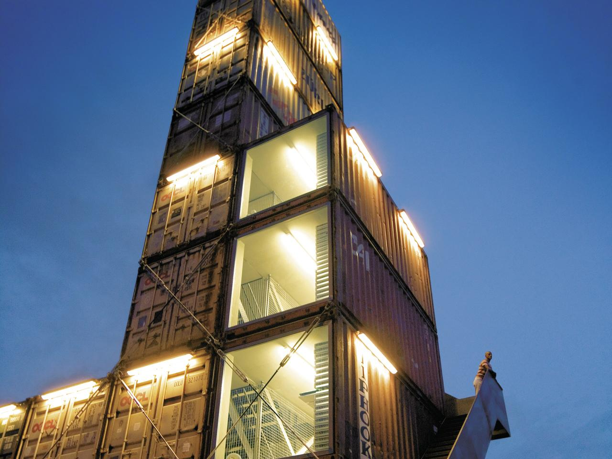
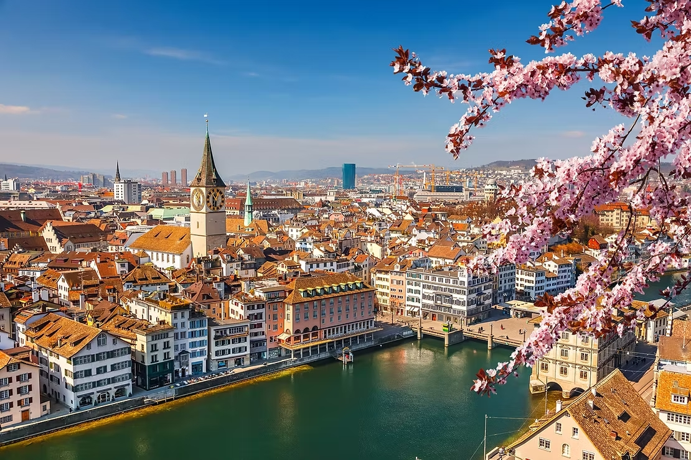
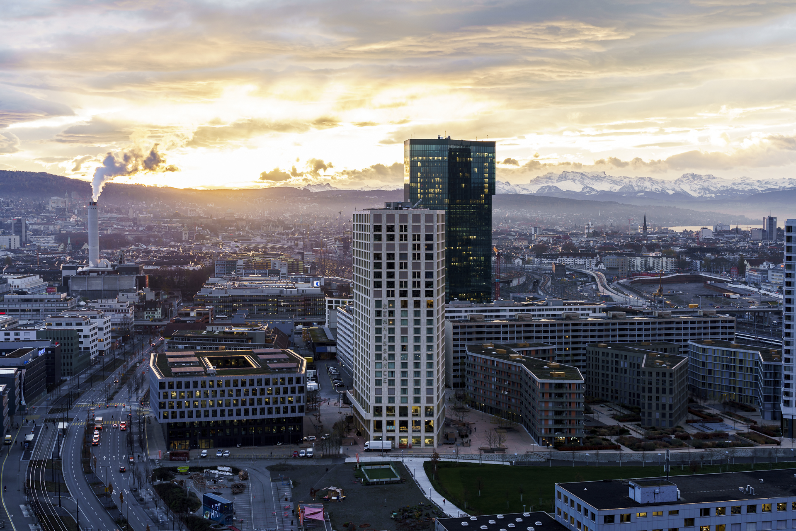
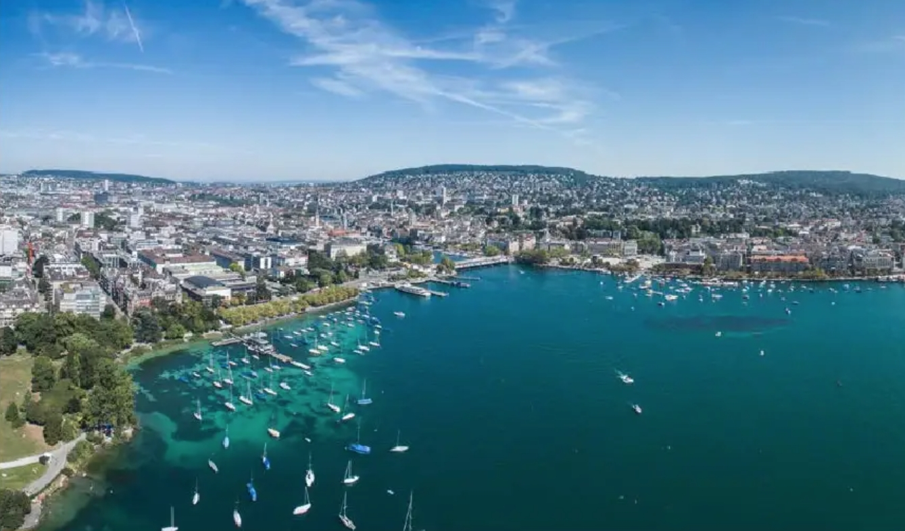
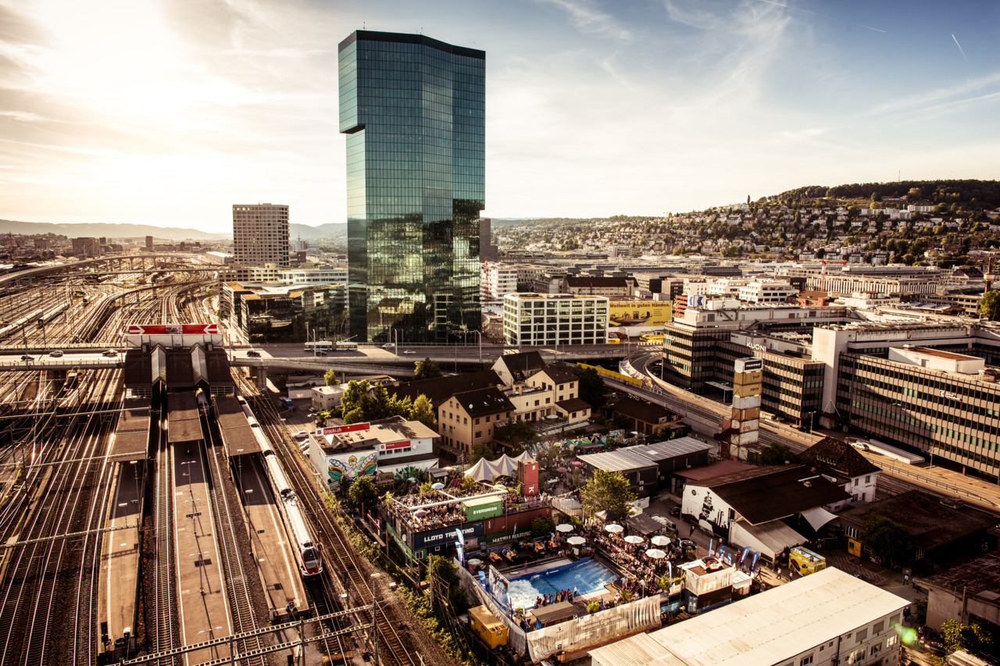

## Overview

Zürich-West represents one of Switzerland's most ambitious urban transformation projects, converting a former industrial district into a thriving innovation hub that balances cutting-edge technology with exceptional quality of life. Once characterized by factories and warehouses, this 100-hectare area has evolved into a mixed-use smart district that serves as a living laboratory for Zurich's smart city initiatives. The district exemplifies Swiss pragmatism by implementing technological solutions that directly address citizen needs while preserving the area's industrial heritage. Central to this transformation is the Smart City Zürich strategy, launched in 2018, which uses Zürich-West as a testbed for digital infrastructure, sustainable mobility solutions, energy-efficient buildings, and participatory governance platforms. What distinguishes Zürich-West from many global smart districts is its emphasis on human-centered design, with technology deployed as a means to enhance livability rather than as an end in itself.

## Goals and Aspirations

**Digital Transformation with Purpose**. Zürich-West aims to leverage digital technologies not for their own sake, but specifically to address urban challenges and improve quality of life. The district serves as a proving ground for the city-wide Smart City Zürich strategy, which emphasizes practical applications of technology that create tangible benefits for residents. This goal reflects Zurich's pragmatic approach to innovation, focusing on solutions that directly address citizen needs rather than implementing technology for technology's sake. The integration of smart infrastructure is carefully balanced with considerations of data privacy, accessibility, and social inclusion.

**Sustainable Urban Development**. Zürich-West strives to become a model for sustainable urban living through ambitious energy and environmental targets. The district aims to implement the 2000-Watt Society vision, reducing per capita energy consumption to 2000 watts of continuous power and limiting CO2 emissions to one tonne per person annually. This goal encompasses resource-efficient buildings, renewable energy systems, circular economy principles, and green infrastructure. The district's approach to sustainability extends beyond environmental concerns to include economic viability and social equity, reflecting a holistic understanding of sustainable development.

**Innovation Ecosystem Creation**. The transformation of Zürich-West seeks to establish a vibrant innovation ecosystem that fosters collaboration between research institutions, startups, established companies, and public entities. By converting former industrial spaces into innovation hubs like the Kraftwerk innovation campus and the Impact Hub Zürich, the district aims to become a magnet for talent and a catalyst for technological and social innovation. This goal includes nurturing entrepreneurship, promoting knowledge exchange, and creating spaces where diverse stakeholders can collaborate on urban challenges, positioning Zürich-West as a key node in Switzerland's innovation landscape.

**Participatory Urban Governance**. Zürich-West aspires to pioneer new models of urban governance characterized by transparency, citizen participation, and co-creation. Through digital participation platforms and physical engagement spaces, the district aims to involve residents, businesses, and other stakeholders in decision-making processes regarding urban development and smart city initiatives. This goal reflects a commitment to democratic values and recognition that successful smart districts must be shaped by the needs and preferences of their users, not imposed from above by planners or technologists.

## Key Characteristics

**Adaptive Reuse of Industrial Heritage**. Zürich-West's transformation builds upon rather than erases its industrial past, repurposing historic structures for contemporary uses while preserving their character. Former factories like the Löwenbräu-Areal now house art galleries, tech startups, and residential lofts, while the iconic Freitag Tower constructed from shipping containers symbolizes the district's creative reuse ethos. This approach creates a distinctive sense of place that differentiates Zürich-West from generic smart city developments elsewhere. The juxtaposition of historic industrial architecture with modern digital infrastructure creates a unique urban landscape that tells the story of the area's evolution while accommodating future-oriented functions.

**Living Lab Methodology**. Zürich-West functions as an urban living laboratory where smart city solutions are developed, tested, and refined in real-world conditions before potential scaling. The district hosts pilot projects in collaboration with ETH Zürich, local startups, and corporate partners, with residents actively participating in testing and providing feedback. This methodology accelerates innovation cycles by enabling rapid prototyping and iteration while ensuring solutions respond to actual needs. Recent examples include testing autonomous shuttle buses, smart street lighting systems, and blockchain-based neighborhood energy trading platforms, with successful projects subsequently expanded to other areas of Zurich.

**Mixed-Use Development Model**. The district integrates residential, commercial, educational, cultural, and recreational functions within a compact area, creating a vibrant urban environment that supports the "15-minute city" concept. This mixed-use approach reduces transportation needs, promotes street-level activity throughout the day, and creates opportunities for serendipitous interactions that fuel innovation. Residential buildings incorporate diverse housing types, including cooperative housing models that ensure social diversity. The Prime Tower complex exemplifies this mixed-use philosophy, combining office space, restaurants, residential units, and public areas within a single development, fostering a dynamic urban ecosystem.

**Data-Driven Decision Making**. Urban management in Zürich-West is increasingly informed by data collected through an expanding network of IoT sensors, public WiFi infrastructure, energy monitoring systems, and citizen feedback platforms. The district implements a federated data architecture that balances centralized coordination with decentralized innovation, adhering to Swiss data protection standards that prioritize privacy and security. Analytics derived from this data ecosystem inform decisions ranging from traffic management to energy optimization, while also being made available to researchers and developers through the Zürich Open Data Portal, enabling further innovation while maintaining strict privacy protections.

**Public-Private Collaboration Framework**. The development of Zürich-West is guided by a structured collaboration between public authorities, private developers, academic institutions, and civil society organizations. This framework goes beyond traditional public-private partnerships to include quadruple-helix innovation models where citizens actively participate as co-creators. The Smart City Zürich Board includes representatives from these diverse stakeholder groups and oversees strategy development while specialized working groups focus on specific domains like mobility or energy. This collaborative governance structure ensures that multiple perspectives inform development decisions, creating balanced solutions that serve public interests while leveraging private sector expertise and resources.

## Stakeholders

**City of Zurich Office for Urban Development**. As the primary public sector driver behind Zürich-West's transformation, this municipal agency coordinates the district's development strategy and implements the Smart City Zürich initiative. Led by Dr. Anna Schindler, Director of Urban Development, the office balances technological innovation with social and environmental considerations, ensuring smart city projects align with broader urban planning goals. The agency maintains a dedicated team focused on Zürich-West that facilitates coordination between various municipal departments, private stakeholders, and community representatives. Their approach emphasizes evidence-based decision making, public participation, and adaptive management, allowing the district's development to respond to emerging needs and opportunities. [Stadt Zürich](https://www.stadt-zuerich.ch/prd/en/index/stadtentwicklung/smart-city.html)

**ETH Zürich and Zürich University of Applied Sciences (ZHAW)**. These leading academic institutions provide crucial research capacity and technical expertise for Zürich-West's smart city initiatives. Through the ETH Future Cities Laboratory and ZHAW's Institute of Sustainable Development, they contribute to pilot projects in areas such as urban sensing, energy management, and mobility solutions. Professor Dr. Thomas Kauer from ETH leads several collaborative research projects in the district, creating opportunities for students and researchers to work on real-world urban challenges. Their involvement ensures that innovations implemented in Zürich-West benefit from scientific rigor and cutting-edge knowledge while offering valuable testing grounds for academic research that bridges theory and practice. [ETH Zürich](https://eth.ch/en)

**Zürich-West Business and Innovation Association**. Representing over 120 companies based in the district, this association advocates for business interests while promoting innovation and sustainability. The organization facilitates networking between established companies and startups, coordinates shared infrastructure initiatives, and collaborates with public authorities on district development. Led by Chairwoman Martina Weber, a former tech entrepreneur, the association has been instrumental in establishing innovation spaces like the Kraftwerk and organizing events that showcase the district's technological capabilities. Their active involvement ensures that smart city initiatives address business needs while leveraging private sector resources and expertise for public benefit. [Zürich-West Wirtschaft](https://www.zueriwest.ch)

**Quartierverein 5 Industrie**. This established neighborhood association represents residents' interests in Zurich's District 5 (Industriequartier), which encompasses the Zurich-West development area. The organization acts as an important community voice in urban planning processes, advocating for balanced development that preserves neighborhood character while embracing thoughtful innovation. Through regular meetings, community events, and direct engagement with city officials, the association ensures residents' perspectives are considered in smart city initiatives and development projects. Their activities include organizing local cultural events, facilitating community dialogue about neighborhood changes, and representing community interests in discussions about public spaces, mobility solutions, and housing affordability. As Zurich-West continues its technological transformation, this association plays a crucial role in promoting development that serves existing community needs while accommodating innovation. [Quartierverein 5 Industrie](https://chreis5.info/)

**Digitalswitzerland**. This nationwide initiative brings together over 200 organizations from business, academic, and public sectors to advance Switzerland's position as a digital innovation hub. Through their Smart City Hub program, they coordinate knowledge sharing between Swiss cities and help scale successful pilots from Zürich-West to other locations. Dr. Nicolas Bürer, Managing Director, has championed the initiative's focus on digital skills development, helping ensure that local residents can participate in and benefit from the digital transformation of their neighborhood. Their involvement connects Zürich-West to national innovation strategies and international best practices, helping position the district within broader digital transformation efforts. [Digitalswitzerland](https://digitalswitzerland.com)

## Technology Interventions

**Urban Data Exchange Platform**. At the core of Zürich-West's digital infrastructure is the Urban Data Exchange (UDX) platform, launched in 2019 to facilitate secure data sharing between various urban systems while preserving privacy and security. The platform adopts a federated architecture where data remains with its original owners but can be accessed through standardized APIs following clear governance protocols. UDX integrates data from transportation systems, energy grids, building management systems, environmental sensors, and citizen reporting tools, creating a comprehensive digital twin of the district. This infrastructure enables cross-domain applications like predictive maintenance of public infrastructure, real-time resource optimization, and evidence-based urban planning. Developed through collaboration between the City of Zurich, ETH Zürich, and private technology partners, UDX implements the International Data Spaces reference architecture and adheres to Swiss data protection standards, which are among the strictest globally. The platform balances innovation potential with robust safeguards against surveillance or misuse of personal data.

**Smart Mobility Hubs and Integrated Transportation**. Zürich-West has pioneered the implementation of mobility hubs that integrate multiple transportation modes at strategic nodes throughout the district. These hubs combine public transit connections with shared mobility services (e-bikes, cargo bikes, electric carsharing), charging infrastructure, and real-time information systems. The centerpiece is the Hardbrücke Mobility Hub, completed in 2022, which features Switzerland's largest concentration of shared vehicles, automated package delivery lockers, and a digital kiosk where residents can access various mobility services through a unified interface. The district's mobility ecosystem is coordinated through the ZüriMobil application, which provides intermodal routing, unified payment, and personal carbon footprint tracking. The system has reduced private car ownership in the district by 32% since implementation, while a fleet of autonomous shuttle buses operates on fixed routes connecting key destinations. Data collected through these systems informs continuous optimization of transit schedules and infrastructure placement, creating a responsive transportation network that adapts to changing usage patterns.

**Energy Positive Block and Distributed Energy Resources**. The Energieverbund Zürich-West project transforms energy management at the district scale by interconnecting buildings through a smart microgrid that optimizes energy production, storage, and consumption. Launched in 2020 with funding from the Swiss Federal Office of Energy, this system connects 14 buildings with diverse functions (residential, commercial, educational) through a shared thermal and electrical grid. The network incorporates multiple renewable energy sources including rooftop photovoltaics (3.2 MW total capacity), geothermal wells, and waste heat recovery from commercial operations. Energy flows are managed by an AI-powered optimization system that forecasts demand and production, stores surplus energy in a community battery system (4 MWh capacity), and facilitates peer-to-peer energy trading between buildings using blockchain technology. The block consistently produces more energy than it consumes on an annual basis, with surplus power supplied to surrounding areas. Residents and businesses can monitor their energy consumption through a dedicated dashboard, which provides personalized recommendations for reducing energy use and participating in demand response programs. This system has reduced participating buildings' carbon emissions by 78% compared to conventional energy supply while decreasing energy costs by approximately 15%.

**Citizen Engagement and Digital Democracy Platform**. The "MeinZüriWest" (My Zürich-West) platform, launched in 2021, creates a digital space for participatory governance and community engagement in the district. This multilingual platform combines several functions: neighborhood forums where residents discuss local issues; participatory budgeting tools that allow citizens to propose and vote on community projects; urban planning consultations with interactive 3D visualizations; and problem reporting mechanisms integrated with city services. The platform implements advanced deliberation methodologies supported by AI moderation tools that help synthesize diverse inputs and identify consensus areas. To ensure inclusive participation, the digital platform is complemented by physical "digital democracy points" in public spaces where facilitators help those with limited digital literacy participate. Additionally, the system integrates with the district's civic data dashboard that visualizes key metrics on sustainability, mobility, and resource use, creating transparency about progress toward shared goals. Since implementation, citizen participation in district planning has increased threefold, with 42% of adult residents having used the platform at least once. Several urban interventions, including a community garden, outdoor co-working space, and art installations, have been directly initiated and shaped through this platform.

**Circular Economy Infrastructure and Resource Management**. Zürich-West implements a comprehensive approach to material flows and waste reduction through a district-scale circular economy system. Central to this intervention is the Resource Hub, opened in 2022, which combines a materials bank for storing and exchanging reusable building components, a repair café where residents can fix household items, and a digital materials passport system that tracks resources used in construction projects. The district's waste management system uses IoT-enabled bins that monitor fill levels and material composition, optimizing collection routes and providing data on consumption patterns. This infrastructure is supported by the ZüriCircular digital platform that connects residents, businesses, and municipal services to facilitate sharing, repairing, and recycling of resources. The platform includes a neighborhood sharing economy marketplace, documentation for repair and upcycling projects, and a tracking system for material flows within the district. Notable successes include a 45% reduction in landfill waste compared to similar districts, the reuse of 60% of building materials from renovation projects within the district, and the creation of 15 new jobs in repair and refurbishment services. The system demonstrates how digital technologies can enable more efficient resource use while strengthening community connections through collaborative consumption.

## Financing

**Multi-Source Funding Model with Performance-Based Elements**. Zürich-West's smart district development employs an innovative financing approach that combines traditional funding mechanisms with newer performance-based instruments. Initial infrastructure investments were secured through a public-private partnership between the City of Zurich, which contributed land assets and approximately 40% of capital costs, and a consortium of private investors led by Swiss Prime Site and Credit Suisse Real Estate Fund, which provided the remaining 60% of upfront investment. This baseline funding was supplemented by research grants from the Swiss National Science Foundation and the EU Horizon 2020 program, which supported specific pilot projects and technology development. What distinguishes the financing model is its incorporation of Social Impact Bonds and Environmental Impact Bonds tied to specific performance metrics. For example, a 5-million CHF Environmental Impact Bond issued in 2021 links investor returns to verified reductions in carbon emissions and resource consumption within the district. If targets are exceeded, investors receive enhanced returns, while underperformance reduces payouts. This mechanism aligns financial incentives with sustainability goals while transferring performance risk from the public sector to private investors. Additionally, the district has implemented a value capture mechanism whereby a portion of property value increases resulting from infrastructure improvements is redirected to fund ongoing technology upgrades and community initiatives. Operating costs for smart systems are covered by a combination of user fees (for services like mobility sharing), efficiency savings (particularly from energy optimization), and revenue from the commercialization of anonymized data insights. This diverse funding portfolio has proven more resilient to economic fluctuations than traditional models relying primarily on public budgets, while the performance-based elements have accelerated progress toward sustainability targets.

## Outcomes

**Enhanced Urban Resilience and Adaptability**. Zürich-West's integrated smart systems have significantly improved the district's capacity to respond to unexpected challenges and changing conditions. During the unusual heat waves of 2022 and 2023, the district's networked infrastructure enabled rapid deployment of cooling interventions, with sensors detecting temperature hotspots and automatically adjusting building systems, redirecting water resources to green infrastructure, and alerting vulnerable residents. Similarly, the energy microgrid demonstrated resilience during grid instability events, maintaining essential services through local generation and storage while implementing demand response protocols. The district's digital twins and simulation capabilities now allow planners to model various scenarios—from extreme weather to public health emergencies—and develop evidence-based resilience strategies. This outcome reflects a shift from static infrastructure to adaptive systems that can respond dynamically to changing circumstances, creating a more robust urban environment in the face of growing climate uncertainties and other potential disruptions.

**Democratized Innovation and Digital Inclusion**. Contrary to the technocratic approach of many smart city initiatives, Zürich-West has succeeded in creating an innovation ecosystem characterized by broad participation and shared benefits. The district's innovation spaces like the Kraftwerk and community fabrication labs have engaged diverse residents in technology creation, with over 2,500 citizens participating in co-creation workshops since 2020. Digital literacy programs conducted in collaboration with local schools and community centers have reached more than 4,200 residents, with specialized programs targeting seniors, immigrants, and economically disadvantaged groups. These efforts have resulted in a more equitable distribution of benefits from digital transformation, with surveys indicating that 72% of residents across all demographic groups report direct improvements to their quality of life from smart district initiatives. This outcome demonstrates that technological advancement and social inclusion can be mutually reinforcing when digital divide concerns are addressed proactively through targeted interventions and inclusive design processes.

**Economic Revitalization with Entrepreneurial Ecosystem**. The transformation of Zürich-West from industrial area to innovation district has catalyzed significant economic development while fostering a diverse entrepreneurial ecosystem. Since 2018, the district has attracted over 200 new businesses ranging from tech startups to creative enterprises, creating approximately 3,800 jobs. The area's reputation as an innovation testbed has proven particularly valuable for Swiss cleantech, civic tech, and urban technology startups, with 85 companies directly commercializing solutions first piloted within the district. Notably, this economic growth has occurred alongside measures to preserve affordability and prevent wholesale gentrification. The district maintains a designated portion of below-market commercial spaces for social enterprises and local businesses, while coworking facilities like Impact Hub Zürich provide affordable access to professional infrastructure for early-stage ventures. This balanced approach has resulted in an economically diverse district where innovation thrives without completely displacing traditional activities or long-term residents, creating a more sustainable model for urban regeneration.

**Data-Driven Environmental Performance Improvements**. Zürich-West has leveraged its digital infrastructure to achieve measurable improvements in environmental sustainability metrics. The district's comprehensive monitoring system tracks resource flows and environmental indicators in real-time, enabling interventions that have reduced overall energy consumption by an average of 26% compared to 2018 baseline measurements. Carbon emissions have decreased by approximately 42% during the same period, putting the district on track to achieve carbon neutrality by 2030—ahead of the citywide target. Water consumption has been reduced by 31% through leak detection, greywater recycling, and smart irrigation systems that adjust based on soil moisture and weather forecasts. These improvements have been achieved not only through technological systems but also by providing actionable information to users via dashboards that visualize resource consumption and suggest specific interventions. The combination of automated optimization and behavior change enabled by data transparency demonstrates how digitalization can accelerate progress toward environmental goals when properly designed and implemented.

## Open Questions

**Balancing Innovation with Affordability and Inclusion**. Despite efforts to maintain socioeconomic diversity, Zürich-West continues to grapple with gentrification pressures intensified by its growing reputation as an innovation district. As property values increase with each successful smart city intervention, questions persist about who ultimately benefits from these improvements and whether technological enhancements contribute to displacement of lower-income residents or traditional businesses. While the district has implemented measures like cooperative housing models and subsidized innovation spaces, the long-term effectiveness of these interventions remains uncertain. This tension raises fundamental questions about whether smart districts can prevent the "luxury green enclave" effect observed in other cities, where environmental and technological improvements become amenities that primarily benefit the affluent. Ongoing research is examining how the benefits of digitalization are distributed across different demographic groups and what additional policy tools might be needed to ensure that smart city developments remain inclusive rather than exacerbating urban inequalities.

**Privacy, Surveillance, and Data Governance Evolution**. As Zürich-West's data collection infrastructure expands, the district faces evolving challenges regarding data governance, consent, and the potential for surveillance. While the current framework emphasizes privacy by design and strict limitations on personal data usage, questions remain about how these principles will be maintained as systems become more integrated and commercial pressures for data monetization increase. Resident surveys indicate growing concern about the cumulative surveillance potential of multiple systems, even when individual applications follow privacy best practices. This tension is particularly acute in public spaces where traditional notions of anonymity are increasingly challenged by networked sensing technologies. The district is actively exploring governance innovations like data trusts and algorithmic auditing tools, but the effectiveness of these models in balancing innovation with privacy protection remains unproven. This question reflects broader societal debates about digital rights in smart urban environments and highlights the need for governance frameworks that can evolve alongside technological capabilities.

**Scaling and Replication Challenges**. While Zürich-West has successfully implemented numerous smart city innovations within its boundaries, questions remain about how these approaches can scale to the broader city context or be replicated in different urban environments with varying economic, political, and social conditions. Many of the district's technological interventions benefit from the area's relatively small scale, concentrated investment, and the unique ecosystem of stakeholders that has developed around the innovation district. Initial attempts to transfer successful pilots to other parts of Zurich have encountered challenges related to existing infrastructure constraints, institutional fragmentation, and different community priorities. This raises important questions about whether the smart district model represents a scalable approach to urban transformation or simply creates islands of innovation that struggle to influence broader urban systems. Research partnerships with other European cities are exploring how Zürich-West's methodologies and technologies might be adapted to different contexts, particularly in less affluent regions where financial resources and institutional capacities may be more limited.

Disclosure: This brief was written with the assistance of AI for structuring and grammar checks, but all research and analysis are human-generated.

## References

---

### Primary Sources

- [Smart City Zurich Strategy 2021 2022](https://www.scribd.com/document/530789426/Smart-City-Zurich-Strategy-2021-2022)
- [Take “Zurich-West” in Switzerland as an example](https://dds.sciengine.com/cfs/files/pdfs/view/1006-9321/LQ7j7WzKZvR3TKxzb.pdf)
- [Smart City Zurich-Office of Urban Development](https://oascities.org/wp-content/uploads/2018/06/Seiler_Bilbao_ioTWeek_june18.pdf)
- [Towards inclusive and sustainable strategies in smart cities](https://www.researchgate.net/publication/388205881_Towards_inclusive_and_sustainable_strategies_in_smart_cities_A_comparative_analysis_of_Zurich_Oslo_and_Copenhagen)

### Secondary Sources

- [Zürich: A Global Hub of Culture, Innovation, and Quality of Life](https://futurehubs.eu/zurich-a-global-hub-of-culture-innovation-and-quality-of-life/)
- [Zurich: A Leading Smart City in 2025](https://www.mingothings.com/post/zurich-a-leading-smart-city-in-2025)
- [Why Zurich comes top in the latest smart city ranking](https://cities-today.com/why-zurich-comes-top-in-the-latest-smart-city-ranking/)
- [How AR and AI are making Zurich a smarter and safer city](https://govinsider.asia/intl-en/article/how-ar-and-ai-are-making-zurich-a-smarter-and-safer-city-david-weber-zurich)
- [Top 7 Smart Cities in the World in 2024](https://earth.org/top-7-smart-cities-in-the-world/)
- [2000-watt society](https://en.wikipedia.org/wiki/2000-watt_society)