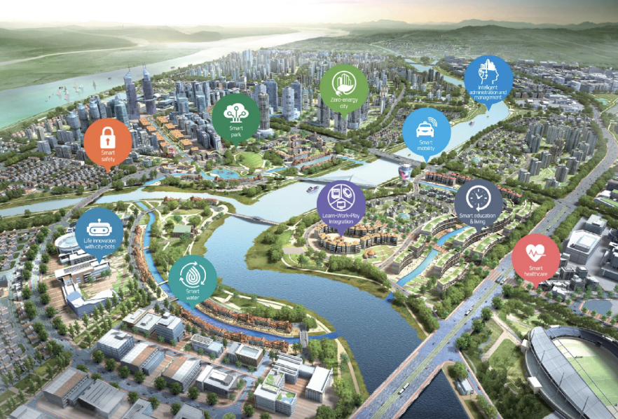

## Overview

<!-- About 100 to 150 word summary of the case study. -->

The Busan Eco Delta Smart City is an 2,773 square meter development project located in Gangseo-gu, Busan. Its development began in 2012 and is scheduled to be completed in 2023. The project's main objective is to provide a variety of services, including housing commerce, research and development, logistics, and more, to its target population of 76,000 people or 30,000 households. This project is being initiated jointly by Busan Metropolitan City, K-water, and Busan Metropolitan Corporation. The city was designed to be smart from the outset and was announced as a pilot project in 2018. With cutting-edge technology such as robots, augmented reality, and artificial intelligence, the community plans to provide residents with greater convenience. 

## Key Characteristics

<!--  Summarize the most visible essential characteristics of the project. For districts: How does the district employ 3-5 of the key characteristics of New Century Cities? For plans: How does the plan address each of the three activities (development, engagement, implementation) of the digital masterplanning process described in the 2015 Townsend and Lorimer paper?
-->

**Smart Growth**. The Busan Eco Delta Smart City project focuses on spatial planning for smart growth, integrating work and home to provide citizens with more accessible and diverse activities 24/7. The city's 7 themed streets connect various functional areas for culture, leisure, and daily life to encourage community activities. The project also emphasizes sharing the environmental benefits of the city, designated as a heritage site, with everyone. The smart innovation center features a data-hub, showroom, brand exhibition, startup assist center, R&D plug-in support, creator space, and more. The project includes themed spaces for waterfront ecology experiences, leisure, and daily activities along the Macdo River, Pyeonggang Stream, and West Nakdong River. The city planning includes five innovation clusters to create decent jobs, such as healthcare and robot clusters, water-thermal energy clusters, and a new Korean Wave AR/VR cluster. The project includes assisted housing for the underprivileged, city informatization, mandatory BIM design for public structures, and application of private sector data in link with digital twin technology for city operations. Finally, the project explores potentials for implementation of integrated smart underground infrastructure with involved parties.

**Sustainable Urban Innovations**. The Busan Eco Delta Smart City project focuses on Sustainable Urban Innovations, including the Eco Delta Smart City Platform. The platform consists of a digital city platform, an augmented city platform, and a robot city platform, optimized for robotics development and applications. The project emphasizes shared infrastructure elements between services to reduce development costs and allow the entire city to be used as a testing lab, promoting bottom-up development. The aim is to implement a cutting-edge digital platform that covers the entire city, providing flexibility that other cities do not offer. The project also includes the implementation of an AR platform, meeting the trend of internet to mobile to augmented service to provide immersive experiences and improve the decision-making process. The project optimizes the city for bot applications to promote utilization and industrial growth, ensuring a sustainable urban environment for the future.

**Top-down and bottom-up approaches.**. The Busan Eco Delta Smart City project focuses on ten innovative ways to add value to urban living, using a people-led, bottom-up approach for field-specific innovations and a top-down approach for strategic objectives. The bottom-up approach includes challenges to find final solutions for selected issues through contests between businesses, living labs to develop innovation tasks, and testbeds to validate technologies and ideas with real-life settings and residents. The top-down approach includes special and common objectives, with areas of focus on life innovation with city-bots, LWP integration, intelligent administration and management, smart water, zero-energy city, smart education and living, post-industrial innovation community, smart healthcare, smart mobility, smart safety, and a sustainable city to last for generations, all designed to create an independent and creative smart citizen, proactive and intelligent public services, and a smart park.

## Goals and Aspirations

<!-- Summarize the most important goals of the project. Replace the placeholder title with a succinct name for the goal. The text should be around 50 words. -->

**Healthy, Balanced, Human-Centered City**. Create a human-centered city that promotes mental health, prioritizes human needs, and emphasizes work-life balance. Its facilities and services are designed to meet their needs and improve their overall quality of life.

**Nature-Human Harmony City**. Focus on ecological protection and sustainable urban planning,  and design to achieve a harmonious coexistence between the city and nature and establish a sustainable ecological city.

**4IR-Driven Smart City**. Elevate the intelligence of the city by incorporating Fourth Industrial Revolution (4IR) technologies into daily life, creating a fundamental shift in the way people live, work, and interact with each other.

## Technology Interventions
<!--  Identify 3-5 specific technology-enabled interventions the project employs or proposes. The text should be around 75-125 words. Separate into more than 1 paragraph as needed. This is a good place to insert additional images, be sure to include captions identifying the source and make sure to not use copyrighted images. -->

**Smart Healthcare**. The smart healthcare is an intervention in the Busan Eco-Delta City project, offering continuous healthcare services and cutting-edge medical technologies to citizens. The project focuses on preventive care by providing a personalized smart healthcare platform and introducing next-generation medical services. The personalized smart healthcare platform, healthcare and big data center, communication services, and introduction of health tokens with blockchain technology have made healthcare services more accessible and efficient for citizens. By developing this personalized smart healthcare platform and leveraging the latest technologies, Busan Eco-Delta City is creating a smart and sustainable city that enhances the quality of life of its citizens. This intervention demonstrates how technology can revolutionize healthcare services and improve public health outcomes.

**Smart Education**. Smart education system is a key technological intervention that helps improve students' personal creativity and critical thinking skills, including innovative teaching and learning approaches such as AR education, smart schools, and innovation education. AR education uses augmented reality to provide an immersive learning experience. Smart schools use the latest technology to enhance the learning process. Innovation education focuses on developing problem-solving skills. This intervention creates a new school paradigm for the smart era, revolutionizing the education system and preparing students for the workforce of the future. By promoting a smart education system, the Busan Eco-Delta is creating a sustainable smart city to improve the quality of life of its citizens.

**Robotics for Quality of Life**. The Busan Eco Delta City project has implemented robotics as a technology intervention to assist with daily living activities, enhancing the quality of life for its citizens. The project has introduced rehabilitation and mobility assist bots, AI assistant bots, and care bots to provide support in different areas of life. The project also provides supportive infrastructure for robotics development and utilization, including expansive shared infrastructure, testbeds, and future robot concept houses. By creating a new lifestyle with robots and integrating them into daily living activities, Busan Eco-Delta City is setting an example of how technology can enhance the quality of life and lead to a better future for all.

*Busan Eco Delta Smart City Strategic Innovation Priorities*

## Stakeholders
<!--  Identify 3-5 key stakeholder organizations or groups. The text should be around 50 words, and include a link to the organization.-->

**Ministry of Land, Infrastructure and Transport**.  The Ministry of Land, Infrastructure and Transport is responsible for national land and transport policies, including urban planning and development. In the Busan Eco Delta City project, the department provides funding and regulatory oversight to ensure that the project complies with national policies and regulations. It works with the City of Busan and other stakeholders such as the private sector to facilitate the successful implementation of the project. [Ministry of Land, Infrastructure and Transport](https://www.molit.go.kr/english/intro.do)

**Busan Metropolitan City**.  As the local government agency responsible for the city, Busan Metropolitan City plays a critical role in the implementation and management of the project. The city provides the necessary infrastructure and services required for the project and works closely with other stakeholders. The City takes steps to educate and inform the public about the project's objectives, achievements, and advantages through various outreach programs. Furthermore, the City conducts evaluations of the project's results and its effect on the community to guarantee its ongoing triumph. [Busan Metropolitan City](https://www.busan.go.kr/eng/index/bsevents/inaugural-address)

**K Water**.  K water is primarily responsible for the construction, operation and management of water and renewable energy facilities. k water is leading the digital logistics pilot project for Busan Eco Delta Smart City, applying cutting-edge technology to improve citizen convenience and eliminate logistics problems. k water is also promoting the development of the Swamp Eco Park, a migratory bird habitat designed to restore the ecosystem to a healthy state by working with experts in various fields in the region to design and restore the original functions of damaged land, rivers and land to restore the ecosystem to a healthy state, and to emphasize the purpose of eco-park development and the beautiful friendship between people and nature. [K water](https://www.kwater.or.kr/eng/main.do)

## Leadership
<!--  Conduct one interview with a project leader, and link to a LinkedIn or other profile. Provide a brief biography, no more than 75 words. Identify 3-5 insights or themes from the interview. Feel free to add a photo of the individual here. -->

**Dongho Han**. Dongho Han holds a BArch from Pusan National University in Busan, South Korea, and an MSc in Urban Regeneration from the Bartlett School of Planning, UCL. Previously, he worked at the Research Institute of Industrial Technology and served as an instructor for BIM software, including ArchiCAD and Revit, at Pusan National University. His research primarily centers around sustainable urban regeneration, with a particular focus on policy mobility and achieving sustainability goals.

**Government Leadership**. South Korea has adopted a government-led policy-making approach to smart city development, with a focus on integrating IoT and ICT technologies to improve urban functions and citizens' quality of life.

**Regulation vs. Innovation**. The heavy regulations and government supervision required for private firms to develop their ideas within the EDC platform have been a major barrier to innovation and autonomy. This highlights the need for a flexible and light governance system that encourages private firms to develop their ideas without restrictions and regulations. A modification of the governance system is necessary for successful policy mobility and the implementation of smart city projects.

**Need for Alignment**. The case of the Eco delta City project in South Korea highlights the importance of aligning the perspectives and objectives of all stakeholders involved in the development of a smart city. It also highlights the value of learning from the experiences of other countries and adopting policies and practices that align with the long-term vision of a smart city.

## Financing
<!--  Identify at least one financing scheme being used in this project or plan. About 100 words is probably a good length for this. -->

The Busan Eco Delta Smart City project has a total cost of 5.4 trillion won ($4.23 billion), of which 70 billion won was earmarked from the state budget and the remaining amount will be financed by the private sector. The consortium is composed of 12 companies, including LG CNS, Shinhan Bank, and Wins, among others. About 2 trillion won could be raised by selling all planned 3,800 apartment houses, while commercial buildings and tradable data from city management could serve as another financial source. 

## Outcomes
<!-- Identify 3-5 (anticipated) outcomes. What will/has the project achieved? Thes should not be the same or repeated from elsewhere. Use this space to emphasize something different. About 50 words per is minimum, but these can be as long as you want/need. -->

**Smart City Demonstrations**.  Busan Eco Delta Smart City is a digital city that supports innovative mobile technologies and services such as autonomous driving and car sharing. It also aims to create a mobile healthcare system to improve citizens' healthcare and overall well-being. Moreover, it has established a smart park where citizens can experience the latest technology and design innovations, creating a better environment and platform for innovation.

**Augmented Reality Pilots**.  Busan Eco Delta Smart City is an augmented city with augmented reality technology that is smarter and more connected. In education, a new system of schools is established through AR education, and city applications based on AR technology support citizens ability to easily access various facilities and services in the city through fingertip booking. In addition, the city is using the latest digital technologies, such as digital signage, virtual reality, and augmented reality, to support diverse exhibitions and attract the attention of exhibitors.

**Robotics Tests**.  Busan Eco Delta Smart City is a robot city featuring the application of robots in daily life and industry, and the expansion of related infrastructure to establish a world-renowned robot city. In this city, the most advanced robotics technology is integrated with life to improve the quality of life of its citizens, while also promoting the development of the robotics industry as the world's leading robotics industry center.

## Open Questions
<!-- Identify 1-3 open question(s). What is uncertain, unclear, or still unresolved about this project? These can be 50 words or less. -->

- How will the project address the potential displacement of residents during the construction phase?
- How will the project ensure the inclusivity and accessibility of its smart technology platforms, such as smart healthcare services or opportunities for decent jobs, for citizens of all socioeconomic backgrounds?
- How will the project address potential privacy concerns that may arise from the extensive use of data and technology in the city?

## References

### Primary Sources

<!-- 3-5 project plans, audits, reports, etc. -->

- Busan Offical Website: https://www.busan.go.kr/eng/ecodelta01
- Embrace the Future Busan Eco Delta Smart City: Action Plan Summary: https://busan-smartvillage.com/filedown?realfile=EDC_20230301212857f64326442096edb3363148ad7080aef1.pdf&download=[brochure]%20BUSAN%20ECO%20DELTA%20SMART%20CITY.pdf
- K-water 2022 Sustainability Report: https://www.kwater.or.kr/web/eng/download/smreport/2022_SMReport.pdf
- Korea's Smart City Report: https://smartcity.go.kr/wp-content/uploads/2022/09/2023-Smart-city-brochure.pdf

### Secondary Sources

<!-- 5-7 secondary source documents: news reports, blog posts, etc.. -->

- https://cities-innovation-oecd.com/cities/busan-kor/
- News: LG CNS selected as preferred bidder for $4.23 bn Busan smart city project (https://pulsenews.co.kr/view.php?sc=30800028&year=2022&no=443140)
- News: Smart City Fair displays innovative tech for recycling water and waste (https://www.korea.net/NewsFocus/HonoraryReporters/view?articleId=180517)
- News: NEWSSamsung building a futuristic home in Korean smart city (https://www.sammyfans.com/2021/12/27/)samsung-building-a-futuristic-home-in-korean-smart-city/
- News: A New City, Built Upon Data, Takes Shape in South Korea (https://www.nytimes.com/2022/03/28/technology/eco-delta-smart-village-busan-south-korea.html)
- Park, J., Kim, S., Jun, S., & Jung, J. (2019). Are Smart Cities Growing Smartly and Sustainably?: Smart and Sustainable Growth Evaluation of Each Plan of Two Smart Cities in South Korea. Journal of Environmental Policy and Administration, 27(S), 17–49. https://doi.org/10.15301/jepa.2019.27.s.17