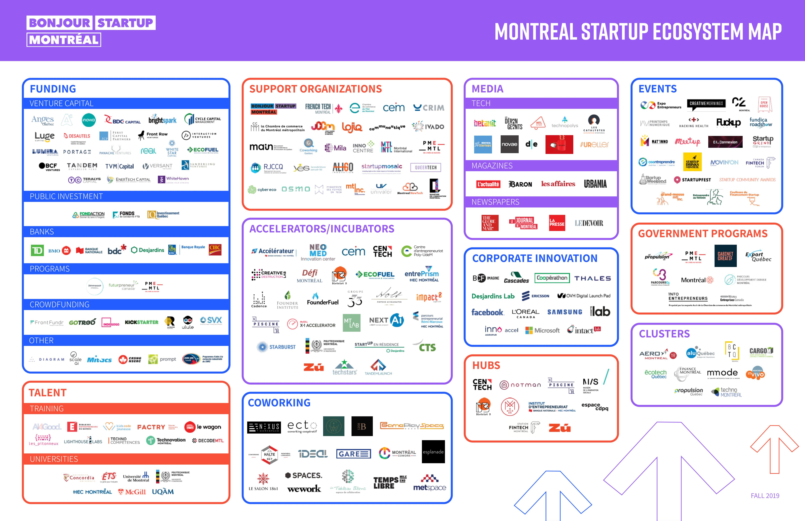

## Overview

<!-- About 100 to 150 word summary of the case study. -->

What makes a good innovation ecosystem? According to research on the topic, many studies point to a few key features: networks, talent, and innovators. These features might be described in different terms, however, overall their impact remains the same according to the following functions they perform: research & development within academia and industry, research institutions to support these functions, and enough jobs to support a collaborative environment. Montreal seems to check all the boxes of a great innovation ecosystem. So what does that mean for the city itself?

## Key Characteristics

<!--  Summarize the most visible essential characteristics of the project. For districts: How does the district employ 3-5 of the key characteristics of New Century Cities? For plans: How does the plan address each of the three activities (development, engagement, implementation) of the digital masterplanning process described in the 2015 Townsend and Lorimer paper?
-->

**Montreal's Smart and Digital City Action Plan focuses on improving Quality of Life and improving economic development. What are the specifics?**

**City as a Lab**.  Montreal's innovation community experiments with concrete solutions to problems of mobility, food, and municipal regulations. This program makes it possible to quickly implement concrete solutions imagined by the community to test them with citizens.

**Innovation in Food and Mobility**  Montreal is focused on innovation in two key areas: Food and mobility. Regarding the former, key target metrics include: reducing pollution, increasing sustainable mobility options, simplifying access to services, reducing local single-driver trips. For the latter, the enhanced sharing of local resources, improved organizational efficiency, increased distribution, and reduced food waste were important characteristics listed within the 2023 innovation community plan.

**Bottom-Up Approach to Governance**.  Whether it's the 10-year masterplan or current projects, Montreal is focused on consulting with citizens to develop solutions from the ground up. Over the next 10 years, the goal is to speed up the ecological transition, strengthen solidarity, equality, and inclusion, promote democracy and participation, and stimulate innovation and creativity. Have smart city initiatives helped with this?

## Goals and Aspirations

<!-- Summarize the most important goals of the project. Replace the placeholder title with a succinct name for the goal. The text should be around 50 words. -->

**Discover linkages between industry, government, and academia**. In the realm of AI and smart city initiatives, discovering the links between government, industry, and academia is essential to fostering a synergistic ecosystem. These connections, often facilitated by collaborative projects, shared objectives, and mutual support, serve to expedite innovation, encourage knowledge transfer, and ensure the development and application of AI technologies align with societal needs and ethical standards.

**Assess the presence and influence of the AI industry on Montreal's Smart City Strategy and Plan**. With more than 19,400 jobs in AI and 6,000 researchers, Montreal's AI ecosystem generates $1.2 Billion in yearly revenue. This influences all aspects of life, including political, cultural, and financial structures that move the city forward.  

**Consider the long-term impacts of an AI innovation ecosystem.**. An AI innovation ecosystem can foster significant long-term impacts: economic growth through job creation and new industries, improved municipal services via data-driven decision-making, enhanced quality of life through smart solutions, and increased environmental sustainability. However, it also presents challenges such as data privacy concerns, ethical dilemmas, and workforce displacement due to automation, requiring careful management and regulation. How has the city found a balance regarding these elements?

## Technology Interventions
<!--  Identify 3-5 specific technology-enabled interventions the project employs or proposes. The text should be around 75-125 words. Separate into more than 1 paragraph as needed. This is a good place to insert additional images, be sure to include captions identifying the source and make sure to not use copyrighted images. -->

**Optimized Mobility**. Sustainable mobility is on the forefront of Montreal's 10-year plan. Since the 2019 project, Montreal has also experimented with various mobility initiatives. For instance, an autonomous shuttle service is offered between a few blocks near the city centre. The shuttles are programmed to travel on a predefined route, at a maximum speed of 20 km/h. Ultimately, the aim is to reduce traffic and congestion.

**Smart Food Initiatives**. As an outcome of the 2019 competition, Montreal focused on food as one of the three components of the programme. Key goals included increasing the efficiency of community organizations that distribute food, improving access to healthy local food for vulnerable populations, sharing mutual resources to feed everybody, and reducing waste along the food distribution chain. For instance, the MutuAli platform facilitates the sharing of professional food industry equipment in Montreal. It bridges the gap between the needs of the local community and resources available across the city. Another project, Recolte, strengthens the supply chain by providing fresh, healthy, local foods to community organizations, while improving market access for food producers.

**Open Data Legislation**.  Montreal's smart city strategy primarily gravitates around a robust emphasis on open data. This central aspect serves as a conduit to allow both the public and software developers to gain access to an expansive array of data clusters. The goal is to underpin transparency, stimulate civic participation, and foster a culture of innovation. To facilitate this, Montreal has painstakingly created dedicated data portals. Moreover, the city has embarked on an ambitious mission to not just enhance the quality of these datasets but also significantly expand their volume. Montreal highlights multiple data hubs, including the Indigenous data hub which partners with Montreal's Indigenous Community NETWORK - this organization develops and coordinates a data project aiming to promote the sovereignty of Indigenous data.

On the legal front, Montreal has displayed an unwavering dedication to ensuring adherence to privacy and data protection statutes within the framework of its smart city projects. The city grapples with the delicate act of balancing the tangible advantages proffered by data collection and utilization, while simultaneously safeguarding the privacy rights of its citizens. The city is also actively contemplating legislative measures to manage the advent of new technologies and the subsequent impacts on its denizens and the urban fabric. This includes formulating policies on complex issues such as data ownership and the implementation of artificial intelligence in the provision of public services.

## Stakeholders
<!--  Identify 3-5 key stakeholder organizations or groups. The text should be around 50 words, and include a link to the organization.-->

**Tech Industry**.  Industry stakeholders are companies and businesses directly involved in or affected by the implementation of the smart city plan. This group includes tech companies who design and produce smart technologies (IoT devices, sensors, AI software, data analytics tools, etc.), construction and infrastructure firms who are responsible for integrating these technologies into the city's physical infrastructure, telecommunication companies, energy providers, and transport organizations. They stand to gain from new business opportunities that arise as a result of the city's transformation. Their innovations, expertise, and resources are critical to driving the smart city initiative forward. With its AI-focused research lab, Microsoft Research Montreal is a key stakeholder in the city's AI initiatives. In 2019, DeepMind also announced the opening of a new research lab in Montreal, further solidifying the city's status as a global AI hub. [Google Deepmind](https://www.deepmind.com/)

**Government Bodies**.  Government stakeholders include local city administrators, provincial and national officials, and regulators. As the entity initiating the smart city plan, the Montreal City Government plays a pivotal role in the overall decision-making, funding, regulation, and coordination of the initiative. They are responsible for ensuring that the plan aligns with the city's broader strategic goals, serves public interests, and complies with laws and regulations. They also have to maintain transparency and engage the public in the decision-making process. Other government bodies, like provincial and national governments, might be involved in providing support, setting policy, and regulation.

[Montreal's Innovation Community](https://portail-m4s.s3.montreal.ca/pdf/mtlcommun_projectguide_montreal_in_common_-_an_innovation_community_2023.pdf.pdf)

**Academia**. Universities, research institutions, and other academic bodies are crucial for the research and development aspect of the smart city initiative. They can help design, test, and improve smart technologies, and study the impact of these technologies on various aspects of city life. They can also provide education and training to prepare the workforce for a tech-centric urban environment. Their research can inform policy-making and contribute to making the initiative more effective and sustainable. In Montreal, universities such as McGill University and Université de Montréal may have significant involvement in this aspect.

[Montreal Centre Projects, McGill](https://www.mcgill.ca/centre-montreal/projects)

## Leadership
<!--  Conduct one interview with a project leader, and link to a LinkedIn or other profile. Provide a brief biography, no more than 75 words. Identify 3-5 insights or themes from the interview. Feel free to add a photo of the individual here. -->

<!-- **Question 1**. In terms of academic and government partnerships, are there any specific partnerships you can share that have been particularly successful? 
**Question 2**. In general, what are some unique insights you have received from citizens - are there any in particular that stand out to you? 
**Question 3**. How have economic fluctuations, especially the recent downturn in tech financing, impacted the innovation ecosystem in Montreal, specifically regarding its smart city initiatives. 
-->

<!--  While no one was available for an interview within this timeframe, I discovered feedback others have provided in the past.  -->
**Broad Buy-In.** "Agreeing on high-level principles regarding digital data, such as inclusion or the common good, and transposing such principles into concrete action cannot be done without substance. Best practices are achieved by people willing to spring into action. Montreal in common provides the perfect framework for such action, through the diversity of its projects, the support provided for experimentation, and its vision for data use that is centered around humans." - Lauriane Gorce, Data Governance, Open North

**Civic Empowerment.** "Creating concrete change at a neighborhood scale by empowering citizens, whether though joint neighborhood creative or civic activities, is a way to generate collective solutions and to implement them. To participate in Montreal in common is to realize major projects with the potential to affect the future." - Pascal Priori, Neighborhood mobility, Solon

**Optimizing Food Systems** "Optimizing the supply of fresh local products in an effort to enable the most underprivileged Montrealers to have access to healthy nutrition is a true source of motivation for us. We are equally enthusiastic about reaching our goals, by forming partnerships on site, understanding their needs, and proposing efficient and effective tools and solutions on all levels." - Local and integrated food system, Recolte

## Financing
<!--  Identify at least one financing scheme being used in this project or plan. About 100 words is probably a good length for this. -->

**Local, Provincial, and Federal Funding**. At the federal level, Montreal has the opportunity to pull from awards, grants, scholarships, and funds. This includes the $50,000,000 smart cities grant funding, which was awarded to the city in 2019. Provincially, organizations like MITCAS, the Government of Quebec Research Fund, and the Quebec Infrastructure Fund are potential sources. And at the Municipal level, funding is scattered across a variety of institutions, including numerous innovation labs, research programs, and accelerators.

## Outcomes
<!-- Identify 3-5 (anticipated) outcomes. What will/has the project achieved? Thes should not be the same or repeated from elsewhere. Use this space to emphasize something different. About 50 words per is minimum, but these can be as long as you want/need. -->

**Bottom-up Innovation Strategy**. Montreal relies on team collaboration and on-site experimentation, with the belief that projects must be centered on humans, and knowledge and data must be shared. Their framework and business model operates on the following tenets: (1) Broadcasting knowledge and scaling up through conferences, public or targeted webinars, and durable solutions that are visible in Montreal and abroad, (2) Supporting innovation and experimentation through agile management, collaboration, experimentation, co-design, and citizen participation, (3) Harvesting and pooling of knowledge through platforms and other opportunities for exchange among partners (e.g. meetings, webinars, workshops), and (4) Investing knowledge into programs and projects through the orientations of the governing committee and support team.

## Open Questions

**What are the funding sources and amounts currently allocated to Montreal's' municipal labs?**.  Currently, the information available on Montreal's smart city lab funding is quite vague, and further exploration of the topic is required.

**To what extent is the local government orienting itself to strategically align with industry? Has the development of a bottom-up approach been met with any contention?**  

**How will the AI innovation ecosystem be impacted by economic influences?**

## References

- [Wifi Stations](https://www.mtl.org/en/experience/where-to-find-wi-fi-when-travelling-montreal)
- [Smart Cities Challenge Win, 2019](https://www.mcgill.ca/centre-montreal/channels/news/montreal-wins-smart-cities-challenge-297205)
- [Electric Plaza Shuttles](https://montreal.ca/en/articles/automated-electric-shuttles-plaza-saint-hubert-19054)
- [Sustainable Transport, MTL](https://blog.mtl.org/en/sustainable-transport)
- [Montreal Innovation Laboratories](https://montreal.ca/en/departments/laboratoire-de-linnovation-urbaine-de-montreal)
- [Montreal Centre Projects, McGill](https://www.mcgill.ca/centre-montreal/projects)
- [Social Sciences and Humanities Research Council](https://www.sshrc-crsh.gc.ca/home-accueil-eng.aspx)
- [Science and Innovation Funding, Government of Canada](https://www.canada.ca/en/services/science.html)
- [Research Coordinating Committee, Govenrment of Canada](https://www.canada.ca/en/research-coordinating-committee.html)
- [Canada research funding services](https://www.canada.ca/en/services/science/researchfunding.html)
- [International Chair on the Uses and Practices of the Smart City, ESG UQAM](https://villeintelligente.esg.uqam.ca/partenaires/au-canada/)
- [Mission, Propulsion Quebec](https://propulsionquebec.com/en/about/mission)
- [Montreal City Studio](https://www.concordia.ca/academics/experiential-learning/partners/citystudio.html)
- [About Us, Cite ID Labs](http://cite-id.com/en/about-us)
- [Montreal Innovation Community](https://portail-m4s.s3.montreal.ca/pdf/mtlcommun_projectguide_montreal_in_common_-_an_innovation_community_2023.pdf.pdf)
