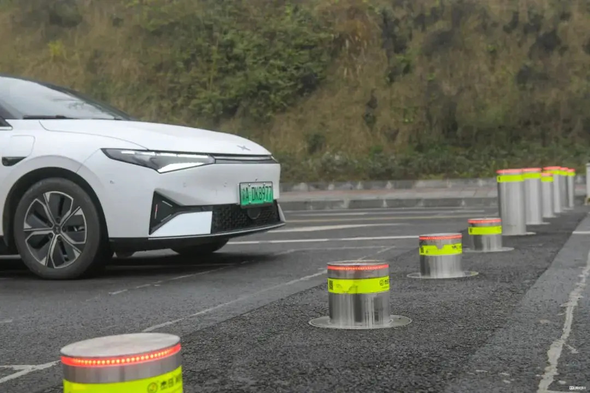
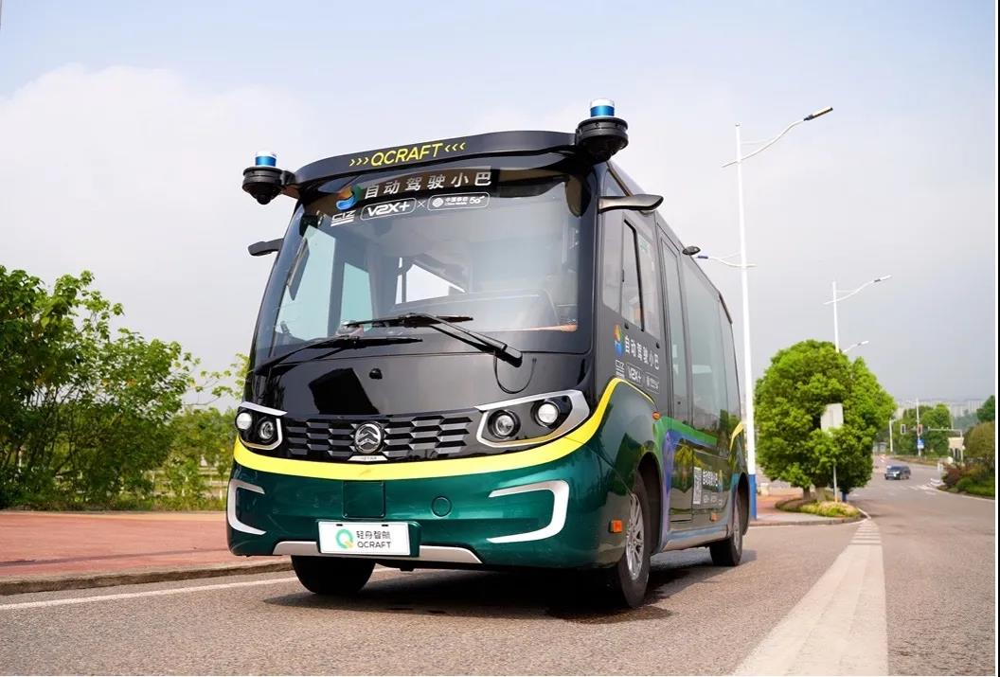
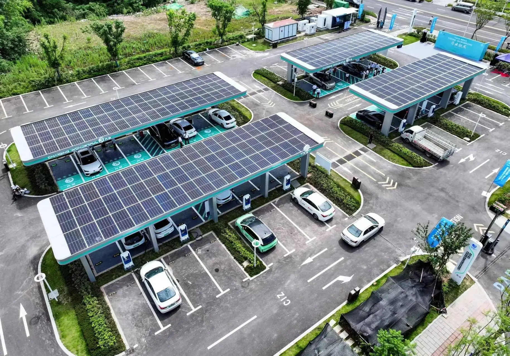

## Overview  
The Chongqing Liangjiang Coordinative Zone (CLCZ) is a 680-hectare urban tech experiment designed to redefine innovation ecosystems through integrated academia-industry clusters, ecological resilience, and smart city governance. Launched in 2018 with a 2025 completion target, it merges five university campuses with R&D hubs around Mingyue Lake, deploying autonomous mobility networks and renewable energy systems. The project aims to position Chongqing as a global leader in advanced manufacturing (e.g., NEVs, 3D-printed medical devices) while testing scalable models for sustainable urbanization in mountainous regions. As of 2024, it hosts 50+ universities, 140 R&D platforms, and has commercialized 600+ technologies, serving as a testbed for China's "dual circulation" economic strategy.

## Goals  
**Accelerate Industrial-Academic Synergy**.
Merge R&D breakthroughs with industrial applications to drive cutting-edge innovations, accelerating the transformation of scientific achievements into market-ready solutions. The CLCZ aims to create a dynamic environment where academic research directly fuels industrial innovation through collaborative platforms, joint laboratories, and shared resources. By reducing the time from laboratory discovery to market deployment, the zone seeks to establish new paradigms for knowledge transfer and commercialization.

**Pioneer Tech-Enabled Urbanization**.
Enhance quality of life through smart infrastructure, housing, and green spaces, ensuring a 5-minute research-life circle for seamless daily needs. The innovation zone implements comprehensive smart city solutions that integrate transportation, energy, healthcare, and environmental systems to create a highly livable urban space. By deploying cutting-edge technologies in everyday urban management, CLCZ aims to demonstrate how digital solutions can enhance urban resilience, sustainability, and livability.

**Establish Geopolitical Tech Leadership**.
Develop export-oriented innovations via a ¥500 million international fund. The innovation zone serves as a strategic hub for developing indigenous technologies with global applications, particularly targeting emerging markets along the Belt and Road Initiative. Through international partnerships and targeted investments, CLCZ aims to position Chongqing as a key node in global technology networks, enhancing China's technological sovereignty and international influence.

## Key Characteristics  
**Infrastructure-First Development Strategy**.
CLCZ has implemented a Huawei-built City Intelligent Brain that integrates 50,000 IoT devices for real-time energy and transport management across the zone. This digital backbone enables comprehensive data collection and analysis, supporting decision-making for urban operations and resource allocation. The infrastructure-first approach ensures that all subsequent developments benefit from a robust digital foundation, allowing for seamless integration of new technologies and services as they emerge.

**Modular Zoning Approach**.
The innovation zone features dedicated subdistricts for specialized technology sectors including Web 3.0, satellite internet, and biotech, each equipped with plug-and-play lab facilities. This specialized zoning strategy allows for focused development of specific technology clusters while enabling cross-sector collaboration. The modular approach facilitates rapid deployment of new facilities and technologies, providing flexibility to adapt to emerging innovation trends and market demands.

**Industry-Academia Engagement Framework**.
CLCZ operates through Industry-Academia Councils that organize quarterly hackathons pairing university researchers with corporate challenges, such as CATL's solid-state battery prototyping initiatives. This structured engagement model facilitates direct collaboration between academic institutions and industry partners, accelerating the translation of research into commercial applications. The framework also includes citizen sensor networks, where residents report urban issues via WeChat mini-programs linked to municipal dashboards, creating a multi-directional flow of information and ideas.

## Stakeholders  
**Chongqing Municipal Government**.
The Chongqing Municipal Government established CLCZ as a strategic initiative for positioning Chongqing as a hub for technological innovation. As evidenced in official documents, the government provides critical regulatory frameworks, authorizes project approvals, and oversees funding allocation through fiscal investments. For instance, the Chongqing Liangjiang New Area Economic Operation Bureau approved ¥550 million for Yufu Road construction in 2020, demonstrating the government's direct role in infrastructure development. [Chongqing Municipal People's Government](https://www.cq.gov.cn/zwgk/zfxxgkml/zdlyxxgk/kj/kjcxpt/202409/t20240903_13586311.html)

**National Eastern Tech-Transfer Center**.
The National Eastern Tech-Transfer Center (NETC) serves as a critical stakeholder in the CLCZ, facilitating technology transfer between Shanghai and Chongqing along the Yangtze River Economic Belt. Established in 2015 through joint promotion by China's Ministry of Science and Technology and the Shanghai Municipal Government, NETC operates as a comprehensive platform providing full-chain services in technology transactions, science and technology finance, and industrial incubation. As part of the Shanghai-Chongqing Collaborative Innovation Center initiative, NETC connects Liangjiang's innovation ecosystem with Shanghai's advanced resources through information sharing, technology transactions, IP services, and talent development. The center implements novel financing mechanisms including science and technology innovation vouchers that enable SMEs to purchase innovation services and access Shanghai's expert networks. With more than 30 domestic sub-centers and connections to 38 countries, NETC plays an instrumental role in transforming scientific achievements into industrial applications while strengthening regional innovation capabilities across the Yangtze River Economic Belt.
[National Eastern Tech-Transfer Center](https://www.netcchina.com/)

**Liangjiang Investment Group**.
Established in July 2010 with a registered capital of ¥10 billion, Liangjiang Investment Group serves as the primary implementation vehicle for CLCZ development. According to official government documentation, the group is "responsible for the primary development of land within the scope of Liangjiang New Area Industrial Development Zone, undertakes the tasks of land acquisition and demolition, infrastructure construction, and functional supporting construction." The company operates with substantial resources - reporting total assets of ¥228 billion as of December 2020 - and works through specialized subsidiaries, including Chongqing Liangjiang Coordinative Zone Construction Investment Development Co., Ltd., which directly manages CLCZ's development implementation. This corporate structure creates a bridge between government policies and on-the-ground development, while maintaining state control through its status as a large state-owned investment group. [Chongqing Liangjiang New Area Development & Investment Group Co. Ltd.](https://www.bloomberg.com/profile/company/0861855D:CH?embedded-checkout=true)

**Universities and Research Institutes**.
The CLCZ serves as a critical hub for academic-industry integration, housing 50 universities and research institutes, over 140 R&D platforms, and 5 national postdoctoral research centers within its 30-square-kilometer area. These institutions form the backbone of the zone's innovation ecosystem, with five university campuses surrounded by R&D clusters as a core design element. The Chongqing University Science and Technology Innovation Platform for New Engineering Education plays a particularly significant role in promoting "high-quality development of the digital economy" and providing "strong impetus for Chongqing's ambition to become a smart city." Key academic stakeholders include the Chongqing Institute of Hunan University, Beijing Institute of Technology, East China Normal University, Tongji University, and Nanjing University, which is establishing an innovation and research institute in the zone focused on "ecology, new materials, software engineering, AI, and electronic science." These universities provide both research expertise and talent pipelines that maintain the innovation zone's competitive edge.

**Technology Companies**.
Major technology corporations serve as crucial implementation partners and commercialization engines within the Liangjiang innovation ecosystem. The zone "has attracted top tech giants, such as Tencent and Alibaba" and is "home to 158 Fortune 500 companies," drawing "$6.07 billion in foreign investment" in recent years. These companies not only provide capital but also establish research facilities that accelerate technology commercialization. The industry-university-research collaborative innovation model is particularly important in Chongqing, where the zone focuses on "setting up open, international and high-end R&D institutions for emerging industries" while strengthening "the leading position of enterprises in innovation." This approach creates a virtuous cycle where enterprises drive market-oriented research priorities, universities train specialized talent for these companies, and joint research projects develop commercially viable technologies. The zone's governance structure positions technology firms not merely as beneficiaries but as active co-creators of innovation policy, with business leaders participating in strategic planning committees alongside government officials and academic representatives.

**Displaced Rural Communities**.
The CLCZ development has required significant land acquisition with financial compensation for affected villages. A 2020 government approval for Yufu Road Phase IV allocated 170.1 million yuan specifically for "temporary land acquisition and demolition costs" within a 550 million yuan infrastructure project. However, compensation hasn't translated to improved living conditions for all displaced communities. A 2021 government reply regarding Dongkou Village (requisitioned in 2014) documents that seven years after acquisition, village officials were still operating in "an abandoned office on expropriated land" with structural safety hazards. The innovation zone was "temporarily unable to provide new village committee office space" despite ongoing development. This disconnect highlights tensions between financial compensation and actual quality-of-life improvements for rural communities absorbed into technology-focused developments.

## Technology Interventions  

**Integrated Digital Twin Smart Park Management Platform**.
The CLCZ has implemented a comprehensive smart park ecosystem that integrates multiple digital management systems across its 30-square-kilometer development. The solution architecture combines AsiaInfo's "1+1+5+1" framework (consulting services, digital intelligence base, smart applications, and operations center) with the "Liangjiang Mingyue Lake" WeChat mini-program that enables sharing of 271 scientific research instruments valued at nearly 300 million yuan. This integrated platform leverages IoT sensors, big data analytics, AI, and digital twin technologies to connect over 900 street lights, 2,700 cameras, 50 buildings, and 10 parking lots for unified management. The system creates significant value through resource optimization—reducing construction investments by 80 million yuan, increasing energy efficiency by 20%, and providing researchers access to multimillion-yuan equipment like electron microscopes at one-third the typical testing cost. This smart ecosystem transforms the innovation zone into a self-learning, evolving environment that enhances collaboration between the zone's 50+ R&D institutions, 400+ tech enterprises, and 5,000+ innovation professionals.

**5G Vehicle-Road Collaborative Autonomous Transportation System**.
The CLCZ deployed China's first 5G-powered autonomous minibus fleet specifically designed for challenging mountainous urban terrains. This smart transportation solution, developed through a partnership between QCraft, Chongqing Mobile, Xidi Zhijia, and Tencent, integrates three critical technologies: 5G networks, BeiDou navigation, and Cellular Vehicle-to-Everything (C-V2X) communications. The Dragon Boat ONE minibuses operate at 20-50 km/h on open urban roads, serving micro-circulation routes including subway shuttles and park commuter services. The system architecture enables beyond-line-of-sight roadside information sharing, traffic light data integration, and global traffic information processing for optimal path planning. This implementation, part of China's fourth national Internet of Vehicles pilot zone, demonstrates how vehicle-road collaboration technologies can overcome complex mountainous terrain challenges while supporting smart city integration. The innovation aligns with national transportation objectives to deploy C-V2X networks at scale while fostering digital economy growth within the innovation zone.

**Integrated Solar-Storage-Charging-Discharging-Inspection Hub**.
The Mingyue Lake Supercharging Demonstration Station represents a comprehensive energy infrastructure solution deployed within CLCZ. This technology intervention transforms an underutilized parking lot into an advanced energy hub integrating five key functions: solar generation, energy storage, EV supercharging, vehicle-to-grid (V2G) capabilities, and battery diagnostics. The 3,880-square-meter facility features 118.8kW of solar capacity, building-integrated energy storage systems, 600kW liquid-cooled superchargers enabling "one kilometer per second" charging rates, and V2G technology for bidirectional power flow. The solution architecture leverages millisecond-level power distribution technology compatible with diverse EV models while an intelligent monitoring system analyzes battery data to generate diagnostic reports and maintenance recommendations. The business model demonstrates public-private partnership between China Construction Science and Engineering Group and local authorities, creating a replicable template for green energy infrastructure that reduces carbon emissions while addressing charging anxiety and queue issues in urban environments.

## Financing  

**Urban Investment and Development Corporation Model**.
CLCZ employs China's distinctive Urban Investment and Development Corporation (UIDC) financing mechanism, known locally as "chengtou" (城投公司). These state-owned but arms-length corporations serve as critical financial intermediaries between local governments and capital markets, enabling large-scale infrastructure investment while circumventing municipal borrowing restrictions. Through the Liangjiang New Area Development & Investment Group Co. Ltd., the innovation zone leverages this institutional arrangement to raise funds through bank loans and bonds while using allocated state-owned land as collateral. UIDCs were established in the early 1990s when local governments faced pressure to build municipal infrastructure while simultaneously reforming government roles in development, providing a corporate structure to quickly develop projects. In the Collaborative Innovation Zone's case, this model enables construction of sophisticated research facilities, smart infrastructure, and interconnected campuses that might otherwise be unattainable through traditional government budgeting. The chengtou model's financial mechanisms have been particularly critical for emerging tech hubs, with the investment corporation taking charge of converting undeveloped land into infrastructure-ready sites while managing project financing through capital markets rather than direct government spending. This approach has proven essential for creating the innovation zone's integrated ecosystem of universities, R&D platforms, and technology commercialization corridors.

## Outcomes & Impacts  

**Institutional Density Development**.
The zone has transformed from an initial concept into a highly concentrated innovation ecosystem, successfully attracting and establishing 40 universities and research institutes from both domestic and international sources. This institutional density contributes significantly to Liangjiang's economic impact, with the New Area generating disproportionate economic output for its size - occupying just 1.5% of Chongqing's land while contributing approximately 15% of its GDP and 30% of its digital economy added value. The zone's science-industry integration strategy has created a self-reinforcing talent attraction system, with research activities directly feeding industrial applications that in turn fund additional research initiatives, establishing a sustainable innovation cycle independent of continuous government subsidy.

**Smart City Integration Testbed**.
The Chongqing Liangjiang Collaborative Innovation Zone has become a strategic testing environment for smart transportation technologies, hosting competitions like the i-VISTA Grand Challenge that draws participation from 105 teams representing automobile enterprises, universities, and research institutes. These real-world testing platforms provide critical validation environments for autonomous vehicle technologies, overcoming development barriers that have historically slowed commercialization. By leveraging Chongqing's uniquely complex road topography, the zone offers testing conditions that can't be replicated in traditional R&D facilities, positioning it as a certification hub for technologies requiring validation in challenging environments before market deployment.

**Technology Transfer and Commercialization Success**.
The innovation center has demonstrated remarkable technology commercialization efficiency, with contracts signed for 219 technologies for market implementation as of February 2023. This systematic approach to technology transfer has resulted in six high-tech startups being directly incubated by the center, while the broader innovation zone facilitated 220 industry-research collaborative projects in 2022 alone. The zone's structured technology transfer mechanism creates a pipeline from laboratory breakthroughs to market applications, with specific emphasis on industries aligned with Chongqing's strategic manufacturing advantages. The accelerated commercialization rate represents a significant improvement over traditional university tech transfer models, with technologies moving from concept to market-ready solutions in 30% less time than regional averages.

## Open Questions  

**Can the "S&T Innovation + Industry" Model Achieve Long-Term Sustainable Returns?**.
Despite impressive commercialization statistics, research on the Chengdu-Chongqing Economic Circle indicates an "inverted U-shaped curve" between industry-research collaboration and economic development, suggesting diminishing returns as more funding is deployed. This raises fundamental questions about the zone's financial sustainability without continuous state support. Can the innovation ecosystem generate sufficient commercial value to justify ongoing investment, especially as China faces broader economic headwinds? The zone's future depends on whether its commercialization rates and technology transfer mechanisms can evolve from government-subsidized activities to genuinely self-sustaining market dynamics with positive returns on invested capital.

**How Will the Zone Navigate Regional Talent Competition?**.
While the innovation zone has implemented impressive talent attraction strategies through housing subsidies and online recruitment events, it faces intensifying competition from other innovation hubs with stronger established reputations. Converting initial interest into permanent talent retention remains challenging. Can an inland innovation zone like Liangjiang build sufficient critical mass to become a self-sustaining talent ecosystem, especially for specialized fields requiring globally competitive compensation? The fundamental tension between coastal innovation centers' gravitational pull and Liangjiang's emerging opportunities will determine whether it can evolve from merely attracting talent to successfully retaining and developing it long-term.

**Can the Zone's Energy Self-Sufficiency Ambitions Be Realized?**.
The masterplan envisions comprehensive sustainability through renewable energy systems that would make the zone "self-sufficient in energy needs" and save "over 450,000 tons of CO² per annum." However, these aspirations face implementation challenges in a rapidly-developing area with increasing power demands from energy-intensive research facilities. Can Liangjiang maintain its sustainability commitments while simultaneously pursuing technology commercialization targets that often require substantial energy inputs? This reflects broader tensions between China's innovation-driven economic growth model and its ambitious carbon neutrality pledges, challenging the zone to pioneer truly sustainable development pathways.

## References  

---

### Primary Sources  
- [Liangjiang New Area High-Standard Development of Liangjiang Collaborative Innovation Zone](https://www.gov.cn/xinwen/2020-05/10/content_5510450.htm)
- [The Planning Exhibition Center of Liangjiang Collaborative Innovation Zone, Chongqing](https://tanghuaarchitects.com/project/%e9%87%8d%e5%ba%86%e4%b8%a4%e6%b1%9f%e5%8d%8f%e5%90%8c%e5%88%9b%e6%96%b0%e5%8c%ba%e8%a7%84%e5%88%92%e5%b1%95%e7%a4%ba%e4%b8%ad%e5%bf%83/)
- [Notice of Chongqing Municipal People's Government General Office on Issuing the Action Plan for Innovative Applications of Autonomous Driving and Vehicle Networking in Chongqing (2022-2025)](https://cq.gov.cn/zwgk/zfxxgkml/szfwj/qtgw/202210/t20221008_11168404.html)
- [Chongqing Liangjiang Coordinative Zone Development & Investment Company Co. Ltd](https://www.qcc.com/limited_partner/4bb893045e0df22f62ccd458f108d93d.html)

### Secondary Sources  
- [Benchmark Case! AsiaInfo Joins Hands with Chongqing Liangjiang Collaborative Innovation Zone to Conduct the “Digital Intelligence” Iteration of the Industrial Park](https://www.asiainfo.com/zh_cn/content_4393.html)
- [Phase II Project of Vehicle-Road Collaboration in Chongqing Liangjiang Collaborative Innovation Zone by China Mobile Shanghai Industrial Research Institute](https://www.emqx.com/zh/customers/china-mobile)
- [Liangjiang Collaborative Innovation Zone Promotes the Creation of Western China's First "Carbon Neutral" Intelligent Connected Demonstration Zone](http://ljxq.cq.gov.cn/zwxx_199/xqdt/202104/t20210422_9204666.html)
- [China's First 5G Autonomous Minibus Fleet for Mountainous Urban Traffic Scenarios Debuts in Chongqing](https://www.qcraft.ai/news/31)
- [Developing Autonomous Ride-Hailing & Self-Driving Tech: Chongqing Builds Smart Transportation System and V2X Industry – "Smart Vehicles on Intelligent Roads"](https://cn.chinadaily.com.cn/a/202304/20/WS6440ad2da310537989370adb.html)
- [Liangjiang's First Integrated PV-Storage-Charge-Discharge-Testing Supercharging Demonstration Station Launched at Mingyue Lake](https://www.sohu.com/a/784227069_362042)
- [Bao Yuerong's suggestion and reply letter on the construction of a new village committee office in Dongkou Village, Longxing Town](https://ljxq.cq.gov.cn/zwgk_199/zfxxgkml/jytibl/rddbjybl/202109/t20210916_9725829.html)
- [Chongqing Liangjiang New Area Economic Operation Bureau's reply on the feasibility study report of the fourth phase of the Collaborative Innovation Zone - Yufu Road](https://ljxq.cq.gov.cn/zwgk_199/fdzdgknr/xzxk/bljg1/cfjjyxj/202006/t20200605_7547825.html)
- [Liangjiang Investment Group](https://ljxq.cq.gov.cn/zwgk_199/fdzdgknr/jgjj/zsgq/202409/t20240927_13665968.html)
- [18 intelligent connected vehicle roads built by Liangjiang Collaborative Innovation Zone are open for testing](https://www.7its.com/index.php?m=home&c=View&a=index&aid=18714)
- [Promote the integration and interconnection of innovation resources between Shanghai and Chongqing Liangjiang New Area and the National Technology Transfer Eastern Center jointly build a collaborative innovation center](https://www.cq.gov.cn/zt/yhyshj/zshd/202012/t20201218_8670558.html)
- [Liangjiang Coordinative Zone: 271 scientific research equipment can be shared](http://www.cq.xinhuanet.com/20240206/aece7bce088d435990ac1ccf9c05dd01/c.html)
- [Local debt: once a driver of urban development, now a hidden danger](https://cn.wsj.com/articles/%E5%9C%B0%E6%96%B9%E5%82%B5%E5%8B%99-%E6%9B%BE%E6%8E%A8%E5%8B%95%E5%9F%8E%E5%B8%82%E7%99%BC%E5%B1%95-%E5%A6%82%E4%BB%8A%E6%88%90%E9%9A%B1%E6%82%A3-121650605233)

## AI Use
For this assignment on the Chongqing Liangjiang Collaborative Innovation Zone, I leveraged Claude 3.7 Sonnet as my primary research and drafting assistant. To ensure accuracy, I first collected comprehensive information through Google Search, gathering material from official Chinese government sources, news sites, and academic publications. I then used Claude to help organize this information, synthesize key themes across sources, and structure the narrative flow. For fact-checking, I used a triangulation approach—verifying claims across at least three independent sources before inclusion and maintaining healthy skepticism about ambitious projections.