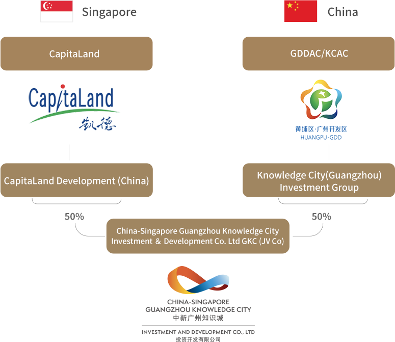
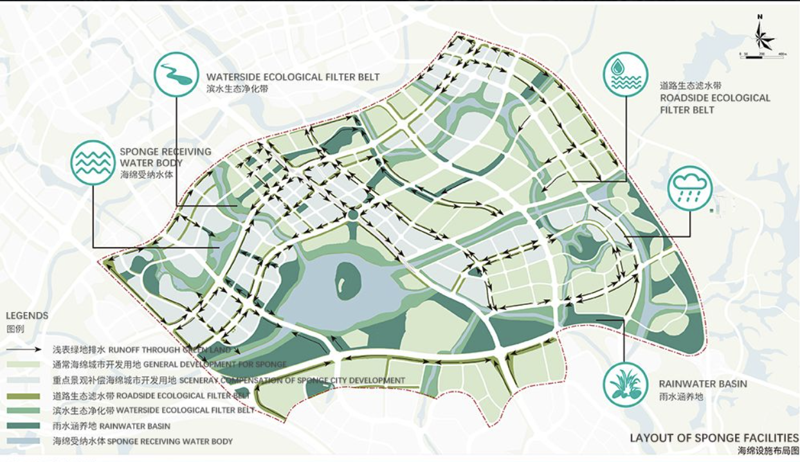
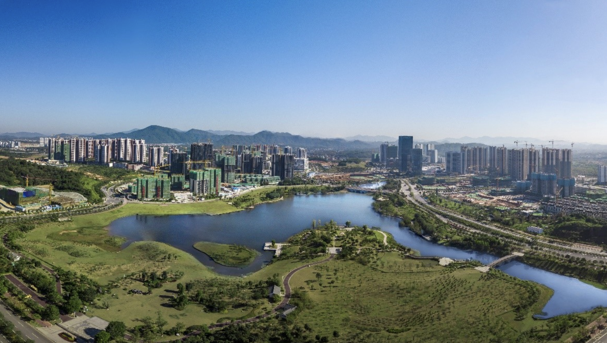
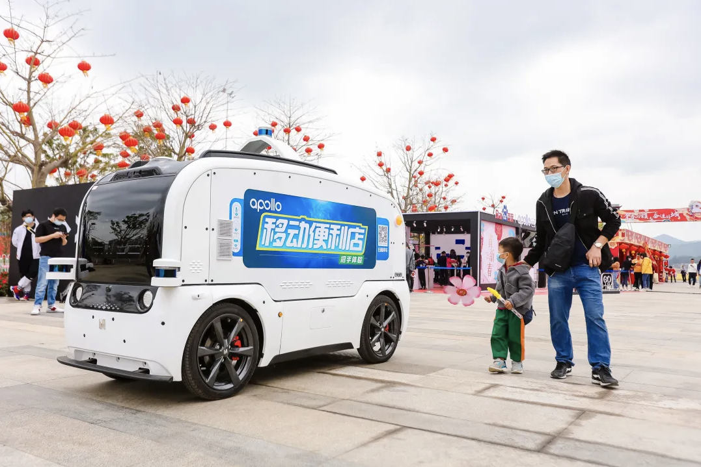

<!--
Allowed values:

type: district, plan

tags: Environment, Mobility, Buildings, Energy, InformationSystems, HealthEducation, InnovationSystems, CivicTech, CivicInnovation, Food

-->

## Overview

<!-- About 100 to 150 word summary of the case study. -->

The Sino-Singapore Guangzhou Knowledge City (SSGKC) is developed by a joint venture between China and Singapore aimed at creating an innovation hub and smart city demonstration zone in Guangzhou. Leveraging Singapore's expertise in urban planning and knowledge-based economies, SSGKC aims to foster a vibrant ecosystem for high-tech industries, startups, and research institutions. The 232 square kilometer development integrates cutting-edge smart city infrastructure like high-speed connectivity, sensor networks, renewable energy systems and intelligent management tools from the ground up. Key focus areas include healthcare and biomedical sciences, sustainable urban solutions like the "sponge city" ecological concept, and smart living showcases featuring autonomous vehicles and e-government services. Through public-private partnerships and strategic collaborations with universities like SCUT and NTU, SSGKC aspires to attract talent, drive innovation, and serve as a model for sustainable urban development across China.

## Goals and Aspirations

<!-- What is the project trying to achieve? Identify 3-5 high-level goals that define the entire project.Replace the placeholder title with a succinct name for the goal. -->

**Collaborate with Singapore to Develop a Smart City Testbed for Innovation**.
SSGKC (Sino-Singapore Guangzhou Knowledge City) aims to leverage Singapore's expertise in smart city development and urban management to create a living lab for piloting and showcasing cutting-edge technologies and innovations. Through close collaboration and knowledge sharing with Singapore, SSGKC seeks to adapt and apply best practices in areas such as ICT infrastructure, urban planning, and sustainable development.

**Foster a Vibrant Innovation Ecosystem**.
SSGKC seeks to create an incubator like environment for knowledge-based industries and start-ups to thrive. It will focus on attracting investments in high value-added sectors such as ICT, clean tech, biomedical sciences, and professional services. Key initiatives include establishing research institutes, accelerators, and centers of excellence, as well as providing supporting policies and incentives for innovation and entrepreneurship.

**Become a Model for Sustainable Urban Development**.  
SSGKC aspires to showcase best practices in sustainable urban solutions that can be replicated in other Chinese cities. It will adopt a comprehensive approach that encompasses green building standards, renewable energy, water and waste management, smart mobility, and ecological conservation. Its Eco-City plan will also leverage data analytics and digital tools to optimize resource efficiency and enhance urban resilience.

## Key Characteristics

<!--  How is the project organized into specific activities that advance these goals? For plans: How does the plan address each of the three activities in digital master plans (development, engagement, implementation). For districts: How does the district employ 3-5 of the key characteristics of innovation hubs?
-->

**Strategic Location and Connectivity**.
SSGKC is strategically located in Guangzhou Huangpu District, at the heart of the Pearl River Delta region, one of China's most dynamic and innovative economic zones. It is well-connected to major cities like Shenzhen and Hong Kong, and closely located to its partner city, Singapore. The similarity in climate and geographical conditions between Guangzhou and Singapore creates an ideal environment for collaboration, knowledge sharing, and talent development through university exchange programs. SSGKC's strategic location provides companies with access to a large market, diverse talent pool, and opportunities for cross-border collaboration, while its proximity to key research institutions facilitates industry-academia partnerships and technology transfer.

**Public-Private Partnership Model**.  
SSGKC employs a unique collaboration model that is enterprise-led, government-supported, and market-driven. This public-private partnership leverages the strengths of both the Singapore and Chinese governments in providing strategic guidance and policy support, while giving the private sector the flexibility to drive innovation and respond nimbly to market demands. The joint venture company, GKC Co., works closely with various stakeholders to create an efficient and innovative environment for businesses to thrive.

**Comprehensive Smart City Infrastructures**.
As a public and private collaborated project, SSGKC has the advantage of integrating smart city solutions from the ground up with a total area of 123 square kilometers and 60 square kilometers designed for development. It boasts a state-of-the-art ICT infrastructure that includes high-speed broadband connectivity, sensor networks, and cloud computing platforms. The district also pioneers the use of smart grids, renewable energy systems, and intelligent urban management tools to optimize resource efficiency and enhance public services. This comprehensive smart city infrastructure provides a robust foundation for companies to develop and test new technologies and applications. Moreover, SSGKC acts as a demonstration district for the city to showcase and pioneer its smart city initiatives.

## Stakeholders
<!--  Who initiated the project? Who is leading the project forward? Who else has a say in how it unfolds? Who is directly affected but marginalized? Identify 3-5 key stakeholder organizations or groups. Identify 3-5 key individuals. These are people who are associated with the project as leaders, supporters, critics, or regulators. They are likely to be members of the stakeholder groups identified above. These are people you should try to contact for one or more interviews.-->

**Knowledge City Inverstment Group(Chinese State-Cowned Enterprises)**.  

Knowledge City (Guangzhou) Investment Group Co., Ltd. is one of the key stakeholders in the Sino-Singapore Guangzhou Knowledge City (SSGKC) project. As a Chinese state-owned enterprise, it is part of the 50-50 joint venture company, GKC Co., which serves as the master planner and developer of SSGKC. The group plays a crucial role in overseeing the project's planning, infrastructure development, investment attraction, and industry development.[Knowledge City (Guangzhou) Investment Group Co., Ltd](https://ssgkc.com/en.php/p01.html?id=1)

**CapitaLand Development(Singapore)**.  

CapitaLand Development, a Singapore-based real estate company, is another key stakeholder in the SSGKC project. As a leading global real estate developer and owner, CapitaLand brings its expertise in master planning, urban development, and real estate investment to the project.  [CapitaLand](https://www.capitaland.com/en.html)

**Research Institutions**.  

Research institutions, such as the South China University of Technology (SCUT) and Nanyang Technological University (NTU), play a vital role in the development of SSGKC as a knowledge-based economy. These institutions collaborate through the Sino-Singapore International Joint Research Institute to drive innovation, research, and talent development in the region. The joint institute focuses on areas such as sustainable urban development, next-generation electric vehicles, and biomedical materials, which align with the key industries targeted by SSGKC. [South China University Of Technology | Nanyang Technological University](https://www.csijri.com/en/introductiontotheinstitute/index.html)

## Technology Interventions
<!--  What specific technology-enabled interventions does the project propose? Identify 3-5 technology interventions. Describe use cases, value proposition, solution architecture, data created or consumed, key platforms and standards, business models, regulatory issues, etc. Separate into more than 1 paragraph as needed. This is a good place to insert additional images, be sure to include captions identifying the source and make sure to not use copyrighted images. -->

**Healthcare & BioMedical**. SSGKC has established a dedicated healthcare and biomedical cluster to foster clinical research, new drug development, and innovative medical technologies. The cluster provides a conducive environment for biomedical companies, offering subsidized office spaces and funding support. The ecosystem is anchored by three state-of-the-art oncology hospitals, two advanced proton treatment centers, and a research facility in collaboration with the Sun Yat-sen University Cancer Center. This infrastructure, along with comprehensive support services and access to talent, attracts leading biomedical research companies to establish their presence in SSGKC and engage in groundbreaking research projects, accelerating the development of innovative healthcare solutions.

**Sponge City Ecological Filter**. Sino-Singapore Guangzhou Knowledge City (SSGKC) has fully integrated the sponge city concept into all aspects of its development, creating a unique "large sponge body" with high construction standards and a regional characteristic sponge city development system. Key features include innovative road designs that incorporate roadside rain gardens, sunken green spaces, and ecological grass ditches to store, infiltrate, and purify rainwater; the creation of Fenghuang Lake and Jiulong Lake as flood control and storage projects; and the implementation of permeable concrete pavements and multi-layered vegetation in all building projects to filter and store rainwater, reducing surface runoff and improving the city's overall water management.

**Smart Living**.  The Knowledge City also emerged as a pilot demonstration site for smart living, showcasing a range of cutting-edge technologies that aim to improve the quality of life for its residents and serve as a role model for the rest of the city. In the Fenghuang Lake community, Baidu's Robobus provides last-mile driverless shuttle services, while Baidu Apollo's Robotaxi connects over 50 stations, offering autonomous vehicle experiences. The Jiulong Lake Square area features self-driving retail, cleaning, and disinfection vehicles, as well as the Apollocop patrol vehicle. Residents can easily book these services through mobile apps. The development of intelligent transportation in Knowledge City relies on both smart vehicles and intelligent roadside and cloud infrastructure. Guangzhou's open and inclusive policy environment supports the autonomous driving industry, and Baidu Apollo's MaaS platform brings a better mobile travel experience to residents. Interactive screens in vehicles display real-time traffic information, while smart e-government services further enhance urban management and public services. This comprehensive smart living ecosystem in Guangzhou Knowledge City demonstrates the potential for intelligent technologies to transform urban life and sets a benchmark for future city development.

## Financing
<!--  How are the technology interventions identified to be financed? How does this fit into financing of the larger project? Identify at least one financing mechanism that is being used. -->

**Financing Scheme**.  Technology interventions are identified and prioritized based on their potential to contribute to the project's overall goals of fostering innovation, economic growth, and sustainable urban development. The selection process involves close collaboration between the joint venture company, GKC Co., and various stakeholders, including government agencies, research institutions, and industry partners. Once a technology intervention is deemed strategically important, it is integrated into the master plan and budget of the larger project. For instance, the development of the comprehensive smart city infrastructure, which includes intelligent urban management systems, renewable energy solutions, and advanced ICT networks, is financed through a combination of government investments, private sector partnerships, and revenue generated from the project itself. One specific financing mechanism used in SSGKC is the public-private partnership (PPP) model, where the government provides land, infrastructure, and policy support, while private sector partners contribute capital, expertise, and market access. This approach allows for the sharing of risks and rewards, and ensures the financial sustainability of the technology interventions over the long term.

## Outcomes
<!-- What results has the project produced to date? What outcomes and impacts are anticipated? Identify 3-5 (anticipated) outcomes. What will/has the project achieved? Thes should not be the same or repeated from elsewhere. Use this space to emphasize something different. -->

**Talent Attraction and Population Growth**. The Sino-Singapore International Joint Research Institute, established in 2015  between the China-Singapore Guangzhou Knowledge City Administrative Committee, South China University of Technology, Nanyang Technological University, and others, has emerged as a catalyst for Guangzhou's innovation-driven growth and talent attraction over the past five years. Bringing in over 200 high-tech professionals, including more than 30 from Singapore, the institute focuses on pioneering R&D across six cutting-edge platforms - life and health, new materials, AI, new energy, environmental solutions, and smart cities. It has since catalyzed over 45 industrial projects (25 in cooperation with partner universities), 40 patent applications, 44 new products and processes commercialized, and 88 published research papers. By leveraging Singapore's expertise, the institute implemented mechanisms facilitating worldwide tech transfer and IP protection for companies. The institute's contributions have been pivotal to the rapid growth witnessed in Guangzhou's Knowledge City, which currently has a permanent population exceeding 130,000 within its 232 square kilometer area. As of 2023, Knowledge City has attracted over 400 enterprises, 1,300 high-level talents, 4,000+ postgraduate students, and 30,000+ university students driving innovation, entrepreneurship and employment. Remarkably, the growth rates of the permanent population, workforce, and university student population have all surpassed 50% since the project's inception, with the student population increasing by around 72%.

**Ecological and Livable Environment**.  The Knowledge City has earned the National Three-Star Green Eco-City Certification,for its excellent urban ecological planning and abundance of green spaces integrated throughout the city. Not only focused on environmental sustainability, the development has has also prioritized accessible healthcare by constructing two state-of-the-art tertiary hospitals to provide high-quality medical resources for its residents. Moreover, the city boasts an efficient "five horizontal and five vertical" road network pattern complemented by ambitious infrastructure plans. These include the construction of 8 rail transit lines, 7 expressways, and 7 urban rapid roads - a comprehensive transportation network that will enable residents to reach major cities within the Guangdong-Hong Kong-Macao Greater Bay Area in just one hour's travel time.

**A Smart living Demonstration Zone**.  Guangzhou Knowledge City exemplifies cutting-edge smart city living, seamlessly blending autonomous transportation and intelligent e-government services. The city has launched its first self-driving public transit line, with driverless vehicles powered by 5G, vehicle-road coordination, and AI technologies effortlessly navigating routes, yielding to traffic, and transporting passengers. Companies like Guangzhou Bus Group have deployed fleets of autonomous micro-circulating buses that operate around the clock in all scenarios. Beyond mobility, Knowledge City is pioneering smart e-government, leveraging advanced technologies to streamline public services and administration. Residents can access a comprehensive suite of government services online or via smart kiosks, benefiting from efficient digital workflows and data integration across municipal departments. This smart living demonstration zone provides a glimpse into the future of urban living, where autonomous mobility combines with seamless e-governance to create a more convenient, sustainable, and tech-enabled civic experience.

## Open Questions
<!-- What is uncertain, unclear, or still unresolved about this project? Identify 1-3 open question(s). -->

How can the innovative solutions in SSGKC inspire other cities worldwide, and what role can international collaboration play in promoting best practices?

What factors contribute to the success of a knowledge-based economy, and how can district plan like SSGKC nurture innovation and lifelong learning?

As cities become smarter and more connected, what are the potential benefits and challenges, and how can projects like SSGKC ensure equitable access to technology?

## References

---

### Primary Sources

<!-- 3-5 project plans, audits, reports, etc. -->

- [Sino-Singapore Guangzhou Knowledge City](https://ssgkc.com/en.php/p01.html?id=2)
- [Developing a City of Future Presentation](https://conversations.aucklandcouncil.govt.nz/sites/conversations.aucklandcouncil.govt.nz/files/pdf/NG%20Kok%20Siong%20Presentation.pdf)
- [Crane, Keith, et al. “Summary.” An Outline of Strategies for Building an Innovation System for Knowledge City, RAND Corporation, 2012, pp. xi–xxii. JSTOR](https://www.jstor.org/stable/10.7249/j.ctt3fh0cd.6)
- [CapitaLand: “China-Singapore Guangzhou Knowledge City.”](https://www.capitaland.com/en/find-a-property/global-property-listing/integrateddevelopment-urbandevelopment/china-singapore-guangzhou-knowledge-city.html)

### Secondary Sources

<!-- 5-7 secondary source documents: news reports, blog posts, etc.. -->

- [Global first self-driving MaaS: Guangzhou citizens ride driverless vehicles to welcome the new year](https://ai.baidu.com/forum/topic/show/982898)
- [Office, CSGKS Cooperation Affairs. China-Singapore Guangzhou Knowledge City: Creating a New Highland of Knowledge Creation and Building a Demonstration Zone of Opening up and Cooperation, 8 Nov. 2022](https://www.prnewswire.com/news-releases/china-singapore-guangzhou-knowledge-city-creating-a-new-highland-of-knowledge-creation-and-building-a-demonstration-zone-of-opening-up-and-cooperation-301669975.html)
- [“Panel: Sino-Singapore Guangzhou Knowledge City.”Center for Liveabale Cities YouTube, 26 Mar. 2018](https://www.youtube.com/watch?v=KGdtU1oTjgA)
