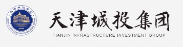

## Overview

<!-- About 100 to 150 word summary of the case study. -->

The Sino-Singapore Eco-City is a joint venture between the Chinese and Singapore governments. Since 2008, developing the district has been a high-priority mission of the Chinese government, which has taken great advantage of policies favoring real-estate investment, and the effective implementation of a top-to-bottom planning strategy. The primary motivation behind the district is to experiment with an alternative development model to the traditionally dense and pollution-heavy cities in China. Green space and natural landscapes are the foundations of Eco-city, and are also the most attractive feature for new residents. It encourages new residents to move in, as it is only 30 kilometers away from Tianjin, and 150 kilometers away from Beijing. The city is also built upon the concepts of modular neighborhoods and 15-minutes comfort circles for everyone.

## Key Characteristics

<!--  Summarize the most visible essential characteristics of the project. For districts: How does the district employ 3-5 of the key characteristics of New Century Cities? For plans: How does the plan address each of the three activities (development, engagement, implementation) of the digital masterplanning process described in the 2015 Townsend and Lorimer paper?
-->

**Mixed-use**.  A key characteristic of smart cities in the new century is the mixed-use of spaces for business, commercial, recreation, and residential purposes. This fosters a diverse and interesting lifestyle while enabling residents to have greater connectivity in their everyday lives. The Eco-Cell, Eco-Community, and Eco-District zones provide convenient access to essential services within a 15-minute walk and offer various recreational opportunities within the neighborhood.

")

**Promote sustainability**.  The Sino-Singapore Eco-City is driven by the goal of developing a nature-friendly city, setting it apart from other major Chinese cities. The city incorporates dedicated green spaces that are not earmarked for future development, recognizing their role in reducing the carbon footprint and improving the residents' quality of life. Additionally, the city boasts extensive public transportation coverage, ensuring that residents have easy access to public transportation for all their needs.

")

**Use advanced information and community-oriented technologies for efficient management of urban services**.  To truly thrive in the new century, a city must be able to leverage technology to efficiently manage its services. In the Eco-City, residents can access over 95% of administrative public services through a mobile app. In case of natural emergencies, the digitized utility maintenance and operation center provides real-time monitoring of the city's infrastructure, enabling decision-makers to act with greater awareness and effectiveness.

")

## Goals and Aspirations

<!-- Summarize the most important goals of the project. Replace the placeholder title with a succinct name for the goal. The text should be around 50 words. -->

**Create a living space with a close connection to nature**:  Regardless of location, ample vegetation should be visible. It should be convenient for everyone to fully immerse themselves in nature.

**Co-exist with the nature under harmony**: The city's construction and operations must have a minimal environmental impact. Advanced infrastructure should utilize renewable energy sources and incorporate advanced rainwater usage. All buildings must be carbon-neutral green buildings.

**Promote cultural growth**:  Encourage the development of traditional, contemporary, and new cultures. Ensure that at least 20% of housing is affordable public housing, and provide 100% barrier-free access to all public areas in the entire city.

## Technology Interventions
<!--  Identify 3-5 specific technology-enabled interventions the project employs or proposes. The text should be around 75-125 words. Separate into more than 1 paragraph as needed. This is a good place to insert additional images, be sure to include captions identifying the source and make sure to not use copyrighted images. -->

**Green-oriented building design**: Extensive use of new recyclable construction material. Usage of Argon glass to improve insulation, optimizing building design and orientation to provide adjustable sunlight heating, seasonal variable natural ventilation, and natural light coverage. Integration of green walls with vegetation to naturally improve indoor air quality.

Building water usage is monitored, with a rainwater harvesting and reuse system fully built in. Renewable energy collection system built in buildings. Water and power resources usage and recycling are monitored and controlled in a single platform.

")

**Pneumatic Waste Collection System**:  Residents are encouraged and rewarded for sorting their waste. A Pneumatic Waste Collection System allows waste to be sorted and transported on a large scale, where transportation to a centralized facility is an air-tight process. Recyclables are turned into products, and kitchen waste is used as material for fertilizers and industrial soaps. Other wastes are turned harmless locally using chemical procedures, instead of being shipped out.

")

**Sponge City concept**:  Resilience against and efficient use of water are integral to the foundation of the Eco-City. Permanent sensors have been installed at various points along the tap water service pipelines, guaranteeing that the water quality meets drinking standards from the facility to the tap. By effectively harvesting rainwater through real-time stormwater runoff control, the city is able to monitor and regulate water quality and volume in a centralized system. In the event of storms, flooding is effectively prevented through the use of permeable pavement, large natural landscape dampening, a rainwater storage system for future use, and high-capacity runoff to the ocean.

")

## Stakeholders
<!--  Identify 3-5 key stakeholder organizations or groups. The text should be around 50 words, and include a link to the organization.-->

**The Chinese Central Government**: Represented by Tianjin eco-city investment & development co.ltd and Tianjin Infrastructure Investment Group, nationally owned companies dedicated to providing the public service, transportation, and utility to the Eco-City. Directly works with Singapore side to determine visions and strategies for development   [Tianjin Infrastructure Investment Group](https://www.tj-chengtou.com/about.aspx?cateid=1/)

**Singapore**: Represented by the Ministry of National Development, a government agency, symbolizing the high level of cooperation between Singapore and China on developing the Eco-City. The Keppel Group, primarily responsible for green building design, and integrating its expertise in energy, environment, urban development, connectivity, and property management, introducing the smart city technologies making the Eco-City unique. [The Keppel Group](https://www.kepcorp.com/cn/who-we-are/about-keppel/#tab-urban-development/)

")

**Sino-Singapore Tianjin Eco-City Investment and Development Co., Ltd. (SSTEC)**.  As the master developer, SSTEC works closely with the governments and private sectors of China and Singapore, as well as other international partners, to plan and develop the Eco-City. The SSTEC is the platform where both Chinese and Singaporean nationally owned capital work together to develop the city. [Tianjin eco-city investment & development co.ltd](https://www.tjeco-city.com/?lang=english/)

")

## Leadership
<!--  Conduct one interview with a project leader, and link to a LinkedIn or other profile. Provide a brief biography, no more than 75 words. Identify 3-5 insights or themes from the interview. Feel free to add a photo of the individual here. -->

**Real-Estate Development On-Site Manager: Mr. Qi**. The unnamed field manager, Mr. Qi, works for [Jia Liu](http://www.Tianjineco-city.com/About/team?lang=english/), who is the Deputy CEO of SSTEC. As a project leader manages the on-site construction work in developing the Eco-City, he has witnessed waves of people moving into the city, and seen how the city has been built over the past 8 years. The opportunity to interview him came from a family relationship back in my hometown Beijing, where we share family members. He wished to remain unidentified in my report, so that he could speak freely.

**Personal Car Usage**: Sustainability is a core value of the Eco-City, and the city has invested in a public transportation system for sustainable, green travel. However, more than 90% of residential families still own at least one vehicle. This has made it difficult for medical and technology industries to settle in the Eco-City, as they have already established large sites in Beijing and Tianjin. Many residents moved to the Eco-City to enjoy nature with their families, but the adults still commute to Tianjin for work. Unfortunately, this has led to ironic rush hours in a city built for car-free living.

**Living Concepts & Legislation Conflict**: As a city that promotes cultural growth, the residential buildings and neighborhoods of the Eco-City feature an abundance of public spaces. Introduced by Keppel Group, there are many benefits to having large areas of public space in residential areas, significantly improving the comfort level of residents. However, the apartments are sold under traditional Chinese real-estate laws, by which the household purchased area stated on contracts includes a certain percentage of the shared public area within the building, and also a smaller percentage of the outdoor area shared by the entire neighborhood. Many property owners were unhappy after they found the area of their own apartment is more than 30% smaller than the area stated in their contract of purchase, and criticized property management agencies. Communication between the residents and property management workers in some neighborhoods is difficult, limiting the services that residents receive.

**Green Spaces**: The best way to enjoy the Eco-City is to work and live locally. When its not the winter, green vegetation is visible everywhere around the city. Commutes to work, supermarkets, and picking up kids from school are all very pleasant experiences, and being surrounded by nature enhances relaxation. The natural landscape is preserved well, and the interviewee liked to go to the central wetland park after dinner for a jog, where he can see water birds from time to time.

## Financing
<!--  Identify at least one financing scheme being used in this project or plan. About 100 words is probably a good length for this. -->

**Bilateral Joint Venture**: As introduced above, the Eco-City is a joint venture between China and Singapore, including government agencies, public sector, and private sectors from both China and Singapore. Strictly 50% of the initial investment was from Chinese government owned sources, represented by Tianjin Infrastructure Investment Group. The other 50% of the initial investment was from Keppel Group, Singapore, which represents the combined support from Singaporean government and Singaporean private sectors. The Eco-City development has also received high-priority attention and funding directly from the Chinese central government, as it lies on the new pan-Beijing economic belt in the economic planning visions.

## Outcomes
<!-- Identify 3-5 (anticipated) outcomes. What will/has the project achieved? Thes should not be the same or repeated from elsewhere. Use this space to emphasize something different. About 50 words per is minimum, but these can be as long as you want/need. -->

**Highly aggressive sustainable implementation**:  The Eco-City was awarded first place among cities globally for using a sustainable model of development for urban space, by [Construction 21 International](https://www.construction21.org/en/index.html). The Eco-City has accomplished its Sustainability KPIS, which regulated that the city needs to build its dependency on sustainable resources. Its completion encourages the city to take itself to the next level. The Eco-City is currently working to achieve its Sustainability 36 KPIs 2.0, which include increasing sustainable energy sources to more than 32%, and harnessing non-traditional sources of tap water to more than 60% by 2035.

")

**Gaining 140,000 new residents as of 2023**:  Although the real-estate market is currently very low in China, it has not changed the fact that the Eco-City is a very popular destination for people to move to. As of 2023, the population of permanent residents reached 140,000, compared to 120,000 in 2022. The Eco-City is also on-track in building the population foundation for a future expansion. There are 34 schools and kindergartens in the city, serving 23,400 students, which made close to 20% of the total population. These are indicators that the Eco-City has plenty of potential to continue developing in future.

**The nature is truly a good feature for residents**:  Using [Zhihu](https://www.zhihu.com/), a platform similar to Reddit and Quora for the Chinese language internet, I viewed posts by residents of the Eco-City related to their quality of life in the Eco-City. Although there are aspects of living there that trouble the residents, most of them found the high coverage of vegetation and natural landscape extremely valuable. The post below is from a young lady who moved to the Eco-City two years ago, who has already bought a house and is actively getting ready to move in. She perceives an oceanside vacation town vibe in the Eco-City, which gives her great comfort in her everyday living.

**Anticipated move in of technology firms**: For 2024, it is anticipated that more than 150 innovative technology firms would move into the Eco-City. This will bring more than three times open tech positions available compared to the Eco-City today. This will encourage more residents to move to the Eco-City.

## Open Questions
<!-- Identify 1-3 open question(s). What is uncertain, unclear, or still unresolved about this project? These can be 50 words or less. -->

**Attracting corporate move-in**:  In terms of choosing a location to establish headquarters, the Eco-City is located in an awkward location, given its proximity to Beijing and Tianjin. Corporations can be attracted by high bonuses provided by the government, but this is an unsustainable strategy. What kind of strategy could bring more work opportunities to the Eco-City?

**Dependence on cars**:  Although the Eco-City was built to be used comfortably without using private cars, the car ownership rate at the Eco-City is at a level close to suburban areas in America. Residents are also used to travelling by their own car whenever possible, since the well-designed urban landscape allows easy travel by car. What does this tell us about the car-free motivations of smart cities, and the way residents interact with it?

## References

Most sources are from the Chinese internet.

### Primary Sources

<!-- 3-5 project plans, audits, reports, etc. -->

- <http://www.Tianjineco-city.com/static/web//en/singapore1.html?lang=english>
- <https://www.eco-city.gov.cn/>
- <https://www.kepcorp.com/cn/who-we-are/about-keppel/#tab-urban-development>
- <http://www.Tianjineco-city.com/static/web//en/singapore5.html?lang=english>
- Interview over phone with Mr.Qi (SSTEC)

### Secondary Sources

<!-- 5-7 secondary source documents: news reports, blog posts, etc.. -->
- <https://tieba.baidu.com/f?kw=%E4%B8%AD%E6%96%B0%E7%94%9F%E6%80%81%E5%9F%8E>
- <https://www.zhihu.com/answer/34761877>
- <https://www.zhihu.com/answer/2794269827>
- <https://tj.zhaoshang.net/yuanqu/detail/55>
- <https://www.zhihu.com/answer/863054265>
