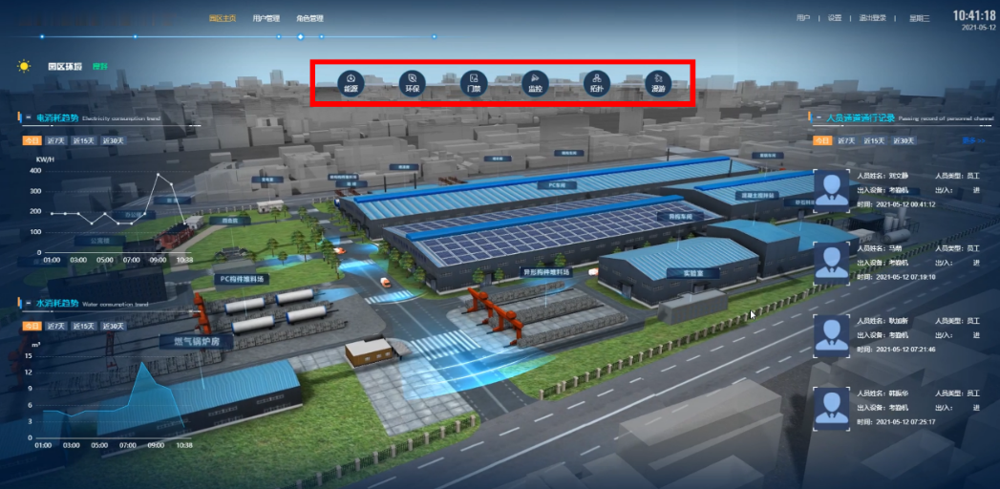
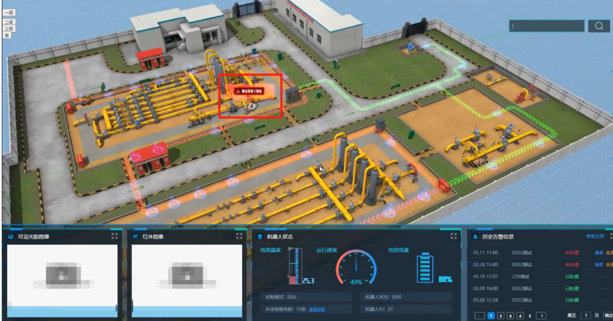
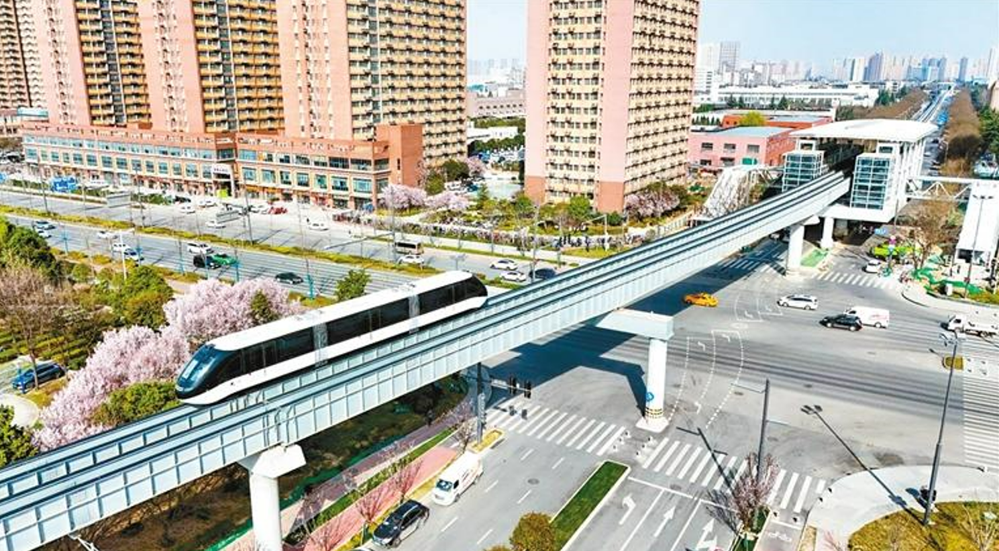

<!--
Allowed values:

type: district, plan

tags: Environment, Mobility, Buildings, Energy, InformationSystems, HealthEducation, InnovationSystems, CivicTech, CivicInnovation, Food

-->

## Overview

<!-- About 100 to 150 word summary of the case study. -->

Located in the southern part of Xi'an, China, Xi'an GaoXin District is a national high-tech industrial development zone and a pioneer in the smart city initiative. Over the past few years, the region has implemented several large-scale smart city projects that integrate real-time data from IoT sensors, GIS systems and 3D modeling to improve urban management and service delivery.

## Goals and Aspirations

<!-- What is the project trying to achieve? Identify 3-5 high-level goals that define the entire project.Replace the placeholder title with a succinct name for the goal. -->

**Carry out visualized city management**. Establishing a unified digital surveillance platform to achieve unified, real-time regional surveillance for tasks such as arresting crime and security management.

**Implement Transportation management**. Modernize public transportation and reduce congestion. At the same time, reduce carbon emissions and protect the environment.

**Establish a digital urban planning process**. Build highly detailed 3D models of the city for future urban planning.

## Key Characteristics

<!--  How is the project organized into specific activities that advance these goals? For plans: How does the plan address each of the three activities in digital master plans (development, engagement, implementation). For districts: How does the district employ 3-5 of the key characteristics of innovation hubs?
-->

**Diverse Stakeholders and Talent Ecosystem**.
The Xi'an Hi-Tech Zone brings together a wide range of players, including municipalities, state-owned enterprises, technology startups, R&D centers, and academic institutions such as Xi'an Jiaotong University. This diversity creates an environment where expertise in engineering, urban planning, cloud infrastructure, and civil technology intermingle.

**Strong Government Leadership and sufficient Funding**.
Smart city development in the Xi'an Hi-Tech Zone is under the direct leadership of the Xi'an municipal government and is supported by national-level innovation policies. The government has clear long-term planning goals and significant public investments-such as the Silk Road Software City and the Wave Northwest Base-demonstrate strong financial support.

**Open testbed for smart technology integration**. The district provides ample space for piloting advanced technologies such as IoT sensors, big data analytics, cloud computing and 3D city modeling. In addition, these technologies are integrated into a unified platform to support citywide surveillance, environmental monitoring and urban planning.

## Stakeholders
<!--  Who initiated the project? Who is leading the project forward? Who else has a say in how it unfolds? Who is directly affected but marginalized? Identify 3-5 key stakeholder organizations or groups. Identify 3-5 key individuals. These are people who are associated with the project as leaders, supporters, critics, or regulators. They are likely to be members of the stakeholder groups identified above. These are people you should try to contact for one or more interviews.-->

**Xi'an Municipal Government**.  As the main sponsor and coordinator of the project, the Xi'an Municipal Government leads the smart city strategy for the Hi-Tech Zone. It is responsible for overseeing planning, financing and cross-sectoral coordination, and plays a key role in policy support and long-term vision setting.[Xi'an Municipal Government](https://zwfw.xa.gov.cn/gaoxin/)

**The Xi'an High-Tech Zone Administrative Committee**.  The Xi'an High-Tech Zone Administrative Committee is responsible for implementing most smart city interventions locally. It manages local infrastructure deployment, platform integration, and collaboration with private companies and universities.[Xi'an High-Tech Zone Administrative Committee](https://xdz.xa.gov.cn/)

**Wave Group**. It is a state-owned IT company that provides cloud computing, big data and smart city technologies in the region. Wave's presence in the region (regional headquarters) makes it a core technology provider and partner for platform building and data infrastructure. [Wave Group](https://www.inspur.com/lcjtww/gylc32/2315125/index.html)

**Universities**.  Universities provide research expertise and talent pipelines in areas such as artificial intelligence, IoT and urban analytics. Their collaboration supports technology development, pilot projects and simulation-based urban planning. [Xi'an Jiaotong University](https://www.xjtu.edu.cn/)

## Technology Interventions
<!--  What specific technology-enabled interventions does the project propose? Identify 3-5 technology interventions. Describe use cases, value proposition, solution architecture, data created or consumed, key platforms and standards, business models, regulatory issues, etc. Separate into more than 1 paragraph as needed. This is a good place to insert additional images, be sure to include captions identifying the source and make sure to not use copyrighted images. -->

**Urban 3D Modeling and Digital Twin Platform**. Xi'an Hi-Tech Zone has developed a fine three-dimensional urban model as a "digital twin" platform for urban planning and real-time management. The model integrates information such as GIS, IoT sensor data, infrastructure drawings, etc., and supports urban planners to perform visual analysis and scenario simulation in a virtual environment.

Use scenarios: Urban planning departments can simulate regional transformation, construction of new roads or emergency response routes;

Data sources: traffic sensors, environmental monitors, building permits, cadastral information;

Platform and standards: Comply with three-dimensional modeling standards such as CityGML and can be linked to local GIS and BIM systems.

**Unified urban monitoring and governance platform ("One-stop management")**. The Hi-tech Zone has built a unified urban monitoring platform, integrating video surveillance, Internet of Things equipment and sanitation/traffic system data into the same interface. The system can detect illegal acts, emergencies or public facilities problems in real time, and automatically assign the problems to relevant departments for processing.

Use scenarios: The system automatically identifies illegal parking, calls the police through AI and notifies law enforcement personnel;

Data types: video streaming, sanitation vehicle GPS, air quality sensor data, etc.;

Architecture: Edge Computing + Central AI Analytics Engine;

Source of funds: Government investment;

Supervision: Comply with national cybersecurity and data compliance standards.

**BYD CloudRail (Yunba)**.

Yunba is an elevated intelligent rail transit system that uses rubber wheels and guide rails, and has the characteristics of low noise and low energy consumption. Xi'an Hi-Tech Zone has introduced this system to supplement the traditional subway system and provide fast and green commuting solutions.

Use scenarios: The "last mile" traffic connecting residential areas and office areas;

Advantages: Short construction cycle and low cost, suitable for high-density urban areas;

Data types: passenger flow, platform congestion, operating timetable;

Platform: A proprietary system provided by BYD, integrated into the urban transportation platform.

**Driverless subway (Metro Line 16)**.  
Xi'an Metro Line 16 partially serves the high-tech zone and is a fully automatic unmanned subway line. The system uses advanced communication signal system and AI scheduling algorithms to dynamically adjust the operating frequency according to real-time passenger flow, improving safety and efficiency.

Use scenarios: Congestion is sensed through platform sensors during peak periods and automatically increases the frequency of departure;

Data source: gate data, platform sensors, train status information;

## Financing
<!--  How are the technology interventions identified to be financed? How does this fit into financing of the larger project? Identify at least one financing mechanism that is being used. -->

**Public funding**. Most smart city projects in GaoXin District, Xi'an are publicly funded by the Xi'an Municipal Government and GaoXin District Administrative Committee. Major projects (such as Cloudrail, Urban Management Platform, and 3D City Model), supplemented by national innovation grants. 

**Public-private partnership**.
Some small projects are developed through public-private partnerships. This hybrid model helps ensure long-term sustainability while encouraging private sector innovation.

## Outcomes
<!-- What results has the project produced to date? What outcomes and impacts are anticipated? Identify 3-5 (anticipated) outcomes. What will/has the project achieved? Thes should not be the same or repeated from elsewhere. Use this space to emphasize something different. -->

**Improved efficiency of problem detection and resolution**.  The "One-stop management" platform has greatly improved the efficiency of problem detection and resolution. More than 120,000 urban management incidents are handled each year, and more than 92% are resolved within the prescribed time, thereby improving public service response capabilities.

**Eased congestion and enhanced last-mile connectivity**.  The introduction of Cloudrail and autonomous subway lines has eased congestion and enhanced last-mile connectivity. These systems provide more reliable and sustainable transit options, reducing reliance on private cars and reducing emissions.

**Enhanced spatial planning and infrastructure coordination**.  3D digital urban models enhance spatial planning and infrastructure coordination. City managers use this model to simulate development plans, enabling more accurate and data-information urban decision-making.

**Strengthened the region’s role as a hub for high-tech development**.  The Smart City initiative has attracted the region to tech companies, talent and investment, strengthened the local innovation ecosystem and strengthened the region’s role as a hub for high-tech development.

## Open Questions
<!-- What is uncertain, unclear, or still unresolved about this project? Identify 1-3 open question(s). -->

**With the expansion of the city management platform, how to solve data privacy and surveillance issues?**  With the increasing use of video surveillance and sensor data, the need for transparent data governance and public accountability is growing.

**Can integration between different technical systems such as 3D urban models, bus platforms and environmental sensors be effectively extended?** System interoperability remains a challenge, especially when more platforms and vendors are introduced.

**To what extent can citizens and marginalized groups participate in shaping the development of smart services?**.  Despite the expansion of digital infrastructure, inclusive engagement and equitable access remain limited and undefined.

## References

---

### Primary Sources

<!-- 3-5 project plans, audits, reports, etc. -->

- Xi’an High-tech Zone Urban Operations Management Platform – Project overview by CityVision Big Data Co., Ltd. http://www.cityvision.cn

- Xi’an 14th Five-Year Smart City Development Plan (2021–2025) – Official city planning document. https://www.xa.gov.cn

- BYD SkyRail (CloudRail) Official Product Guide – BYD Company Limited. https://www.byd.com/cn/product/skyrail.html

- Inspur Northwest Headquarters Project Brief – Inspur Group. https://www.inspur.com

### Secondary Sources

<!-- 5-7 secondary source documents: news reports, blog posts, etc.. -->

- Xi’an’s “One Network Unified Management” selected as a national best practice case – Sohu News, 2024. https://www.sohu.com/a/826920875_121798711

- Xi’an High-tech Zone showcases digital governance achievements – China Daily, 2022. https://shx.chinadaily.com.cn/a/202208/16/WS62faf4d4a3101c3ee7ae3e78.html

- Xi’an CloudRail (Yunba) – Wikipedia. https://en.wikipedia.org/wiki/Xi%27an_SkyRail

- Xi’an Metro Line 16 – Wikipedia. https://en.wikipedia.org/wiki/Xi%27an_Metro_Line_16

- Integrated Digital Twin Platform Overview – Tali Technology (Xi’an). https://www.xatali.com/newsinfo/1561071.html
