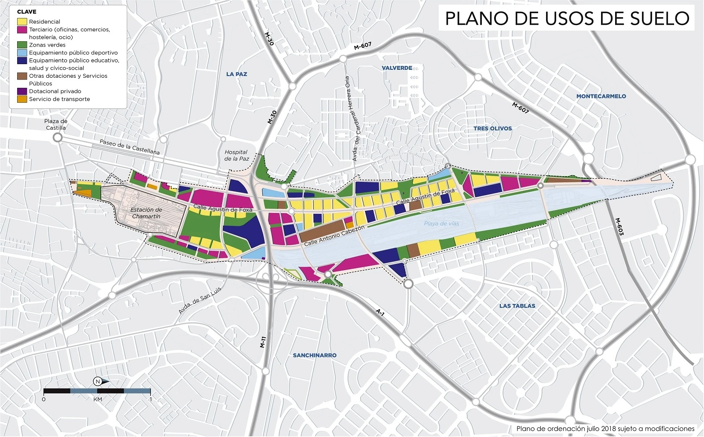

<!--

Allowed values:

  

type: district, plan

  

tags: Environment, Mobility, Buildings, Energy, InformationSystems, HealthEducation, InnovationSystems, CivicTech, CivicInnovation, Food

  

-->

## Overview
  
<!-- About 100 to 150 word summary of the case study. -->

Madrid Nuevo Norte is one of Europe's largest urban renewal initiatives, transforming a 5.6 km long, 560-hectare area of disused industrial land and rail yards in northern Madrid. The €6 billion project aims to create a new central business district integrated with extensive green spaces and sustainable mobility options. Key features include a 145,000 sq.m urban forest park built over the covered rail tracks, over 400,000 sq.m of additional green areas, and new infrastructure for metro, rail, cycling, and rapid bus transit. Led by Distrito Castellana Norte with the City of Madrid, the mixed-use development will include residential areas alongside commercial spaces for attracting businesses. Environmental sustainability is a core focus, with plans to reduce temperatures, apply circular economy principles, and enable future expansions aligned with climate change mitigation strategies.

## Goals and Aspirations

<!-- What is the project trying to achieve? Identify 3-5 high-level goals that define the entire project.Replace the placeholder title with a succinct name for the goal. -->

**New Economic Engine for Madrid**. The primary goal is to create a vibrant new central business district and economic hub in the northern part of Madrid that enhances the city's global competitiveness by attracting major businesses, investment, and jobs.
  
**Sustainable Urban Ecosystem**. A core aspiration is to integrate advanced sustainability practices throughout the urban design, such as reducing carbon emissions, promoting renewable energy usage, implementing green building standards, preserving natural resources, and enabling future climate-resilient expansions.
  
**Inclusive and Livable Communities**. The project aims to promote social cohesion by developing inclusive public spaces, green areas, sustainable mobility options, and a mix of residential areas accessible to a wide range of economic levels, thereby improving overall quality of life for residents.

**Urban Regeneration and Heritage**. Madrid Nuevo Norte seeks to transform disused industrial lands and abandoned buildings into a modern, integrated urban district that drives economic productivity while respecting the local cultural heritage.
  
## Key Characteristics

<!-- How is the project organized into specific activities that advance these goals? For plans: How does the plan address each of the three activities in digital master plans (development, engagement, implementation). For districts: How does the district employ 3-5 of the key characteristics of innovation hubs?

-->

**Sustainable Mobility and Green Spaces**. The project emphasizes pedestrian-friendly urban planning with extensive public transport connections, including integrating the metro, rail, cycling infrastructure, and rapid bus transit systems. Over 400,000 square meters are dedicated to creating new parks and green spaces, including a 145,000 square meter urban forest built over the covered rail tracks.
  
**Urban Regeneration and Integration**. Madrid Nuevo Norte aims to revitalize underutilized industrial lands and abandoned buildings by transforming them into a modern, integrated urban district. The plan involves developing a new central business district around the northern rail station while respecting the area's cultural heritage and natural landscape.
  
**Prioritizing Environmental Sustainability**. Sustainability is a core focus, with plans to apply circular economy principles, minimize water and material footprints, reduce urban temperatures through green infrastructure, promote renewable energy usage, implement green building practices, and enable future climate-resilient expansions to accommodate population growth.

**Enhancing Livability and Public Spaces**. The district design prioritizes creating inclusive public spaces, extensive green areas, and a mix of residential areas accessible to a wide range of economic levels, thereby improving the overall quality of life for residents and fostering social cohesion.

**Innovation Hub for Sustainable Development**. As one of Europe's largest urban renewal initiatives, Madrid Nuevo Norte aims to establish the city as a leading example of sustainable urban development. The project incorporates innovative solutions for mobility, energy efficiency, climate adaptation, and smart city technologies to enhance Madrid's competitiveness on an international scale.

## Stakeholders

<!-- Who initiated the project? Who is leading the project forward? Who else has a say in how it unfolds? Who is directly affected but marginalized? Identify 3-5 key stakeholder organizations or groups. Identify 3-5 key individuals. These are people who are associated with the project as leaders, supporters, critics, or regulators. They are likely to be members of the stakeholder groups identified above. These are people you should try to contact for one or more interviews.-->

**Distrito Castellana Norte (DCN)**. DCN is the main developer consortium leading the planning and execution of the Madrid Nuevo Norte project. They are responsible for overseeing the large-scale redevelopment initiative. [Distrito Castellana Norte (DCN)](https://creamadridnuevonorte.com/en/about-us/)

**RSHP (Rogers Stirk Harbour + Partners)**. RSHP is a renowned international architectural firm based in the UK. They are the lead architectural designers for the Madrid Nuevo Norte masterplan, responsible for shaping the overall urban design vision and plans for the district. [RSHP](https://rshp.com/projects/masterplanning/madrid-nuevo-norte-mnn/)

**Merlin Properties**. Merlin Properties is a leading real estate company in Spain and one of the main developers spearheading the Madrid Nuevo Norte project through its subsidiary Crea Madrid Nuevo Norte, S.A. Merlin owns a 14% stake in this subsidiary and is a crucial private sector stakeholder responsible for the planning and execution of the large-scale redevelopment. [Merlin Properties](https://www.merlinproperties.com/)
  
**BBVA**. BBVA (Banco Bilbao Vizcaya Argentaria) is a major Spanish multinational financial services company. BBVA communicated with Merlin Properties, one of the key developers, regarding the project's plans. As a major bank, BBVA is the major player involved in providing financing or investment for the Madrid Nuevo Norte development.[BBVA](https://www.bbva.com/en/)

## Technology Interventions

<!-- What specific technology-enabled interventions does the project propose? Identify 3-5 technology interventions. Describe use cases, value proposition, solution architecture, data created or consumed, key platforms and standards, business models, regulatory issues, etc. Separate into more than 1 paragraph as needed. This is a good place to insert additional images, be sure to include captions identifying the source and make sure to not use copyrighted images. -->

**Integrated Mobility Platform**. The project plans to implement an integrated mobility platform that utilizes artificial intelligence and data analytics to optimize traffic flow, public transport scheduling, and mobility services across the district. This platform will likely leverage IoT sensors, real-time data streams, and predictive algorithms to enable smart traffic management, efficient routing, and seamless integration of various transport modes like metro, buses, and cycling infrastructure.
  
**Smart Building Technologies**. Madrid Nuevo Norte aims to incorporate advanced building technologies to enhance energy efficiency and sustainability. This includes the deployment of smart glass that can adapt to light conditions, automated energy management systems for reducing consumption, and the integration of renewable energy sources like solar panels. These smart building solutions will help minimize the district's environmental footprint and carbon emissions.

**Community Engagement Platforms**. To foster civic engagement and improve service delivery, the project envisions implementing community-based digital platforms that allow residents to interact directly with city services and provide feedback. These platforms could enable features like reporting issues, accessing information, participating in decision-making processes, and engaging with local authorities and service providers, thereby promoting transparency and inclusivity within the district.

## Financing

<!-- How are the technology interventions identified to be financed? How does this fit into financing of the larger project? Identify at least one financing mechanism that is being used. -->

**Financing Scheme**. Madrid Nuevo Norte project is being financed through a blend of private investment from real estate developers, public funds from the City of Madrid, and targeted grants from the European Union for urban development initiatives. This mixed financing approach allows for robust financial support covering various aspects of the large-scale redevelopment, including the proposed technology interventions for mobility, smart buildings, and community engagement platforms. By leveraging both private capital and public funding sources, the project aims to secure the necessary resources to execute its ambitious plans for transforming northern Madrid into a sustainable, tech-enabled urban district.
  
## Outcomes

<!-- What results has the project produced to date? What outcomes and impacts are anticipated? Identify 3-5 (anticipated) outcomes. What will/has the project achieved? Thes should not be the same or repeated from elsewhere. Use this space to emphasize something different. -->

**Establishment of a New Economic Hub**. The project aims to create a vibrant new central business district that will attract major businesses, investment, and jobs to northern Madrid, thereby enhancing the city's global economic competitiveness and positioning it as a leading financial and technological hub in Europe.

**Sustainable Urban Development Model**. Madrid Nuevo Norte is anticipated to set a new standard for sustainable urban development by achieving significant reductions in carbon emissions, promoting renewable energy usage, implementing green building practices, preserving natural resources, and enabling future climate-resilient expansions. The project aims to serve as a model for environmentally conscious urban planning and design.
  
**Improved Quality of Life and Social Inclusion**. Through the development of inclusive public spaces, extensive green areas, sustainable mobility options, and a mix of residential areas accessible to a wide range of economic levels, the project is expected to improve the overall quality of life for residents and promote social cohesion within the district.

**Urban Regeneration and Heritage Preservation**. By transforming disused industrial lands and abandoned buildings into a modern, integrated urban district, Madrid Nuevo Norte aims to revitalize underutilized spaces while respecting the local cultural heritage and natural landscape. This urban regeneration effort is anticipated to drive economic productivity and enhance the city's appeal.

**Positioning Madrid as a Sustainable City Brand**. The successful execution of this large-scale, environmentally conscious urban renewal project is expected to position Madrid as a leading sustainable city brand on an international level, attracting further investment, talent, and recognition for its commitment to urban innovation and climate change mitigation strategies.

## Open Questions

<!-- What is uncertain, unclear, or still unresolved about this project? Identify 1-3 open question(s). -->

**Economic Sustainability and Project Timeline**. While the project aims to create a new economic hub and attract businesses, it is unclear how potential economic fluctuations or market shifts may impact the completion timeline and the level of investment secured from private developers and public sources. The long-term economic viability and ability to maintain the ambitious development pace remains an open question.

**Impact on Local Businesses and Communities**. Although the project promises to improve quality of life and provide affordable housing options, the sources do not address the potential effects on existing local small businesses and communities during the extensive construction phase. How will their interests and livelihoods be safeguarded, and what measures will be taken to mitigate any negative impacts on these stakeholders?

**Integration of Advanced Technologies**. The project envisions incorporating smart city technologies, sustainable building practices, and community engagement platforms. However, the specific details and implementation plans for seamlessly integrating these advanced technologies into the urban fabric are not clearly outlined. How will the adoption and maintenance of these technologies be managed, and what challenges may arise in terms of infrastructure, data governance, and user adoption?
  
## References

---

### Primary Sources

<!-- 3-5 project plans, audits, reports, etc. -->

- [Madrid Nuevo Norte](https://creamadridnuevonorte.com/en/)
- [RSHP](https://rshp.com/projects/masterplanning/madrid-nuevo-norte-mnn/)
- [ResearchGate](https://www.researchgate.net/publication/379254084_Mega_projects_and_sustainable_city_image_evidence_from_Nuevo_Norte_Project_of_Madrid)

<!-- Create a list by starting a line with `+`, `-`, or `*`

- Sub-lists are made by indenting 2 spaces:

- Very easy!-->

### Secondary Sources

- <https://www.arup.com/projects/madrid-nuevo-norte>
- <https://cdn.filepicker.io/api/file/aKL8EtXvRbqQwmG3IGIq?fit=max>
- <https://www.mdpi.com/2071-1050/13/4/2094>
- <https://www.iberian.property/news/archive/bbva-merlin-and-san-jose-will-invest-eur216m-on-madrid-nuevo-norte-project/>
- <https://www.reuters.com/world/europe/madrids-new-business-district-aims-learn-rivals-2024-01-11/>
  
<!-- 5-7 secondary source documents: news reports, blog posts, etc.. -->

<!-- Create a list by starting a line with `+`, `-`, or `*`

- Sub-lists are made by indenting 2 spaces:

- Very easy!>
