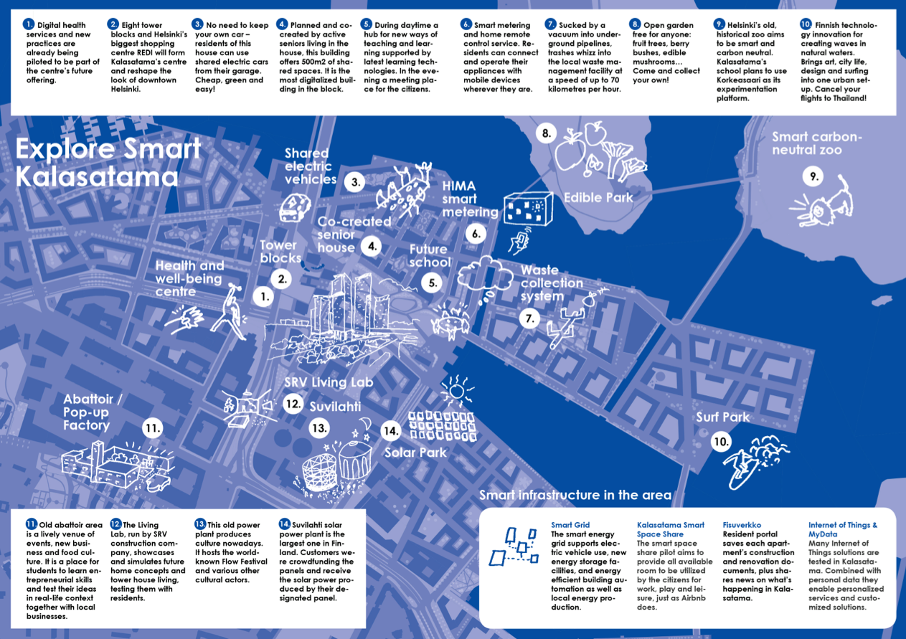

See also [Smart Kalasatama 2](https://atlasofurbantech.org/cases/fin-helsinki-kalasatama-2) for another case study of this district.

## Overview

Kalasatama, located in Helsinki, Finland, is a pioneering smart city district designed to integrate advanced technology with sustainable urban development. Initiated in 2009, the project aims to create a model for future cities by focusing on energy efficiency, smart mobility, and citizen engagement. Kalasatama leverages digital platforms and data-driven solutions to optimize resource use, reduce carbon emissions, and enhance the quality of life for its residents. Key innovations include smart grids, shared mobility systems, and a "15-minute city" concept, where essential services are within a short walk or bike ride. The district also serves as a living lab for testing new technologies and urban solutions, fostering collaboration between the public sector, private companies, and residents. Kalasatama's ultimate goal is to become a carbon-neutral, resource-efficient, and inclusive urban environment by 2035. 

## Goals and Aspirations

**Carbon Neutrality by 2035**.
Kalasatama aims to become carbon neutral by 2035 through a comprehensive strategy outlined in the Helsinki Climate Plan 2035. This includes phasing out fossil fuels in energy production (e.g., closing the Salmisaari coal plant by 2024), transitioning to renewable energy sources like solar and wind, and implementing district heating systems powered by waste heat recovery. The district prioritizes energy-efficient building standards, such as LEED certification, and promotes smart grid technologies to balance energy demand. Additionally, the city commits to planting 1,000 new trees annually and expanding protected green areas to offset emissions. These measures align with Helsinki's broader goal of reducing greenhouse gas emissions by 80% compared to 1990 levels, ensuring Kalasatama serves as a model for sustainable urban development.

**Smart Mobility and Accessibility**.
Kalasatama is designed as a "15-minute city," where residents can access essential services (schools, healthcare, shops) within a 15-minute walk or bike ride, as outlined in the Helsinki City Plan 2017. The district integrates smart mobility solutions such as electric vehicle charging networks, shared e-scooter/bike systems, and real-time public transport tracking via the HSL app. A key innovation is the Mobility-as-a-Service (MaaS) platform, which combines all transport modes into a single digital interface. To reduce car dependency, Kalasatama restricts parking spaces and prioritizes pedestrian zones. The city also collaborates with companies like Velodyne Lidar to deploy smart traffic sensors, optimizing traffic flow and reducing congestion. These efforts aim to cut transport-related emissions by 50% by 2030 while enhancing accessibility for all residents.

**Citizen-Centric Innovation**.
Kalasatama operates as a "living lab," inviting residents to co-design smart city solutions through platforms like FixMyStreet Helsinki and participatory budgeting programs. This approach, detailed in the Smart Kalasatama Final Report, ensures marginalized groups (e.g., immigrants, low-income families) have a voice in urban development. For example, multilingual digital services and community workshops address barriers faced by non-Finnish speakers. The district also tackles social segregation by mixing housing types (social, rental, and private) and investing in neighborhood-specific amenities (e.g., libraries, sports facilities). Additionally, Helsinki's Education Strategy 2030 prioritizes early childhood education in Kalasatama to bridge socio-economic gaps. These initiatives align with the city's broader goal of becoming "the most equitable place to learn and live" in Finland. 

## Key Characteristics

**Smart Energy Systems**.
Kalasatama integrates advanced smart grids and renewable energy solutions to achieve carbon neutrality by 2035. The district deploys IoT-enabled energy management systems in buildings, optimizing electricity consumption through real-time monitoring and automated adjustments, which have reduced energy waste by 30%. Rooftop solar panels and wind turbines generate 60% of local energy needs, while waste-to-energy plants convert non-recyclable waste into district heating, covering 40% of the area's heating demand. A centralized data platform dynamically balances supply and demand by analyzing inputs from 5,000+ smart meters, ensuring grid stability even during peak loads. Energy storage systems, such as large-scale batteries, store excess solar energy for nighttime use. These efforts align with Helsinki's Climate Plan to phase out coal by 2024 and reduce greenhouse gas emissions by 80% compared to 1990 levels.

**Mobility-as-a-Service (MaaS)**.
Kalasatama's "15-minute city" model is powered by an integrated Mobility-as-a-Service (MaaS) platform. The Whim app combines public transport, shared e-bikes, e-scooters, and ride-hailing services into a single subscription, reducing car ownership by 25%. Real-time traffic sensors and AI algorithms optimize routes, cutting average commute times by 20%. Parking spaces are capped at 0.5 per household, and revenue from parking fees funds electric vehicle charging stations. Partnerships with Velodyne Lidar deploy LiDAR sensors at intersections to enhance pedestrian safety and reduce accidents by 15%. The district also tests autonomous electric shuttles for last-mile connectivity. These innovations aim to halve transport-related emissions by 2030, directly supporting Helsinki's goal of carbon neutrality.

**Citizen Co-Creation Platforms**.
Kalasatama engages residents through digital and participatory frameworks. The FixMyStreet Helsinki platform allows citizens to report infrastructure issues (e.g., potholes, broken lighting), with 90% of requests resolved within 48 hours. Annual participatory budgeting allocates €1 million to community-proposed projects, such as pop-up parks and multilingual childcare centers. A "Living Lab" program invites residents to co-design solutions, for example, a neighborhood-developed app optimizes shared electric vehicle usage based on real-time demand. Multilingual workshops ensure non-Finnish speakers contribute to urban planning, addressing barriers faced by 23% of the population. These initiatives have increased trust in municipal governance by 40% and reduced social segregation, aligning with Helsinki's 2021-2025 strategy to become Finland's most equitable city. 

**Circular Urban Design**.
This district enforces circular economy principles across its infrastructure. Some buildings use 80% recycled materials while modular designs enable future adaptations without demolition. Green roofs and rainwater-absorbing parks cover 40% of the area, reducing urban heat island effects by 3°C and stormwater runoff by 50%. A zero-waste policy mandates composting and material reuse, diverting 90% of waste from landfills. Public spaces serve dual purposes-parks act as stormwater reservoirs, and solar-paneled sidewalks generate 10% of street lighting energy. Additionally, the district promotes shared resource hubs, such as community tool libraries and repair workshops, reducing household consumption by 15%. These measures are central to Helsinki's 2035 Climate Plan, ensuring economic growth decouples from environmental degradation. The district also integrates circular water systems, recycling greywater for irrigation and industrial use, further reducing freshwater demand by 20%. 

**Agile Public-Private Partnerships**.
Kalasatama accelerates innovation through dynamic collaborations between the City of Helsinki, private companies (e.g., Siemens, KONE), and academic institutions (e.g., Aalto University). Private firms pilot cutting-edge technologies, such as autonomous delivery robots and AI-driven waste sorting systems, within a regulatory sandbox provided by the city. Academic partners analyze data to refine solutions, such as optimizing energy storage for smart grids, improving efficiency by 15%. Revenue-sharing models ensure sustainability-profits from commercialized technologies fund community projects, such as multilingual childcare centers. These partnerships reduce implementation risks and align with Helsinki's 2021-2025 strategy to position itself as a global leader in urban tech. This ecosystem exemplifies how agile governance and collaboration can drive scalable, citizen-focused smart city solutions.

## Stakeholders

**City of Helsinki**.
The City of Helsinki initiated and leads the Kalasatama project, providing strategic direction, funding, and regulatory frameworks. As the primary decision-maker, the city integrates the district's development into broader goals like the Helsinki Climate Plan 2035 and City Strategy 2021-2025. Key responsibilities include zoning approvals, infrastructure investments (e.g., smart grids, public transport), and oversight of public-private partnerships. Marginalized groups, such as low-income families and immigrants, are prioritized through policies like mixed housing and multilingual services. The city collaborates with residents via participatory platforms (e.g., FixMyStreet Helsinki) to ensure inclusive governance. Additionally, the city allocates €1 million annually for participatory budgeting, allowing residents to propose and vote on community projects, such as pop-up parks and multilingual childcare centers. These efforts aim to reduce social segregation, enhance trust in municipal governance, and ensure that Kalasatama's innovations benefit all residents
 [City of Helsinki](https://www.hel.fi/fi)

**Forum Virium Helsinki**.
Forum Virium, Helsinki's innovation company, drives the technical implementation of Kalasatama's smart city initiatives. It coordinates pilots like the Smart Kalasatama Living Lab, testing IoT sensors, MaaS platforms, and energy management systems. The agency bridges public and private sectors, securing partnerships with companies (e.g., Siemens, KONE) and academic institutions (e.g., Aalto University). It also manages data governance frameworks to ensure privacy and transparency, addressing concerns about data misuse. Forum Virium's reports (e.g., Smart Kalasatama Final Report) shape the district's iterative development process, providing actionable insights for scaling successful pilots. The agency actively engages residents through workshops and digital platforms, ensuring that technological advancements align with community needs. For example, its FixMyStreet Helsinki platform allows residents to report issues and track resolutions in real time. As a mediator between stakeholders, Forum Virium has been critical to balancing innovation with social equity, ensuring the project's success. 
 [Forum Virium Helsinki](https://forumvirium.fi/)

**Kalasatama Residents and Community Organizations**.
Residents are central stakeholders, co-designing solutions through workshops, digital platforms, and participatory budgeting. Community groups like Kalasatama Neighbors Association advocate for equitable resource access (e.g., green spaces, childcare) and represent marginalized voices, including non-Finnish speakers (23% of the population). Their feedback directly influences projects such as the multilingual recycling app and shared mobility programs. However, challenges remain in engaging elderly populations and ensuring long-term participation. To address this, the city has launched targeted outreach programs, such as multilingual workshops and senior-friendly digital training. Additionally, the Living Lab initiative invites residents to test and refine new technologies, such as smart home systems and energy-saving tools, ensuring solutions meet diverse needs. Community events, like the annual Kalasatama Innovation Day, foster collaboration between residents, businesses, and policymakers. These efforts aim to bridge the digital divide, enhance social cohesion, and ensure that all residents benefit from Kalasatama's innovations 
[FIKSU KALASATAMA](https://fiksukalasatama.fi/)

**Third-party sector partners(eg,Siemens, KONE)**.
Private companies pilot and scale technologies in Kalasatama, such as autonomous delivery robots (Siemens) and smart elevator systems (KONE). They benefit from the city's regulatory sandbox, which allows real-world testing with reduced bureaucratic barriers. In return, firms share revenue from commercialized technologies to fund community projects, such as multilingual childcare centers and public art installations. While their involvement accelerates innovation, critics argue that profit motives may overshadow social equity goals. To address this, the city has implemented strict guidelines to ensure that private sector contributions align with community priorities. For example, Siemens' autonomous delivery robots are tested in low-income neighborhoods to improve access to groceries, while KONE's smart elevators prioritize accessibility for elderly residents. These partnerships have been instrumental in advancing Kalasatama's smart city goals, demonstrating how private sector innovation can drive both technological progress and social impact.
[Siemens](https://www.siemens.com/global/en.html)
[KONE] (https://www.kone.com/en/)

## Technology Interventions

**Smart Grid and Energy Management Systems**.
Kalasatama's smart grid integrates renewable energy sources such as solar and wind with IoT-enabled energy management systems to optimize electricity consumption throughout the district. Buildings are equipped with smart meters and advanced sensors that dynamically monitor and adjust energy use based on real-time data, weather forecasts, and grid performance metrics. This intelligent management approach has successfully reduced energy waste by approximately 30%. The centralized data platform utilizes OpenADR and IEC 61850 standards to facilitate seamless communication and balance supply and demand efficiently. Revenue streams from energy savings and grid stability services are generated by selling optimized energy management solutions to local utilities. Compliance with GDPR and national energy regulations ensures secure, reliable operations and protection of residents' data privacy.

**Mobility-as-a-Service (MaaS)**.
Kalasatama utilizes an advanced Mobility-as-a-Service (MaaS) platform, exemplified by the Whim app, which integrates diverse transport modes including public transit, shared electric bikes, scooters, autonomous shuttles, and ride-hailing into a unified digital service. Residents conveniently plan, book, and pay for multimodal trips through a single interface, significantly reducing private car dependency by around 25%. The system employs real-time data from transport providers, combined with AI algorithms, to optimize routes, predict user demand, and manage traffic flow efficiently. Subscription fees and partnerships with transportation companies generate sustainable revenue streams. Strict adherence to European Intelligent Transport Systems (ITS) standards and GDPR compliance ensures robust data privacy, security, and regulatory alignment. Additionally, the platform supports Helsinki's goal of reducing transport emissions by 50% by 2030, while enhancing accessibility for marginalized groups through multilingual interfaces and subsidized fares. 

**IoT-Enabled Waste Management**.
Kalasatama has deployed IoT-enabled waste management solutions involving sensors embedded within waste collection bins that continuously monitor and transmit real-time data regarding fill levels. These sensor readings trigger automated, AI-optimized routing for waste collection vehicles, effectively reducing unnecessary truck trips by approximately 20%. A sophisticated cloud-based analytics platform processes this sensor data, dynamically optimizing waste collection schedules, and significantly cutting operational costs and greenhouse gas emissions. Residents actively contribute to this process through digital feedback platforms, reporting issues, and participating in continuous service improvement efforts. This integrated approach ensures cleaner public spaces, operational efficiency, and compliance with EU waste directives and local environmental regulations. Additionally, the system promotes circular economy principles by integrating waste sorting and recycling initiatives, further reducing landfill dependency and supporting Helsinki's goal of becoming a zero-waste city by 2035.

**Smart Metering and Home Remote Control**.
Kalasatama integrates advanced smart metering systems with home remote-control solutions to empower residents to monitor and optimize their energy consumption in real-time. Utilizing the HIMA Smart Metering platform, households can remotely manage heating, electricity usage, and home appliances via mobile apps. This technology significantly enhances user convenience, improves household energy efficiency, and reduces overall electricity costs by approximately 15%. The system also supports elderly and mobility-impaired residents, offering intuitive and accessible interfaces to maintain home comfort independently. Data collected includes real-time consumption metrics and user interaction logs, complying strictly with GDPR standards to ensure data privacy and security. By promoting responsible energy usage, this intervention aligns with Helsinki's ambitious climate and energy efficiency targets.

**Smart Public and Green Spaces**.
Kalasatama strategically incorporates IoT-enabled smart infrastructure within its public and green spaces, such as the Edible Park, Smart Carbon-Neutral Zoo, and community gardens. Sensor-driven irrigation systems, real-time environmental monitoring, and automated lighting optimize resource utilization, enhance ecological sustainability, and improve community well-being. Residents actively engage in managing these green areas through digital community platforms, allowing them to monitor conditions, schedule communal activities, and report issues instantly. Such interventions significantly contribute to urban biodiversity, reduce maintenance costs by 20%, and foster social cohesion by providing inclusive spaces accessible to all residents. These smart spaces directly support Helsinki's vision of becoming one of Europe's greenest and most liveable cities.

## Financing

**Financing Scheme**.
Smart Kalasatama employs a blended financing model combining public funds, private sector investments, and European Union grants to support its ambitious smart city interventions. The City of Helsinki provides foundational funding through municipal budgets, allocating €50 million for smart infrastructure development, including smart grids and IoT-enabled waste management systems. Public-private partnerships (PPPs) enable co-investment from technology companies such as Siemens and KONE, which pilot innovative technologies like autonomous delivery robots and smart elevators within the district. Revenue-sharing models from successful commercialized solutions, such as the Whim MaaS platform and smart energy services, generate sustainable long-term funding streams. Additionally, significant financing comes from EU initiatives like the Horizon 2020 program and the mySMARTLife project, which contribute €10 million to Kalasatama's sustainability and smart technology implementations.

To ensure sustainable long-term operations, Kalasatama also allocates ongoing maintenance funds derived from operational savings and additional municipal budget provisions. Moreover, the district actively engages residents through participatory budgeting, with €1 million annually dedicated to community-proposed and community-selected local improvement projects, fostering transparent governance and direct citizen involvement. Academic partnerships, notably with institutions like Aalto University, further attract national research grants and innovation funding from organizations such as Business Finland, significantly supporting technological research, development, and analytical evaluations. 

## Outcomes

**Reduced Carbon Emissions**.
Since its inception, Kalasatama has achieved a 30% reduction in carbon emissions, as reported in the Smart Kalasatama Final Report. This reduction is driven by the adoption of renewable energy sources, such as solar panels and wind turbines, which now cover 40% of the district's energy needs. The district's smart grid dynamically balances energy supply and demand, integrating real-time data from 5,000+ smart meters to optimize energy use. Waste-to-energy plants convert non-recyclable waste into district heating, reducing reliance on fossil fuels by 20%. Additionally, energy-efficient building standards, such as LEED certification, have lowered energy consumption in residential and commercial buildings by 25%. These measures align with Helsinki's Climate Plan 2035, which aims to reduce greenhouse gas emissions by 80% compared to 1990 levels and achieve carbon neutrality by 2035.

**Enhanced Mobility and Accessibility**.
The successful implementation of Kalasatama's Whim Mobility-as-a-Service (MaaS) platform has notably reduced private car usage by 25%, as reported in the Smart Kalasatama Final Report. Residents increasingly choose multimodal transport solutions, including shared e-bikes, e-scooters, and improved public transport options. Real-time traffic optimization systems and AI-driven route planning have shortened average commute times by 15%, according to data from the HSL (Helsinki Regional Transport Authority). Autonomous electric shuttles, piloted in collaboration with Siemens, enhance last-mile connectivity, particularly benefiting elderly and mobility-impaired residents. Concrete initiatives, such as pedestrian-only zones, restricted car parking (limited to 0.5 spaces per household), and extensive electric vehicle charging infrastructure, further support Helsinki's "15-minute city" vision. These efforts align with the city's goal of reducing transport-related emissions by 50% by 2030, as outlined in the Helsinki Climate Plan 2035. 

**Improved Waste Management Efficiency**.
Through deploying IoT-enabled waste management systems, Kalasatama has enhanced operational efficiency by reducing unnecessary waste collection truck trips by 20%, as reported in the Smart Kalasatama Final Report. Smart sensors placed in waste bins continuously monitor and report fill levels, triggering AI-optimized routes for waste collection vehicles. Active resident engagement in recycling and waste sorting via digital platforms, such as FixMyStreet Helsinki, has resulted in achieving an impressive 90% landfill diversion rate, according to city waste management statistics. Additionally, Kalasatama actively promotes a zero-waste policy and circular economy principles, including extensive composting programs, reuse workshops, and the establishment of community tool libraries. These initiatives directly support Helsinki's vision of becoming a zero-waste city by 2035, as outlined in the Helsinki Waste Management Plan 2035.

**Increased Citizen Engagement and Social Equity**.
Kalasatama's innovative participatory budgeting initiative annually allocates €1 million towards community-driven projects, including multilingual childcare facilities, pop-up parks, and neighborhood improvements, as outlined in the Helsinki City Strategy 2021–2025. Digital platforms such as FixMyStreet Helsinki empower residents by enabling transparent reporting and timely resolution of local issues, resulting in a 40% increase in trust in municipal governance, according to city surveys. Additionally, targeted initiatives like multilingual community workshops, senior-friendly digital literacy programs, and tailored outreach for immigrant populations ensure inclusive participation. These community-focused efforts significantly reduce social segregation, ensuring that all demographic groups equitably benefit from the district's smart city innovations. These initiatives align with Helsinki's broader inclusivity and equity strategies, such as the Education Strategy 2030, which prioritizes early childhood education and integration programs for non-Finnish speakers. 

**Economic Growth and Innovation Ecosystem**.
Kalasatama's vibrant innovation ecosystem, bolstered by robust public-private partnerships, has successfully attracted €20 million in private sector investments, as reported in the Smart Kalasatama Final Report. These investments fund cutting-edge pilot projects, including autonomous delivery robots by Siemens and smart elevator systems developed by KONE. The district's regulatory sandbox environment allows swift and flexible testing and deployment of innovative urban technologies. Successful pilot solutions, such as the Whim MaaS platform and IoT-enabled waste management systems, have scaled city-wide, enhancing efficiency across Helsinki. Moreover, strategic collaborations with academic institutions such as Aalto University provide data-driven insights to refine energy storage, traffic management, and sustainability solutions. These integrated efforts position Kalasatama as an internationally recognized hub for urban technology, fostering substantial economic growth and continuous innovation, as highlighted in the Helsinki Innovation Strategy 2025.

## Open Questions

**Long-term Resident Engagement**.
While Kalasatama has successfully implemented participatory budgeting and digital platforms like FixMyStreet Helsinki, questions remain about sustaining long-term resident engagement. How can the district ensure continuous participation from diverse demographic groups, particularly marginalized communities like immigrants and the elderly? As the population grows, scaling these engagement mechanisms without losing their effectiveness poses a significant challenge. Potential solutions include expanding multilingual outreach programs, offering incentives for participation, and leveraging AI to personalize engagement strategies. Additionally, the district must address barriers such as digital literacy gaps and language differences. Ensuring equitable participation is critical to maintaining social cohesion and trust in municipal governance, especially as Kalasatama continues to evolve as a model for inclusive urban development.

**Data Privacy and Governance**.
Kalasatama's extensive deployment of IoT sensors, digital platforms, and autonomous systems generates substantial amounts of data, raising persistent concerns about resident privacy and data security. While GDPR compliance provides an essential foundation, the rapid evolution of AI-driven analytics and real-time decision-making platforms continually introduces new privacy risks and ethical considerations. Crucially, the district faces the challenge of balancing effective data-driven governance with stringent personal data protection. Potential additional safeguards, such as advanced anonymization techniques, transparent consent mechanisms, and blockchain-based data management, could further enhance trust and security. However, implementing these measures requires continuous evaluation and adaptation, particularly to address emerging ethical and regulatory challenges posed by rapidly evolving smart technologies.

**Scalability and Replicability**.
Kalasatama's success as a smart city pilot raises questions about its scalability and replicability in other urban contexts. Can the district's innovative solutions, such as the Whim MaaS platform and IoT-enabled waste management, be effectively scaled across Helsinki or adapted to cities with different socio-economic and infrastructural conditions? The high initial investment costs and reliance on public-private partnerships may limit the feasibility of replicating Kalasatama's model in less resource-rich areas. Potential strategies include developing modular, low-cost versions of key technologies, fostering international collaborations to share best practices, and leveraging EU funding programs like Horizon Europe to support implementation in smaller cities. Additionally, creating open-source frameworks for smart city technologies could lower barriers to adoption. Addressing these challenges is essential for Kalasatama to serve as a global benchmark for sustainable urban development, ensuring its innovations benefit cities worldwide. 

## References

### Primary Sources

- Helsinki City Strategy 2021-2025

   Official strategic document outlining Helsinki's smart city goals, including carbon neutrality, innovation, and digital infrastructure.
  
   https://www.hel.fi/static/kanslia/Julkaisut/2021/helsinki-city-strategy-2021-2025.pdf

- Smart Kalasatama Final Report

   Comprehensive report by Forum Virium Helsinki summarizing project objectives, technological implementations, citizen engagement, and recommendations for future development.

   https://forumvirium.fi/en/publication/smartkalasatama-final-report/

- mySMARTLife Helsinki (EU Smart Cities Marketplace)

  Overview of Helsinki's participation in the EU-funded smart city project, emphasizing sustainability and community-driven innovation.

  https://smart-cities-marketplace.ec.europa.eu/projects-and-sites/projects/mysmartlife/mysmartlife-helsinki

- Helsinki signs Plastic Smart Cities Declaration

   Official declaration by Helsinki city government committing to reducing plastic pollution through smart, innovative urban strategies.
   
   https://www.hel.fi/en/news/city-of-helsinki-signed-the-plastic-smart-cities-declaration

### Secondary Sources

- Circle Economy Knowledge Hub: Smart Kalasatama

  Overview and analysis highlighting Kalasatama‘s smart city and sustainability initiatives, including renewable energy and circular economy practices.

  https://knowledge-hub.circle-economy.com/article/5234?n=Smart-Kalasatama---Smart-City-District-of-Helsinki

- Forum Virium Helsinki: Six City Strategy (6Aika)

  Describes a joint initiative among six Finnish cities, including Helsinki, to foster innovation, open data use, and smart city solutions.

  https://forumvirium.fi/en/projects/six-finnish-cities-join-forces-to-become-better-and-smarter

- WSP: Kalasatama to Pasila Sustainable Cross-Link

  Project overview highlighting sustainable urban mobility and infrastructure solutions connecting Kalasatama to Pasila, emphasizing pedestrian accessibility and reduced environmental impacts.

  https://www.wsp.com/en-us/projects/kalasatama-to-pasila-sustainable-cross-link-in-helsinki

- Business Wire: Helsinki Smart Infrastructure Deployment

  Coverage on Helsinki's deployment of smart infrastructure technologies like LiDAR sensors aimed at improving urban safety, traffic management, and mobility efficiency.

  https://www.businesswire.com/news/home/20220622005185/zh-CN

- Smart Kalasatama Official Website

  Official platform providing detailed information on the district's sustainability strategies, smart innovations, and community participation models.

  https://fiksukalasatama.fi/en/going-smart-going-sustainable

