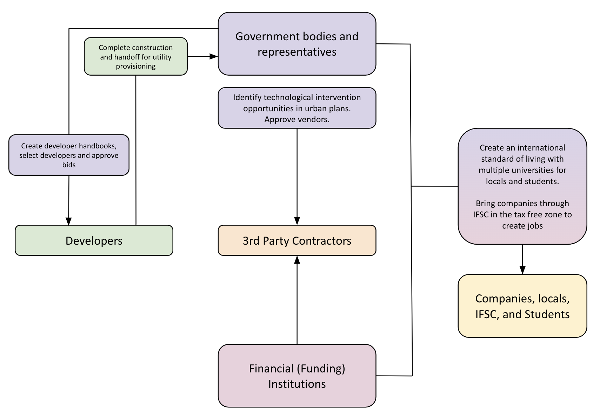

<!--
Allowed values:

type: district, plan

tags: Environment, Mobility, Buildings, Energy, InformationSystems, HealthEducation, InnovationSystems, CivicTech, CivicInnovation, Food

-->

## Overview

<!-- About 100 to 150 word summary of the case study. -->

GIFT (Gujarat International Finance and Tech-City) is a free trade zone project aimed at establishing an advanced and integrated financial centre in India. It focuses on facilitating a range of financial services including back-office operations, high-end trading, etc. to attract foreign investment. GIFT is developed in a Special Economic Zone, becoming home to India’s first International Financial Services Center (IFSC) where residents and non-residents can perform transactions in 14 currencies other than the Indian Rupee (INR). Through this simple, yet powerful concept, the Hon’ble PM of India, Shri Narendra Modi, looks to make GIFT City the primary price setter for some of the largest traded instruments (commodities, currencies, equities, etc.) in the world. The city rests on a 16 km utility corridor that will become the backbone to support integrated development, fibre optic cable networks, AI enablement, smart grids, and many more technologies that will serve as a groundbreaking initiative towards a smarter, and global India.

## Goals and Aspirations

<!-- What is the project trying to achieve? Identify 3-5 high-level goals that define the entire project.Replace the placeholder title with a succinct name for the goal. -->

- **A Dominant Financial Hub:** GIFT City is a platform for the dominant financial hub of India through domestic tariffs for business-related India operations and multiservice special economic zones.
- **International Standard Work/Life:** GIFT City integrates finance and technology for smart city development, combining modern infrastructure, regulatory frameworks, and technological advancements to provide an international standard of working and living.
- **Sustainable Infrastructure:** The project promotes sustainable development through robust policies with green buildings and technological infrastructure that minimises environmental impacts.
- **Social Infrastructure Development:** GIFT City blends commercial, residential, and social spaces, integrating with surrounding communities.

## Key Characteristics

<!--  How is the project organized into specific activities that advance these goals? For plans: How does the plan address each of the three activities in digital master plans (development, engagement, implementation). For districts: How does the district employ 3-5 of the key characteristics of innovation hubs?
-->

- **Formalising urban planning:** Indian suburban infrastructure starts with 1 building, that invites a basic road, then water supply, sewage lines, stable power, and maybe wifi when a larger road gets built (sometimes), over a period of 25 years. GIFT (Gujarat International Finance and Tec-City) is a project looking to further the idea of shortening the timeline to make basic infrastructure available in India.
  - The foundation of GIFT lies on top of a 16 km long utility tunnel that provides basic utility services such as power, water, sewage and garbage disposal, building connectivity, and communication for any building from the get-go. This also means that there is no need to excavate roads for utility provision in the future, making GIFT a “Dig Free” zone.
  - Fibre optic cables: The fibre optic ring network connects each building, enabling fast internet and AI integration, enhancing business efficiency and communication.

- **Plug and Play:** GIFT City's "plug-and-play" model simplifies the implementation process for developers. The utility tunnel provides essential infrastructure, including power, water, and sewage, to each building, allowing developers to focus on design and construction without worrying about basic utilities. This streamlined approach supports efficient, sustainable development.

- **Innovation Triangle:** GIFT City's proximity to Ahmedabad and Surat creates an "Innovation Triangle," leveraging the strengths of both cities. Ahmedabad, known for its vibrant sports scene and world-class cricket stadium, and Surat, recognized as India's Diamond District, benefit from GIFT City's development, fostering economic growth and tourism.

- **Walkability:** Contrary to the mindset of luxury meaning traveling in self-owned motor vehicles, GIFT City’s urban planning is based on the “walk to work” concept to reduce public and private transportation needs. This fundamentally promotes the goal of achieving sustainable development.

## Stakeholders
<!--  Who initiated the project? Who is leading the project forward? Who else has a say in how it unfolds? Who is directly affected but marginalized? Identify 3-5 key stakeholder organizations or groups. Identify 3-5 key individuals. These are people who are associated with the project as leaders, supporters, critics, or regulators. They are likely to be members of the stakeholder groups identified above. These are people you should try to contact for one or more interviews.-->

- **Developers:** The developers are responsible for bidding on projects, constructing buildings, and selling land in GIFT City. They lead the construction process and ensure the project's goals are realised. The higher building costs, due to regulations and technological infrastructure, impact the selling prices, making the area potentially posh and marginalising some buyers. Primary groups in development at GIFT include Shivalik Group, SAVVY group.
- **Third-party Companies and Contractors:** These companies and contractors bring GIFT City's technology and smart city initiatives to life. They implement existing systems and solutions, contributing to the technological infrastructure one segment at a time. They rely on the utility corridor to get started, connecting their solutions seamlessly to the city's infrastructure. This includes ENVAC for waste management, ABB for sensors, AllGoVision for security and surveillance technology and REHVA for the district colling system.
- **Government bodies and representatives:** These individuals act as intermediaries between the government and developers. They create the handbook and guidelines for developers, perform the bidding process for them and meticulously ensure that project and sustainability goals are being maintained. They initiated the project with the utility tunnel in the plug and play model, handed it off to developers for building construction, and will eventually complete the utility provisioning post construction completion. They also ensure smooth communication between all parties.
- **Financial Institutions:** Entities like IFPL (India Infoline Finance Ltd.) play a key role in financing developments within GIFT City, providing funds for construction projects and enabling the overall growth of the city. Their involvement supports the development of financial services, technology infrastructure, and smart city features, contributing to GIFT City's vision.
- **IFSC, Locals, and Students:** The IFSC oversees financial services in GIFT City, providing a regulatory framework for banking, insurance, and capital markets. Locals and students contribute to the community, benefiting from the project's development and adding to its diversity and vibrancy.

## Technology and Urban Planning Interventions
<!--  What specific technology-enabled interventions does the project propose? Identify 3-5 technology interventions. Describe use cases, value proposition, solution architecture, data created or consumed, key platforms and standards, business models, regulatory issues, etc. Separate into more than 1 paragraph as needed. This is a good place to insert additional images, be sure to include captions identifying the source and make sure to not use copyrighted images. -->

GIFT City integrates two key types of smart initiatives: smart urban planning and technological interventions that make a city smart.

**Smart Urban Planning - Utility Corridor:** The primary smart urban planning initiative is the aforementioned utility tunnel that enables the plug-and-play model. This utility corridor forms the backbone of GIFT City's technological innovations, supporting microgrids, sensors, data collection software, and other digital interventions. These technologies blend traditional infrastructure with modern systems, transforming the city into a smart urban hub. While tax incentives, domestic tariff laws, and the IFSC attract financial institutions to GIFT city, the ready-made infrastructure reduces setup costs and time, allowing businesses to quickly establish operations and contribute to the city's growth. This requires emphasis because of the formalised urban planning initiative (Key Characteristic 1) at GIFT City, unlike most large urban planning initiatives in India. Bank of America’s 3000-employee office is now operational in GIFT given the reduced setup time. The project took approximately 14 years to come to life, but this time investment has proven worthwhile in this aspect.

Technological Interventions at GIFT are enabled by the utility corridor. It includes the following:

- **Smart Grids:** GIFT City's utility corridor has enabled smart grids that ensure constant and efficient power distribution.
Real-time Monitoring: ABB's (Ability Smart Sensor) smart sensor technology conducts real-time monitoring of energy consumption, utilising automated metering and billing systems. This data is transmitted to the cloud, flagging anticipated motor malfunctions to optimise performance using a predictive mechanism.
- *Energy Efficiency:* The smart grid system redistributes power constantly which helps reduce energy consumption by approximately 10%, advancing GIFT City's sustainability goals and lowering operational costs for businesses and residents. This sustainable energy infrastructure attracts both foreign companies and residents, ensuring constant reliable power and reducing overall costs.
- **Advanced Surveillance:** Using AllGoVision’s technology, GIFT City's advanced surveillance systems enhance security and monitoring throughout.
  - *Safety:* The solution integrates with Honeywell IP cameras and video management systems to provide automated surveillance monitoring. Its primary use case is the tripwire feature that triggers an alarm when someone crosses a “virtual line” ensuring security for businesses and residents. The system can also use this feature to detect trespassing into restricted zones, object detection, and loitering alerts.
  - *Cost Effectiveness:* AllGoVision's automated surveillance reduces the need for manual monitoring, making the process more efficient and cost-effective. The system saves time and manpower, contributing to the city's overall operational efficiency, while its ability to detect object occlusion and environmental changes like rain ensures reliability.
- **Automated Waste Management:** GIFT City's automated waste management system, utilising the ENVAC system, ensures efficient waste collection and segregation.
  - *Operational Efficiency:* The ENVAC system automates waste collection and segregation, reducing human intervention and streamlining waste management. This system integrates with the city's centralised infrastructure, supporting its sustainability goals.
  - *Sustainability:* The system provides clean energy and treated waste readings, contributing to GIFT City's environmental objectives. This feature attracts environmentally conscious businesses and residents, fostering a sustainable urban ecosystem.

## Financing
<!--  How are the technology interventions identified to be financed? How does this fit into financing of the larger project? Identify at least one financing mechanism that is being used. -->

GIFT City went through a series of financing mechanisms with a variety of stakeholders that support development and technological initiatives. The initial funding for GIFT City came from IFPL (India Infoline Finance Ltd.), which financed the construction of the 16 km utility tunnel, a core component of the project's infrastructure. The government later took over financing, allocating companies to different sites based on requirements. This initial support provided a stable foundation for the city's technological and urban development. As GIFT City gained traction, financing shifted towards bids from developers. The infrastructure's robust guidelines and stringent standards make bidding more challenging, leading to higher bids that finance projects. This approach has sustained the city's progress, ensuring consistent development and growth. The financing model also supports phase-wise development, with operational milestones such as the opening of the Bank of America office. This generates money rotation, fueling further growth and development. The focus has primarily been on office and residential spaces, with social segments yet to be financed. Once the office and residential spaces are fully developed, IFPL will fund social and recreational activities in GIFT City. This phase will complete the city's integrated development, creating a balanced ecosystem for business, residential, and social needs.

## Anticipated Outcomes
<!-- What results has the project produced to date? What outcomes and impacts are anticipated? Identify 3-5 (anticipated) outcomes. What will/has the project achieved? Thes should not be the same or repeated from elsewhere. Use this space to emphasize something different. -->

**Creating a finance hub:** With the goal to become a financial hub, GIFT City faces a huge challenge regarding talent attraction and retention. The state of Gujarat is also known as the “land of businessmen”. So, even though the project creates an innovation triangle, it has been unable to attract local talent because most students join their family business at an early age. Gujarat also does not have large/reputed universities that can help with talent acquisition given the lack of job culture. Surat (another nearby city) is the diamond district of the world, again lacking a culture of jobs requiring Fin-Tech expertise. So, while Bank of America has a 3000-employee office operational at GIFT City, they and others are facing a massive challenge to acquire talent.

**Welcoming global entities and individuals:** The fundamental idea of success for GIFT City is to create a city like New York or London where upcoming and existing talent starts choosing India as the place to be. Technological initiatives are only seen as an enabler to create a modern living and working environment. However, attracting global investment requires building an international mindset. Gujarat is a dry state (alcohol and nicotine are banned here). It is also an inherently vegetarian community that has historically killed diversity within social and recreational activities. To combat this and develop a global mindset, the central government has begun relaxing the laws surrounding alcohol, recreation, and social engagement. At a minimum, it will help attract talent that is non-Gujarati (from other parts of India and the world) and promote global companies to set up shop here at GIFT.

**Job creation:** GIFT City is anticipated to create ~1M+ direct and indirect jobs in the Gujarat economy through its tax incentives for local and foreign businesses to create a vibrant local ecosystem. GIFT expects to attract top 500 ranking universities across the world to open India branches. All transactions will be freely convertible into non-INR currencies with the IFSC initiative and existing infrastructure will facilitate a seamless experience. Permissible courses at these universities are required to include research programs in Financial Management, FinTech, Science, Technology, Engineering, and Mathematics. This is reinforced by the speculation of lacking local talent in Gujarat in the Finance industry.

## Open Questions
<!-- What is uncertain, unclear, or still unresolved about this project? Identify 1-3 open question(s). -->

- How does public perception of smart cities shift from developed countries to developing countries? Does the target population at GIFT City in 2024 care as much about personal data collection as San Diego lamppost surveillance in 2017?

- What is a reasonable timeline for social infrastructure development to keep GIFT City relevant for companies and individuals? Does it become outdated after 5-7 years if the goals are still not met or complete?

- GIFT City is developed with the potential of replication in India across other industries. It is also a lot of India’s first (including utility corridor, smart technology investments, IFSC, etc.). Is there a real need to create a blueprint for a replicable smart city? Do we need to make more than a few smart cities across industries in 1 country ever?

## References

### Primary Sources

<!-- 3-5 project plans, audits, reports, etc. -->

- [Masterplan](https://accreditation.giftgujarat.in/concept)
- [Handbook For Developers](https://api.giftgujarat.in/public/downloads/GDCR/Handbook%20for%20Developers%20_%20July%202021.pdf)
- [Sustainability Guidelines](https://api.giftgujarat.in/public/downloads/GDCR/Environmental-Sustainability-Reference-Abridge-v03.pdf)
- [Quality guidelines](https://api.giftgujarat.in/public/downloads/GDCR/QA_QC_Guidelines_for_Building_construction_in_GIFT_City.pdf)
- [Tech Interventions](https://giftsez.com/)
- [Smart Grids, Intelligent Transportation Systems](https://www.sobha.com/blog/gift-city-residences-future-urban-living/#:~:text=The%20city%20is%20equipped%20with,connectivity%20and%20efficient%20resource%20management.)
- [ABB Technologies is Putting in the Power Grid at Gift](https://www.constructionweekonline.in/people/20919-gift-city-indias-first-fully-operational-smart-city)
- [District Cooling system](https://www.rehva.eu/rehva-journal/chapter/indias-first-district-cooling-system-at-gift-city)
- [AllGoVision Video Analytics City Surveillance Solutions for Smart Cities](https://www.allgovision.com/AllGoVision_Case-Study_Gift-City.pdf )
- Other:
  - [IFSC](https://www.giftgujarat.in/business/ifsc)
  - [Infrastructure](https://www.giftgujarat.in/infrastructure)
  - [Business Presentation](https://www.giftgujarat.in/downloads/Doing%20business%20at%20GIFT%20IFSC_booklet.pdf)

### Secondary Sources

<!-- 5-7 secondary source documents: news reports, blog posts, etc.. -->

- Times Property: <https://timesproperty.com/news/post/all-about-gift-city-blid6504>
- ICMG Group: <https://www.linkedin.com/pulse/delving-indias-premier-smart-city-project-gift-icmg-group-jrhic/>
- Economic Times: <https://economictimes.indiatimes.com/industry/services/property-/-cstruction/gift-city-may-see-indias-first-regulated-global-realty-infra-asset-tokenisation-platform/articleshow/108625666.cms>
- Surveillance Tech: <https://medium.com/@vaishnavgnair21/cyber-threat-intelligence-report-gujarat-international-finance-tec-city-gift-city-66ecb407536d>
- ABB Tech: <https://www.constructionweekonline.in/people/20919-gift-city-indias-first-fully-operational-smart-city>
- Science Direct Paper: <https://www.sciencedirect.com/science/article/pii/S2352146516306834>
