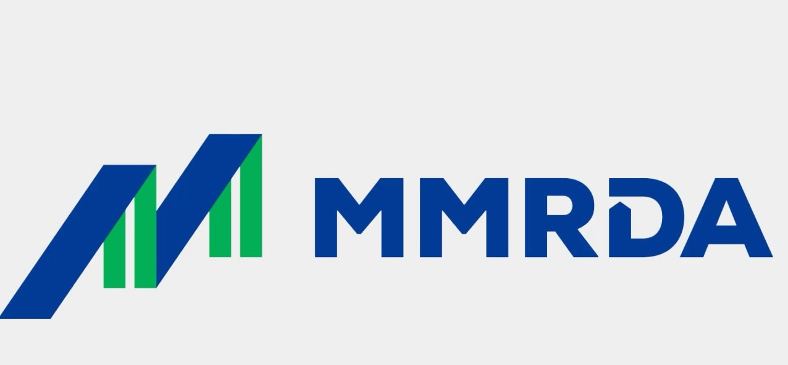

<!--
Allowed values:

type: district

tags: Environment, Mobility, Buildings, Energy, InformationSystems, HealthEducation, InnovationSystems, CivicTech, CivicInnovation, Food

-->

## Overview

<!-- About 100 to 150 word summary of the case study. -->

Bandra Kurla Complex is a financial and business district in Mumbai, India.

The MMRDA (Mumbai Metropolitan Region Development Authority) focused on developing BKC to decongest South Mumbai which houses a lot of business spaces and offices, the streets are extremely narrow in South Mumbai and it doesn't have enough space to accommodate the growing demand for business spaces in Mumbai. The plan laid out also wants to upscale the BKC area into a “smart” business hub to attract more businesses and at the same time serve the growing population of the area.

Its important to understand how BKC has evolved over time. To make it easy to comprehend, one can split BKC's development into 2 phases - In 1977 BKC was brought to life to relieve traffic congestion problems and over the years leading upto until around 2014 it was purely real estate with big developers coming in and building offices, workspaces, schools etc. The second phase was brought into the picture from 2014 which had the label 'Smart' and now the focus pivoted from just buidling office spaces and huge towers to actually creating features around it with smart technology and innovation.

## Goals and Aspirations

<!-- What is the project trying to achieve? Identify 3-5 high-level goals that define the entire project.Replace the placeholder title with a succinct name for the goal. -->

**Internet Connectivity**. One of the important goals of Smart BKC was to make BKC more connected to the internet. They already had the real estate sorted out, now it was time for them to build things that actually makes it 'smart' and for them it all started with first making sure there is public wifi setup. The MMRDA worked with Reliance as well to give upto 2 - 5 Mbps of internet speed to users.

**Transportation and Smart Parking**. Bandra Kurla Complex wasnt the best in terms of bus and local train connection and with the increasing crowd there it was essential to get transportation set up efficiently. For this purpose they opted for smart buses. These are e-buses that run from prime locations around Mumbai to BKC and they also have a special app integrated from where you can book tickets and track these buses. Other than that, the BEST (Brihanmumbai Electric Supply and Transport) also started running buses along this route and these buses can be tracked/booked via CHALO mobile application. Parking is a huge pain point of Mumbai and with the increasing number of car owners in BKC MMRDA launced smart parkings with digital availability tracker etc and with plans to integrate e-vehicle charging stations.

**Safer Citizens**. The "Smart BKC" project in Mumbai has introduced a Citizen Mobile Application designed to enhance the urban experience, this app integrates various smart solutions, including real-time traffic updates, parking management, and emergency notifications, aiming to streamline urban living and commuting. Users can access services such as public transport schedules, community events, and utility services. Additionally, the application offers a platform for residents and workers in the area to interact with local governance, report issues, and receive updates directly. This initiative reflects a broader trend of utilizing technology to manage urban centers more effectively, making cities like Mumbai smarter and more liveable. Other than this, MMRDA also installed more than 100 CCTV cameras around BKC and the feed is sent back to police stations and control centers to perform video analytics and track down on theft and improve overall citizen security.

**Recreational: Green Parks and Gardens**. The "Smart BKC" project in Mumbai places emphasis on sustainability and green living, which is highlighted in its development of parks and gardens within the Bandra Kurla Complex area. The green spaces were very well received and MMRDA has paid special attention to the maintenance of these spaces to make sure it is still in good shape for public use.

## Key Characteristics

<!--  How is the project organized into specific activities that advance these goals? For plans: How does the plan address each of the three activities in digital master plans (development, engagement, implementation). For districts: How does the district employ 3-5 of the key characteristics of innovation hubs?
-->

**Integration Of Technology**.  One of the fundamental aspects of innovation hubs is the integration of advanced technology to streamline operations and enhance efficiency. The Smart BKC project employs IoT (Internet of Things), smart lighting, and data analytics to improve infrastructure management, reduce energy consumption, and enhance security. There are more than 800 smart lights installed that not only reduced the energy consumption but also reduced the time spent in servicing them.

**Sustainability and Environamental Focus**.  The Smart BKC project incorporates green initiatives such as energy-efficient buildings, waste management systems, and green spaces. These efforts contribute to creating a sustainable business environment that minimizes ecological impact while promoting long-term sustainability. Also emphasis on smart street lights, e-buses, and setting up electric vehicle charging stations do reflect their overall commitmment to being more environmentally conscious.

**Collaboration Spaces and Economic Development**. Another key feature of innovation hubs is providing spaces fostering collaboration among stakeholders. The Smart BKC project aims to develop areas that encourage interactions between businesses, researchers, and professionals. This promotes networking and collaboration, which are essential for fostering innovation ecosystems. All of these work, be it real estate development or the vision of making it smart contributes to overall economic development by enhancing the attractiveness of the area as a business destination, leading to increased investment and job creation.

## Stakeholders
<!--  Who initiated the project? Who is leading the project forward? Who else has a say in how it unfolds? Who is directly affected but marginalized? Identify 3-5 key stakeholder organizations or groups. Identify 3-5 key individuals. These are people who are associated with the project as leaders, supporters, critics, or regulators. They are likely to be members of the stakeholder groups identified above. These are people you should try to contact for one or more interviews.-->

**MMRDA**. Mumbai Metropolitan Region Development Authority [(MMRDA)](https://mmrda.maharashtra.gov.in/) is the primary government body responsible for infrastructure development in the Mumbai Metropolitan Region, MMRDA is the initiator and a major stakeholder in the Smart BKC project. It plays a central role in planning, execution, and oversight. They are the people who initated the idea of making BKC a new business hub in Mumbai and they are now the ones who are leading the charge of making it smart. From planning to financing or bringing in external private partners, all is handled by MMRDA. From my interview it was highlighted that this Smart BKC project and many projects that started in Mumbai after 2015 have been quite transparent and relatively have quicker response times to its other parties involved in the process. Overall, the process has been quite digitalized and people working in the teams internally are spending much less time filling out physical forms.

**Businesses And Corporates**. Companies located within the Bandra Kurla Complex are crucial stakeholders, as the project directly impacts their operational environment and potential business growth. Big companies such as Reliance were also key stakeholders in this project. Reliance has recented launched a Convention Center which as state of the art infrastructure and interior design. Other than that BKC houses some of the major banks of India and private schools.  

**Residents And Local Community Groups**. While potentially marginalized in the decision-making process, residents of surrounding areas and community groups are directly affected by the changes and are crucial for gathering feedback and ensuring community needs are met. MMRDA has struggled with incorporating suggestions from local communities and hearing and receiving feedbacks from the residents. Over the last couple of years, it has started making small strides towards this direction though and apps like the citizen mobile application kind of hint towards this new shift in their approach.

**Interview**. For this project, Mr Nilesh Lele was interviewed who is currently the president of Chamber for Advancement of Small and Medium Businesses. He is responsible for uplifting SMEs in India by educating them, providing/sourcing necessary funding, etc. Some of the insights received were -

1. WiFi connectivity was one of the most successful goals of the project.
2. Realized that public transport via buses was the best bet - included e-buses in the Smart BKC route.
3. Brought Yulu (a private company) into the picture for electric motorbikes within BKC - ended more for recreational than actually for transportation.
4. Working with MMRDA was quite transparent, but found a lack of public involvement.

")

## Technology Interventions
<!--  What specific technology-enabled interventions does the project propose? Identify 3-5 technology interventions. Describe use cases, value proposition, solution architecture, data created or consumed, key platforms and standards, business models, regulatory issues, etc. Separate into more than 1 paragraph as needed. This is a good place to insert additional images, be sure to include captions identifying the source and make sure to not use copyrighted images. -->

**Smart Parking**. A smart parking system with guidance capabilities is designed to efficiently manage approximately 2,844 parking slots, encompassing indoor, outdoor, and street parking areas. Additionally, the infrastructure includes electric vehicle (EV) charging stations, complemented by a locator service to assist drivers in easily finding available charging points. Parking times were reportedly reduced from 20 minutes to 5 minutes in the area.

**Wifi Connection**.  Free 2-5 Mbps with 1 GB limit wifi per user per month is made available at open spaces & streets for business and exhibition use. The city is also leveraging the government run MTNL's (Mahanagar Telephone Nigam Limited) network to support this as well as private companies are also pouring their share to meet this goal.

**Video Analytics**. 155 new cameras were included in the area and the feed is connected to mumbai cctv command center and BKC polic station. MMRDA has leverged this data to perform video analytics and improve citizen safety. They also reported reduced theft in street furniture and improved emergency response.

## Financing
<!--  How are the technology interventions identified to be financed? How does this fit into financing of the larger project? Identify at least one financing mechanism that is being used. -->

**Government and Private Partnerships**. MMRDA remains as the sole head authority over the planning and control of the BKC region and the financing comes from the government as well as private businesses. Private businesses were and still are buying this premium land from MMRDA - Reliance who has been a major player in the BKC project bought 7.5 hectare plot in BKC for around 132 Million USD. There are many other private businesses involved (around 21 Indian firms) but Reliance has been choosen by the MMRDA for financing and implementing many parts of the smart BKC project.

## Outcomes
<!-- What results has the project produced to date? What outcomes and impacts are anticipated? Identify 3-5 (anticipated) outcomes. What will/has the project achieved? Thes should not be the same or repeated from elsewhere. Use this space to emphasize something different. -->

**Enhanced Mobility and Reduced Traffic Congestion**.  Since the inaugural of BKC, this has been the most important point. Other than just the infrastruture development, the project has introduced smart buses and an integrated transportation management system that helps in reducing the overall traffic congestion within the complex and across South Mumbai. This has made commuting smoother and more predictable for daily commuters. The introduction of electric buses and the availability of a mobile application for transportation management (CHALO app) further enhance this aspect.

**Increased Public Safety**.  With the deployment of over 155 CCTV cameras and the integration of video analytics, the project has significantly improved security within the Bandra Kurla Complex. These measures have reportedly reduced theft and improved emergency response times, creating a safer environment for both residents and business professionals.

**Improved Urban Living Standards**.  The Citizen Mobile Application along with the free public wifi introduced under the Smart BKC initiative facilitates better urban living by providing real-time traffic updates, parking management, and emergency notifications. This app not only simplifies access to public services but also creates a sense of community by enabling residents to interact with local governance, report issues, and receive updates.

**Advancing Sustainability**. The focus is now moving towards sustainability and is evident in the development of energy-efficient buildings, waste management systems, the creation of green spaces, and smart streetlights. Furthermore, with the plans of additional spaces for electric vehicle charging stations it looks like the government is acknowledging the arrival of e-vehicles in India and is getting geared for it.

## Open Questions
<!-- What is uncertain, unclear, or still unresolved about this project? Identify 1-3 open question(s). -->

**Equity**. How does the Smart BKC project make sure that equitable access is provided to all sections of society, including marginalized communities?.  

**Privacy**. What are the steps taken to ensure that privacy is held high, especially in a project that is focusing so much on video analytics and data collection?

**Next Steps**. What does Smart BKC 3.0 entail and what counts under ‘futuristic innovations’?

## References

---

### Primary Sources

<!-- 3-5 project plans, audits, reports, etc. -->

- [MUMBAI METROPOLITAN REGION DEVELOPMENT AUTHORITY: Smart BKC](https://mmrda.maharashtra.gov.in/projects/innovations/smart-bkc/overview)
- [KPMG Screen](https://wtcmumbai.org/pdf/report-presentiton/2015/29jan/Shri%20Sanjay%20Sethi.pdf)
- [MUMBAI METROPOLITAN REGION DEVELOPMENT AUTHORITY: Comprehensive Transport Study](https://mmrda.maharashtra.gov.in/projects/transport/comprehensive-transport-study/overview)
- [BKC Layout](https://mmrda.maharashtra.gov.in/sites/default/files/2021-09/bkc_0.jpg)

### Secondary Sources

<!-- 5-7 secondary source documents: news reports, blog posts, etc.. -->

- <https://www.smartcitiescouncil.com/article/reliance-infrastructure-give-face-lift-smart-bkc-project>
- <https://mmrda.maharashtra.gov.in/sites/default/files/2021-09/BKC%20Planning%20Proposal%20Report_0.pdf>
- <https://smartutilities.net.in/2020/03/17/model-complex/>
- <https://theprint.in/india/smart-parking-better-designed-junctions-mmrdas-plan-to-decongest-mumbais-business-hub-bkc/1767338/>
- <https://www.mid-day.com/mumbai/mumbai-news/article/reliance-infrastructure-to-give-face-lift-to--smart-bkc--project--17149170>
