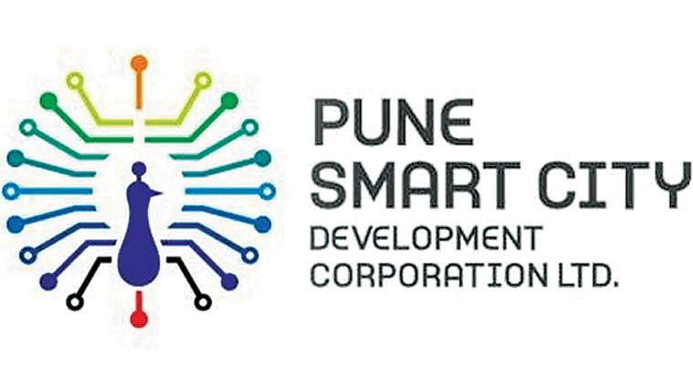

## Overview

<!-- About 100 to 150 word summary of the case study. -->

The Smart Cities Mission of India was a key offering of the Indian government. Launched by the Ministry of Housing and Urban Affairs in 2015, it has been instrumental in facilitating communication and resource sharing between different parts of the Indian government to achieve better living standards for Indians in 100 cities across the country. Pune is the second largest city in the State of Maharashtra. As a major urban center, it is faced by challenges with inadequate infrastructure and environmental concerns due to its rapid urbanization. Under the Smart Cities Mission, the Pune Municipal Corporation (PMC) implemented various initiatives to address these issues. Through the use of technology, IoT and Data Analytics, the city has improved its transport, waste management, healthcare offerings, and digital governance.

## Key Characteristics

<!--  Summarize the most visible essential characteristics of the project. For districts: How does the district employ 3-5 of the key characteristics of New Century Cities? For plans: How does the plan address each of the three activities (development, engagement, implementation) of the digital masterplanning process described in the 2015 Townsend and Lorimer paper?
-->

**Infrastructure**.  The Smart City mission in Pune has focused on upgrading and modernizing its infrastructure. The city has made investments into improving roads, transportation systems and utilities. An example of this is the development of the Between the Road Transport System (BRTS) for public bus transportation. Other initiatives include the integration of IoT based systems for intelligent traffic management, waste management, and optimizing resource utilization.

**Digital Connectivity**.  The city is a major center of IT in the State. It thus recognizes the importance of digital connectivity to enable smart-solutions. In order to provide widespread access to high-speed internet, the city has established Wi-Fi hotspots in public areas to create a digital infrastructure that supports the implementation of smart technologies. This has empowered the citizens to make use of the applications that the city runs, such as e-governance platforms. The initiative works in close tandem with the Ministry of Electronics and Information Technology.

**Citizen Engagement and Participation**.  Pune places a significant emphasis on its citizen engagement and participation. The city has implemented various channels to empower citizens to make their voice heard. Through mobile apps (Pune Connect), social media channels and community outreach programs, citizens can provide inputs to decision making, report issues and actively participate in the development of their neighborhood.

## Goals and Aspirations

<!-- Summarize the most important goals of the project. Replace the placeholder title with a succinct name for the goal. The text should be around 50 words. -->

**Sustainable Infrastructure Development:**  The Smart City Mission in Pune aims to create a resilient urban infrastructure by upgrading and modernizing transportation systems, enhancing public amenities and implementing smart solutions for efficient resource utilization and management. The goal is to create an environmentally friendly city that meets the needs of its growing population.

**Enhanced Quality of Life**. The city strives to improve the quality of life for its citizens by providing reliable and accessible public services, healthcare, education and green spaces. The city has a goal to create an inclusive and livable environment where its residents can thrive and enjoy a high standard of living.

**Digital Transformation and Innovation**.  Pune is a tech hub for the region. By leveraging technology and innovation, the city wants to drive digital transformation. The mission includes implementing smart solutions for e-governance, traffic management, delivering services, and citizen engagement. It aims to create a digitally powered city that utilizes technology for citizen-centric services.

## Technology Interventions
<!--  Identify 3-5 specific technology-enabled interventions the project employs or proposes. The text should be around 75-125 words. Separate into more than 1 paragraph as needed. This is a good place to insert additional images, be sure to include captions identifying the source and make sure to not use copyrighted images. -->

**Smart Grid System**. The smart grid system in Pune enables intelligent energy management, with real-time monitoring, analysis, and control of electricity distribution. The goal is to optimize energy consumption, reduce waste, and improve reliability. By integrating renewable energy sources and employing sophisticated metering infrastructure, the smart grid promotes sustainable practices and provides information to make informed decisions regarding energy usage.

**Smart Transportation System**.  The city employs technology to integrate various systems to allow for intelligent traffic management, real-time vehicle tracking, and smart parking solutions. Using data analytics and a network of sensors, it allows the city to efficiently manage the flow of traffic, minimizing congestion and travel time. Even with transport infrastructure, technology is being closely knit into these projects.

**E-governance Framework**.  Pune emphasizes the successful implementation of a robust e-governance framework. This intervention aims to digitize government services and processes and facilitate easy and transparent delivery of public services. By using technology, citizens can access various government services online, including payment of taxes, obtaining licenses, and accessing information. It streamlines the administrative procedure, reduces bureaucracy, and promotes citizen participation.

## Stakeholders
<!--  Identify 3-5 key stakeholder organizations or groups. The text should be around 50 words, and include a link to the organization.-->

**Pune Municipal Corporation (PMC):**. The PMC is the governing body responsible for the administration and management of Pune City. It is the leading agency for planning, implementing and managing the various projects and initiatives for the smart cities missions.  [PMC Homepage](https://pmc.gov.in/)

**Pune Smart City Development Corporation Limited (PSCDCL):**.  The PSCDCL is a special purpose vehicle created to execute the smart city projects in Pune. It works with different stakeholders, including the government agencies, private sector partners, and citizens to drive the vision.  [PSCDCL Homepage](https://punesmartcity.in/smart-city/feeds)

**Private Sector Partners**.  Multiple private sector partners companies are kept in the loop for the development and implementation of smart cities initiatives. These organizations bring expertise in areas of technology, infrastructure, and services. Companies such as Tech Mahindra, Tata Consultancy Services, and Larsen & Toubro are utilized for their experience in technology and infrastructure development.

## Leadership
<!--  Conduct one interview with a project leader, and link to a LinkedIn or other profile. Provide a brief biography, no more than 75 words. Identify 3-5 insights or themes from the interview. Feel free to add a photo of the individual here. -->

**Pranav Savle**. Pranav worked with the Smart Cities Mission in Pune from 2020 to 2021. He contributed to the mission as a Smart Cities fellow, working on the Health Management Information System. He completed his Computer Engineering from Pune University and is currently working with Capgemini as a Senior Data Analyst.  [LinkedIn](https://www.linkedin.com/in/pranavsavle/)

**Local Talent**. The Smart Cities Mission of India pulls from its local talent pool of students to create modern and relevant digital solutions. It empowers students to use their talent and skills to create solutions for the smart cities mission.

**Government Siloes**. A key hurdle that fellows faced during their implementation phase was the interfacing between different government departments. The difference in jurisdiction and authority made acquiring the necessary resources and information difficult in some cases.

**Private Sector Collaboration**. The fellowship creates solutions that are actionable and impactful. In cases where their scale and mandate is larger than what can be achieved by fellows, private sector partners are brought in to take the project to its completion.

## Other people interviewed

|  |  |
|:---:|:---:|
| [Aayush Kakaji](https://www.linkedin.com/in/aayush-kakaji-16386078/) | [Divya Bharti](https://www.linkedin.com/in/divya-bharti-03204945/) |

**Insights and notes** Divya Bharti and Aayush Kakaji are the 2020 and 2021 Fellows for the Smart Cities Mission. Aayush currently is working as a Business Analyst at the National Institute of Urban Affairs, while Divya is currently a Project Manager for State Reform at the Central Square Foundation. Each worked on projects to help the cities of Bhopal and Indore.

## Financing
<!--  Identify at least one financing scheme being used in this project or plan. About 100 words is probably a good length for this. -->

**Government Grants and PPPs**. The central government provides financial funding to smart city projects through the Smart Cities Mission scheme. It allocated funds to the PMC and other implementing agencies to support the development of the initiatives. The central government's financial support helps the city bridge the gap between investment, ensuring the successful implementation of the projects. Another financing scheme using the Smart Cities Mission for Pune is a Public-Private Partnership (PPP). PPPs involve collaboration between the government and private sector companies to fund, develop, and manage projects. The private sector partners contribute financial and technical knowhow, while the government provides the regulatory framework and additional financial assistance.

## Outcomes
<!-- Identify 3-5 (anticipated) outcomes. What will/has the project achieved? Thes should not be the same or repeated from elsewhere. Use this space to emphasize something different. About 50 words per is minimum, but these can be as long as you want/need. -->

**Enhanced Transportation**.   The Smart Cities Mission for Pune aims to improve the city's transportation infrastructure, promoting sustainable modes of transport and reducing traffic congestion. Electric public-transport buses and the Between the Road Transport System (BRTS) are examples of achieving this. Anticipated outcomes include the development of efficient public transportation, improved last-mile connectivity and implementing smart traffic management solutions to enhance citizen mobility.

**Citizen-centric services**.  The mission emphasizes the delivery of citizen-centric services through digital and technology powered solutions. The anticipated outcomes are the development of integrated citizen service portals, mobile platforms and digital interfaces that empower citizens to access government services, provide feedback, and participate in the decision making process. The goal is also to increase transparency and accountability in residents' interactions with the government.

**Sustainability**.  The Smart Cities Mission for Pune focuses on sustainability and aims to reduce the city’s carbon footprint. Anticipated outcomes include the adoption of renewable energy sources, implementation of energy efficient infrastructure, waste reduction and management, and promotion of green spaces to create a sustainable urban living space.

## Open Questions
<!-- Identify 1-3 open question(s). What is uncertain, unclear, or still unresolved about this project? These can be 50 words or less. -->

**Equity**.  How will the Smart Cities Mission for Pune make sure that equitable access is provided to all sections of society, including marginalized communities? What steps will be taken to avoid exacerbating the existing social and economic disparities?

**Infrastructure Maintenance**.  What measures are being taken to ensure the long-term sustainability and maintenance of the smart city infrastructure? How can the city leverage its unique demographics to solve these issues?

**Data Privacy and Security**.  How does the project address data privacy and security concerns ? How is citizens' personal information handled across different smart city entities and platforms?

**Integration**.  What can the city take from other such developments? How can the city better integrate with the central agencies that it interacts with?

## References

---

### Primary Sources

<!-- 3-5 project plans, audits, reports, etc. -->

- <https://smartcities.gov.in/>
- <https://punesmartcity.in/smart-city/feeds>
- <https://www.squareyards.com/blog/pune-smart-city-smcart>

### Secondary Sources

<!-- 5-7 secondary source documents: news reports, blog posts, etc.. -->

- <https://niua.in/iscfp/>
- <https://smartcities.gov.in/India_Smart_Cities_Fellowship_Program>
- <https://www.ibef.org/government-schemes/smart-cities-mission#:~:text=The%20100%20Smart%20Cities%20Mission,them%20citizen%20friendly%20and%20sustainable>.
- <https://hlrn.org.in/documents/Smart_Cities_Report_2017.pdf>
