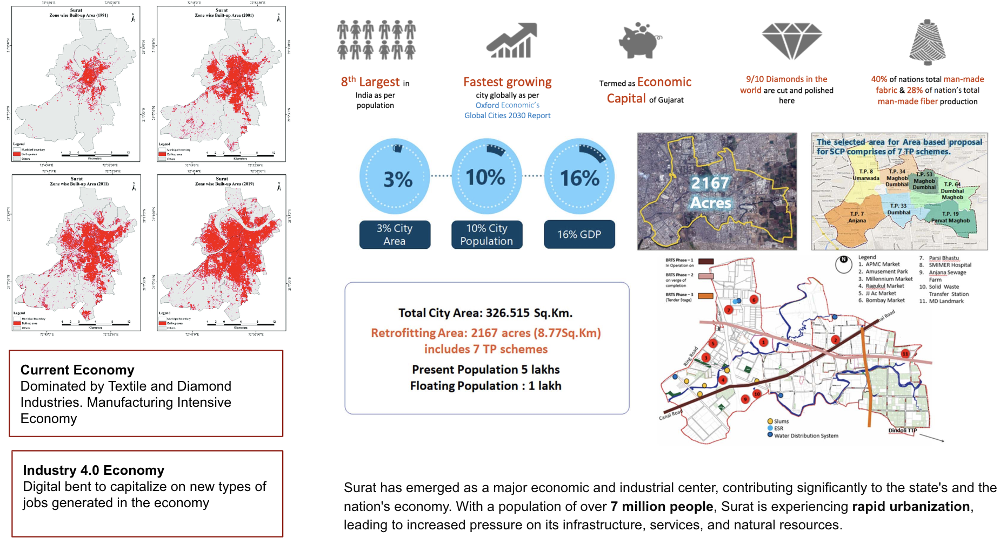
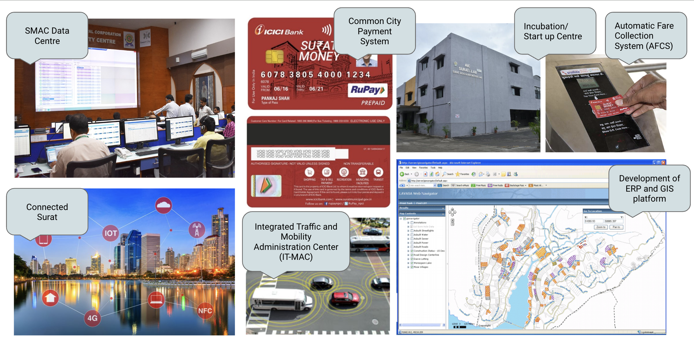
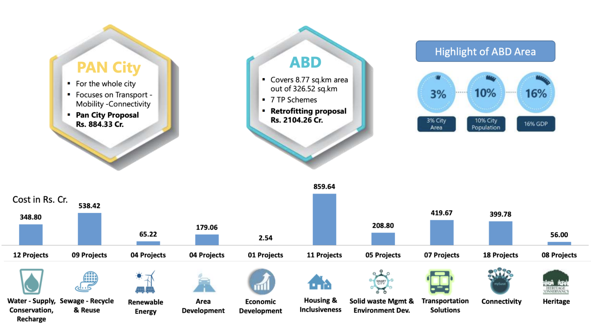

<!--
Allowed values:

type: plan

tags: Environment, Mobility, Buildings, Energy, InformationSystems, HealthEducation, InnovationSystems, CivicTech, CivicInnovation, Food

-->

## Overview

<!-- About 100 to 150 word summary of the case study. -->

Known for its diamond and textile industries, Surat is a crucial economic hub facing challenges from rapid urbanization, such as infrastructure deficits, environmental degradation, and public service strain. Surat Smart City Project, part of India's Smart Cities Mission addresses these issues by enhancing urban infrastructure, promoting sustainable development, and improving public services.
With a population of over 7 million, Surat is one of the fastest-growing cities in Gujarat, necessitating effective strategies to manage its expansion. Key initiatives include integrated traffic management systems, a common city payment system, renewable energy projects, and ERP and GIS platforms for municipal operations.
The project encompasses both Pan City and Area-Based initiatives. The Pan City proposal focuses on enhancing public services and citizen interface, particularly emphasizing Intelligent Transport and Connectivity to envision a more citizen-friendly Surat. Meanwhile, Area-Based interventions target sustainable economic growth and quality of life enhancements in specific areas, allocating 3% of Surat's total geographical area for transformation into well-planned urban spaces.

## Goals and Aspirations

<!-- What is the project trying to achieve? Identify 3-5 high-level goals that define the entire project.Replace the placeholder title with a succinct name for the goal. -->

**Improve Urban Infrastructure**. The project aims to upgrade the city's infrastructure to keep pace with its rapid urbanization. Key initiatives include a 24x7 water supply system with smart metering, the enhancement of sewage treatment plants, and the recycling of treated wastewater. In transportation, the development of an Integrated Traffic and Mobility Administration Center (IT-MAC) seeks to optimize traffic flow and reduce congestion. These upgrades ensure the city's infrastructure can support its growing population, thereby enhancing the overall quality of life.

**Promote Sustainable Development**. The project integrates renewable energy sources like solar and wind power, introduces LED street lighting with smart monitoring systems, and promotes green spaces. Additionally, improvements in waste management aim to reduce pollution and boost recycling efforts. These initiatives are designed to foster a balanced urban environment that supports economic growth while preserving natural resources and reducing the city’s carbon footprint.

**Enhance Public Service**. Leveraging advanced technologies, the project aims to make public services more efficient and accessible. An ERP system for municipal operations and a GIS platform for urban planning are central to these efforts along with a  common city payment system using a contactless smart card streamlines access to civic services. Enhanced public services, including emergency response, waste management, and citizen engagement, are facilitated through IT-enabled applications and real-time data monitoring, ensuring prompt and effective service delivery.

**Foster Economic Growth**. Building on Surat's robust economic base, the project seeks to drive further development and attract investment. Initiatives include supporting startups, research institutions, and technology parks to create new job opportunities and stimulate economic activity. By enhancing the business environment, the project aims to make Surat a preferred destination for both domestic and international investors. This goal also involves fostering entrepreneurship and developing a skilled workforce to meet the demands of a rapidly evolving economy.

**Promote Inclusive Urban Development**. Ensuring that all segments of the population benefit from the city's development is a key focus. The project includes initiatives for affordable housing, healthcare, education, and improved public amenities, particularly for marginalized and vulnerable groups. By fostering community engagement and participation, the project aims to create an inclusive urban environment where every resident has access to essential services and opportunities for economic and social advancement.

## Key Characteristics

<!--  How is the project organized into specific activities that advance these goals? For plans: How does the plan address each of the three activities in digital master plans (development, engagement, implementation). For districts: How does the district employ 3-5 of the key characteristics of innovation hubs?
-->

The Surat Smart City Project falls under the category of a municipal digital master plan. The project specifically focuses on developing and implementing comprehensive digital and technology plans to address urban challenges, improve infrastructure, enhance public services, and promote sustainable development within the city of Surat.

**Development**.  The development phase of the Surat Smart City Project involves laying the groundwork for various initiatives to address urban challenges and promote sustainable growth. This begins with comprehensive feasibility studies to assess the viability and impact of proposed projects, ensuring they align with Surat’s long-term goals. Securing funding is critical, and the project leverages government grants, public-private partnerships, and private investments to finance its initiatives. Detailed blueprints are created for upgrading essential infrastructure, including implementing a 24x7 water supply system with smart metering, enhancing sewage networks and treatment plants, and developing integrated traffic management systems.

**Engagement**. The engagement phase involves extensive stakeholder engagement through public consultations, workshops, and community meetings. These activities gather input and feedback from residents, businesses, and other stakeholders, ensuring their voices are heard and concerns addressed. By involving the community in the planning process, the project fosters a sense of ownership and ensures that the benefits of the smart city transformation are equitably distributed, particularly to marginalized groups. This participatory approach helps build trust and ensures that the project's outcomes are aligned with the community’s needs.

**Implementation**. The implementation phase translates the detailed plans developed during the earlier stages into tangible actions. This includes the construction and deployment of critical infrastructure projects such as upgrading water supply systems to ensure a continuous 24x7 supply and enhancing sewage treatment capabilities. Technology-enabled solutions are rolled out to improve municipal operations and urban management, including the implementation of an ERP (Enterprise Resource Planning) system and a GIS (Geographic Information System) platform. payment system facilitates seamless transactions for various civic services. Monitoring and evaluation mechanisms are put in place to track progress, assess the impact of initiatives, and make necessary adjustments to ensure the project's goals are met effectively.

## Stakeholders
<!--  Who initiated the project? Who is leading the project forward? Who else has a say in how it unfolds? Who is directly affected but marginalized? Identify 3-5 key stakeholder organizations or groups. Identify 3-5 key individuals. These are people who are associated with the project as leaders, supporters, critics, or regulators. They are likely to be members of the stakeholder groups identified above. These are people you should try to contact for one or more interviews.-->
“Creating a balance between nature and development is key. By protecting nature, we prevent pollution from contaminating our land, air and water, and we protect the health of our citizens." - Municipal Commissioner of Surat, Shri Banchhanidhi Pani

**Surat Municipal Corporation(SMC)**. [Surat Municipal Corporation](https://www.suratmunicipal.gov.in/) is the primary driving force behind the Surat Smart City Project. Tasked with planning, executing, and monitoring the various initiatives, SMC is pivotal in ensuring that the project aligns with the city's broader urban development objectives. By coordinating with multiple stakeholders, SMC facilitates the integration of infrastructure upgrades, technological advancements, and community engagement activities.

**Government of Gujarat**. [Government of Gujarat](https://en.wikipedia.org/wiki/Government_of_Gujarat) plays a crucial supporting role by providing policy guidance, financial backing, and a regulatory framework for the Surat Smart City Project. The state government ensures that the project adheres to regional development policies and contributes to the overall growth strategy for Gujarat.

**Surat Smart City Development Ltd.(SSCDL)**. This is a special purpose vehicle created to implement the smart city initiatives.[SSCDL](https://www.suratsmartcity.com/SSCDL/AboutSSCDL) is responsible for managing project execution, working closely with various stakeholders, including private sector entities and technology providers. The organization is essential in turning the strategic vision of the Surat Smart City Project into reality by meeting project milestones within the set timelines and budgets.

**Local Community Groups**.  Local community groups, comprising resident associations and business organizations provide critical input, feedback, and support, ensuring that the project's initiatives are in line with the community's needs and expectations. Their participation helps foster a sense of ownership and ensures that the benefits of the smart city transformation are distributed fairly among all residents, including marginalized populations.

**Private Sector Partners**.  Private sector partners, including technology companies, urban planners, and infrastructure developers, are vital to the project’s success. These partners bring in necessary expertise, cutting-edge technologies, and financial investments. Key collaborations include:

• [Microsoft City's Next Initiative](https://www.microsoft.com/en-us/industry/blog/government/2015/02/13/surat-becomes-a-showcase-city-for-microsoft-citynext/): Partnering with Tata Consultancy Services and Wipro to drive sustainable urban growth and technological innovation in Surat.

• [IBM](https://economictimes.indiatimes.com/news/economy/infrastructure/ibm-picks-surat-allahabad-vizag-among-16-global-locations-for-smart-cities-project/articleshow/47250982.cms?from=mdr): Assisting with improved citizen services through the IBM Smarter City program, addressing challenges such as waste management, disaster management, and overall citizen engagement.

These partnerships significantly enhance the project's capability to implement innovative solutions, ensuring that Surat remains a leader in urban development.

## Technology Interventions
<!--  What specific technology-enabled interventions does the project propose? Identify 3-5 technology interventions. Describe use cases, value proposition, solution architecture, data created or consumed, key platforms and standards, business models, regulatory issues, etc. Separate into more than 1 paragraph as needed. This is a good place to insert additional images, be sure to include captions identifying the source and make sure to not use copyrighted images. -->

**Integrated Traffic Management System (IT-MAC)**. This system is a cornerstone of Surat's efforts to create a smarter and more efficient urban transportation network. This system employs a network of sensors, cameras, and data analytics to monitor and manage traffic flow in real-time. By collecting data on vehicle movement, traffic density, and road conditions, IT-MAC can dynamically adjust traffic signals to alleviate congestion and improve traffic flow.
One of the key benefits of IT-MAC is its ability to enhance road safety. The system can detect traffic violations, monitor accident-prone areas, and provide instant alerts to traffic management authorities. Moreover, by optimizing traffic light cycles based on real-time data, the system minimizes idle time at intersections, thereby reducing vehicle emissions and contributing to better air quality.
Additionally, IT-MAC supports the integration of public transport systems, prioritizing buses and other mass transit vehicles at traffic signals to promote public transportation usage. This not only improves the efficiency of public transport but also encourages residents to shift from private vehicles to more sustainable modes of travel, further easing traffic congestion and reducing the city’s carbon footprint.

**Common City Payment System**.  The common city payment system is designed to streamline the financial transactions associated with various municipal services, making it easier and more convenient for residents to access and pay for these services. This system involves the use of a contactless smart card that can be used across multiple services, including utilities (such as water and electricity), public transportation, parking, and even entry to municipal facilities like libraries and recreational centers. This unified payment system offers several advantages.
For residents, it simplifies the payment process, eliminating the need to carry multiple cards or cash for different services.
For the city administration, it enhances operational efficiency by consolidating payment processing and reducing the administrative burden associated with managing numerous payment systems.
The implementation of the common city payment system also includes robust security measures to protect user data and prevent fraud. Advanced encryption technologies ensure that transactions are secure and user information is protected. Additionally, the system generates valuable data on service usage patterns, which can be analyzed to improve service delivery and plan future infrastructure developments.

**Renewable Energy Projects**. Surat's Smart City Project incorporates several renewable energy initiatives aimed at reducing the city's reliance on fossil fuels and lowering greenhouse gas emissions. One of the primary initiatives is the installation of solar panels on public buildings, such as schools, hospitals, and government offices. These solar installations generate clean energy, reducing the city's overall energy costs and carbon footprint. Another significant component of this intervention is the upgrade of street lighting systems to energy-efficient LED lights powered by solar energy. These solar-powered LED streetlights not only consume less energy but also have longer lifespans compared to traditional lighting, resulting in reduced maintenance costs and less environmental impact.
Furthermore, the project explores the potential of wind energy and other renewable sources to diversify Surat’s energy mix. By promoting the adoption of renewable energy technologies, the project aims to create a more sustainable urban environment, encourage the growth of green industries, and set an example for other cities in India and beyond.

**ERP and GIS Platforms**. The implementation of Enterprise Resource Planning (ERP) and Geographic Information System (GIS) platforms represents a significant advancement in the management and planning capabilities of Surat’s municipal operations. The ERP system integrates various administrative functions, including finance, human resources, procurement, and asset management, into a single cohesive platform. This integration streamlines processes, improves resource allocation, and enhances the overall efficiency of municipal operations.
The GIS platform complements the ERP system by providing spatial analysis and mapping capabilities. This technology is crucial for urban planning, as it allows city planners to visualize data geographically, analyze spatial relationships, and make informed decisions based on comprehensive data sets. For example, GIS can be used to map out areas with high water leakage rates, identify locations for new infrastructure projects, or analyze the distribution of public services to ensure equitable access for all residents.

**Smart Water Management**. The system is designed to address the challenges of water distribution and usage in a rapidly growing city like Surat. One of the primary components of this system is the implementation of a 24x7 water supply, ensuring that residents have continuous access to clean water. This is achieved through the installation of smart water meters that provide real-time monitoring of water usage across the city. These smart meters are equipped with sensors that detect leaks and monitor water flow, allowing for immediate identification and resolution of issues in the water supply network. This proactive approach significantly reduces water wastage and ensures that the city's water resources are used efficiently.
In addition to leak detection, the smart water management system also includes the use of advanced analytics to predict water demand and optimize supply. By analyzing usage patterns and predicting future demand, the system can adjust water distribution in real-time to ensure that supply meets demand without overburdening the infrastructure. Moreover, the system promotes the recycling and reuse of treated wastewater for non-potable purposes, such as industrial use and irrigation. This reduces the strain on the city's fresh water resources and promotes sustainable water management practices.

## Financing
<!--  How are the technology interventions identified to be financed? How does this fit into financing of the larger project? Identify at least one financing mechanism that is being used. -->

Surat Smart City Project employs a multifaceted financing strategy to support its ambitious goals. The cornerstone of the financial plan is government funding, which includes substantial grants from India's Smart Cities Mission. These grants provide a crucial financial foundation, enabling the initiation and continuation of various urban development projects. Public-private partnerships (PPPs) play a significant role in the financing strategy, attracting private investment and leveraging the expertise of private sector entities. These partnerships are instrumental in implementing a wide range of initiatives, from infrastructure development to the deployment of advanced technologies. By sharing risks and rewards, PPPs ensure that projects are completed efficiently and sustainably.

Private sector contributions, especially from technology and infrastructure companies, further bolster the project's financial health. These contributions not only provide essential funding but also bring in cutting-edge technologies and innovative solutions that are vital for the project's success. Companies involved in these sectors often see the Smart City initiative as a valuable opportunity for collaboration and investment, leading to mutually beneficial outcomes.

In addition to these primary financing mechanisms, the project also explores alternative funding sources such as international development funds, loans from financial institutions, and municipal bonds. International development funds can offer grants and low-interest loans to support specific aspects of the project, particularly those related to sustainability and resilience. Loans from financial institutions provide additional capital for large-scale infrastructure projects, while municipal bonds can be issued to raise funds from public investors, offering them a stake in the city's future development. By employing this diversified financing approach, the Surat Smart City Project ensures a steady flow of resources necessary to achieve its comprehensive objectives. This strategy not only secures the financial sustainability of the project but also fosters a collaborative environment where various stakeholders contribute to the city's transformation into a modern, sustainable, and inclusive urban center.

## Outcomes
<!-- What results has the project produced to date? What outcomes and impacts are anticipated? Identify 3-5 (anticipated) outcomes. What will/has the project achieved? Thes should not be the same or repeated from elsewhere. Use this space to emphasize something different. -->

**Improved Traffic Management**.  The implementation of the Integrated Traffic Management System (ITMS) has resulted in notable improvements in traffic flow and congestion reduction in Surat. By optimizing traffic signals and providing real-time updates, the system has shortened travel times and enhanced overall commuting experiences for residents. Additionally, this outcome has contributed to enhanced road safety and a reduction in vehicle emissions, aligning with the city's sustainability objectives.

**Streamlined Civic Transactions**.  TThe introduction of the common city payment system has simplified access to civic services, promoting financial inclusion and efficiency. By integrating various services into a single payment solution, this outcome has streamlined transactions and enhanced transparency in municipal operations. Moreover, it has improved accessibility for residents, ensuring smoother interactions with city services. activities and access essential services.

**Environmental Improvement**. Efforts in renewable energy adoption and waste management have yielded tangible environmental benefits for Surat. This outcome includes a reduction in the city's carbon footprint and enhancements in environmental quality. Additionally, the promotion of green spaces has elevated the city's livability, offering residents more recreational opportunities while contributing to overall environmental sustainability.

**Economic Prosperity**. The establishment of an innovation ecosystem has catalyzed economic growth and job creation in Surat. By attracting new businesses and investments, this outcome has bolstered the city's economic resilience and prosperity. Furthermore, it has fostered entrepreneurship and innovation, driving forward the city's economic agenda and ensuring long-term sustainability.

**Informed Urban Planning**. The deployment of the Geographic Information System (GIS) platform has revolutionized urban planning and management in Surat. This outcome encompasses informed decision-making processes, allowing city planners to optimize resource allocation and infrastructure development. By enhancing strategic planning capabilities, this outcome ensures the city's growth is sustainable and well-coordinated, laying the groundwork for future urban development initiatives.

## Open Questions
<!-- What is uncertain, unclear, or still unresolved about this project? Identify 1-3 open question(s). -->

How will the project ensure the long-term sustainability of its technology interventions, particularly in terms of maintenance and upgrades? While the project has made significant progress in implementing advanced technological solutions, ensuring their long-term sustainability requires a robust strategy for maintenance, upgrades, and continuous improvement. This includes securing ongoing funding, developing skilled personnel, and establishing partnerships with technology providers to support the system's life cycle.

What measures are being taken to ensure that marginalized and vulnerable populations are not left behind in the smart city transformation? While the project aims to benefit all residents, it is essential to ensure that marginalized and vulnerable populations are included in the planning and implementation processes. This includes addressing their specific needs, providing equitable access to services, and ensuring that the benefits of the smart city transformation are distributed fairly.

How will the project adapt to evolving technological trends and potential regulatory changes in the future? The rapid pace of technological advancements and changes in regulatory frameworks present ongoing challenges for the project. It is crucial to have a flexible and adaptive approach to incorporate new technologies, comply with emerging regulations, and respond to changing needs and expectations of the city's residents. This includes continuous monitoring of technological trends, proactive engagement with regulators, and regular updates to project plans and strategies.

## References

1. NEC Corporation. (n.d.). Transportation solutions - NEC. Retrieved May 19, 2024, from <https://www.nec.com/en/global/solutions/transportation/case-datumsi/index.html>

2. Surat Smart City Development Ltd. (n.d.). About SSCDL. Retrieved May 19, 2024, from <http://www.suratiilab.org/about-sscdl>

3. Square Yards. (n.d.). Surat smart city: Current progress and development plans. Retrieved May 19, 2024, from <https://www.squareyards.com/blog/surat-smart-city-smcart>

4. Shift Cities. (2021, May 21). Surat smart city: Leading India's sustainable urban development movement. Retrieved May 19, 2024, from <https://www.shiftcities.org/post/surat-smart-city-leading-indias-sustainable-urban-development-movement>

5. Surat Municipal Corporation. (n.d.). Retrieved May 19, 2024, from <https://www.suratmunicipal.gov.in/>

### Primary Sources

1. National Institute of Urban Affairs. (2015). Surat city plan (SCP). Retrieved May 19, 2024, from <https://smartnet.niua.org/sites/default/files/resources/SCP_%20SURAT.pdf>

2. Pundir, R. (2017). Surat smart city in the making. ResearchGate. Retrieved May 19, 2024, from <https://www.researchgate.net/publication/319442268_Surat_Smart_City_in_the_making>

3. My Surat. (n.d.). Projects. Retrieved May 19, 2024, from <https://mysurat.in/projects.htm>

4. Surat Smart City Development Ltd. (n.d.). Annual reports. Retrieved May 19, 2024, from <https://www.suratsmartcity.com/SSCDL/AnnualReports>

5. Resilient Cities Network. (2023). Surat TFURP project logic. Retrieved May 19, 2024, from <https://resilientcitiesnetwork.org/wp-content/uploads/2023/07/Surat-TFURP-Project-Logic.pdf>

### Secondary Sources

1. Bhatt, R. (n.d.). Smart city and case of Surat. Academia.edu. Retrieved May 19, 2024, from <https://www.academia.edu/9755852/SMART_CITY_AND_CASE_OF_SURAT>

2. IUDX. (n.d.). Surat smart cities. Retrieved May 19, 2024, from <https://iudx.org.in/surat-smart-cities/>

3. Shukla, S. (2017). Surat smart city. ResearchGate. Retrieved May 19, 2024, from <https://www.researchgate.net/publication/316824250_Surat_Smart_City>

4. Traffic Infra Tech. (2017, May 4). Surat smart city in the making. Retrieved May 19, 2024, from <https://trafficinfratech.com/surat-smart-city-in-the-making/>

5. Surat Municipal Corporation. (2017). Day 1 of the smart city Surat's mega event to showcase India's excellence in the field. Retrieved May 19, 2024, from <https://www.facebook.com/MySuratMySMC/videos/day-1-of-the-smart-city-surats-mega-event-to-showcase-indias-excellence-in-the-f/1316589982170416/>

6. Surat Municipal Corporation. (2022, January 19). MySuratMySMC status update. Retrieved May 19, 2024, from <https://x.com/MySuratMySMC/status/1484392650426171392>

7. Surat Smart City. (n.d.). Retrieved May 19, 2024, from <https://www.slideshare.net/SuratSmartCity1>

8. Swarajya. (2021, December 31). Surat tops list for smart city completion; Agra and Ahmedabad follow while UTS and NE cities lag behind. Retrieved May 19, 2024, from <https://swarajyamag.com/infrastructure/surat-tops-list-for-smart-city-completion-agra-and-ahmedabad-follow-while-uts-and-ne-cities-lag-behind>

9. Ministry of Housing and Urban Affairs. (n.d.). Surat: Resource document. Retrieved May 19, 2024, from <https://dsc.smartcities.gov.in/uploads/resource/resourceDoc/Resource_Doc_1708420849_Surat.pdf>

10. Surat Smart City. (n.d.). Retrieved May 19, 2024, from <https://www.suratsmartcity.com/>
