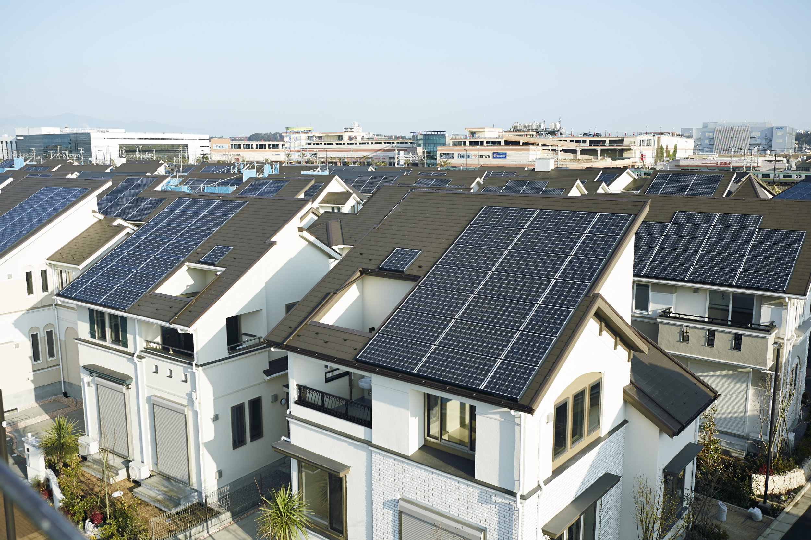
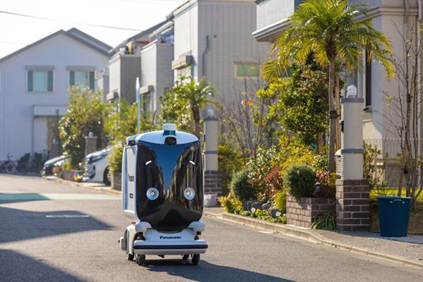
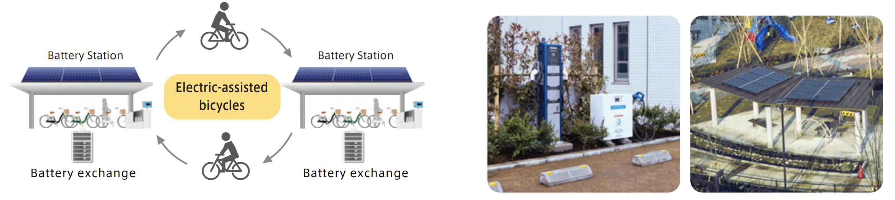
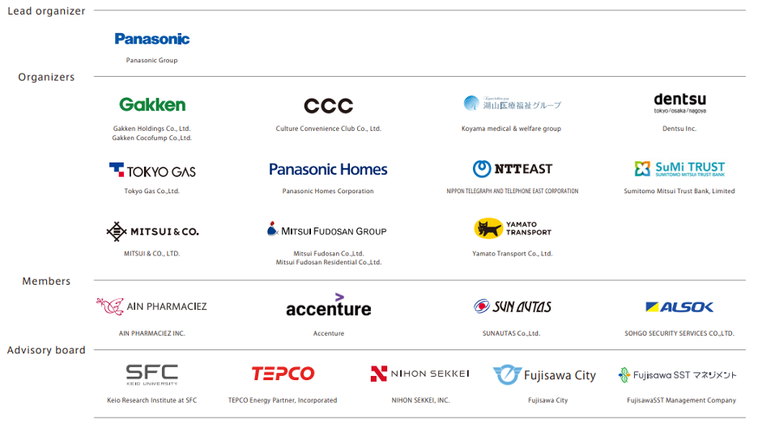

## Overview

<!-- About 100 to 150 word summary of the case study. -->

The Fujisawa Sustainable Smart Town (Fujisawa SST) is a smart town project in Fujisawa, Kanagawa Prefecture, Japan. The town began development in 2012, led by Panasonic in collaboration with multiple public and private partners. It offers a new type of living focused on sustainability and resident well-being. The current phase of the town has been built over 19 hectares with 1,000 houses and many public areas such as shops and parks. Cutting-edge communications, energy efficiency, and green technology make the town completely self-sustainable, with a low carbon footprint and an enhanced quality of life. Designed around five key concepts (community, energy, mobility, security, and wellness), the town is the first to prioritize resident quality of life as its number one objective. In addition, the Fujisawa SST serves as a testing field for new technologies and strives to be a model town for future smart city projects.

")

## Key Characteristics

<!--  Summarize the most visible essential characteristics of the project. For districts: How does the district employ 3-5 of the key characteristics of New Century Cities? For plans: How does the plan address each of the three activities (development, engagement, implementation) of the digital masterplanning process described in the 2015 Townsend and Lorimer paper?
-->

**Promote Sustainability**.  The town embraces sustainability by managing energy generation using a mix of natural energy and technologies for energy creation and storage. All houses use solar power from panels to supply energy and batteries to store it for later use. A smart grid system controls all energy usage, consumption, and storage, while shared services, such as electric vehicles, reduce individual resource consumption. The Fujisawa SST is designed to passively use wind, sunlight, water, and heat, among other natural resources, to power the town. The town aims to cut CO2 emissions by 70% and water consumption by 30%.

**Effective Management of Urban Services**.  The Fujisawa SST manages urban services through integrated communication services, using real-time data to control waste management, transportation, security, and healthcare, decreasing the time needed to provide various services. The town has a dedicated disaster plan to power houses and provide push notifications to house smart TVs and personal mobile phones. Healthcare services across all fields are linked together to better personalize services for each resident. 

**Celebrate the Experience of Place and Community**.  The Fujisawa SST offers a sense of community with a unique combination of natural and urban elements. There are multiple communal spaces, such as parks and plazas. Additionally, the Fujisawa SST Council, the group of stakeholders involved in the town’s development, organizes many events and activities to facilitate community building. The town's design blends modern infrastructure and architecture with the cultural feel of Fujisawa to provide residents with ways to connect with local lifestyles and heritages.

## Goals and Aspirations

<!-- Summarize the most important goals of the project. Replace the placeholder title with a succinct name for the goal. The text should be around 50 words. -->

**Build Sustainable Lifestyles**.  The Fujisawa SST aspires to be a smart town where the focus isn’t on the infrastructure but on the citizens themselves. Therefore, the town is designed with residential comfort and sustainable living patterns in mind. In addition, the town offers programs to teach residents the importance of sustainable living and skills such as proper recycling.

**Improve Quality of Life**. The town aspires to improve the quality of life for residents. With minimal traffic, the town provides quick, walking distance access to all essential services and needs; this provides safety and accessibility for residents across diverse needs and ages. Surveillance cameras offer security without intruding. An abundance of different wellness and activity spaces aspire to build resident physical and psychological health.

**Serve as a Model for Smart Cities**.  The Fujisawa SST aspires to be a model for future towns and smart cities. With technologies from Panasonic, its project lead, and other Japanese technology companies, the town is a testing ground for a broad range of smart city technologies and initiatives.

## Technology Interventions
<!--  Identify 3-5 specific technology-enabled interventions the project employs or proposes. The text should be around 75-125 words. Separate into more than 1 paragraph as needed. This is a good place to insert additional images, be sure to include captions identifying the source and make sure to not use copyrighted images. -->

**Energy Management Systems**. All houses in the Fujisawa SST are equipped with solar power generation systems through panels and batteries for storage. Each house, along with other power sources such as wind turbines, is linked to the Community Energy Management System (CEMS). Electric power generated by individual units can be used to power houses and facilities, while excess power can be sold for town revenue or stored for emergency use, which is important as Fujisawa is particularly prone to earthquakes. Numerous energy-saving technologies in each household and building are linked to the CEMS, such as led lighting, energy-efficient air-conditioners, and water-saving showers, which allows the town to track energy and water consumption and consult with families or individuals on consumption habits and selling excess power from their homes.

**Autonomous Deliveries**.  Shonan Hakobo is an autonomous robot developed by Panasonic that delivers goods to residents from nearby businesses. This robot is in response to the growing demand for e-commerce and home delivery services, coupled with increased desire for no-contact interactions. Shonan Hakobo means “Shonan Delivery Robot” in Japanese, with Shonan being the region of Fujisawa the town is in. Panasonic realized that it wasn’t enough to have a delivery robot but that it should help bring the community together, so residents were asked to pick the robot's name, and Shonan Hakobo was chosen. Other services centered around Shonan Hakobo are planned around the continued testing of its delivery functionality.

**Electric Bikes and Vehicles**.  The town offers a “total mobility service” with electric vehicles (EV) and bicycles for residents to share. This helps residents participate in a broader range of activities and live more active lives while reducing CO2 emissions. Battery charging stations in convenient locations allow residents to charge vehicles and swap out batteries for bicycles so that the next person does not rent out a vehicle with a battery that will die at an inconvenient time, lessening the environmental impact and removing a barrier to bicycle adoption. Battery charging stations also provide additional sources of electricity in case of emergencies.

**Multi-Device Push Notifications**.  All homes in the Fujisawa SST have information terminals connected to smart TVs that automatically displays push notifications to residents, including disaster information, weather alerts, and power outage updates. This system, which also is connected to residents’ smartphones, is used for general communication during emergencies and to transmit any changes in the schedules of town events.

The information terminal is also connected to other aspects of the town and can send notifications regarding bike or EV availability, healthcare updates, and sales at Shonan T-Site, the town’s commercial base of shops and services. 

## Stakeholders
<!--  Identify 3-5 key stakeholder organizations or groups. The text should be around 50 words, and include a link to the organization.-->

**Panasonic**.  Panasonic is a global leader in developing and manufacturing home appliances and, more recently, home automation. Panasonic is the leader of the Fujisawa SST initiative, aiming to create secure, eco-friendly, and comfortable communities. [Panasonic](https://na.panasonic.com/us/)

**City of Fujisawa**.  The city government of Fujisawa is looking to address growing problems in the surrounding region and Japan as a whole, including an aging population and increased air and water pollution. Fujisawa launched an initiative to develop a town in harmony with the surrounding environment and chose Panasonic’s bid to create a model project. [City of Fujisawa](http://www.city.fujisawa.kanagawa.jp/)

**Fujisawa SST Council**.  The Fujisawa SST Council is an organization of businesses led by Panasonic that contribute to the town's development and meet regularly to discuss town issues. Other notable member organizations include [Yamato Transport](https://www.kuronekoyamato.co.jp/en/), which supports the EV and bike infrastructure in the town, and [Tokyo Gas]( https://www.tokyo-gas.co.jp/corporate/index.html?wovn=en), which supports the town's energy generation and management infrastructure. [Fujisawa SST Council]( https://fujisawasst.com/EN/)

**Fujisawa Citizens**.  Fujisawa SST citizens adopt sustainable practices and rethink their energy consumption and wasteful habits; they also help to shape the town as it evolves to support modern resident needs. Additionally, those living outside the town benefit from positive environmental impacts on the surrounding areas and reduced CO2 emissions, creating a better quality of life.

## Leadership
<!--  Conduct one interview with a project leader, and link to a LinkedIn or other profile. Provide a brief biography, no more than 75 words. Identify 3-5 insights or themes from the interview. Feel free to add a photo of the individual here. -->

**Risa Sato**. Risa Sato is the Promotion Manager, Panasonic Operational Excellence for the Fujisawa SST project. Risa represents Panasonic on the Fujisawa SST Council and focuses on managing stakeholder relationships across community-building, security, and housing initiatives. 

**A New Lifestyle**. While town planning often starts with infrastructure, Panasonic and its partners wanted to do something different to imagine a new lifestyle with the Fujisawa SST. They believe that everyone should have a house that they’re proud of and that they’d want to invite their friends to. Smart technology in the Fujisawa SST supports the residents like a typical smart city project. Still, this project prioritizes a new combination of elements of living, such as eco-consciousness and wellness.

**Development Obstacles**. Ten years ago, the Fujisawa SST’s location used to be an area of factories, including Panasonic factories. Panasonic had a vision for building a smart town here. It needed to buy the land from landowners and reallocate it while working on an agreement with the Fujisawa city government to convince them that this new type of smart city was valuable and feasible. When the first residents moved in, the town hit a roadblock regarding how to not simply provide hardware products but also provide services to customers (town residents). Panasonic started the Fujisawa SST Management Company, which manages the town's day-to-day operations and facilitates the testing of new services and technologies to gather resident feedback.

The COVID-19 pandemic limited the community building and services the town could provide. Still, it used Shonan Hakobo, which had been in private testing for 1.5 years, as a delivery robot, among other technologies, to maintain community and continue providing essential services. 

**Learnings from Fujisawa SST**. As a testing bed, the Fujisawa SST has been able to explore and test services that residents enjoy that they would otherwise not be able to have in a traditional town or neighborhood. One notable example is the presence of surveillance cameras. Every household can monitor cameras through smartphones and smart TVs to check on children to see if they’re safely playing; this technology has become widely utilized by residents for security and peace of mind.

Panasonic has gone on to develop other similar towns in Yokohama and Osaka, but the type of town depends on the surrounding area and local cultures; for example, Yokohama has less space available than Fujisawa, and most people live in condominiums, so a different town structure and management service needs to be implemented there to be successful.

**Looking Towards the Future**. The Fujisawa SST is watching rivals in Japan who are also trying to build smart towns and city districts, with a particular focus on Toyota, which is Panasonic’s closest competitor in terms of development speed and technological innovation. Panasonic is benchmarking against Toyota but is confident in its direction and the data and research it’s already collected to stay ahead and be a model town. 

Panasonic expects new technologies to revolutionize smart cities further. For example, the company is experimenting with new batteries that act as a buffer for energy consumption to ensure stored renewable energy stability. Additionally, it's currently testing hydrogen energy creation with fuel cells and storage to help further keep power consumption at sustainable levels in communities.

## Financing
<!--  Identify at least one financing scheme being used in this project or plan. About 100 words is probably a good length for this. -->

**Public-Private Partnership**. The town was initially built from a $500 million (USD) investment in a public-private partnership between Panasonic, other members of the Fujisawa SST Council, and the Fujisawa government. While limited information is publicly available, the town has recouped real estate investment from housing sales. It continues to make money by investing in town management services and excess energy sales, which generate recurring income for the town and Panasonic. This recurring income has allowed for the planning and development of town expansions and new infrastructure. Panasonic continues to make small investments in the town each year, prioritizing investments that will last a long time, such as weather-resistant and durable solar panels.

## Outcomes
<!-- Identify 3-5 (anticipated) outcomes. What will/has the project achieved? Thes should not be the same or repeated from elsewhere. Use this space to emphasize something different. About 50 words per is minimum, but these can be as long as you want/need. -->

**Develop Both the Current and the Next Generation**.  The Fujisawa SST strives to develop a community and address the real demands of residents. While the town is currently a significant advancement in smart towns, the pace of technology continues to evolve to the point that towns like the Fujisawa SST can be forgotten relics. The Fujisawa SST Management Company continuously evolves the sustainable capabilities of the town as well as provides lifestyle modifications to keep up to date with current lifestyles and trends. The structures and technologies of the town are meant to last over 100 years because the town believes that almost all people can live to be 100 years. As Japan has one of the world’s fastest aging populations, the town will open a senior residence in fall of 2024, using Internet-of-Things technology to streamline care time and monitor residents without being invasive. This facility will provide preventative healthcare, with anticipated outcomes of expanding citizen life expectancy with personalized care and facilitating multi-generational interactions.

**Improve Information Sharing**.  While smart TVs and smartphones can serve as town news push notification systems, these devices can also be used to access a new portal site for the town, which is a one-stop shop for all town information; this includes resident social posts and personalized information such as household energy consumption and advice to reduce it. This portal is a community platform that works in tandem with the town’s design to promote information sharing, allowing for multiple touchpoints where residents can share ideas, information, and knowledge with one another. The largely open, traffic-free streets and parks in the town create many opportunities to talk with neighbors and other community members. Both the town portal and the community spaces serve as venues for residents to voice their opinion, raise town issues, and vote on ballots, allowing residents to be comfortable expressing themselves, whether in-person or online. This blended information sharing anticipates strengthened community connections and a more inclusive and cohesive society.

**Strengthen the Local Economy**.  The Fujisawa SST has become a popular destination in Fujisawa, where visitors can visit a dedicated welcome center in the Fujisawa SST Square and take town tours. As an incubator for new businesses and services, the town has attracted and will continue to attract new businesses looking to develop services and technologies within the context of a residential smart town. Additionally, the sustainability and community focus of the town has attracted many new businesses around the town, from start-ups to wellness-focused grocery stores. This continuous increase in new businesses and tourism will create jobs and a more technologically skilled workforce while spurring research and innovation. The value of the land and the surrounding area has increased from the initial infrastructure; new investments continue to increase the value as Fujisawa SST operates as the center and partner companies develop further infrastructure around it. Ultimately, the increased interest in the town is anticipated to bring in new revenue streams to support the local economy, which even locals who don’t live there can benefit from. 

## Open Questions
<!-- Identify 1-3 open question(s). What is uncertain, unclear, or still unresolved about this project? These can be 50 words or less. -->

**Scalability**.  With a population of over 2000 residents, the Fujisawa SST has had initial success with balancing the sustainability and community goals. How could this town model be scaled to a higher population while at the same time preserving the community atmosphere?

**Technological Resilience**.  The infrastructure of the Fujisawa SST is designed to handle emergencies and provide electricity and information to residents during these times. As this interconnectivity is an emerging technology, how has the connected infrastructure of the town been tested for this resilience? Are there cyber threat protections in place?

## References

---

### Primary Sources

<!-- 3-5 project plans, audits, reports, etc. -->

- [Fujisawa SST Concept Book](https://fujisawasst.com/EN/wp_en/wp-content/themes/fujisawa_sst/pdf/FSST-ConceptBook.pdf)
- [Fujisawa SST Project Overview](https://fujisawasst.com/EN/project/target/)
- [Fujisawa SST Case Study](https://holdings.panasonic/global/corporate/sustainability/sdgs/case-study/case01.html)

### Secondary Sources

<!-- 5-7 secondary source documents: news reports, blog posts, etc.. -->

- [Businesswire: Panasonic to Make Fujisawa Sustainable Smart Town Operational With Its Partner Companies](https://www.businesswire.com/news/home/20150217005416/en/Panasonic-to-Make-Fujisawa-Sustainable-Smart-Town-Operational-With-Its-Partner-Companies)
- [EdgeProp: Creating values worth paying for](https://www.edgeprop.my/content/1600427/creating-values-worth-paying)
- [Fujisawa Sustainable Smart Town: Panasonic's Challenge in Building a Sustainable Society](https://aisel.aisnet.org/cgi/viewcontent.cgi?article=4054&context=cais)
- [The Guardian: Japan's Fujisawa Sustainable Smart Town - a model for 'smart life?](https://www.theguardian.com/sustainable-business/fujisawa-sustainable-smart-town-future-model)
- [Panasonic: Fujisawa Sustainable Smart Town - Generating Sustainable Impacts](https://news.panasonic.com/global/stories/1025)
- [Panasonic: The Tall Order of Developing a "100-Year Community" - Where Panasonic's First Smart Town is at 5 Years into That](https://news.panasonic.com/global/stories/877#:~:text=A%20smart%20community%20born%20in,blessed%20with%20wondrous%20natural%20surroundings.)
- [Tomorrow City: Fujisawa Sustainable Smart Town - Planning for the Next 100 Years](https://tomorrow.city/a/fujisawa-sustainable-smart-town)

