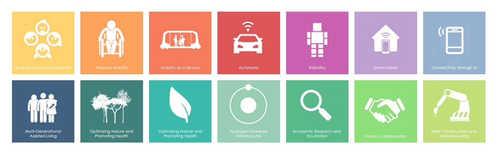

<!--
Allowed values: 

type: a tech-enabled district

tags: Mobility

-->

## Overview

<!-- About 100 to 150 word summary of the case study. -->

This case study explores the ongoing development of a technology innovation district: Toyota Woven City. It aimed at developing new sustainability mobility solutions through autonomous vehicles.

Toyota Woven City is an ongoing technology innovation district envisioned as the world's first urban incubator for advancing mobility solutions. Nestled at the base of Mount Fuji in Susono, Japan, the 175-acre smart city aims to seamlessly blend technology with sustainability. It serves as a "living laboratory," enabling researchers, businesses, and residents to collaboratively develop innovative mobility solutions while enhancing quality of life.

## Goals and Aspirations

**Collaborative Innovation in Mobility and Autonomy**  
Woven City aims to cultivate a fully connected, self-sustaining ecosystem that not only fosters collaborative innovation but also emphasizes mobility, autonomy, and sustainability. This involves creating an environment where technology and creativity meet to drive forward-thinking solutions in transportation and autonomous systems, making the city a global benchmark for technological integration and innovation-driven urban living.

**Carbon Neutrality**  
The city aspires to achieve carbon neutrality by leveraging advanced, renewable energy technologies including solar, geothermal, and hydrogen fuel cells. This commitment extends beyond simple energy efficiency, focusing on the creation of a sustainable urban environment that utilizes cutting-edge technologies to minimize carbon emissions and maximize renewable energy use, setting a new standard for eco-friendly urban living.

**Enhanced Well-being and Quality of Life**  
Woven City is dedicated to enhancing personal and communal well-being through the integration of technologically advanced yet human-centered design. This goal is about more than just technological integration; it's about creating a living environment that supports health, safety, and happiness, ensuring that every aspect of urban design contributes positively to the residents' quality of life.

**Scalable Smart City Model**  
The development of Woven City also includes plans to create a scalable smart city model that can be replicated in other regions around the world. This ambitious goal involves pioneering a blueprint for future cities that incorporate sustainability, technology, and community in ways that can be adapted to different cultures and environments, promoting global adoption of smart city principles.

**Seamless Integration of Technology and Sustainability**  
Aiming to seamlessly blend traditional craftsmanship with modern technology, Woven City plans to integrate renewable energy solutions, AI, and smart infrastructure into the urban fabric. This integration will be executed without compromising the aesthetic and cultural heritage of the region, ensuring that the new urban developments are sustainable, technologically advanced, and respectful of historical and cultural values.

## Key Characteristics

**Multi-modal Mobility Network**  
Designated pathways for autonomous vehicles, personal mobility devices, and pedestrians create a highly efficient, multi-modal mobility network. This network includes dedicated spaces for Toyota's e-Palette vehicles, ensuring seamless integration between private and shared transportation modes.

**Renewable Energy Integration**  
The city uses a combination of solar, geothermal, and hydrogen fuel cells to power its infrastructure, aiming for a carbon-neutral environment. This combination of energy sources ensures a resilient and sustainable power grid.

**Human-centered Design and Technology**  
The urban layout is designed around communal well-being, with residential units equipped with AI-enabled smart home features that monitor and improve the health and daily lives of residents. Traditional Japanese craftsmanship is blended with modern architecture to create a harmonious living environment.

**Living Laboratory for Innovation**  
As a prototype city, Woven City serves as a living laboratory for companies and researchers to test and develop new technologies, from robotics to AI and connected infrastructure, under real-world conditions.

**Community Engagement and Inclusivity**  
The project emphasizes inclusivity and collaboration, encouraging residents and stakeholders to contribute to the city's development through open forums and participatory decision-making processes. The city is designed to accommodate diverse groups, ensuring accessibility and engagement for all.

## Stakeholders

**[Akio Toyoda](https://global.toyota/en/company/profile/executives/operating-officer/akio_toyoda.html)**  
Chairman of the Board of Directors at Toyota Motor Corporation. Akio Toyoda envisioned Woven City as a prototype city for future mobility, aiming to bring his vision of sustainable transportation to life.

**[James Kuffner](https://global.toyota/en/company/profile/executives/)**  
CEO of Woven Planet Holdings, Inc. James Kuffner oversees the technological development and innovation in Woven City, focusing on automated driving, robotics, and smart city infrastructure.

**[Bjarke Ingels](https://big.dk/#projects-twc)**  
Founder and Creative Director of BIG (Bjarke Ingels Group). He leads the architectural design of Woven City, integrating futuristic design principles with sustainable urban planning.

**[Gill Pratt](https://global.toyota/en/company/profile/executives/)**  
CEO of Toyota Research Institute (TRI). Gill Pratt brings expertise in artificial intelligence and robotics, contributing to the project's cutting-edge technological development.

**Yuriko Koike**  
Governor of Tokyo, representing the interest of the local government. While the project is located outside of Tokyo, her support helps align the broader urban policy with Woven City's goals.  

**Koichi Kitazawa**  
Project Leader at Toyota Motor Corporation. Kitazawa manages local community engagement, ensuring the project's goals align

## Technology Interventions
<!--  What specific technology-enabled interventions does the project propose? Identify 3-5 technology interventions. Describe use cases, value proposition, solution architecture, data created or consumed, key platforms and standards, business models, regulatory issues, etc. Separate into more than 1 paragraph as needed. This is a good place to insert additional images, be sure to include captions identifying the source and make sure to not use copyrighted images. -->

**Autonomous Mobility Solutions**  
The primary street network features autonomous vehicles optimized for shared transportation, delivery services, and mobile retail. Toyota's e-Palette vehicles will play a significant role in shared mobility and logistics, offering flexible, on-demand services. Recreational promenades and pathways allow residents to navigate safely using personal mobility devices like bicycles, scooters, and Toyota's i-Walk. Additionally, an underground logistics network handles goods delivery, ensuring efficient city operations. This multi-modal mobility network, supported by Toyota's Mobility Services Platform (MSPF), will contribute to reduced congestion and improved connectivity within Woven City.

**Hydrogen Energy Infrastructure**  
Woven City will use hydrogen fuel cells to generate electricity for the entire city, supported by solar and geothermal energy sources. Hydrogen-powered infrastructure ensures a carbon-neutral, sustainable ecosystem, providing clean energy for transportation, homes, and businesses. This infrastructure will deliver power not only for daily living but also for transportation needs, contributing to a resilient power grid. By combining hydrogen fuel cells with other renewable energy sources, Woven City aims to establish a model for sustainable, carbon-neutral urban living.

**Smart Homes and In-Home Robotics**  
Residences in Woven City are equipped with in-home robotics to assist with daily living. Full connectivity through sensor-based AI technology manages tasks like grocery deliveries, laundry pick-ups, and trash disposal. These smart homes are designed to improve residents' health, safety, and well-being while providing spectacular views of Mount Fuji. The seamless integration of sensor-based AI technology, robotics, and home automation aims to create an efficient, safe, and enjoyable living environment for residents, enhancing their overall well-being.

**Living Laboratory and Open Innovation Platform**  
Woven City is a living laboratory where residents, researchers, and businesses will collaborate on innovative solutions in mobility, robotics, AI, and smart infrastructure. This open innovation platform encourages experimentation and co-creation of future technologies. The platform is designed to accelerate innovation through collaborative industry partnerships and data-sharing, enabling prototyping and research within a real-world urban environment. Toyota's Connected City Platform, alongside Woven Alpha's Arene Automotive Platform, will provide the necessary digital infrastructure to foster creativity and new business models.

## Financing
<!--  How are the technology interventions identified to be financed? How does this fit into financing of the larger project? Identify at least one financing mechanism that is being used. -->

**Financing Scheme: Corporate Investment and Partnerships**  
Toyota Motor Corporation has reportedly invested over AUD $15 billion into Woven City, partnering with various organizations to establish the infrastructure and technology services required for the project. The funding supports the development of autonomous mobility networks, hydrogen energy infrastructure, smart homes, and a living laboratory for innovation. Toyota aims to create a self-sustaining, technology-enabled ecosystem by leveraging direct corporate investment and strategic partnerships with companies like ENEOS Corporation, Woven Planet Holdings, and academic institutions.

- **Corporate Investment:** Toyota Motor Corporation's primary funding for Woven City comes from its internal investment funds. The significant capital investment demonstrates Toyota's commitment to transforming the site into a prototype city for future mobility and sustainability.

- **Strategic Partnerships:** Collaborative partnerships with ENEOS Corporation for hydrogen infrastructure, and Woven Planet Holdings for technological development, provide additional funding and expertise. Toyota Research Institute (TRI) and academic institutions like Stanford University contribute to the research and development efforts.

- **Open Innovation and Commercialization:** Woven City aims to attract startups, inventors, and corporations to participate in the living laboratory, providing a platform for testing and commercializing innovative solutions. This approach will facilitate additional funding through venture capital and other financing mechanisms as the city scales.

## Outcomes
<!-- What results has the project produced to date? What outcomes and impacts are anticipated? Identify 3-5 (anticipated) outcomes. What will/has the project achieved? These should not be the same or repeated from elsewhere. Use this space to emphasize something different. -->

**Phase 1 Construction Progress**  

- Construction of Phase 1 is scheduled to be completed in the summer of 2024, providing essential infrastructure for the initial 360 residents, expanding to 2,000 in the future. Initial trials will start in 2025, testing 12 technological areas.

**Arene Software Platform and Next-Generation Mobility**  

- Woven by Toyota is deploying its comprehensive software platform, Arene, on vehicles starting in 2025. This will expand vehicle intelligence, drive down costs, and enhance safety and personalization.

**Hydrogen-Based Society Collaboration**  

- In collaboration with ENEOS, Woven City will integrate "green hydrogen" into its infrastructure. This partnership will establish a hydrogen refueling station and promote hydrogen-powered logistics.

## Open Questions
<!-- What is uncertain, unclear, or still unresolved about this project? Identify 1-3 open question(s). -->

**Deployment of Arene Software Platform**  

- How will the Arene software platform impact the deployment of next-generation BEVs and automated driving technologies in Woven City?

**Hydrogen Infrastructure and Scalability**  

- How scalable is the green hydrogen infrastructure, and what challenges could arise in making Woven City a model hydrogen-based society?

**Community Engagement and Collaboration**  

- How will Toyota effectively foster collaboration between various stakeholders, including startups, corporations, and residents, to shape the future of urban living in Woven City?

## References

---

### Primary Sources

<!-- 3-5 project plans, audits, reports, etc. -->

- [Woven City Project Overview](https://www.woven-city.global/)
- [Toyota Mobility Concept Announcement (April 2023)](https://woven.toyota/en/our-latest/20230411/)
- [Woven by Toyota and ENEOS Collaboration](https://global.toyota/en/newsroom/corporate/35133506.html)

### Secondary Sources

<!-- 5-7 secondary source documents: news reports, blog posts, etc. -->

- [Woven City News - Official Blog](https://www.woven-city.global/blog)
- [Woven City Tech Meetups and Architectural Challenges (March 2024)](https://www.woven.toyota/en/our-latest/20230320/)
- [Woven City: Testing the Future of Urban Living](https://techcrunch.com/2021/05/14/toyotas-woven-city-a-testing-ground-for-autonomous-vehicles-smart-cities/)
- [Toyota’s Woven City, Japan: Phase 1 Construction](https://newatlas.com/architecture/toyota-woven-city/)
- [Woven by Toyota Accelerates Vision for Mobility](https://woven.toyota/en/our-latest/20230411/)
- [Toyota's Woven City: A 'Living Laboratory'](https://www.bbc.com/future/article/20210910-how-woven-city-will-make-tomorrow-sustainable)
