<!--
Allowed values:

type: district, plan

tags: Environment, Mobility, Buildings, Energy, InformationSystems, HealthEducation, InnovationSystems, CivicTech, CivicInnovation, Food

-->

## Overview

<!-- About 100 to 150 word summary of the case study. -->

The Yongsan International Business District (YIBD) is a large-scale urban development project in Seoul, South Korea, aiming to transform a 495,000 square meter area (half the size of Manhattan, 4.4 times the size of the Hudson Yard Development Project) into a global business hub. Launched in 2001, the project has undergone various challenges and revisions, with the current plan focusing on creating a smart city district that integrates innovative technologies and sustainable design principles [1]. The YIBD will feature eco-friendly high-rise buildings, smart infrastructure, and a vibrant urban environment, incorporating cutting-edge technologies in transportation, energy, city management, and disaster prevention systems [2]. The project is expected to be completed by 203N (exact timeline undetermined) and aims to serve as a model for future urban development projects in Korea.

## Goals and Aspirations

<!-- What is the project trying to achieve? Identify 3-5 high-level goals that define the entire project.Replace the placeholder title with a succinct name for the goal. -->

**Establish a Global Business Hub**. Historically, the Yongsan area served as the center of water transportation during the Joseon Dynasty and the Korean Empire, a Japanese military base during the Japanese colonial period, and a railway vehicle maintenance depot in the modern era [2].

Currently, under the 2040 Seoul City Basic Plan [3], Yongsan is designated as the central area of the three sub-centers, connecting the existing city center, Yeouido, and Gangnam. The area is undergoing significant changes, with the relocation of the current South Korean president's office to Yongsan, the railway underground project (Special Act on Underground Railways passed in the National Assembly on January 9, 2024), and a shift in the cultural hub of Seoul (due to Yongsan Gateway), transforming it into a new center of South Korea.

In this context, YIBD aims to transform Yongsan into a world-class international business district, capitalizing on its strategic location as the geographical center and transportation hub of Seoul. By benchmarking strategies of major cities worldwide (e.g., New York's Hudson Yards project, London's Canary Wharf project) that have sought to improve their competitiveness through the active development of declining urban spaces, the goal is to create a multi-functional smart urban space that enables diverse activities 24 hours a day.

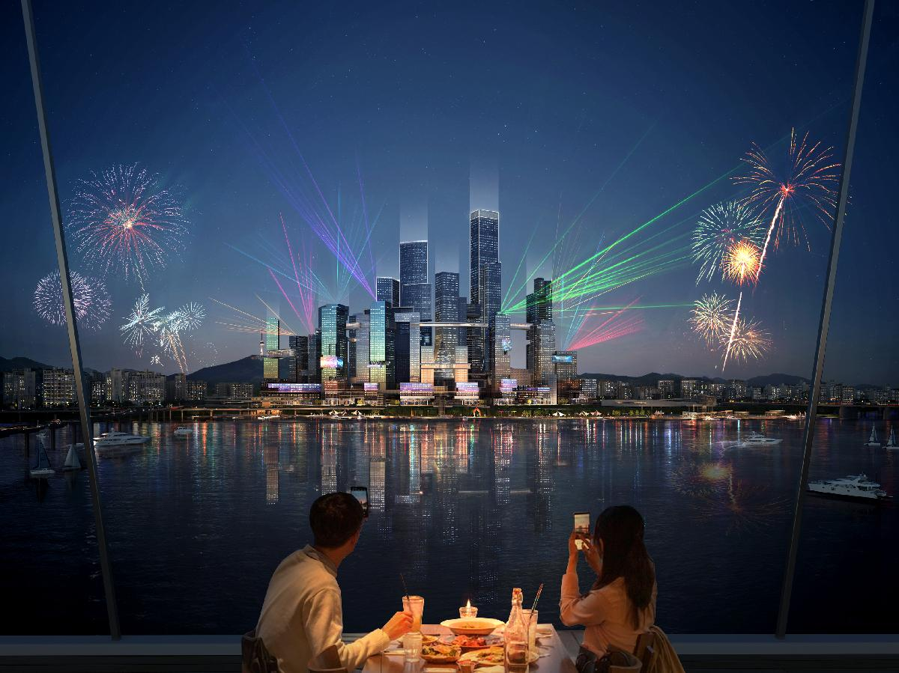

**Develop a Smart and Innovative City**. The city government is aiming for YIBD to be a testbed for smart city technologies and innovations, incorporating keywords of a future urban environment in response to global issues such as climate change, pandemics, high-tech mobility, digital transformation, and technological competition. The district will integrate various cutting-edge solutions, including Urban Air Mobility (UAM), Cooperative Intelligent Transportation Systems (C-ITS), Vehicle-to-Everything (V2X) communication, Local Dynamic Maps (LDM), smart logistics, home healthcare systems, Online-to-Offline (O2O) services, digital twin-based disaster prevention systems, drone-based firefighting systems, energy self-sufficiency tech, smart eco-systems, resource circulation, and smart grids with energy storage systems (ESS). These technologies will optimize urban operations, enhance sustainability, and improve the quality of life for residents and workers, positioning the YIBD as a hub for innovation and collaboration.

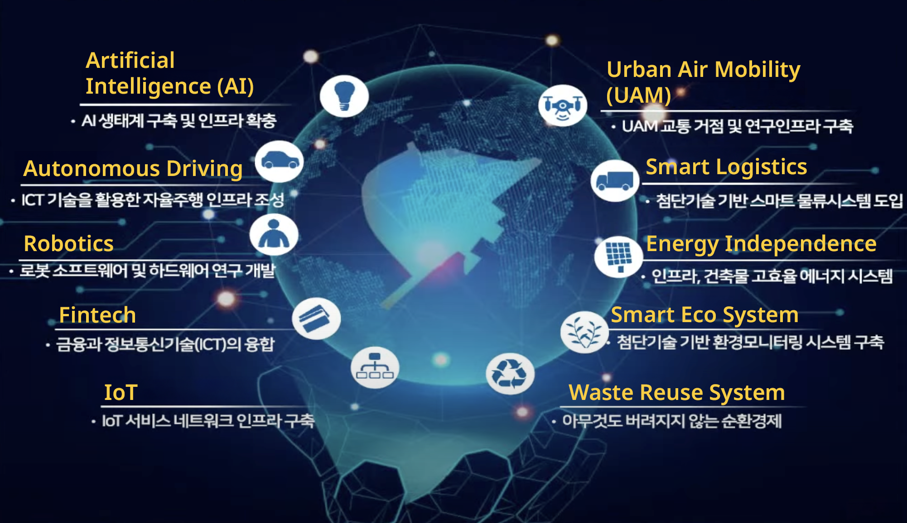

**Establish a Comprehensive Three-Dimensional Transportation Network**. The YIBD will prioritize the development of a comprehensive and efficient transportation system, designed as a three-dimensional network integrating walkways and various modes of transport seamlessly. The main structure consists of pedestrian streets at ground level, autonomous shuttles and personal mobility devices on the first underground level, and a transportation network on the second and third underground levels connecting the district internally and externally. UAM services will provide aerial transportation options, connecting the YIBD to key locations. Advanced intelligent urban transportation systems like C-ITS and V2X communication will optimize traffic flow and enhance road safety.

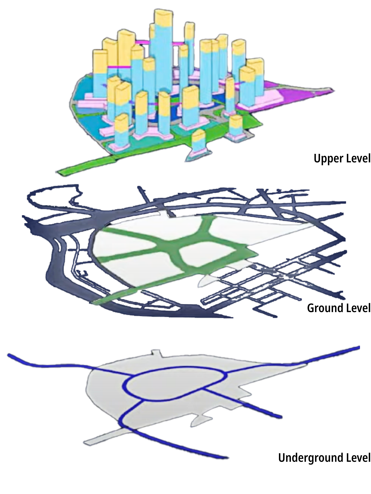

**Create a Green and Eco-Friendly Urban Environment**. The YIBD will also focus on creating a pleasant and eco-friendly living environment by incorporating an extensive network of green spaces, parks, and open areas, reaching approximately the same area as the project's footprint (around 500,000 square meters) by utilizing the entire space three-dimensionally from underground to ground level and up to the upper levels.

The plan is to secure 20% of the total YIBD area as parks and green spaces, utilize 30% as open green spaces using private public spaces, and secure the remaining 50% or so through green terraces, rooftop and facade greening. The green spaces will be connected to Yongsan Park and the Han River through pedestrian networks, transforming Yongsan into a city filled with green ecological spaces.

In South Korea, the Seoul Metropolitan Government's architectural review process for securing such green spaces is particularly strict, as the conditions for building height and building-to-land ratio are tied to the secured green area (in some cases, there may even be disadvantages to the development). Currently, it is estimated that plans for incentives related to green areas are being established by the Seoul Metropolitan Government and are expected to be finalized and delivered to each cooperation before the completion of base infrastructure construction in 2028.

## Key Characteristics

<!--  How is the project organized into specific activities that advance these goals? For plans: How does the plan address each of the three activities in digital master plans (development, engagement, implementation). For districts: How does the district employ 3-5 of the key characteristics of innovation hubs?
-->

**Comprehensive Mixed-Use Development**. The YIBD project takes a comprehensive approach to urban development, integrating various land uses and functions to create a vibrant and sustainable district. The project encompasses residential, commercial, cultural, and recreational spaces, as well as advanced infrastructure and amenities.

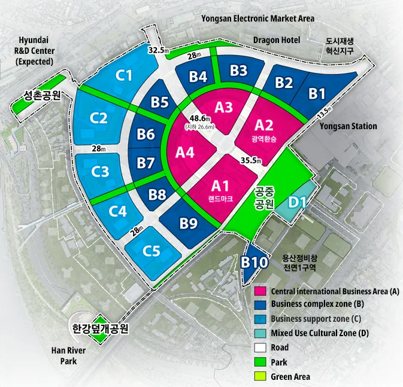

1. **The central international business area** aims to attract global ICT companies, with a mix of functions including international business, exhibition and convention, commercial, cultural, and transportation. The upper floors will feature international business facilities, hotel residences, luxury business hotels, and observatory. The lower floors will include exhibition and convention spaces, art museums, complex cultural libraries, and rest areas.
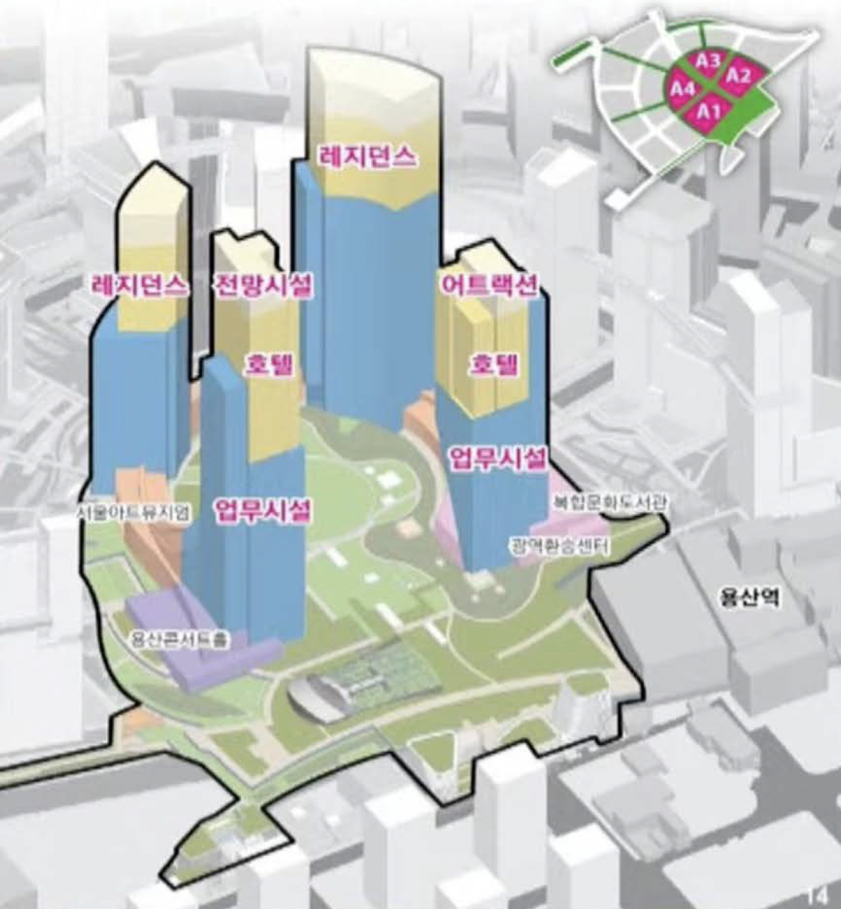
1. **The business complex zone** surrounding the central international business area will focus on ICT-based industry, with over 50% of the area dedicated to businesses area(ICT, AI, big data, etc.) and less than 30% for residential use, targeting foreign or company employees. This zone will synergize with the nearby Yongsan Electronics Market and Hyundai R&D Center, creating an innovation cloud.
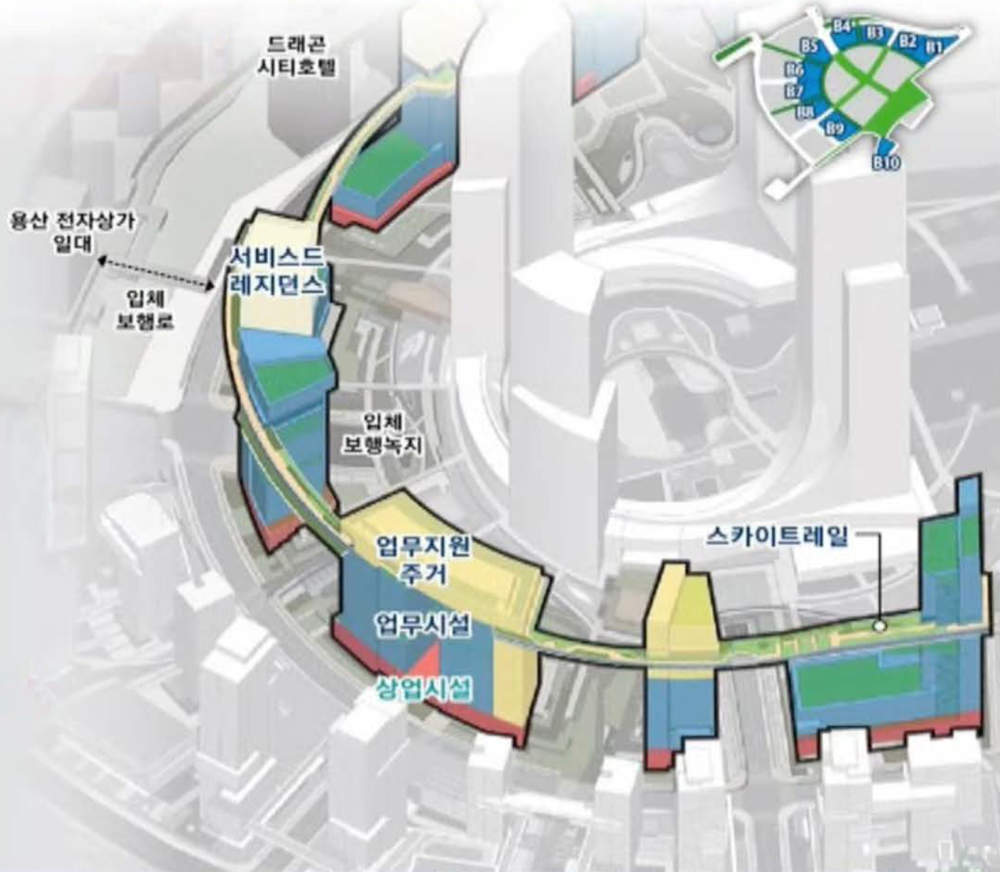
1. **The business support zone** will be utilized for educational facilities and internal/external resident support functions, with around 30% allocated for domestic and foreign companies' business spaces and approximately 50% for residential use by company employees and the general public. This comprehensive mixed-use development approach aims to create a high-density, complex urban environment where people can enjoy work, housing, leisure, and relaxation within a walkable daily life zone (radius of about 600 meters).
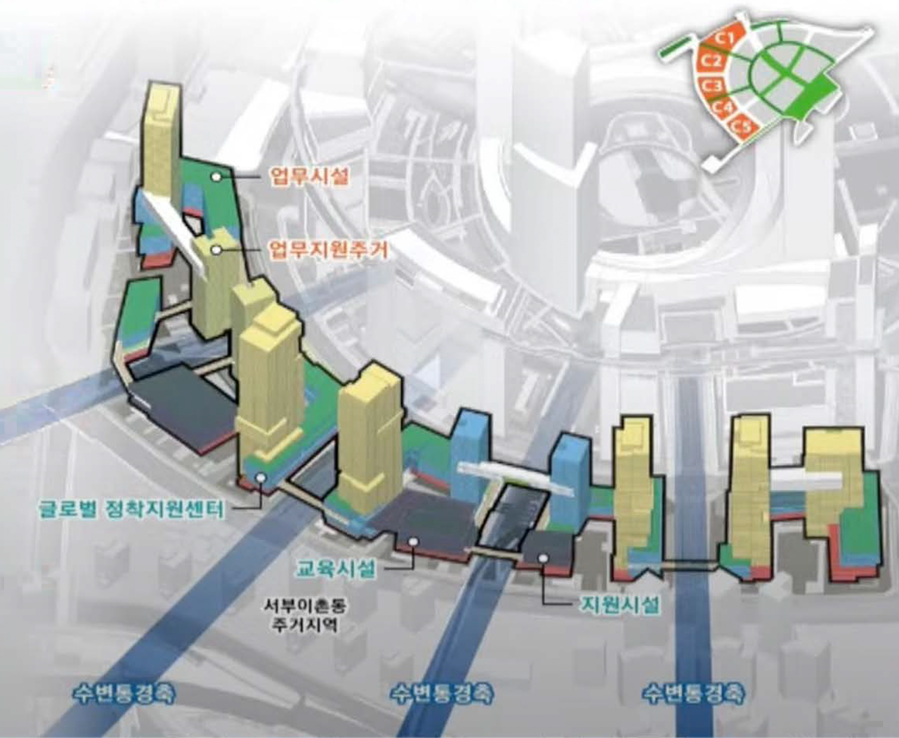

**Public-Private Partnership and Governance Engagement**. The YIBD project is being implemented through a collaborative public-private partnership model, leveraging the strengths and resources of both sectors. The project's governance structure involves a stable project promotion system that clearly defines the roles and responsibilities of public and private stakeholders.

1. **The public sector**, including the Seoul Metropolitan Government, Korail, and SH Corporation, will focus on infrastructure construction (approximately 5 trillion won in public funds), anchor site development, and creating the foundation for development.
2. **The private sector** will then complete the remaing development. A dedicated organization tentatively named the 'Yongsan Development Agency' will be established to ensure stable project promotion, with SH Corporation (public developer, 30% of the investment) and Korail (land owner, 70% of the investment) as joint venture partners (MOU signed in May 2021). This partnership approach ensures effective coordination, risk-sharing, and alignment of interests, enabling the successful planning, financing, and execution of the project.

**Smart City Technologies and Infrastructure Implementation**. The YIBD project places a strong emphasis on deploying cutting-edge smart city technologies and infrastructure to enhance urban services, connectivity, and user experience. This includes the integration of advanced mobility solutions, Internet of Things (IoT) sensors, digital twin systems, and smart grids. The district will establish a smart city integrated system, featuring a smart logistics system and an integrated city management system. A city-integrated energy management center will utilize digital twins for intelligent energy and environmental management. Mobility as a Service (MaaS) will be introduced, providing a one-stop integrated service connecting all transportation modes. The district will also apply LEED certification, being the first area-wide certification framework (LEED ND SEOUL) [1] in South Korea, aiming to create an eco-friendly, carbon-zero district. A 'cool town' will be created by implementing measures to reduce urban heat island effects and energy consumption through green cooling, blue cooling, and white cooling.

**Innovation and Entrepreneurship Support**. The YIBD project aims to foster innovation and entrepreneurship by providing a supportive ecosystem for startups, businesses, and research institutions. Dedicated innovation spaces, such as incubators, accelerators, and co-working facilities, will be developed to offer resources, mentorship, and networking opportunities. The district will promote collaboration between industry and academia, facilitating joint research projects, technology transfer, and talent development programs to drive the commercialization of new technologies and solutions. The business complex zone will create an innovation cloud linked to the Hyundai R&D Center, and Yongsan Electronics Market fostering digital industry businesses related to ICT, artificial intelligence, and big data. Not only these facilities, but also global support centers for ventures and startups are also planned.

## Stakeholders
<!--  Who initiated the project? Who is leading the project forward? Who else has a say in how it unfolds? Who is directly affected but marginalized? Identify 3-5 key stakeholder organizations or groups. Identify 3-5 key individuals. These are people who are associated with the project as leaders, supporters, critics, or regulators. They are likely to be members of the stakeholder groups identified above. These are people you should try to contact for one or more interviews.-->

**Seoul Metropolitan Government**. The Seoul Metropolitan Government, led by Mayor Oh Se-hoon, plays a pivotal role in overseeing the planning, development, and regulatory aspects of the YIBD project. Within the Seoul Metropolitan Government, the Seoul Metropolitan Future Space Planning Office's Yongsan International Business District (YIBD) Development Team is directly responsible for various tasks, including establishing and managing the urban development zone and plans, supporting district unit planning and public sector guidelines, managing business feasibility and public contribution plans, organizing the Master Planner group and advisory committee, handling transportation improvement measures and disaster impact assessments, overseeing the introduction of new transportation systems, managing practical affairs and civil complaints, developing guidelines for surrounding areas, establishing the integrated support ordinance, and handling organizational restructuring and workforce planning. The Seoul Metropolitan government aims to guide the city to successfully transform into a smart city and to coordinate with each company to adjust the degree of tech intervention. In particular, the Government uses strategies such as varying incentives according to the technology being used, and through this, it establishes administrative guidelines and incentives to encourage the city to successfully integrate the aforementioned technologies. [Seoul Metropolitan Government](https://english.seoul.go.kr/), [Seoul Metropolitan Future Space Planning Office's YIBD Development Team](https://newsearch.seoul.go.kr/ksearch/search.do?kwd=용산국제업무지구)
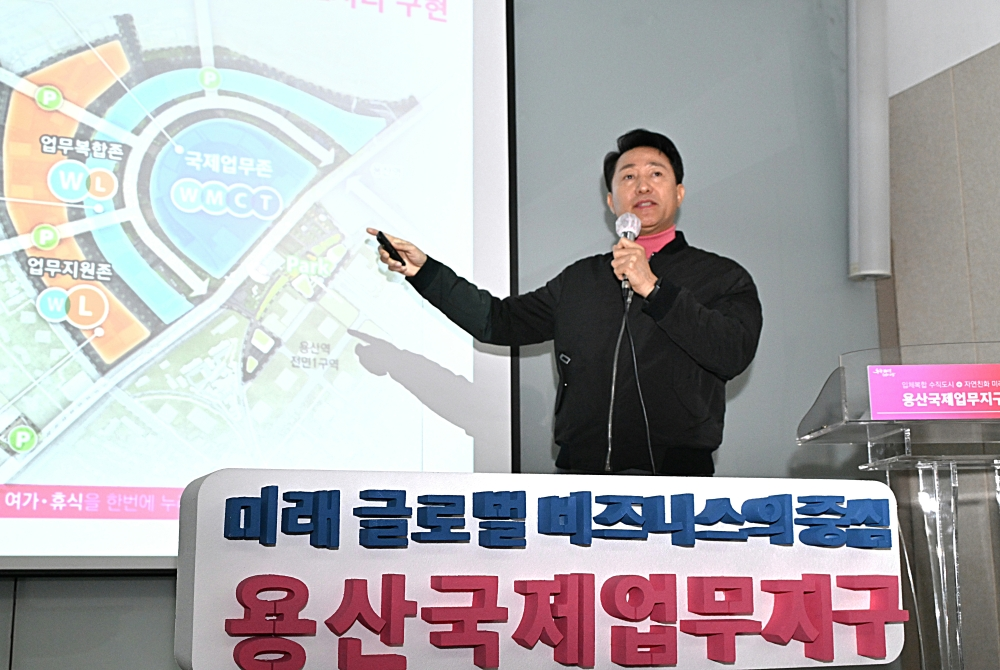

**Korea Railroad Corporation (Korail)**. Korail, the national railway operator, is a key stakeholder in the YIBD project, owning a significant portion of the land within the project area. It plays a crucial role in the development process by contributing its land holdings and ensuring the integration of the district with the existing and future transportation infrastructure. [Korea Railroad Corporation](https://info.korail.com/infoeng/index.do)

**Seoul Housing & Communities Corporation (SH Corporation)**. SH Corporation, a public corporation owned by the Seoul Metropolitan Government, is actively involved in the YIBD project, focusing on the development of the base infrastructure for YIBD, including the anchor building, housing, and community facilities within the district. SH Corporation plays a crucial role in the public-private partnership, contributing 30% of the investment as a joint venture partner in the 'Yongsan Development Corporation'. SH Corporation's experience in creating sustainable and vibrant cityscapes will be beneficial in shaping the YIBD's overall development processes, especially residential areas fostering a strong sense of community and social cohesion. [Seoul Housing & Communities Corporation](http://www.i-sh.co.kr/eng/index.do)

**Yongsan Development Corporation**. The Yongsan Development Corporation is a public-private partnership established to manage the development and operation of the YIBD. It serves as the main implementation body for the project, coordinating with investors, developers, and local authorities. The corporation is responsible for attracting international businesses and investment, overseeing the construction process, and ensuring the project's financial viability. As a joint venture between Korail (70% stake) and SH Corporation (30% stake), the Yongsan Development Corporation leverages the expertise and resources of both public and private sectors to drive the successful implementation of the YIBD project. It also works closely with the Seoul Metropolitan Government and other stakeholders to streamline administrative processes, facilitate regulatory approvals, and ensure the timely completion of the project. The Yongsan Development Corporation's effective management and coordination are critical to the overall success of the YIBD.

**Private Companies**. The YIBD project actively engages private companies, particularly those that will play a crucial role in constructing the remaining parts of the district after the base infrastructure is developed by the Seoul Metropolitan Government, Korail, and SH Corporation. Once the public sector stakeholders complete the essential infrastructure construction, private developers and investors will take the lead in developing the commercial, residential, and recreational components of the YIBD. They will be responsible for designing and constructing state-of-the-art office buildings, hotels, retail spaces, entertainment venues, and high-end residential complexes that align with the district's vision and master plan.

The involvement of private companies is expected to ensure that the YIBD's development incorporates the latest market trends, technological advancements, and sustainable design principles. These private sector partners will work closely with the Yongsan Development Corporation and the Seoul Metropolitan Government to ensure that their projects adhere to the established guidelines, contribute to the overall cohesiveness of the district, and meet the needs of future tenants and residents.

These private companies will be the ones to implement tech interventions. In line with the guidelines established by the Seoul Metropolitan Government, each company will comprehensively review how much urban technology they will implement to receive incentives such as increased floor height. They will strategically implement the technology intervention into the infrastructure that the Seoul Metropolitan Government, Korail, and SH Corporation will complete by 2028.

**Local Community and Civic Groups**. The local community and civic groups in the Yongsan area, including Yongsan Electronics Market stakeholders, residents of nearby apartments, and Yongsan Station operators, have a significant stake in the project's impact on their neighborhood. They have been actively involved in discussions and negotiations with the project stakeholders to voice their concerns and ensure that their interests are considered. Key issues raised by the community include potential displacement, gentrification, and changes to the urban fabric. Besides the concerns, the inclusion of Yongsan Electronics Market stakeholders in the planning process is expected to help create synergies between the existing commercial ecosystem and the new international business district, due to the massive number of consumers visiting the market. The engagement of apartment residents and Yongsan Station operators ensures that the YIBD's development takes into account the concerns and aspirations of the local community.

## Interview

The interview process involved several key stakeholders from the Seoul Metropolitan Government and the Future Space Planning Office's YIBD Development Team. These interviews provided valuable insights and perspectives on the Yongsan International Business District (YIBD) development project, highlighting both positive aspects and potential challenges.

**Positive Perspectives**. The interviewees noted that the YIBD project stood out as the first in Seoul to pursue LEED ND certification, demonstrating a commitment to sustainability and green building practices. The finalization of the site ownership issue, with Korail as the property owner, had cleared a significant hurdle for the project's progress. The project's adaptability to changing urban technologies and trends was another positive aspect emphasized. Given the substantial investment in the YIBD, there was considerable pressure to successfully manage and execute the project, as it represented one of the largest undertakings in Seoul's history.

**Challenges and Research Areas**. Despite the project's ambitious goals, the interviews also revealed uncertainties and challenges. The most significant challenge identified during the interviews was not disclosed in the provided excerpts. The interviewees highlighted several crucial research areas and questions related to the YIBD project:

1. **Integration of Smart Technologies in Three-Dimensional Strategy**. The clear direction and rationale behind the approach of integrating smart technologies in a three-dimensional strategy that connected mobility with buildings required further investigation, particularly the emphasis on mobility within the smart district.

2. **Preventive Measures for Technology Implementation**. As the YIBD was located in an area with the highest real estate demand in Seoul, there were concerns that companies might prioritize profits over technology implementation. Identifying preventive measures and strategies to ensure the adoption of tech interventions was deemed crucial.

3. **Types of Companies Engaged**. Gaining insight into the types of companies that would primarily engage in the project's development was considered essential for understanding the project's potential trajectory and outcomes.

**Evaluation and Integration of Technology**. Rather than utilizing a centralized evaluation framework, smart city assessments were being outsourced to external partners by companies. This decentralized approach raised concerns about the systematic and long-term integration of technology.

South Korea's urban planning typically aligned with national plans, and for long-term smart city development, the outsourcing model through external partners was more prevalent than relying on dedicated government research agencies. The government's aim to raise the traffic load for YIBD was part of a comprehensive strategy to address transportation challenges in the area.

**Enforcement of Smart Tech Interventions**. In the South Korean context, enforcing smart tech interventions was expected to occur during the architectural review process. The government incentivized technology integration by tying development benefits, such as floor area ratios and green space requirements, to the adoption of smart city features. The interviewees stressed the importance of reviewing the process of driving smart city adoption to ensure it aligned with public interests and generated positive outcomes for the community.

## Technology Interventions
<!--  What specific technology-enabled interventions does the project propose? Identify 3-5 technology interventions. Describe use cases, value proposition, solution architecture, data created or consumed, key platforms and standards, business models, regulatory issues, etc. Separate into more than 1 paragraph as needed. This is a good place to insert additional images, be sure to include captions identifying the source and make sure to not use copyrighted images. -->

**Smart City Integrated System**. The YIBD plans to implement a comprehensive smart city integrated system to optimize urban operations, enhance sustainability, and improve the quality of life for residents and workers. This system will encompass various components, including:

1. Smart Logistics System: The district will deploy an advanced smart logistics system to streamline the movement of goods and services within the area. This system will leverage IoT sensors, real-time data analytics, and automated delivery solutions to optimize supply chain management, reduce congestion, and improve efficiency. Smart lockers, autonomous delivery robots, and intelligent routing algorithms will be employed to facilitate seamless and eco-friendly last-mile delivery services.
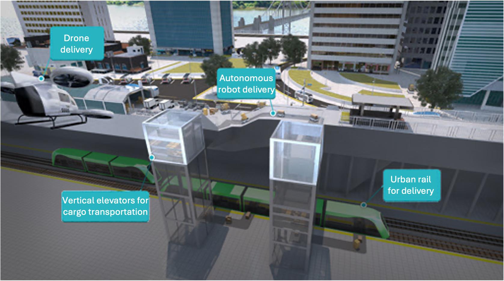
2. Integrated City Management System: The YIBD will establish an integrated city management system that utilizes digital twin technology for intelligent energy and environmental management. This system will create a virtual replica of the district's infrastructure, buildings, and assets, enabling real-time monitoring, predictive maintenance, and optimized resource allocation. The digital twin will simulate various scenarios, such as traffic flow, energy consumption, and emergency response, to support data-driven decision-making and enhance the district's resilience.
3. Mobility as a Service (MaaS): The district plans to introduce a comprehensive MaaS platform that integrates all transportation modes into a single, user-friendly interface. Residents and visitors will be able to access a wide range of mobility options, including public transit, autonomous shuttles, shared bicycles, and e-scooters, through a unified mobile application. The MaaS platform will provide real-time information, route planning, and seamless payment options, promoting a shift towards sustainable and convenient transportation choices.
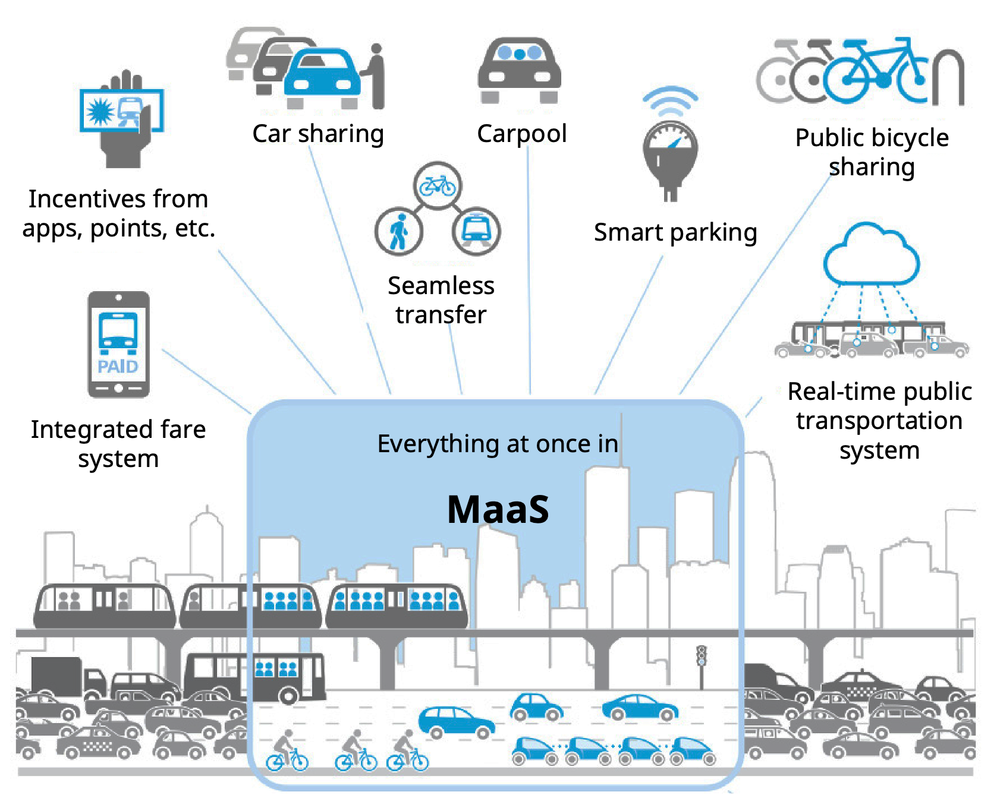

**Comprehensive 3D Transportation Network**. The YIBD will feature a comprehensive three-dimensional transportation network, integrating various mobility solutions:

- Pedestrian streets at ground level
- Autonomous shuttles and personal mobility devices on underground level 1
- Underground transportation network (levels 2-3) for internal/external connectivity
- Urban Air Mobility (UAM) services for aerial transportation

The district will also incorporate green spaces for ground-level walking and loop-shaped underground roadways.

**Intelligent Transportation Systems (ITS)**. The YIBD will deploy advanced intelligent transportation systems, as illustrated in Figure 7, to optimize traffic flow, enhance safety, and improve the overall mobility experience. These systems include:

- Cooperative Intelligent Transportation System (C-ITS): Intelligently connecting the car to surroundings and cloud
- Vehicle-to-everything (V2X) communication for vehicle-to-vehicle/infrastructure data exchange
- Local Dynamic Map (LDM): Providing real-time traffic information and safety alerts
- Adaptive traffic control using IoT sensors and real-time data
- C-ITS for optimizing traffic signal timings based on real-time conditions

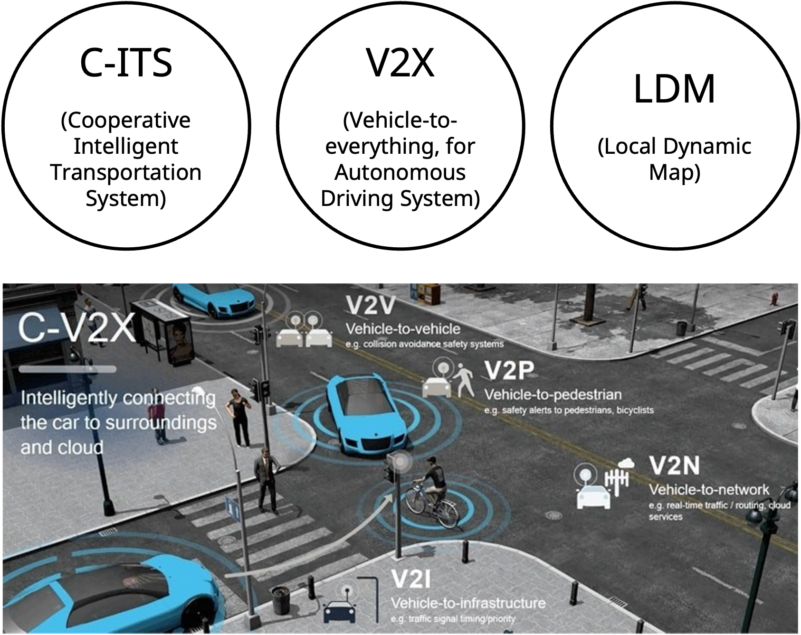

By integrating these intelligent transportation systems, the YIBD aims to create a smart, efficient, and safe mobility ecosystem that leverages cutting-edge technologies to enhance the transportation experience for residents and visitors alike.

**Sustainable Technologies**. The YIBD will incorporate cutting-edge sustainable building technologies to minimize the district's environmental impact and promote occupant well-being. These interventions include:

1. Seoul-framework LEED Certification (LEED ND SEOUL): The district will adopt the Seoul-framework LEED certification system, known as LEED ND SEOUL, which is a localized version of the internationally recognized Leadership in Energy and Environmental Design (LEED) standard. This certification system will guide the development of eco-friendly, energy-efficient, and sustainable buildings throughout the district. It will encompass criteria such as green building materials, water conservation, indoor environmental quality, and renewable energy integration.
2. Cool Town Strategies: The YIBD will implement a range of cool town strategies to mitigate urban heat island effects and reduce energy consumption. These strategies include:
   1. Green Cooling: The district will incorporate green walls, green roofs, and cooling fog systems in landscaped areas to provide natural cooling effects and improve air quality.
   2. Blue Cooling: Blue infrastructure, such as water features, permeable pavements, and rainwater harvesting systems, will be integrated into the district's design to manage stormwater, reduce urban flooding risks, and create a cooling effect through evaporation.
   3. White Cooling: The district will utilize high-reflectivity materials, such as cool roofs and cool pavements, to reflect solar radiation and minimize heat absorption, thereby reducing the cooling energy demand of buildings.
3. Active and Passive Building Design: The YIBD will promote the adoption of active and passive building design principles to optimize energy efficiency and occupant comfort. Passive design strategies, such as natural ventilation, daylighting, and thermal mass, will be employed to reduce the reliance on mechanical systems. Active design features, including smart building automation, energy recovery systems, and advanced insulation materials, will further enhance the performance and sustainability of the district's buildings.
4. Renewable Energy Utilization: The YIBD will incorporate renewable energy systems, such as geothermal and fuel cells. Smart grids and zero-energy buildings will be actively adopted. The planned introduction of renewable energy sources includes 10% solar thermal, 25% fuel cells, and 65% from geothermal and other sources.

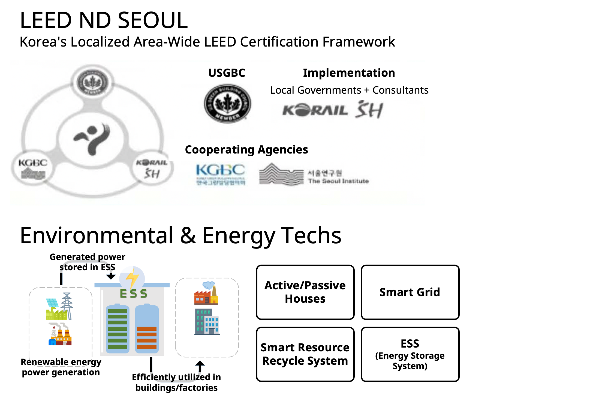

**Smart Safety and Security Systems**. The YIBD will deploy advanced smart safety and security systems to ensure the well-being and protection of residents, workers, and visitors. These systems will use IoT sensors, artificial intelligence, and real-time data analytics to enhance situational awareness, prevent incidents, and facilitate rapid response in case of emergencies. Key interventions include:

1. Intelligent Video Surveillance: The district will implement an intelligent video surveillance system that utilizes computer vision and machine learning algorithms to detect anomalies, suspicious activities, and potential security threats. The system will automatically alert security personnel and law enforcement agencies, enabling proactive monitoring and swift incident response.
2. Smart Fire Detection and Response: The YIBD will install smart fire detection and response systems in buildings and public spaces. These systems will employ advanced smoke and heat sensors, as well as data analytics, to detect fire incidents early and trigger automated fire suppression mechanisms. The system will also provide real-time information to emergency responders, facilitating rapid evacuation and minimizing damage.
3. Digital Twin for Emergency Management: The district's digital twin platform will be utilized for emergency management and response planning. The virtual replica of the YIBD will simulate various emergency scenarios, such as fires, accidents, and natural disasters, to identify vulnerabilities, optimize evacuation routes, and enhance the coordination of emergency services. This technology will enable data-driven decision-making and improve the district's resilience in the face of potential crises.

**Smart Waste Management**. The YIBD will implement a smart waste management system to optimize waste collection, reduce environmental impact, and promote a circular economy. The system will leverage IoT sensors, data analytics, and automated waste collection technologies to streamline waste management processes and improve resource efficiency. The district will establish smart recycling systems that utilize advanced sorting technologies, such as optical sensors and robotics, to automatically separate and process recyclable materials. These facilities will improve the efficiency and accuracy of the recycling process, reduce contamination, and maximize resource recovery.

By implementing these technology interventions, the YIBD aims to create a sustainable, efficient, and future-oriented urban environment that leverages smart city principles and cutting-edge technologies. However, the successful integration of these solutions will depend on effective planning, collaboration among stakeholders, and the ability to adapt to evolving urban technologies and trends. Under the leadership of Mayor Oh Se-hoon, known for his development-oriented policies, the YIBD project has the potential to showcase Seoul's commitment to smart city development and serve as a model for future urban projects in the region.

## Financing
<!--  How are the technology interventions identified to be financed? How does this fit into financing of the larger project? Identify at least one financing mechanism that is being used. -->

**Public-Private Partnership (PPP)**. The YIBD project is being financed through a public-private partnership model, where the Seoul Metropolitan Government collaborates with private investors and developers to fund and deliver the project. This approach allows the government to share the risks, leverage private sector expertise, and attract international investment. The public sector, including Korail and SH Corporation, will invest in the project through a joint venture (MOU signed in May 2021) to establish a dedicated organization tentatively named the 'Yongsan Development Agency' for stable project promotion.

This strategy seems to have been introduced by the Seoul Metropolitan Government and related public enterprises to ensure the project's success, learning from the previous failure caused by external factors such as the Lehman Brothers crisis. This business method has been widely experimented with in Korea, starting from the Songdo International City, and there are sufficient successful cases to reference, making it a good strategy. Not only this project but also the Seoul Station North Area Development Project is being promoted using the same business method.

**Government Funding and Incentives**. The Seoul Metropolitan Government provides funding and incentives to support the development of the YIBD, such as tax breaks, subsidies, and infrastructure investments. These measures aim to attract private investment and ensure the project's financial viability. The land use ratio for non-residential (commercial, business, etc.) will be over 70%, and infrastructure will account for around 40% to secure publicness. The floor area ratio will be revised to allow exceeding the legal upper limit by designating a minimum regulation zone to induce creative architectural planning.

## Outcomes
<!-- What results has the project produced to date? What outcomes and impacts are anticipated? Identify 3-5 (anticipated) outcomes. What will/has the project achieved? Thes should not be the same or repeated from elsewhere. Use this space to emphasize something different. -->

**Technological Innovation and Knowledge Sharing**. The YIBD will foster a culture of innovation and collaboration by bringing together businesses, research institutions, and startups. The district's infrastructure and programs will support R&D activities, knowledge sharing, and technological advancements, positioning Seoul as a leading innovation hub in the region. The integration of smart city technologies, such as IoT sensors, digital twin systems, and intelligent transportation systems, will create a data-driven, responsive urban environment that optimizes urban operations and improves the quality of life for residents and workers. The district will serve as a testbed for pioneering smart city solutions, attracting innovative companies and research institutions to collaborate and develop future-oriented technologies.

**Enhanced Urban Livability**. The YIBD aims to create a high-quality urban environment that offers a superior living and working experience for residents and employees. The district's mixed-use development, green spaces, and amenities will contribute to improved livability, social cohesion, and overall well-being. The integration of sustainable design principles, such as green building certification, renewable energy systems, smart waste management, and water conservation measures, will minimize the district's environmental impact and promote a sustainable urban ecosystem. The extensive network of green spaces, parks, and open areas, covering approximately 30% of the total land area, will enhance the quality of life for residents and visitors, providing opportunities for recreation, relaxation, and social interaction.

The YIBD's comprehensive three-dimensional transportation system will significantly enhance connectivity within the district and to the rest of Seoul. The introduction of advanced transportation modes, such as shared transportation, autonomous shuttles, and Urban Air Mobility (UAM), is a prime example. By establishing a new airport railway starting from Yongsan Station and expanding public transportation infrastructure, the goal is to increase the public transportation share in the Yongsan area from the current 57% to 70%. The seamless integration of various modes of transport, including pedestrian walkways, autonomous shuttles, personal mobility devices, and underground transportation networks, will provide efficient and convenient mobility options for residents, workers, and visitors. Advanced intelligent transportation systems, such as C-ITS and V2X communication, will optimize traffic flow, improve road safety, and create a smooth, efficient transportation experience for all users. Overall, the YIBD's transportation network will set a new standard for smart city mobility, enhancing connectivity, reducing congestion, and improving the quality of life for residents and visitors alike.

**Economic Growth and Job Creation**. The YIBD is expected to contribute significantly to Seoul's economic growth by attracting foreign direct investment, creating new jobs, and boosting the city's competitiveness in the global market (with an estimated 66,000 resident/working population per day, 265,000 visitors/users per day, employment induction effect of 146,000 jobs, production induction effect of 32.6 trillion won, income induction effect of 2.9 trillion won, and value-added induction effect of 13.4 trillion won, based on the Bank of Korea's Input-Output Tables (2019)). The district's development is projected to generate thousands of employment opportunities in various sectors, including finance, technology, and services. The establishment of a global business center, convention and exhibition facilities, and a vibrant retail and entertainment environment will drive economic activity and create a successful international business community.

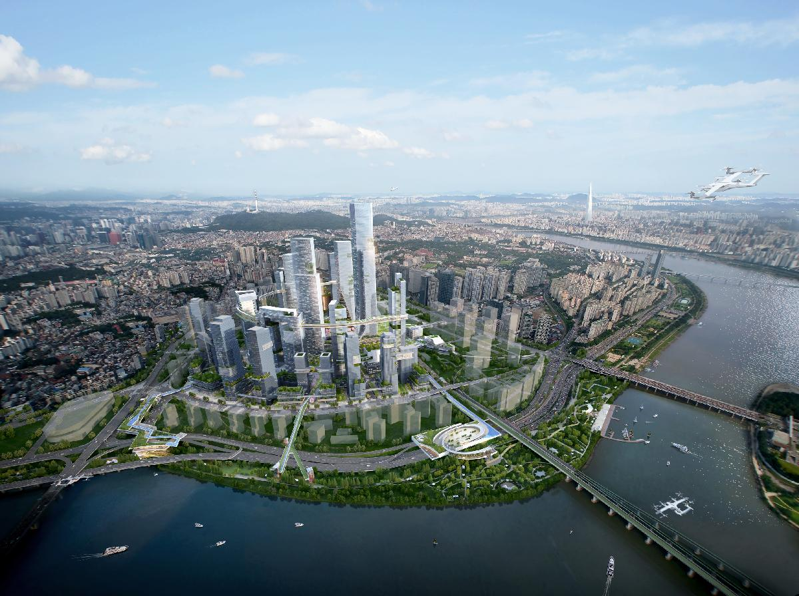

## Open Questions
<!-- What is uncertain, unclear, or still unresolved about this project? Identify 1-3 open question(s). -->

**1. Balancing Economic Viability and Technological Integration**: One of the key uncertainties surrounding the YIBD project is the ability to handle the balance between economic viability and the successful integration of smart city technologies. As the district is located in an area with high real estate demand, there may be pressure on private companies to prioritize profitability over the implementation of cutting-edge technologies. It remains to be seen how the project stakeholders will navigate this challenge and ensure that the YIBD achieves its goal of becoming a showcase for smart city development while maintaining its financial feasibility.

**2. Long-term Adaptability and Resilience**: Another open question is the YIBD's ability to adapt and remain resilient in the face of rapidly evolving technologies and changing urban needs. As the project has a long development timeline, spanning from 2025 to 2039, it is crucial that the district's infrastructure and systems are designed with flexibility and future-proofing in mind. The success of the YIBD will depend on its capacity to accommodate new technologies, respond to shifting market demands, and maintain its relevance as a smart city hub over the long term.

**3. Connectivity between the Newly Developed YIBD Area and the Adjacent Urban Area**: A significant open question is about the integration and connectivity between the newly developed YIBD area and the existing urban districts. As the YIBD is being built within an established urban context, it is essential to ensure that the district seamlessly merges with its surroundings, both physically and socially. This involves creating efficient transportation links, pedestrian-friendly connections, and coherent urban design that respects the local character and heritage. Moreover, the project must foster synergies between the new development and the adjacent neighborhoods, encouraging social interaction, economic spillovers, and a sense of community cohesion. Achieving this harmonious integration will be a critical challenge for the YIBD project, as it seeks to create a vibrant and inclusive urban environment that enhances the overall quality of life in the area.

## References

---

### Primary Sources

<!-- 3-5 project plans, audits, reports, etc. -->

- [1] Seoul Metropolitan Government. "Yongsan International Business District Zoning and Development Plan", Feb. 2024.
- [2] Seoul Metropolitan Government. "Yongsan International Business District Development Concept", Jul. 2022.
- [3] [Seoul Metropolitan Government. 2040 Seoul Metropolitan Master Plan, Feb. 2023](https://urban.seoul.go.kr/UpisArchive/DATA/PWEB/STATIC/2040_seoul_plan.pdf)
- [4] [Seoul Metropolitan Government. 2030 Seoul Metropolitan Master Plan, Apr. 2014](https://urban.seoul.go.kr/UpisArchive/DATA/PWEB/STATIC/1_seoul_plan.pdf)

### Secondary Sources

<!-- 5-7 secondary source documents: news reports, blog posts, etc.. -->

- [5] Kakao Mobility. “2023 KakaoMobility Report, the Road Not Taken.” 2023 KakaoMobility Report , KakaoMobility, 12 Apr. 2024, <https://report.kakaomobility.com/archive/2023-report>.
- [6] “Full-Scale Promotion of Transitioning to a Digital Logistics System - Building and Supporting a Smart Logistics System.” Selection of 6 Support Projects, Including 4 Logistics Service Demonstrations and 2 Logistics Pilot City Development Projects, Ministry of Land, Infrastructure and Transport, 3 Mar. 2022, <https://m.molit.go.kr/viewer/skin/doc.html?fn=6086bad5957a085a619c61aa17fcc500&rs=%2Fviewer%2Fresult%2F20220303>.
- [7] Yun, Hyeok-ryul, and Hyeon-gu Ki. “Introduction Plan for Seoul-Type Integrated Transportation Service (MaaS).” The Seoul Institute, 9 Sept. 2019, <https://www.si.re.kr/node/62422>.
- [8] Seoul Metropolitan Government. Seoul Metropolitan Government to Collaborate with Global Eco-Friendly Certification Authorities... Creating ’Seoul-Type LEED, 20 Sept. 2023, <https://www.seoul.go.kr/news/news_report.do#view/396887?tr_code=snews>.
- [9] Jeon, Jeong-hun. “Yongsan International Business District to Break Ground in ’25... Planned as a Green Vertical City.” <https://Www.Seoul.Go.Kr/News/News_report.Do#view/404852?Tr_code=snews>, Seoul Metropolitan Government, 5 Feb. 2024, english.seoul.go.kr/?SSid=101_01.
- [10] “Yongsan International Business District to Break Ground in 2025.” YouTube, Seoul Metropolitan Government, 5 Feb. 2024, <https://www.youtube.com/watch?v=-wiKmTe6a0k&t=355s>.
