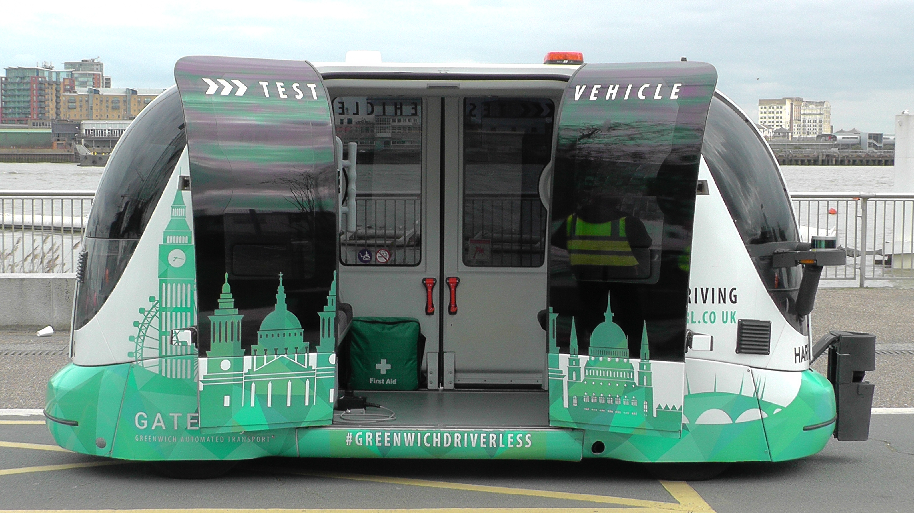

## Overview

The Smarter London Together Plan is an ambitious roadmap developed by the Greater London Authority (GLA) and the Mayor of London (Sadiq Khan) to make London a global leader in smart city technology. The plan focuses on improving digital leadership, fostering citywide collaboration, enhancing digital services, empowering Londoners with digital skills, and advancing data infrastructure. This strategy aims to harness the potential of technology and data to improve London's economy, environment, and quality of life for its residents. The roadmap builds on the last Smart London Plan in 2013 (updated in 2016) and is a new approach based on collaborative missions (with the 33 local boroughs).

## Key Characteristics

<!--  Summarize the most visible essential characteristics of the project. For districts: How does the district employ 3-5 of the key characteristics of New Century Cities? For plans: How does the plan address each of the three activities (development, engagement, implementation) of the digital masterplanning process described in the 2015 Townsend and Lorimer paper?
-->

**Development:** The plan was developed by the Mayor’s Chief Digital Officer and the Smart London Board, initated by a Listening Tour that gathered views from various stakeholders, such as the tech sector, universities, councils, civil society and citizens. The plan also builds on the previous [Smart London Plan from 2013](https://www.london.gov.uk/sites/default/files/smart_london_plan.pdf) and aligns with the seven statutory Mayoral strategies.

**Engagement:** The plan aims to engage citizens and communities better through initiatives such as [Talk London](https://www.london.gov.uk/talk-london/), a 42,000-strong online community where Londoners can share their opinions on various issues; [Crowdfund London](https://www.london.gov.uk/programmes-strategies/shaping-local-places/funding-opportunities/make-london/impact-community-crowdfunding), a digital platform for citizens to propose and fund ideas for their neighbourhoods; and [Civic Innovation Challenge](https://www.london.gov.uk/programmes-strategies/arts-and-culture/mayor-londons-civic-innovation-challenge), a programme that matches tech startups with public bodies and companies to solve urban challenges.

**Implementation:** The plan sets out five missions with specific actions and initiatives to achieve the vision of making London the smartest city in the world. The plan also proposes new structures and partnerships to support collaboration and innovation across public services, such as the London Office for Data Analytics (LODA) ([superseded by the City Data Analytics Programme](https://data.london.gov.uk/loda/#:~:text=The%20London%20Office%20of%20Data,link%20to%20find%20out%20more.)), the [London Office of Technology & Innovation (LOTI)](https://loti.london/), and the [Connected London programme](https://www.london.gov.uk/programmes-strategies/business-and-economy/supporting-londons-sectors/connected-london). The plan also includes report cards to track progress and impact.

## Goals and Aspirations

<!-- Summarize the most important goals of the project. Replace the placeholder title with a succinct name for the goal. The text should be around 50 words. -->

**User-designed services:** Emphasizing a people-first approach, the Smarter London Together plan advocates for user-centered design in creating digital services. It acknowledges the city's rich diversity, focusing on initiatives like implementing design standards, nurturing digital inclusion, stimulating civic innovation, cultivating civic platforms, and endorsing diversity within the tech industry to create a more inclusive digital landscape.

**New deal for city data:** The plan is committed to employing data in a consolidated, legal, ethical, and secure manner to benefit all Londoners. It encompasses a range of initiatives, such as data analytics, cyber security, data rights, data trusts, and open data. These measures are designed to instill a culture of transparency and responsible data practices, ensuring that data-driven decisions are equitable and considerate of all citizens.

**World-class connectivity and smarter streets:** Aiming for comprehensive gigabit-capable digital connectivity, the Smarter London Together plan prepares the city for the 5G technology roll out. This goal entails mobilising public assets, enhancing public wifi, championing smart infrastructure, and promoting common standards. These initiatives collectively work towards establishing seamless, reliable connectivity across London, enabling the city to remain competitive on the global stage.

**Digital leadership and skills:** The plan prioritizes digital leadership and skills development to make public services more receptive to innovation and enhance citizens' digital skills and understanding. Key initiatives include fostering digital and data leadership, developing workforce digital capabilities, improving computing skills, and leveraging cultural institutions. These measures ensure that the city's populace is well-equipped to participate in the digital economy and navigate an increasingly connected world.

**City-wide collaboration:** The Smarter London Together plan recognizes the importance of city-wide collaboration in driving innovation across public services. To achieve this, it establishes new structures and partnerships, such as the London Office of Technology and Innovation (LOTI), MedTech innovation initiatives, novel tech partnerships, Greater London Authority (GLA) digital delivery, and collaborations with other cities. These initiatives facilitate knowledge sharing and best practices, enabling London to learn from and contribute to the global conversation around smart cities.

## Technology Interventions
<!--  Identify 3-5 specific technology-enabled interventions the project employs or proposes. The text should be around 75-125 words. Separate into more than 1 paragraph as needed. This is a good place to insert additional images, be sure to include captions identifying the source and make sure to not use copyrighted images. -->

**[London Datastore](https://data.london.gov.uk/)**. An open data portal that provides access to over 700 datasets on various aspects of the city, such as transport, environment, health, economy and culture. The portal enables data users to explore, visualise, download and share data for various purposes, such as research, innovation, service delivery and transparency. The portal also hosts data challenges, events and blogs to foster a data community in London. The London Datastore aims to increase data availability, usability and value for the benefit of all Londoners.

")

**[Talk London](https://www.london.gov.uk/talk-london/)**. This is an online platform that allows Londoners to share their opinions and ideas on various topics related to the city’s policies and projects. The platform uses surveys, discussion forums, polls and quizzes to engage citizens and gather feedback. The platform also provides information and resources on the city’s initiatives and challenges. Talk London aims to increase public participation, transparency and accountability in the city’s decision-making process. In 2018 there were 44,000 members and in 2020 almost 11,000 new members joined, more than double the previous 12 months (4,500).

")

**[Smart Mobility Living Lab (SMLL)](https://www.smartmobility.london/)**. The Smart Mobility Living Lab is a pioneering testing environment for connected and autonomous vehicles (CAVs) situated in Greenwich and the Queen Elizabeth Olympic Park. SMLL offers a unique real-world urban setting to trial and develop future mobility solutions, encouraging collaboration between automakers, technology providers, and researchers. This initiative promotes the safe and efficient integration of CAVs into London's transportation infrastructure, driving innovation in the mobility sector, and paving the way for a more sustainable, efficient, and accessible transportation system in the city.

**Civic Innovation Challenge:** This is a business support programme that matches startups with leading corporates and public organisations to solve some of London’s most pressing problems. The programme invites startups to propose innovative solutions to challenges such as reducing inequality, preventing climate change and supporting ageing population. The programme provides startups with funding, mentoring, testing opportunities and access to potential customers and partners. The programme also showcases the best ideas and solutions to a wider audience. The Civic Innovation Challenge aims to spur innovation from the tech sector and address social challenges in London.

")

**Connected London**. This is a programme that tackles digital connectivity gaps and prepares the city for the roll out of 5G and emerging technologies. The programme mobilises public assets, such as TfL’s network and street furniture, to expand gigabit-capable internet speeds across the city. The programme also supports smart infrastructure projects, such as sensors and cameras, that can enable new applications and opportunities. The programme also promotes common standards and policies for fibre and mobile connectivity in future developments. Connected London aims to improve digital access and inclusion for all Londoners.

")

## Stakeholders
<!--  Identify 3-5 key stakeholder organizations or groups. The text should be around 50 words, and include a link to the organization.-->

**Greater London Authority (GLA):** The GLA is the regional government of London, led by the Mayor and the London Assembly. It is responsible for setting the strategic direction and policies for the city, as well as delivering programmes and services in areas such as planning, housing, environment, culture and economic development. The GLA also leads and coordinates the Smarter London Together plan and its various initiatives and partnerships. [Greater London Authority.](https://www.london.gov.uk/)

**Transport for London (TfL):** TfL is a public body that manages the transport system in London. It is responsible for implementing digital technologies and data innovations to improve mobility, safety and efficiency for travellers and commuters. TfL also provides public assets and infrastructure to support connectivity and smart city projects. [TfL.](https://tfl.gov.uk/)

**London Councils:** London Councils is a cross-party organisation that represents the 32 boroughs and the City of London. It works with the Mayor and other partners to coordinate and deliver public services across London. It also supports initiatives such as London Ventures, London Counter-Fraud Hub and Information Security for London to foster data sharing and collaboration among local authorities. [Local Authorities and Boroughs.](https://www.londoncouncils.gov.uk/)

**Tech sector:** The tech sector comprises of thousands of tech companies, startups, investors, accelerators and innovation hubs that operate in London. It is a major source of economic growth, talent and creativity for the city. The tech sector also provides solutions and products that address urban challenges and improve public services. The Mayor works with various tech organisations such as [TechUK](http://www.techuk.org/), [Tech Nation](https://technation.io/), [London & Partners](http://www.londonandpartners.com/) and [Tech London Advocates](http://www.techlondonadvocates.org.uk/) to engage and support the tech community.

**Universities and research institutions:** London is home to many world-class universities and research institutions that produce cutting-edge knowledge and expertise in data science, artificial intelligence, smart technologies and urban innovation. They also collaborate with public services, businesses and civil society to test and scale new ideas and solutions. Some examples are the [Alan Turing Institute](https://www.london.gov.uk/press-releases/mayoral/mayor-working-to-improve-air-quality-monitoring), [Centre for Urban Science and Progress London](https://www.kcl.ac.uk/informatics/research/cusp-london) and [Catapult](https://catapult.org.uk/).

**Citizens and civil society:** Citizens and civil society are the end-users and beneficiaries of smart city initiatives. They also play an active role in shaping the city’s vision and priorities through platforms such as [Talk London](https://www.london.gov.uk/talk-london/), [Crowdfund London](https://www.london.gov.uk/programmes-strategies/shaping-local-places/funding-opportunities/make-london/impact-community-crowdfunding) and [Civic Innovation Challenge](https://www.london.gov.uk/programmes-strategies/arts-and-culture/mayor-londons-civic-innovation-challenge). They also have rights and expectations regarding data privacy, security and transparency. The Mayor works with civil society organisations such as [Open Data Institute](https://www.theodi.org/), [Nesta](https://www.nesta.org.uk/), [DotEveryone](https://doteveryone.org.uk/) and [others](https://www.london.gov.uk/get-involved) to advance public understanding and trust in data and digital technologies.

## Leadership
<!--  Conduct one interview with a project leader, and link to a LinkedIn or other profile. Provide a brief biography, no more than 75 words. Identify 3-5 insights or themes from the interview. Feel free to add a photo of the individual here. -->

**Stephen Lorimer**. Stephen Lorimer is an accomplished urban planner with a focus on digital transformation and sustainable development. He has co-authored the Greater London Authority's housing design manual and has been recognized for his innovative work on the gamification of planning with the Homes and Communities Agency. As the Smart London Strategy and Delivery Officer at the Greater London Authority, Stephen has played a pivotal role in shaping the city's digital future. [LinkedIn](https://www.linkedin.com/in/stephen-lorimer-7795203/?originalSubdomain=uk)

")

**Insight 1**.
A key insight for cities looking to develop their own smart city initiatives is the importance of leveraging procurement, persuasion, and fundraising to create programs that garner support and resources. By strategically utilizing these tools, cities can attract partnerships from the private sector, academic institutions, and other stakeholders, fostering a collaborative environment for innovation and progress. An example for the Smarter London Together the plan was the Listening Tour, which involved engaging with citizens and collecting their input, this in turn help London gain the trust of the public and ensure that their concerns were addressed. This approach not only amplifies the impact of smart city projects, but also encourages knowledge-sharing and accelerates the pace of urban transformation, ultimately benefiting the communities they serve. By actively involving residents in the decision-making process, cities can create smart city solutions that are not only technologically advanced, but also truly responsive to the needs and desires of the people they are designed to serve.

**Insight 2**.
One key insight from this conversation is the shifting focus of smart city initiatives in London. In the 2013 plan, there was more emphasis on engaging the private sector, particularly SMEs and startups, to develop and deliver innovative technologies and services. However, the 2018 plan, shifted the focus to public sector investments to improve the city for its residents. One notable difference between the two plans is the attention given to infrastructure and broadband connectivity. The 2018 plan recognized the importance of connectivity as a crucial part of the smart city concept, whereas the 2013 plan did not view it as a smart city issue. This change reflects the evolving priorities and understanding of what constitutes a smart city and the role that infrastructure and connectivity play in creating a more inclusive and sustainable urban environment.

**Insight 3**.
In the future of digital master planning, the leadership structure for smart city development may shift towards a more versatile and adaptable approach. Decisions may be made to assign the responsibility of leading a smart city master plan to a specific department, such as analytics, climate, housing, or others, depending on the primary focus and objectives of the project. This would ensure that the team with the most relevant expertise takes charge, fostering a more targeted and efficient development process. However, cross-departmental collaboration would remain essential in order to create well-rounded, inclusive, and sustainable smart cities. 

## Financing
<!--  Identify at least one financing scheme being used in this project or plan. About 100 words is probably a good length for this. -->

**Financing Scheme**.

A shift occurred from seeking private sector fundraising to relying on public sector financing for the plan. This change was partly due to the political party transition in 2016, and led to the introduction of new initiatives that focused more on addressing public needs rather than catering to private interests.

**Some examples of financing:**

[The Sharing Cities programme](https://www.london.gov.uk/what-we-do/business-and-economy/supporting-londons-sectors/smart-london/sharing-cities), which pilots smart technologies to support the green transition in Greenwich and other European cities, is funded by a [€25 million](https://cities-today.com/european-smart-cities-programme-hits-e250-million-investment-milestone/) grant from the European Union’s Horizon 2020 programme.

The Civic Innovation Challenge, which matches tech startups with public bodies and companies to solve urban challenges, is funded by the Mayor of London and partners such as Microsoft, Social Tech Trust and the TfL. [Link.](https://www.technologyrecord.com/article/mayor-of-london-and-microsoft-launch-civic-innovation-challenge)

## Outcomes
<!-- Identify 3-5 (anticipated) outcomes. What will/has the project achieved? Thes should not be the same or repeated from elsewhere. Use this space to emphasize something different. About 50 words per is minimum, but these can be as long as you want/need. -->

**Improved public engagement and participation:** The plan has enabled more Londoners to have a voice and a stake in the city’s policies and projects through online platforms such as [Talk London](https://www.london.gov.uk/talk-london/), [Make London](https://www.london.gov.uk/programmes-strategies/shaping-local-spaces/regeneration-funding-opportunities/make-london) and [Pay-it-Forward](https://www.london.gov.uk/press-releases/mayoral/over-15m-raised-through-pay-it-forward-london). These platforms have facilitated citizen feedback, crowdfunding, co-design and co-delivery of digital services and solutions that meet user needs and preferences.

**Enhanced data sharing and innovation:** The plan has established stronger foundations for joining-up data across London’s public services to support decision-making, service delivery and recovery. The plan has also created new data services and platforms such as the [Planning Datahub](https://www.london.gov.uk/programmes-strategies/planning/digital-planning/planning-london-datahub) (live feed of all planning applications in city), the [High Streets Data Service](https://data.london.gov.uk/high-street-data-service/) (detailed local economic data using spend and footfall from private sources) and the [Cultural Infrastructure Map](https://www.london.gov.uk/programmes-strategies/arts-and-culture/cultural-infrastructure-toolbox/cultural-infrastructure-map) (open data on cultural assets) that provide valuable insights and information for various stakeholders and sectors. The plan has also developed a new city data platform and governance model that will enable legal, ethical and secure data sharing across the city by the end of 2022.

**Increased digital connectivity and infrastructure:** The plan has improved digital access and inclusion for all Londoners by mobilising public assets to expand gigabit-capable internet speeds, supporting smart infrastructure projects and promoting common standards for fibre and mobile connectivity. The plan has also prepared London for the roll out of 5G and emerging technologies that can enable new applications and opportunities. The plan has also adopted the most comprehensive planning policies in the UK on digital connectivity and smart infrastructure in future developments through the new London Plan.

**Strengthened digital skills and leadership:** The plan has developed the talent needed for the future by providing basic and advanced digital skills training for young Londoners, upskilling teachers and public sector workers, supporting diversity and inclusion in the tech sector and fostering digital and data leadership across the city. The plan has also supported cultural institutions to adapt to the digital age. The plan has also introduced a new statutory skills entitlement for Londoners with no or low digital skills to access fully funded entry and Level 1 digital skills courses.

**Scaled-up green tech and mobility:** The plan has supported the city’s green transition by scaling up smart technologies that can help reduce carbon emissions, improve air quality, promote active travel and enhance energy efficiency. The plan has also supported innovation in mobility services such as e-scooters, demand-responsive buses, smart parking and autonomous vehicles. The plan has also collaborated with other European cities on green tech initiatives such as [Sharing Cities](https://sharingcities.eu/). The plan has also published a [series of playbooks](https://sharingcities.eu/smart-booklets/) on the scaling of smart cities infrastructure to support the Green New Deal.

**Increased collaboration and innovation:** The plan has created new institutions that enable collaboration at scale across London’s public services, such as the London Office of Technology and Innovation (LOTI) and TfL’s Innovation team. The plan has also developed expertise in open call approaches that foster valuable innovation and partnerships with scale-ups and the tech sector. The plan has also launched a [joint initiative](https://oecd-opsi.org/innovations/global-innovation-collaborative/) with Berlin, New York and Paris to bring forward innovation that will speed up the revival of central London and bolster the resilience of businesses impacted by COVID.

## Open Questions
<!-- Identify 1-3 open question(s). What is uncertain, unclear, or still unresolved about this project? These can be 50 words or less. -->

**Open questions 1**.
In the context of the Smarter London Together plan, is there a need for a designated lead department? If so, which department should assume this role? Additionally, should a completely new plan be developed or would iterative changes be more appropriate?

**Open questions 2**. 
What new indicators could we take a look at to measure the success and impact of the Smarter London Together plan, both in terms of direct outcomes and long-term benefits for Londoners?

**Open questions 3**.  
How can Smart City plans ensure the continuity and long-term sustainability of its programs and initiatives, given the potential for shifts in political leadership and changing priorities

## References

---

### Primary Sources

<!-- 3-5 project plans, audits, reports, etc. -->

- [Smarter London Together (2018)](https://www.london.gov.uk/sites/default/files/smarter_london_together_v1.66_-_published.pdf)
- [Smarter London Together Roadmap 2018–21:Report Back to Mayor of London (2021)](https://www.london.gov.uk/sites/default/files/slt_roadmap_summary_paper_for_2021.pdf)
- [Digital Master Planning: An Emerging Strategic Practice in Global Cities](https://marroninstitute.nyu.edu/uploads/content/Working_Paper_25_Digital_Master_Planning.pdf)

### Secondary Sources

<!-- 5-7 secondary source documents: news reports, blog posts, etc.. -->

- [London Datastore](https://data.london.gov.uk/)
- [‘A Smarter London Together’: Listening Exercise for a new Smart London Plan](https://chiefdigitalofficer4london.medium.com/a-smarter-london-together-listening-exercise-for-a-new-smart-london-plan-51be7d9ca203)
- [Your Commute: how City Hall used Oyster card data to gauge citizen views on the use of personal data](https://chiefdigitalofficer4london.medium.com/your-commute-how-city-hall-used-oyster-card-data-to-gauge-citizen-views-on-the-use-of-personal-2b786ff01819)
- [Building the Talk London community in 2020 & beyond](https://chiefdigitalofficer4london.medium.com/building-the-talk-london-community-in-2020-beyond-f710c44f8a39)
- [Mayor of London and Microsoft launch Civic Innovation Challenge](https://www.technologyrecord.com/article/mayor-of-london-and-microsoft-launch-civic-innovation-challenge)
- [Smart City Strategic Planning in North America: Learnings for London](https://publicsectornetwork.com/wp-content/uploads/2020/01/Smart-city-strategic-planning-in-NA-Learnings-for-London.pdf)
- [Smart city for sustainable environment: A comparison of participatory strategies from Helsinki, Singapore and London](https://www.sciencedirect.com/science/article/pii/S0264275121000925?casa_token=dqa9sUZ_hNgAAAAA:TgSDpdbMxYUQ2O16hiTKH-WqS3He_NG-1UnVGllhdcxj59jAiHhNqnlP6uMx7k-JJ5lV530d)
