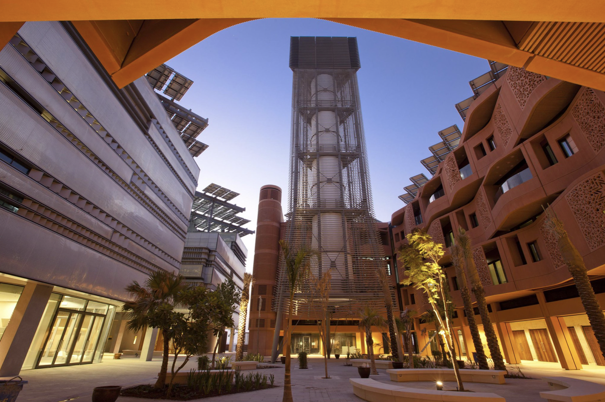
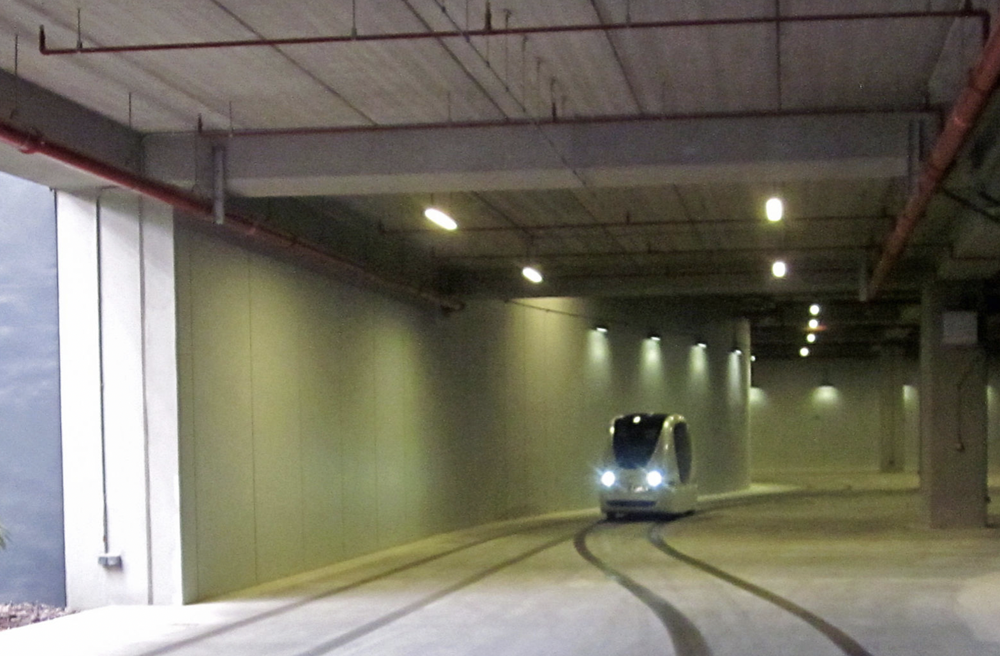
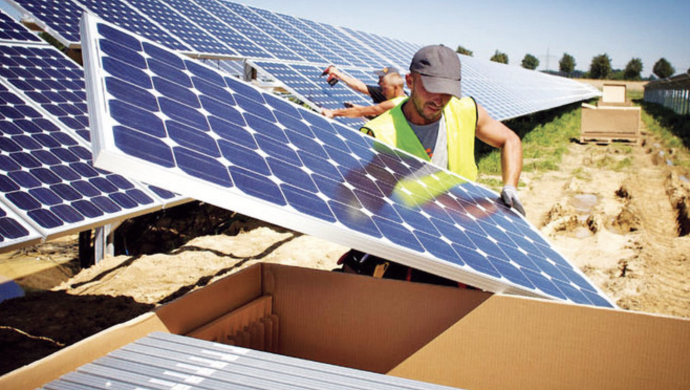

## Overview

<!-- About 100 to 150 word summary of the case study. -->
This case study focuses on Masdar City that is located in the United Arab Emirates (UAE). Masdar City is an ambitious city project that aims to build a low-carbon city in a desert region. This study identifies Masdar City's key characteristics, including its core concept of sustainability, incubated R&D projects and startups that focus on state-of-the-art sustainability technology, and utilization of technologies for efficient management of urban services. The study discusses Masdar City's goals, such as becoming economically sustainable and becoming an incubator of sustainability innovation. The study also uncovers important technology interventions and financing schemes adopted by Masdar City. The study then discusses outcomes that Masdar City has achieved under cooperation with its stakeholders. Lastly, the study pinpoints important open questions that need to be discussed and resolved in the future.

## Key Characteristics

<!--  Summarize the most visible essential characteristics of the project. For districts: How does the district employ 3-5 of the key characteristics of New Century Cities? For plans: How does the plan address each of the three activities (development, engagement, implementation) of the digital masterplanning process described in the 2015 Townsend and Lorimer paper?
-->

**1. Masdar City promotes sustainability.**
As "Masdar '' means "source" in Arabic, Masdar City is designed around the concept of sustainability[1]. As a city in the Abu Dhabi desert, Masdar City is developed to be low-carbon and ecologically efficient, aiming to serve as a model for sustainable cities in desert regions. The City creates sustainability benchmarks to evaluate its sustainability performance on environmental, social, and eonomic aspects[1]. The City uses energy from renewable sources and deploys facilities that utilize clean energy.

**2. Masdar City incubates state-of-art R&D projects and startups on sustainability.**
Masdar City strives to become a hub for research and innovations on sustainable development and renewable energy[1]. Masdar City is Abu Dhabi's only planned and approved R&D cluster[6]. The City develops strategic plans to support innovative R&D projects and technology companies that are working on sustability challenges[5]. To foster the startups, the City builds the Catalyst, which is the region's first sustainability-focused startup accelerator to fund, train, and mentor startups[5]. The City also builds Masdar City Free Zone, which supports businesses by offering "100% foreign ownership, 0% import tariffs, reduced tax footprint, and access to R&D partnerships'’[5]. As a result, the City currently has more than 1,000 companies including startups working on energy, water, artificial intelligence, health, space, agriculture, and mobility[6].

**3. Masdar City provides mixed-use spaces for people to live, work, learn, and play.**
Masdar City offers growing commercial, residential, educational, and hospitality spaces for residents and visitors[5]. With a total site area of 6,000,000 m² (the gross floor area of Masdar City alone comprises 4,000,000 m²), Masdar City is designed to be a pedestrian-friendly community, meaning that apartments, schools, parks, restaurants, and cafes are all within walking distance[5]. With 6,000 people living in the City as residents and 2,300 visitors each week on average, Masdar City aims to double the number of residents in 2023 by building energy-saving buildings and other facilities (e.g., parks, shopping plaza) for living, working, learning, and playing[5]. The City's end goal is 50,000 people, including 40,000 residents who work and study there[5].

**4. Masdar City uses smart technologies for efficient management of urban services.**
Masdar City utilizes smart technologies on managing energy supply and city transportation. The City tests and implements smart technologies for collecting and analyzing real-time energy consumption data, as well as responding to real-time energy demand[7]. For example, the city used smart appliances that are equipped with two-way communication and advanced energy management functionality[7]. These appliances could adjust power demand in response to changes in utility prices and energy demand, while also collecting and transmitting real-time power consumption data[7]. The City also implementes a smart network of transportation options, including the world's first driverless rapid transport (PRT) system, MENA's first autonomous shuttle, and first electric Eco-bus[5].

## Goals and Aspirations

<!-- Summarize the most important goals of the project. Replace the placeholder title with a succinct name for the goal. The text should be around 50 words. -->

**1. Become economically sustainable.**
Masdar City strives to build a model that is both commercially viable and environmentally friendly in the long run[1]. This goal of the City becomes more challenging and urgent given that: (1) the city is in the desert and suffers from inherent resource problems (i.e., limited freshwater supply, energy consumption); (2) the economy of UAE relies heavily on oil and needs to become more sustainable and diversified. It also resonates with the UAE's goal to become the leader that drives transformation in the Energy 4.0 era.

However, under this goal, the City is faced with an "energy trilemma". "Energy trilemma" refers to the challenge of balancing three competing goals in energy policy: affordability, reliability, and sustainability. Masdar City's goals of becoming commercially viable, its prolonged construction process, and struggles on building a zero-carbon city are all linked to the energy trilemma in different ways. For example, the City has changed its "self-develop" operating structure to outsourcing and partnerships as its business model switched from project developer to master developer and integrator[16]. This change reflected an evolving understanding of how to build a commercially viable and sustainable city.

**2. Become an incubator of technological innovations on sustainability.**
Masdar City aims to become an incubator of innovations on sustainability, in which new technologies can be tested and implemented[16]. The goal of the City aligns with the UAE's ambition to have clean energy that consists of 50% of its electricity supply by 2050[1].

The City's goal suggests that the degree of utilizing technological innovations depends on how technologies and policies are combined to enhance a city's performance on sustainability, which moves from "innovations in the city" to "innovations of the city".

**3. Become a model of sustainable and desirable living.**
Masdar City is committed to developing a model of sustainable living, which is both liveable and desirable for its residents[5]. The City envisions its residents to live and work in energy-saving buildings, as well as play in city parks and plazas that have sustainable features.

The City's goal makes Masdar City inherently different from the cities that adopt a reactive approach in city design to respond to increasing needs of residents. The goal also allows the City to have more flexibility to conduct stretegic city plans for residents' sustainable living.

## Technology Interventions
<!--  Identify 3-5 specific technology-enabled interventions the project employs or proposes. The text should be around 75-125 words. Separate into more than 1 paragraph as needed. This is a good place to insert additional images, be sure to include captions identifying the source and make sure to not use copyrighted images. -->

**1. Smart Technology in Buildings.**
Masdar City utilizes smart technology in its energy-saving buildings, which consume 40% less energy and water than normal buildings. As a result, Masdar City is one of the places in the Middle East that have a large amount of high-performance buildings[1], which in turn make Masdar City become a "real-time laboratory" to monitor and explore how smart cities use, generate and share resources. Masdar City's Eco-Villa is a great example - it is a sustainable housing project that generates more energy than it consumes. The Eco-Villa deploys the Smart Home Energy Management System (SHEMS), which is an intelligent IT system to manage energy consumption within the building and potentially other buildings in Masdar city[2]. With the SHEMS, the Eco-Villa's all areas are euipped with motion sensors. The sensors (e.g., smart meters, temperature sensors, and lighting controls) that consist of photocells are all connected to a central control system that collects real-time data on energy consumption and provides real-time feedback to users[2]. For example, the sensors will shut off the lights automatically when daylight lighting levels are adequate[2].

The City also combines a traditional cooling technology - wind tower - with modern technology to reduce the energy consumption of buildings. The traditional wind towers are commonly used in the Arabian Gulf region. They capture the natural wind and direct it down through a series of channels into the building. In Masdar City, the wind towers are integrated with modern building systems and technologies to create a more efficient and sustainable cooling solution. The towers are connected to a series of sensors and controls that allow them to adjust their orientation and speed based on the temperature and humidity levels inside and outside the building. This helps to maximize the cooling effect while minimizing energy consumption.

By designing and constructing the energy-saving buildings, the City has not only built physical assets in the public realm, but also built physical assets in the private realm. For example, wind towers and other public constructions are transformed into living labs to experiment innovations. Environment-friendly office spaces share the same vision as the companies working on renewable resources and green technology.

**2. Smart Technology in Transportation System.**
Masdar City uses smart technology in its transporation system. As the City strives to meet its carbon-neutral goal, it develops a network of hybrid or electric vehicles. One example is Masdar City's Personal Rapid Transit (PRT) System, which operates on a network of tracks[14]. The vehicles are powered by eletric batteries, which allow 60 kilometers on a 90-minute charge[14]. The vehicles also use cameras and sensors to create 3D and 2D maps to detect obstacles and give out the obstacles' postions near the vehicle[15]. The vehicles can also communicate with traffic lights[15].

By utilizing smart technology in transporation system, the City connects different districts and areas together with transporation systems. The connectivity of the City is facilitated, especially under the context in which the City discourages personal use of traditional vehicles.

**3. Smart Technology in Energy Management.** 
Masdar City also designs and implements smart technology in energy management. The City uses mainly solar energy and wind energy[1]. The City has the largest photovoltaic plant in Asia, which produces 17,500 megawatt-hours of clean eletricity per year[5]. Masdar City's Electric Energy Storage Solutions Hub utilizes electrochemical technologies to strengthen renewable energy systems to store power[5].

Masdar City also builds Masdar Solar Hub to study photovoltaics and solar thermal energy technologies[12]. On top of managing different types of energy, Masdar City implements the Smart Grid system, which incorporates renewable energy resources into the grid and makes it more convenient to monitor and manage real-time energy consumption[13].

By utilizing smart technology in energy management, the City graps the essence of the approach to combat climate change. That is, using clean energy for all heating, cooling, and powering needs, and eliminating energy waste by using management tools.

## Stakeholders
<!--  Identify 3-5 key stakeholder organizations or groups. The text should be around 50 words, and include a link to the organization.-->

**The Abu Dhabi Government.**
The Abu Dhabi government is the key stakeholder of Masdar City. The Abu Dhabi government provides the majority of funds, guides the development of the City, and supervises the whole project[1]. From designing and building Masdar City, the Abu Dhabi government hopes to learn how to build a sustainable city that is independent from oil in the long term[1].
Based on this study's current research, although the Abu Dhabi government consulted external agencies as stakeholders, there is still little transparency of their consultation with external stakeholders. It is unclear how the Abu Dhabi government made decisions based on both quantitative and qualitative evidence. [Abu Dhabi Government](https://www.abudhabi.gov.ae)

**Residents.**
Residents are an important stakeholder of Masdar City. Current and future residents of Masdar City work and live in the City are beneficiaries of Masdar City's technologies. However, the power of residents might not be fully established yet, since the City is currently lightly occupied when compared to its ambitious goal of 50,000 people. [Residents](https://masdarcity.ae)

**Business Owners.**
Business owners are an important stakeholder of Masdar City. Businesses are essential to determine whether the City's model is commercially viable and sustainable - these businesses are expected to further the City's objectives on sustainability by contributing to innovations on green energy and clean technologies. Businesses are selected according to whether they are aligned with the City's vision on sustainsbility; they also partner with the City by exchanging knowledge and sharing the ecosystem that fosters technological innovations[2]. As the City sets up Masdar City Free Zone and The Catalyst, it has attracted big corporations, such as Siemens, Lockheed Martin, and Honeywell, and startups to become its corporate tenants[5]. The City currently has more than 450,000 m² of completed buildings fully leased and occupied by businesses of all sizes. [Lockheed Martin](https://www.lockheedmartin.com/en-ae/index.html) - [Honeywell](https://www.honeywell.com/ae/en) - [Alpin Limited](https://www.alpinme.com/contact/)

**Developer.**
The developer is an important stakeholder of Masdar City. The developer is deeply involved in Masday City's development and construction. Masdar City's developer consists of two companies, both of which have the government of Abu Dhabi as the sole shareholder.
According to their official website, Masdar-Abu Dhabi Future Energy Company was established in 2006. Masdar-Abu Dhabi Future Energy Company is a UAE-government owned renewable energy company. The company is involved in not only renewable energy projects, including solar power projects, wind power projects, and waste-to-energy projects, but also Masdar City as a sustainable urban developmenet project. Established in 2002, the Mubadala Development Company is a sovereign wealth fund that aims to create sustainable and diversified financial returns for Abu Dhabi. The company makes local and international investments in private, public, cash, real estate and infrastructure, alternatives, and credit. Starting from 2017, the Mubadala Development Company operates as the Mubadala Investment Company. [Masdar-Abu Dhabi Future Energy Company](https://masdar.ae) - [Mubadala Development Company](https://www.mubadala.com)

**Education and Research Institutions.**
Education and research nstitutions are an important stakeholder of Masdar City. Masdar City is home to several universities and research institutions, including Khalifa University (original name as Masdar Institute) and The International Renewable Energy Agency (IRENA) Innovation and Technology Center. Furthermore, MIT has a graduate research facility in Masdar Institute focusing on alternative energy, sustainability, and advanced technologies. These institutions are involved in state-of-art research on green technology and renewable energy. These institutions collaborate closely with the City on research and knowledge exchange in green energy and sustainable technology. [Khalifa University](https://www.ku.ac.ae) - [The International Renewable Energy Agency (IRENA) Innovation and Technology Center](https://www.irena.org) - [MIT and Masdar Institute Cooperative Program](https://web.mit.edu/mit-mi-cp/)

## Leadership
<!--  Conduct one interview with a project leader, and link to a LinkedIn or other profile. Provide a brief biography, no more than 75 words. Identify 3-5 insights or themes from the interview. Feel free to add a photo of the individual here. -->

**1. Name of Interviewee.**
For this study, I have reached out to Masdar City's Digital Marketing Office, Free Zone Office, and official accounts on social media (including Facebook and Instagram). I have also reached out to different individuals on LinkedIn, such as the Director of Growth, the Associate Director of Sustainability and CSR, and the Head Of Engineering. However, so far I received no response. 

**2. Insight.** 
Based on research on finding project leaders for my interview, one observation is that there is gender imbalance within Masdar City's leadership. The majority of project leaders are men, indicating that there is limited space for female professionals to lead and participate in the city project. This observation was further consolidated by reports that Masdar City confirms the gender imbalance and agrees to involve more females in designing and building the city[1, 3].

## Financing
<!--  Identify at least one financing scheme being used in this project or plan. About 100 words is probably a good length for this. -->

**1. Government Funding.**
The majority of the seed capital (USD $15 billion) was offered by the government of Abu Dhabi. The government also provides a significant amount of funding in ongoing support for city development and innovative research.

This finance scheme makes the government handle the large economic commitment associated with Masdar City. On the one hand, the government's funding allows Masdar City to have construction projects on a large scale, such as building renewable energy power plants, with lower financial risk. On the other hand, the government's funding determines that Masdar City's project might be influenced by political considerations and factors, which may not align with residents' needs and goals. Also, the heavy dependence on government's funding makes it problematic when there is not enough public funds - this was tested to be true when the government postponed the completion of the project from 2014 to 2030 due to the impact of the global financial crisis around 2010.

**2. Sustainability bonds.**
In 2023, Masdar City will issue the first sustainability bond to raise funds for its projects on sustainability. The sustainability bond is aimed to attract international investors who are interested in joining Masdar's green energy plan[9]. The purpose of issuing sustainability bonds is to raise more funds as "Masdar City has established a renewable energy portfolio capacity target of at least 100 gigawatts by 2030"[9].

The sustainability bonds can help Masdar City get into a growing market of investors who are looking to support sustainable projects, and help the City gain a long-term source of funding. However, the bonds may also induce risks on Masdar City's financial stability if the City fails to achieve its sustainability goals. Especially given the fact that the City has built less than 5% of the original plan and has a history of failing to meet original goals, including postponing the completion time, and switching goal from a zero-carbon city to a carbon-neutral city[10, 11].

## Outcomes
<!-- Identify 3-5 (anticipated) outcomes. What will/has the project achieved? These should not be the same or repeated from elsewhere. Use this space to emphasize something different. About 50 words per is minimum, but these can be as long as you want/need. -->

**Outcome 1**
Masdar City is in the Phase I of its sustainable urban planning[17]. The City combines both traditional and innovative approaches to sustainable urban planning. The City adopted energy-saving buildings, smart energy management systems, and smart transpotation network. However, the City still has many projects and buildings that are under construction, which aroused doubts from the public[17]. The main doubts come from the mismatch between the City's ambition and its limited, actual financing[17]. To achieve its goal of completing the project by 2030, the City is expected to enlarge its resources of financing.

**Outcome 2** 
Masdar City has utilized green technology to achieve its revised goal of low-carbon city. As of 2021, the City has generated 15,000 GWh+ from clean sources. The City also got about 7.5M tons CO2 abated by clean energy portfolio[1]. However, although the City adopts strategies and technologies to minimize carbon emissions, achieving its original goal of zero-carbon city is quite challenging. This is because the construction of buildings and transportration system inevitably contribute to carbon emissions. For example, although the City tries to reduce the dependence on traditional vehicles, there is still a need of traditional vehicles for goods and services inside and outside of the City.

**Outcome 3** 
Masdar City is becoming a hub of innovative technology on sustainability. With growing business partners, the City creates many job opportunities and accelerates the UAE's economic growth on sustainable technology. The City enlarged its Masdar City Free Zone by attracting more than 1,000 active companies[1]. Masdar City will continue to attract talent from around the world and aim to achieve gender balance by encouraging more women to work in the sustainability industry[1].
The City has established its economic assets by cultivating universities and research institutions as innovation drivers, fostering green technology businesses as innovation cultivators, and building supporting services as neighborhood-building amenities.

**Outcome 4**
Masdar City is exploring and experimenting how to integrate smart technologies with other systems, such as the currency system. For example, Masdar City is studying an energy-based currency called "Ergos"[17]. Ergos correspond to the amount of energy that is supplied to the community and will be assigned to each resident and visitor. Ergos can be used to exchange the chosen energy of certain services. However, the ergos might trigger concerns over surveillance and privacy, since the government will need to monitor and analyze when, where, and how people use the ergos to exchange energy.

## Open Questions
<!-- Identify 1-3 open question(s). What is uncertain, unclear, or still unresolved about this project? These can be 50 words or less. -->

**1. Question on accessibility and equity**
As Masdar City plans to build a "car free" environment for its sustainability goals, the City does not allow any personal automobiles. The main ways of sustainable transporation include walking, biking, personal rapid transit (PRT), bus/light rapid transit, and metro[8]. However, it should be noted that it still takes people several minutes to get to the station[8]. It is unclear how the City builds facilities or develops services to accommodate physically-disabled people's needs of transportation?

**2. Question on feasibility**
As Masdar City claims itself as an experiment of sustainable smart cities, whether this experiment is replicable, especially when Masdar City is built in a small, controlled environment under the strong government?

**3. Question on communication**
The Masdar City was designed and built in a top-to-bottom order by the government. The communication channel and process between the government and residents still remain unclear: how does the government collect the City's residents' requests and needs? To what extent the government is willing to alter the plan based on residents' needs? As Masdar City states that "We believe that sustainability should be a key consideration in all decision making"[4], whether there are any trade-offs between the government's ambition of building a low-carbon city and residents' needs of having a more convenient but less environmental-friendly lifestyle?

**4. Question on social integration**
With more than 50,000 people planned to inhabit Masdar City, only about 6,000 people are currently living in the City. The 6,000 people, which mainly consists of working professionals, entrepreneurs, researchers, and students, is regarded as a relatively small and homogeneous community. It is unclear whether the City plans to attract more people with diverse backgrounds other than technology and sustainability, in order to fulfill its goal of 50,000 people? If so, how will the City facilitate social integration? 

## References

---

### Primary Sources

<!-- 3-5 project plans, audits, reports, etc. -->
[1] [2021 Masdar Sustainability Report](https://masdar.ae/-/media/corporate/downloads/about-us/masdar-annual-sustainability-reports/2021-masdar-sustainability-report.pdf)

[2] [Masdar City Eco-villa Net-zero Energy](hhttps://masdar.ae/-/media/corporate/downloads/masdar-city/eco-villa-leaflet-en.pdf)

[3] [2020 Masdar Sustainability Report](https://masdar.ae/-/media/corporate/downloads/about-us/masdar-annual-sustainability-reports/masdar-2020-annual-sustainability-report.pdf)

[4] [Masdar Green Finance Framework](https://masdar.ae/-/media/corporate/archive/masdar_green-finance_2023.pdf)

[5] [Masdar City Fact Sheet - 2022](https://masdar.ae/-/media/corporate/downloads/media/2022/masdar_city_factsheet_en-2022_v3.pdf)

### Secondary Sources

<!-- 5-7 secondary source documents: news reports, blog posts, etc.. -->
*************************
[6] Masdar City attracts global and regional innovation giants amid focus on global green recovery from COVID-19
https://www.prnewswire.com/news-releases/masdar-city-attracts-global-and-regional-innovation-giants-amid-focus-on-global-green-recovery-from-covid-19-301313590.html

[7] Masdar City to pilot smart appliances
https://www.smart-energy.com/regional-news/africa-middle-east/masdar-city-to-pilot-smart-appliances-16269/

[8] EVALUATING THE ACCESSIBILITY OF A SUSTAINABLE CITY: CASE STUDY OF MASDAR CITY, UAE
https://www.witpress.com/Secure/elibrary/papers/UMT22/UMT22008FU1.pdf

[9] Abu Dhabi's Masdar to issue first green bond in 2023
https://www.thenationalnews.com/business/energy/2023/01/19/abu-dhabis-masdar-to-issue-first-green-bond-in-2023/

[10] Masdar's zero-carbon dream could become world’s first green ghost town
https://www.theguardian.com/environment/2016/feb/16/masdars-zero-carbon-dream-could-become-worlds-first-green-ghost-town

[11] What Abu Dhabi’s City of the Future Looks Like Now
https://www.bloomberg.com/news/articles/2020-02-14/the-reality-of-abu-dhabi-s-unfinished-utopia

[12] Masdar City’s growing status as ‘innovation ecosystem’ driving future expansion
https://news.masdar.ae/en/press-Release?News/2018/11/28/09/48/Masdar-Citys-growing-status-as-innovation-ecosystem-driving-future-expansion

[13] Masdar: The Greenest City in the World
https://energydigital.com/smart-energy/masdar-greenest-city-world

[14] Masdar City in Abu Dhabi
https://www.centreforpublicimpact.org/case-study/masdar-city

[15] Masdar City unveils first autonomous transport system
https://www.logisticsmiddleeast.com/transport/roads/31557-masdar-city-unveils-first-autonomous-transport-system

[16] Rethinking the future low-carbon city: Carbon neutrality, green design, and sustainability tensions in the making of Masdar City
https://www.sciencedirect.com/science/article/pii/S2214629619308904

[17] We Were Promised Smart Cities. What Happened?
https://builtin.com/internet-things/smart-cities-promise

