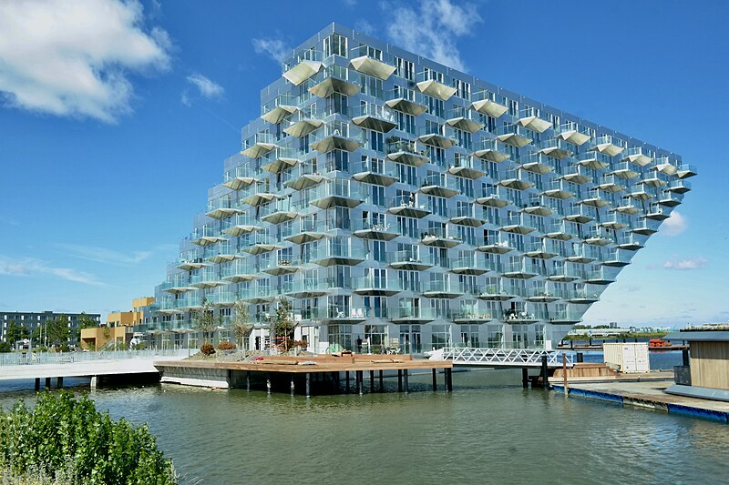
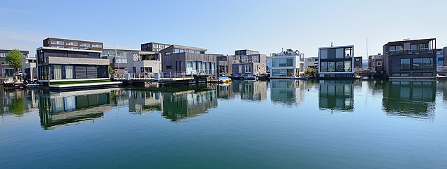

## Overview

<!-- About 100 to 150 word summary of the case study. -->

IJburg is a pioneering smart community located on an artificial island to the east of Amsterdam. It is designed to build a climate-resilient and sustainable model for future urban living. The project integrates renewable energy systems, floating architecture, and green transportation systems to actively respond to the current environmental and social challenges. By combining solar and wind energy with smart grids and exploring blockchain energy trading models, the community has achieved efficient and localized energy production. Its floating buildings are designed to adapt to rising water levels while maximizing rainwater recycling and energy efficiency. Green transportation systems are one of the core of the project, with electric buses, electric boats, and AI-based traffic optimization solutions. Furthermore, digital platforms and resident participation mechanisms support community governance and continuous innovation. IJburg demonstrates how smart city technologies and sustainable design can reshape waterfront development in response to the climate crisis and meet the needs of both present and future generations.

## Goals and Aspirations

<!-- What is the project trying to achieve? Identify 3-5 high-level goals that define the entire project.Replace the placeholder title with a succinct name for the goal. -->

**Build a climate-resilient urban environment.** IJburg is designed to address the challenges of climate change through adaptive infrastructure. By building on artificial islands and using floating architecture, the project reduces flood risks and adapte to rising water levels. Its rainwater collection systems helps to make the community a safe and livable district for the long term.

**Achieve sustainable and local energy systems**. IJburg aims to achieve localized, low-carbon energy production by combining solar and wind power with smart grid infrastructure. Through projects like the Oosterlicht solar roof and experiments with blockchain energy trading, IJburg promotes energy independence while reducing carbon emissions and advancing Amsterdam’s climate neutrality goals.

**Encourage inclusive, participatory urban governance.** IJburg emphasizes inclusive and participatory community development through digital engagement tools like Hallo IJburg. Residents are empowered to contribute to planning, energy sharing, and neighborhood governance. These participatory methods strengthen social cohesion and help ensure that urban innovation reflects the needs and priorities of the community.

## Key Characteristics

<!--  How is the project organized into specific activities that advance these goals? For plans: How does the plan address each of the three activities in digital master plans (development, engagement, implementation). For districts: How does the district employ 3-5 of the key characteristics of innovation hubs?
-->

**Phased development on artificial islands**. IJburg is developed in multiple phases on the artificial islands constructed in Amsterdam’s IJmeer. Each phase includes a mix of residential, commercial and public spaces. This planned growth allows for the gradual increasing of population while allowing for the gradual testing and expansion of infrastructure, sustainable features and smart systems, enabling the development to respond to ecological, social and technological feedback.

**Digital community engagement and shared governance**. Resident engagement is core concept to IJburg’s development. Through platforms such as Hallo IJburg, residents work together as a community by sharing ideas, organizing initiatives, and participating in decision-making. This digital engagement tool promotes bottom-up governance, social cohesion, and localized problem solving.

**Implemnet: Integrated smart infrastructure for sustainability**. IJburg has utilized a range of smart technologies to improve environmental and operational efficiency. These technologies include solar roofs (Oosterlicht project), smart grids and AI-assisted traffic systems. These systems are supported by city data infrastructure such as Amsterdam Energy Atlas and TrafficLink. These continuous feedback from sensors and platforms supports real-time performance monitoring, making implementation adaptive and achievable.

## Stakeholders
<!--  Who initiated the project? Who is leading the project forward? Who else has a say in how it unfolds? Who is directly affected but marginalized? Identify 3-5 key stakeholder organizations or groups. Identify 3-5 key individuals. These are people who are associated with the project as leaders, supporters, critics, or regulators. They are likely to be members of the stakeholder groups identified above. These are people you should try to contact for one or more interviews.-->

**City of Amsterdam**. The City of Amsterdam is the initiator and main manager of the IJburg development project. Through departments such as spatial planning and sustainable development, the government oversees land reclamation, infrastructure, and climate adaptation goals. It also coordinates policy frameworks like the Omgevingsvisie 2050 and the Climate Neutral Roadmap. It serves as key decision-makers, regulators, and funders. [City of Amsterdam](https://www.amsterdam.nl/)

**Stadsdeel Oost-Amsterdam East District Government**. As the governing body of the district in which IJburg is located, Stadsdeel Oost plays a key role in implementation. It connects directly with residents, manages local public spaces, and supports neighborhood initiatives. It serves as an intermediary between city-level planning and grassroots action.
 [Stadsdeel Oost](https://www.amsterdam.nl/stadsdelen/oost/)

**Gebiedonline / Hallo IJburg Platform**. This community-driven digital platform enables more than 4,000 IJburg residents to self-organize local affairs, from energy sharing to event planning. While it is not an official government actor, it has become a powerful stakeholder influencing community dynamics, sustainable development, and bottom-up governance. [Hallo IJburg](https://halloijburg.nl/)

**IJburg Residents**. IJburg residents play an active role in shaping their community. As beneficiaries and contributors to the region’s smart city initiatives, they participate in local planning, sustainability efforts, and community governance. Their collective involvement strengthens social cohesion and ensures that innovation remains in local needs. This empowered group of residents is a key driver in making IJburg a participatory and adaptive smart community.

**Low-income residents and digitally disconnected individuals**. These groups are directly affected by the IJburg project but often marginalized in its development process. As values rise in phases like IJburg II and Strandeiland,  affordability becomes a growing concern for lower-income households. At the same time,  digital civic engagement tools such as Hallo IJburg may exclude elderly or digitally disconnected residents, limiting their ability to participate in planning or access sustainability programs. 

## Technology Interventions
<!--  What specific technology-enabled interventions does the project propose? Identify 3-5 technology interventions. Describe use cases, value proposition, solution architecture, data created or consumed, key platforms and standards, business models, regulatory issues, etc. Separate into more than 1 paragraph as needed. This is a good place to insert additional images, be sure to include captions identifying the source and make sure to not use copyrighted images. -->

**Smart solar energy systems**. One of IJburg’s most impactful energy interventions is the Oosterlicht solar rooftop project at IJburg College. With 480 photovoltaic (PV) panels, the system supplies approximately 15% of the school’s electricity needs while serving as an educational tool for students. It aims to reduce emissions and demonstrate how public buildings can become clean energy centers. The system is also connected to the local grid via smart inverters (converts the direct current (DC) generated by the solar panels into alternating current (AC) required by the grid). It operates on a cooperative ownership model. Local residents collectively own the installation and are able to share in both the energy savings and financial returns generated by surplus energy production.

Complementing this public initiative, the Sluishuis residential buildings demonstrates how solar solutions can be effectively integrated into private housing. It combines energy-efficient design, rooftop solar panels, and climate-adaptive features. All these projects illustrate how both public and residential spaces in IJburg are advancing sustainability through smart, environmentally responsive design.

**Smart and sustainable transportation systems**. IJburg integrates AI-enabled traffic optimization with Mobility-as-a-Service (MaaS) platforms to create a more efficient and low-emission transport network.Through systems like TrafficLink, real-time data is collected from sensors in roads, vehicles, and transit infrastructure. This data is used to dynamically optimize traffic flows, reduce congestion, and prioritize eco-friendly transportation such as electric buses and boats. 

In the meanwhile, IJburg’s MaaS platform integrates multiple modes of transportation, including electric buses, shared bikes and boat bus, into a mobile interface. Residents can plan low-carbon routes, receive real-time traffic updates, and compare green travel options. These technologies promote a shift toward sustainable travel behaviors while generating valuable data on travel patterns to support long-term transportation planning.

**Smart water and flood management systems**. Due to locate on an artificial island on Lake Eyre, IJburg uses advanced water management techniques to ensure long-term climate resilience. The district uses an integrated system of rainwater harvesting, permeable surfaces, green roofs and adaptive drainage infrastructure. These systems collect and reuse rainwater for irrigation and construction, reducing pressure on water systems.

During heavy rain or flooding risks, smart sensors monitor groundwater levels and activate pump systems or dynamic water storage places to solve excess water. The generated data, such as water levels and flow rates, is shared with Amsterdam's citywide climate monitoring platform. This solution helps this area adapt to extreme weather while optimizing local water use and ecological balance.

**Climate-adaptive architecture and floating housing**. The district integrates climate-adaptive architecture as a core element of its urban design. Buildings in this community are designed with elevated foundations, floating structures, green roofs, and waterproof materials to address the risk of flooding and sea level rise.Some residential buildings incorporate semi-floating or fully-floating housing units that remain functional even during extreme weather events. These design strategies improve long-term livability while reducing climate-related risks.

**Digital civic participation platforms**. IJburg supports community-driven governance through digital platforms, which allow residents to organize local events, share resources, and participate in urban planning processes. It is a bottom-up participatory tool that has no central administrator and relies on user review and contributions. These platforms show how digital tools can promote inclusive, real-time urban shared governance.

## Financing
<!--  How are the technology interventions identified to be financed? How does this fit into financing of the larger project? Identify at least one financing mechanism that is being used. -->

**Government investment, public-private partnerships, and community-based financing models**. For instance, the Oosterlicht solar rooftop project at IJburg College was funded partly by the local government’s climate fund and partly by a resident-led energy cooperative, which enables community members to co-invest in the system and share in the financial returns from surplus energy production.

Large infrastructure developments, such as smart transport systems and water management technologies, are often supported by the City of Amsterdam’s Climate Neutral 2050 Plan. In addition to public funding, private-sector participants such as architecture firms, energy companies, and smart mobility providers contribute through development partnerships, technology support, and co-financing models. These mixed financing strategies enable sustainable, scalable development across the region.

## Outcomes
<!-- What results has the project produced to date? What outcomes and impacts are anticipated? Identify 3-5 (anticipated) outcomes. What will/has the project achieved? Thes should not be the same or repeated from elsewhere. Use this space to emphasize something different. -->

**Climate-resilient urban Form**. IJburg’s emphasis on floating architecture, adaptive drainage systems, and permeable surfaces has created a built environment that is better prepared for rising sea levels and extreme weather. These innovations not only protect the current urban infrastructure, but also provide a replicable model for other low-lying cities facing similar climate challenges.

**Increased sustainable awareness and community participation**. Through community-driven initiatives, sustainability has evolved from a policy to a shared social value within the community. Residents not only adopt green technologies, but actively shaping shape how they are implemented. This transformation reflects how sustainability has become a collective cultural norm in urban life in IJsselberg and even in the Netherlands.

**Become a living lab for smart urban infrastructure**. IJburg has become a test point for integrating smart technologies into core urban systems such as traffic management, flood protection and water infrastructure. AI-enabled traffic platforms, real-time stormwater monitoring sensors and adaptive drainage systems have been deployed to explore how data-driven approaches can improve future environment. As a “living laboratory”, IJburg not only improves its own resilience, but also provides valuable insights for scaling smart infrastructure in other urban developments.

## Open Questions
<!-- What is uncertain, unclear, or still unresolved about this project? Identify 1-3 open question(s). -->

**Can climate-adaptive and floating architecture be scaled equitably?** Projects like Sluishuis show advanced sustainable design, but they are often expensive to build and maintain. Can these solutions be scaled up to provide affordable housing for low-income people, or built on a large scale?

**How inclusive are digital engagement platforms like Hallo IJburg?** While digital tools like Hallo IJburg have empowered many residents to participate in neighborhood governance, there are still concerns about digital exclusion, especially for older residents, non-Dutch speakers or those without consistent internet access.

**What are the long-term maintenance and governance models for smart infrastructure?** IJsselberg has already implemented AI traffic systems, flood sensors, and other smart infrastructure, but who will be responsible for their long-term maintenance, data privacy, and system upgrades as these technologies age in the future?

## References

---

### Primary Sources

<!-- 3-5 project plans, audits, reports, etc. -->

- Amsterdam Municipality. (2020). Omgevingsvisie 2050: Een menselijke metropool. Gemeente Amsterdam. https://openresearch.amsterdam/image/2021/7/1/omgevingsvisie_amsterdam_2050.pdf

- Amsterdam Municipality. (2023). Monitor Omgevingsvisie 2023. https://onderzoek.amsterdam.nl/publicatie/monitor-omgevingsvisie-amsterdam-2023

- Zon op IJburg. (n.d.). Oosterlicht solar cooperative project profile. Zuiderlicht.https://zuiderlicht.nu/

- Barcode Architects. (n.d.). Sluishuis. https://barcodearchitects.com/project/sluishuis/

- Hallo IJburg. (n.d.). Digitale wijkplatform voor en door bewoners van IJburg. https://halloijburg.nl/

### Secondary Sources

<!-- 5-7 secondary source documents: news reports, blog posts, etc.. -->

- Urban Green-Blue Grids. (n.d.). IJburg, Amsterdam, The Netherlands. https://urbangreenbluegrids.com/projects/ijburg-amsterdam-the-netherlands/

- de Architekten Cie. (n.d.). Masterplan IJburg – Amsterdam.  https://www.cie.nl/page/960/masterplan-ijburg?lang=en

- Het Parool. (2024, January 30). Amsterdam krijgt zonnepanelenweide op Strandeiland totdat er woningen staan. https://www.parool.nl/amsterdam/amsterdam-krijgt-zonnepanelenweide-op-strandeiland-totdat-er-woningen-staan~b489d19c/?utm_source=chatgpt.com

- Het Parool. (2025, March 25). Werk aan het laatste stuk van IJburg is nu pas echt begonnen: “We kopen niets, we gebruiken echt Amsterdams zand”. https://www.parool.nl/amsterdam/werk-aan-het-laatste-stuk-van-ijburg-is-begonnen-maar-is-pas-over-20-jaar-klaar-waarom-duurt-het-zo-lang~bbb622fd/

- De Dakdokters. (n.d.). Green roof Neptunus school IJburg. https://dakdokters.nl/en/portfolio-items/green-roof-neptunus-school-ijburg/

- ArchDaily. (2022, August 4). Sluishuis / BIG + Barcode Architects.https://www.archdaily.com/985419/sluishuis-residential-building-big-plus-barcode-architects

- Global Site Plans. (n.d.). IJburg, Amsterdam: Innovative neighborhood on artificial islands. Smart Cities Dive. https://www.smartcitiesdive.com/ex/sustainablecitiescollective/ijburg-amsterdam-innovative-neighborhood-artificial-islands/197746/  

## AI USE

Given that information about IJburg is limited and scattered across Dutch and English sources, I used AI to find, summary and translate the reference sources. I manually verified the output by cross-referencing primary documents, such as Omgevingsvisie 2050, monitoring reports from the City of Amsterdam, and construction company websites. References were double-checked with their original sources to ensure accuracy and credibility.