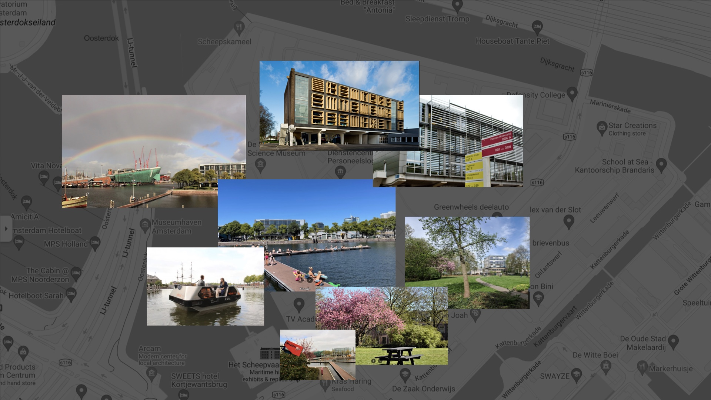
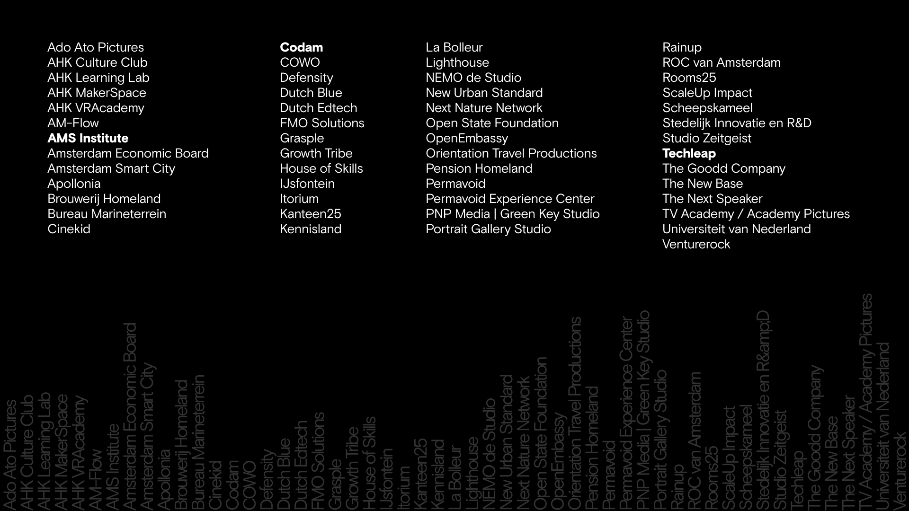
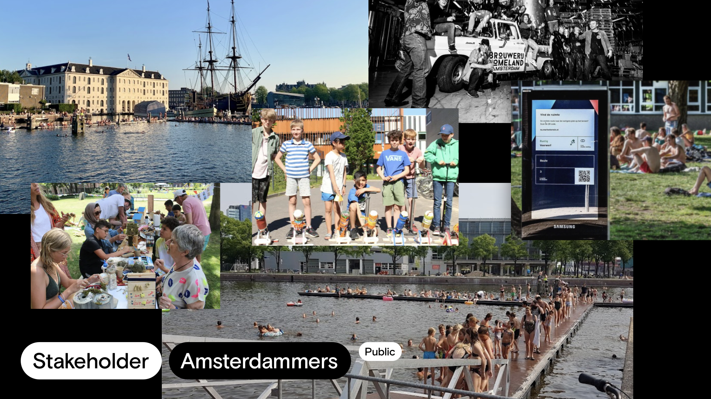
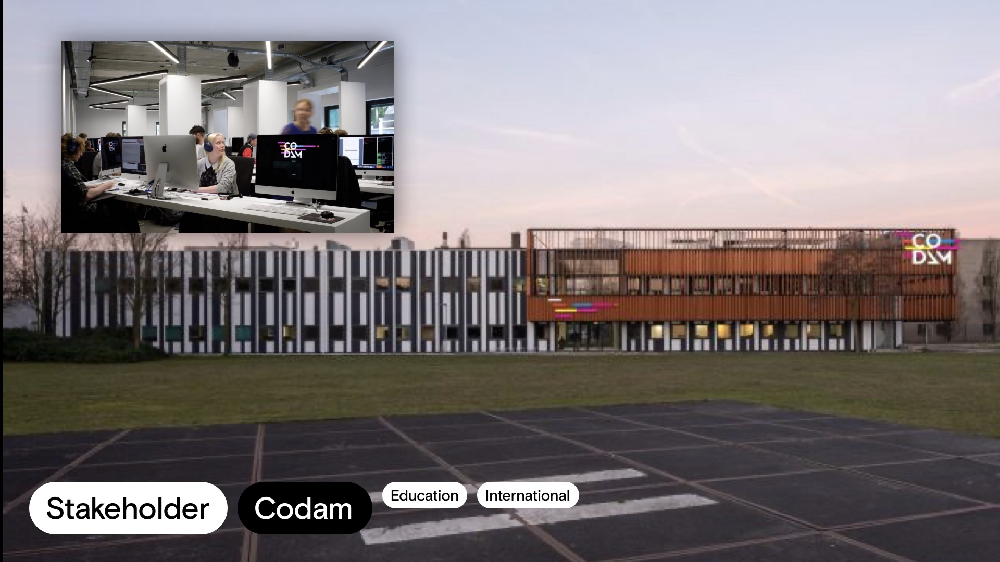
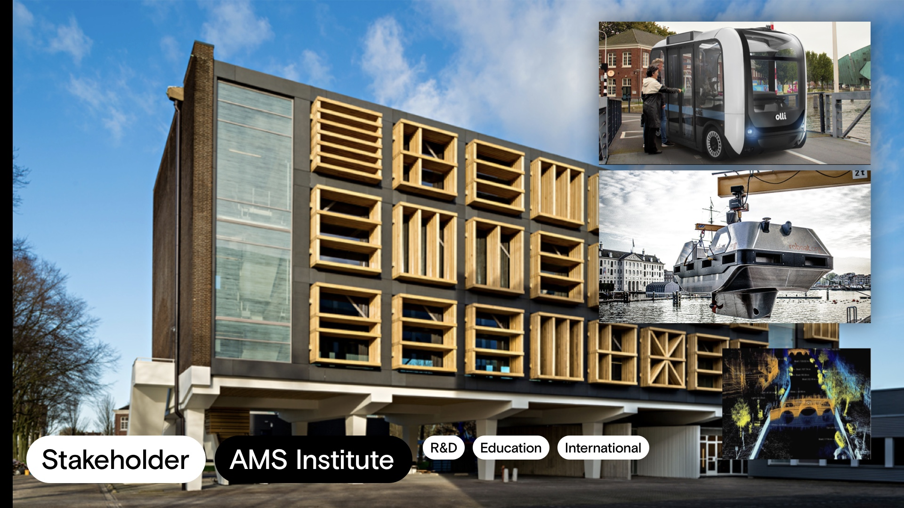
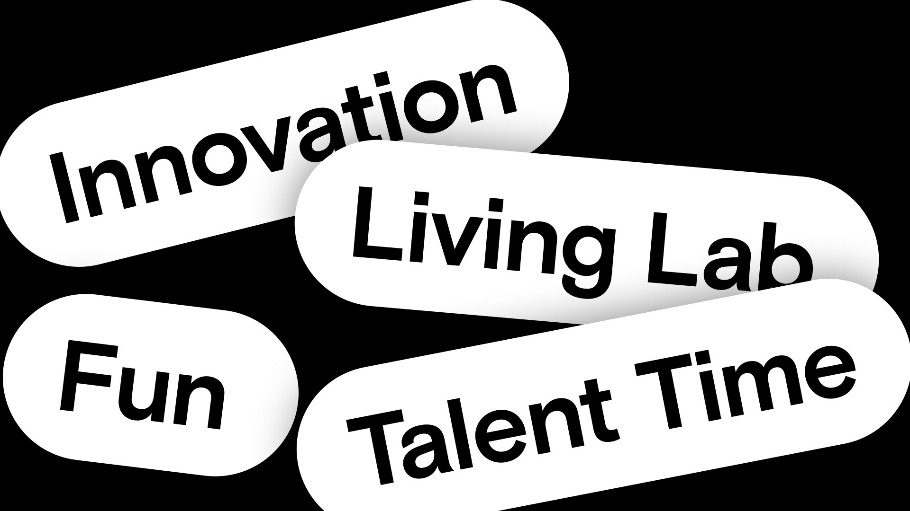

## Overview

<!-- About 100 to 150 word summary of the case study. -->

The Marineterrein, situated in the heart of Amsterdam, the Netherlands, is an emerging hub of innovation and urban development. A former military base, the area has become an exhilarating community that doubles as a living laboratory for urban technology and sustainability. As a shining example of a New Century City, the Marineterrein district contains several unique aspects that distinguish it from typical urban environments. This case study delves into how this innovation district in the centre of Amsterdam incorporates adaptability, sustainability, technological innovation, collaboration, and inclusivity as its guiding principles.

## Key Characteristics

<!-- Summarize the most visible essential characteristics of the project. For districts: How does the district employ 3-5 of the key characteristics of New Century Cities? For plans: How does the plan address each of the three activities (development, engagement, implementation) of the digital masterplanning process described in the 2015 Townsend and Lorimer paper? -->

**Smart Infrastructure**. The Marineterrein employs smart infrastructure in numerous ways. The district showcases a smart mobility system that leverages shared electric vehicles, bicycles, and pedestrian walkways to promote sustainable transportation. Renewable energy sources like solar panels and wind turbines are used to energize buildings and decrease carbon emissions.

**Community Engagement and Co-Creation**. During the summer, Amsterdam locals know the harbourside, fenced off by ships, as an idyllic swimming spot. On this publicly accessible yet privately owned terrain, they host numerous public events, workshops, and open houses. The district's co-creation platform, Marineterrein Community, invites residents and stakeholders to contribute their ideas and feedback on its growth and programming.

**Innovation and Entrepreneurship**. The district's Innovation Lab furnishes a collaborative workspace for entrepreneurs and innovators, including national and international startups. Meanwhile, the Marineterrein Living Lab provides a real-world testing environment for new concepts and products.

**Sustainability and Resilience**. Many buildings within the Marineterrein feature green roofs and rain gardens for stormwater management and for creating green spaces and biodiversity corridors to nurture local ecosystems. Some buildings, like the historic Kommandants (Commander) building, are over a hundred years old, showcasing the use of circular economy principles to minimize waste and encourage resource efficiency.

## Goals and Aspirations

<!-- Summarize the most important goals of the project. Replace the placeholder title with a succinct name for the goal. The text should be around 50 words. -->

**Foster innovation and entrepreneurship** - The Marineterrein encourages startups, tech firms, and research institutions to pursue cutting-edge technologies and solutions for modern urban challenges. It offers spaces for innovation and available co-working spots to increase social interactions.

**Promote sustainability and resilience** - The district aims to boost sustainable and resilient practices via green infrastructure, practicing the principles of a circular economy, and using renewable energy sources.

**Promote community engagement and co-creation** - The area aims to interact with the community through various channels like public events, workshops, and open houses, while also co-creating solutions for urban challenges alongside residents and stakeholders.

**Implement smart infrastructure**- The district's goal is to employ smart infrastructure to cultivate more efficient, sustainable, and liveable urban environments by leveraging renewable energy sources, intelligent mobility systems, and data-driven solutions.

**Prioritize accessibility and inclusivity** - The Marrineterrein creates a barrier-free environment that is accessible and welcoming to all residents and visitors, irrespective of their backgrounds or abilities. This is achieved through participatory design processes, community programs, and accessible infrastructure and public spaces.

## Technology Interventions
<!-- Identify 3-5 specific technology-enabled interventions the project employs or proposes. The text should be around 75-125 words. Separate into more than 1 paragraph as needed. This is a good place to insert additional images, be sure to include captions identifying the source and make sure to not use copyrighted images. -->

**Roboat**.  
The Roboat project in Amsterdam brings forth the world's first fleet of autonomous boats, pioneering a revolution in urban water systems. The research scheme explores the potential of autonomous floating vessels in metropolitan regions, enabling dynamic infrastructure, transportation, and environmental sensing on Amsterdam's canals. With a full-scale prototype in progress, Roboat offers an inventive solution for waste collection and transport. Utilizing LiDAR technology, Roboat creates a comprehensive city picture from millions of data points for navigation and object identification. The joint effort between the Massachusetts Institute of Technology (MIT), Amsterdam Institute for Advanced Metropolitan Solutions (AMS Institute), and local authorities has been met with significant support. Roboat's capabilities extend to temporary floating infrastructure and environmental exploration to enhance waste separation rates and contribute to sustainable urban practices. This project could have implications for water-based cities beyond Amsterdam, addressing the demand for efficient waste collection systems.

**Druktemeter (Crowdmeter)**. They are testing the Druktemeter, a system utilizing cameras and visitor screens to measure and map crowd density during the summer. The goal is to maintain a livable environment while respecting COVID-19 safety protocols. Cameras connected to a computer algorithm count visitors and generate data to enhance the quality of public spaces. Privacy is safeguarded as visitor identities are anonymized before analysis. The system offers real-time data to inform visitors about crowd density at different locations within the site. This experiment assesses crowd levels and livability at Marineterrein and investigates whether visitors adapt their behaviour and maintain physical distancing norms. The results of this test serve as a blueprint for future implementations of similar crowd management systems in urban areas.

**Respyre**
Respyre is determined to convert dull grey concrete into a green, cooling oasis. Using bioreceptive concrete, the project crafts healthy green facades that augment urban livability and boost local biodiversity. This innovative concrete variant lets moss attach and grow, gradually turning bare concrete walls into living surfaces covered in moss. This moss layer offers natural capital by cooling the environment, purifying the air, and offering a habitat for various flora and fauna. Moreover, it needs minimal maintenance and is cost-effective. Respyre's "proof of concept" explores the potential of bio-receptive concrete in fighting heat and pollution while assessing its positive impact on the livability of cities.

## Stakeholders
<!-- Identify 3-5 key stakeholder organizations or groups. The text should be around 50 words, and include a link to the organization.-->

**Amsterdammers**. The locals are key! Marineterrein really prioritized their local engagement. During the summers, many Amsterdamers seek out the cool waters and drinks. Swimming with friends, blasting music, and long nights of partying are part of the deal.

**Codam**.  Codam offers a tuition-free, peer-to-peer learning environment for aspiring programmers. With its unique curriculum and team-based approach, Codam aims to provide accessible and inclusive education to coding and software development students. As an alternative to more traditional education routes such as Bachelor's or Master's degrees, Codam has higher job placement rates for graduates. [Codam](https://www.codam.nl/en/)

**AMS Institute**. A collaboration between TU Delft, WUR, and MIT, the AMS Institute serves as a networking organization, engaging a broad coalition of stakeholders. These include academic researchers, industry, civil society, policymakers, and the urban innovation community. Their unique partnership with the Municipality of Amsterdam and the Metropolitan Area forms the core of AMS Institute's stakeholdership. Through interdisciplinary collaboration and a diverse network, AMS Institute fosters urban innovation and addresses pressing challenges to reinvent cities. [AMS Institute](https://www.ams-institute.org)

## Leadership
<!-- Conduct one interview with a project leader, and link to a LinkedIn or other profile. Provide a brief biography, no more than 75 words. Identify 3-5 insights or themes from the interview. Feel free to add a photo of the individual here. -->

**Tom Benson**. MIT Senseable City Lab Research & Business Manager focused on analyzing the built environment to enhance social and economic opportunities. Co-founder of Senseable Amsterdam Lab, researching science-based methods for Amsterdam's transition to a carbon-neutral city with potential global impact. [LinkedIn](https://www.linkedin.com/in/tbenson1/)

## Financing

**Public-Private**.  The financing of Marineterrein Amsterdam is primarily handled through a public-private partnership model. The project is a collaboration between the Dutch government, the City of Amsterdam, and various private stakeholders. The government and the City of Amsterdam provide funding and support for the development and maintenance of the site.

**Private Investors**. Private investors and companies contribute financially through leases and partnerships. These public and private funding sources help sustain the ongoing development, operations, and initiatives under their wing.

## Outcomes

**Innovation Ecosystem**. Marineterrein Amsterdam has become a crazy creative cradle, nurturing an innovation ecosystem. All sorts of organizations, startups, researchers, and entrepreneurs have made this their home base, creating a melting pot of creativity and invention. This collective spirit has carved out a path for sharing ideas, building partnerships that cut across sectors, and cooking up cool, new solutions to tackle city problems.

**Living Lab**. Marineterrein Amsterdam didn't just build a living lab; they envisioned a sandbox of sustainable urban growth. Imagine a playground where state-of-the-art technologies, infrastructures, and initiatives are free to evolve and improve. It has renewable energy advancements, smart mobility tech, circular economy systems, even sustainable building designs, all striving for a cleaner and more resilient city.

**Social Life (and fun!)**. Throughout the year, there are great activities for everyone, but also space to enjoy the sun, swim, eat, and drink. Being at the Marineterrein feels alive. You are close to innovation and you are also in the heart of Amsterdam.

**Cultivating Talent**. Marineterrein has proven to be an ideal platform for cultivating talent in various sectors, focusing on technology, entrepreneurship, and innovation. The district provides ample opportunities for skill enhancement, knowledge dissemination, and professional growth through comprehensive educational programs, collaborative research projects, and robust startup incubation support. Thus, Marineterrein is crucial in nurturing the next generation of leaders and innovators.

## Open Questions

**Future Expansion:** One of the open-ended questions concerning Marineterrein Amsterdam is about its future growth. The trajectory of the project's expansion and whether there are plans to extend the district beyond its existing boundaries remain uncertain.

**Long-Term Sustainability:** Additionally, the long-term sustainability of the project is undecided. It is important to clarify how Marineterrein Amsterdam will ensure its financial viability and promote continuous innovation. The project must be able to adapt to evolving urban conditions over time.

**Community Engagement:**  Finally, the level of community engagement and the project's impact on neighbouring areas are still being reviewed. It will be crucial to determine how effectively the project synchronizes with the local community and whether it caters to their long-term needs and aspirations.

## References

### Primary Sources

<!-- 3-5 project plans, audits, reports, etc. -->

- Amsterdam Smart City. (n.d.). Innovation at Marineterrein Amsterdam. <https://amsterdamsmartcity.com/projects/innovation-at-marineterrein-amsterdam>
- Dutch Green Building Council. (n.d.). Sustainable urban development at Marineterrein Amsterdam. <https://www.dgbnc.nl/en/sustainable-urban-development-at-marineterrein-amsterdam/>
- Tjallingii, S., & Groenewegen, P. (2020). Marineterrein Amsterdam: urban innovation district. The Plan Journal, 5(1), 3-18. <https://doi.org/10.15274/tpj.2020.06.01.01>
- AMS Instittue. (<https://www.ams-institute.org/documents/62/20211008_Flyer_Marineterein_Amsterdam_Living_Lab_MALL.pdf>

### Secondary Sources

<!-- 5-7 secondary source documents: news reports, blog posts, etc.. -->

- Marineterrein Amsterdam. (n.d.). Marineterrein Amsterdam Living Lab. <https://marineterrein.nl/en/marineterrein-living-lab/>
- Marineterrein Amsterdam. (n.d.). Marineterrein Community. <https://marineterrein.nl/en/community/>
- <https://marineterrein.nl/experimenten/respyre-brengt-de-betonnen-stad-tot-leven/>
