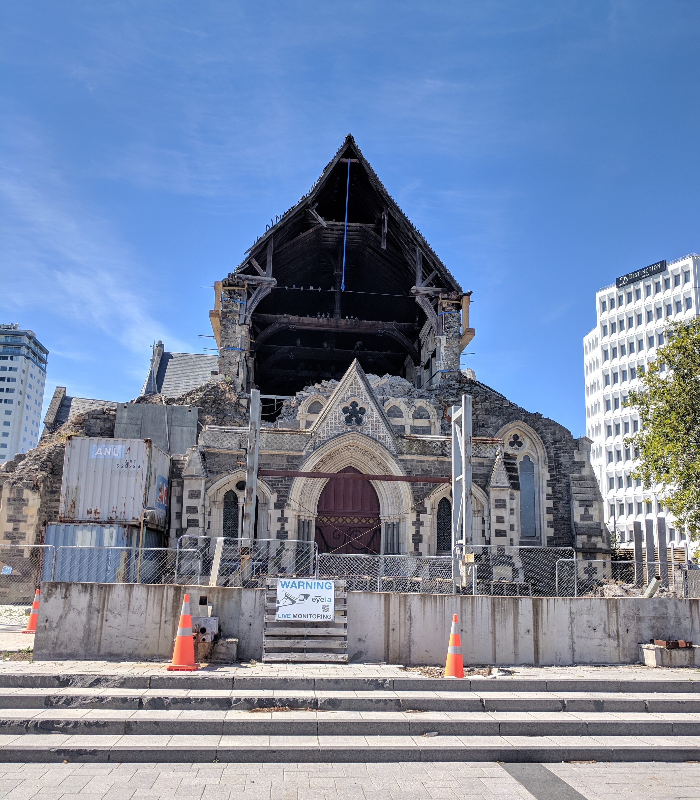
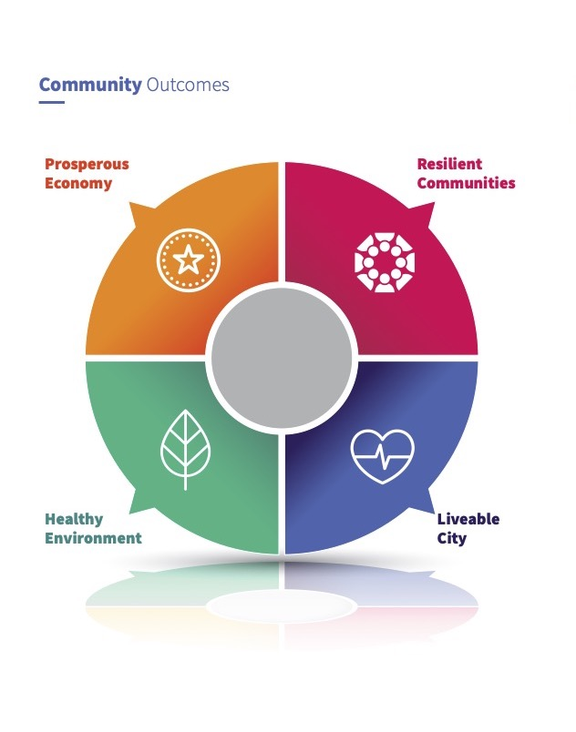
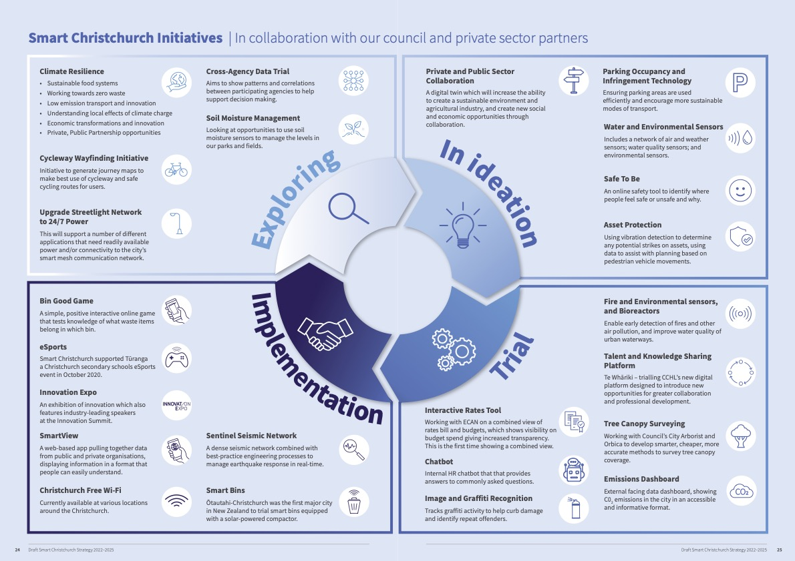
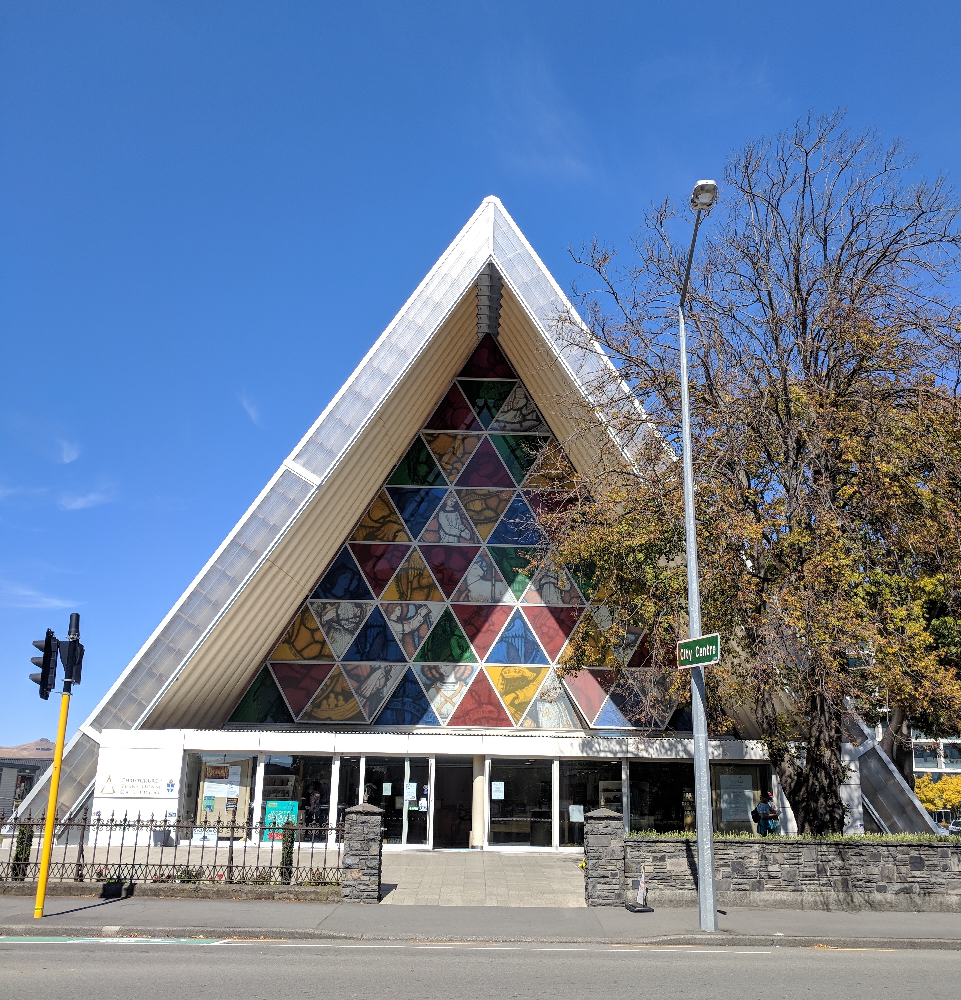

## Overview

<!-- About 100 to 150 word summary of the case study. -->

The Smart Christchurch Strategy was released and adopted by the Christchurch City Council in 2022 to “see Ōtautahi-Christchurch’s reputation build, so that when people “think innovation, they think Christchurch” - a city where anything is possible.” (p 22.) The Strategy showcases projects underway or completed and sets intentions to create further programs throughout the following three years.

### Timeline

#### **2010-11:** Earthquakes

Multiple earthquakes of magnitude 7 damaging or destroying 90% of Christchurch’s CBD and infrastructure.

#### **2013-15:** [Sensing City](https://www.arup.com/news-and-events/worldfirst-sensing-city-project-launched)

A project to collect real-time information about pedestrian and vehicle traffic flow, water and air-pollution, and more. Beginning in 2013, Christchurch began piloting sensor locations. Sensing City project was [ended in 2015](https://idealog.co.nz/tech/2015/09/christchurchs-sensing-city-project-shelved).

#### **2016:** [Smart Christchurch Programme](https://ccc.govt.nz/the-council/future-projects/smart-christchurch)

A Programme in the Christchurch City Council launched with the goal of collaborating with other councils and other partner companies to research, share data, and trial projects.

#### **2019:** [Digital Inclusion Action Plan](https://www.digital.govt.nz/digital-government/programmes-and-projects/digital-inclusion/digital-inclusion-action-plans/2019-digital-inclusion-action-plan/)

A plan released by New Zealand Government outlining a five-year strategic direction for digital inclusion to enable to participate in, contribute to, and benefit from a digital world.

#### **2020–2021:** [Digital Inclusion Action Plan](https://www.digital.govt.nz/dmsdocument/174~digital-inclusion-action-plan-20202021/html)

A re-releasing of the 2019 plan by New Zealand Government to prioritize urgent, emerging issues resulting from the COVID-19 pandemic.

#### **2022:** [Draft Smart Christchurch Strategy](https://ccc.govt.nz/assets/Documents/Consultation/2022/06-June/Draft-Smart-Cities-Strategy-FINAL-spreads.pdf)

A plan released by the Christchurch City Council on June 6th with a [website for public feedback](https://ccc.govt.nz/the-council/haveyoursay/show/524) open from June 23rd - July 14th. Christchurch City Council [adopted the Strategy](https://christchurch.infocouncil.biz/Open/2022/09/CNCL_20220908_AGN_7428_AT.PDF) with [amendments from public feedback](https://christchurch.infocouncil.biz/Open/2022/09/CNCL_20220908_AGN_7428_AT.PDF).

#### **2022-2025:** Smart Christchurch Strategy

Timeline included in report.

## Key Characteristics

<!--  Summarize the most visible essential characteristics of the project. For districts: How does the district employ 3-5 of the key characteristics of New Century Cities? For plans: How does the plan address each of the three activities (development, engagement, implementation) of the digital masterplanning process described in the 2015 Townsend and Lorimer paper?
-->

**Facilitative Approach**. Using the framework from New York University Maron Institute of Urban Management's ['Digital Master Planning' Working Paper](https://marroninstitute.nyu.edu/papers/digital-master-planning), the Smart Christchurch Strategy follows a ‘facilitative approach’.  “The facilitative approach is good for showing short-term progress (e.g. current election cycle) because the scoping process uncovers many technologies that are either available or already being implemented by the city without any central coordination. This means that minimal resources are needed in money and staff because the facilitative approach effectively coordinates and reports previous commitments in technology without requiring new long-term commitments.” (Townsend & Lorimer, 2015, pp.29)

**Effectiveness, Feasibility & Justice**. Using the framework from [Alize Carrere, PhD's research on "climatopias"](https://www.alizecarrere.com/research) at University of Miami, Abess Center for Ecosystem Science and Policy, the Smart Christchurch Strategy can be evaluated on its Effectiveness, Feasibility, and Justice.

- *Effectiveness*. The Strategy summarizes past, present, future initiatives to support innovation in diverse sectors. It is too early in the Strategy's timeline to effectively evaluate the effectiveness, but there are many exciting opportunities present.
As one [public feedback submission](https://ccc.govt.nz/the-council/haveyoursay/show/524) stated, it’s “an opportunity to build on Christchurch's uniqueness, particularly as a seismic engineering frontrunner.”
- *Feasibility*. The Strategy relies on current programs or projects, rather than moonshot ideas. Therefore, despite the lack of concrete milestones and dates, it is highly feasible as it is currently designed. As one [public feedback submission](https://ccc.govt.nz/the-council/haveyoursay/show/524) stated, Smart Christchurch “[needs] to take more risks if you want to produce anything world class.”
- *Justice*. The Strategy is highly people and community centered. Page 13 states, “Smart Christchurch’s strategy starts and ends with people; delivering community centered initiatives that benefit the city’s residents, businesses and visitors. By putting the community at the heart of everything we do, we will deliver initiatives that the community will not only support, but will take ownership of.”

## Goals and Aspirations

<!-- Summarize the most important goals of the project. Replace the placeholder title with a succinct name for the goal. The text should be around 50 words. -->

**Achieve & Advance**.  The main themes of the Strategy aim to inform residents, attract technical talent, summarize past efforts, and create a framework for future interventions. The Strategy describes Ōtautahi-Christchurch’s accomplishments since the earthquakes and defines intended advancements in supporting and growing their Smart Cities ecosystem.

**Co-Design & Collaborate**. The Strategy facilitates co-creation and collaboration across local and regional stakeholders. Page 14 states, “the programme looks for co-design opportunities using multi-disciplinary teams to ensure the problem that needs to be addressed is properly understood in order to develop solutions.” Page 17 states, “In conjunction with other councils we have been working to create an environment that supports shared learnings and in some cases technological solutions to help us all achieve our goals more quickly and efficiently.”

**Innovate & Invest**.  Through its human-centered, iterative approach, the Strategy aims to create “de-risked” environments through working spaces including [Enterprise Precinct and Innovation Campus (EPIC)](https://epicinnovation.co.nz/), events including [GovHack Aotearoa](https://govhack.org/locations/aotearoa/), studies, pilot opportunities, and trials.

## Technology Interventions
<!--  Identify 3-5 specific technology-enabled interventions the project employs or proposes. The text should be around 75-125 words. Separate into more than 1 paragraph as needed. This is a good place to insert additional images, be sure to include captions identifying the source and make sure to not use copyrighted images. -->

**Data Dissemination**. Ōtautahi-Christchurch participates in a cross-agency data sharing trial and the Council’s [SmartView](https://smartview.ccc.govt.nz/) web-based app aggregates and displays data from public and private organisations. SmartView’s replication strategy is to extend into their regions and expand nationally.

**Environmental Evaluation**. Smart Ōtautahi-Christchurch includes many software products, including a public C02 [Emissions Dashboards](https://smartview.ccc.govt.nz/apps/emissions), and infrastructure interventions, including [Smart Bins](https://www.smartcity.co.nz/products-services/smart-city-devices/smart-bin/) solar-powered rubbish compactors. New Zealand’s Climate Tech investment continues to grow both locally and nationally. In 2022, the national government announced the [NZ Super Fund](https://nzsuperfund.nz/) investment of US$100m in climate change mitigation and adaptation initiatives.

**Seismic Sensors**.  New Zealand is prone to earthquakes due to being located on the boundary between the Pacific and Australian tectonic plates. [Sentinel](https://sentinel.net.nz/) is a network of more than 150 seismological and geophysical sensors across Ōtautahi-Christchurch to manage earthquake response in real-time. In 2020, Sentinel began a [trial with the Wellington City Council](https://wellington.govt.nz/news-and-events/news-and-information/our-wellington/2020/07/seismic-sensor-network-trial) of approximately 100 sensors in Wellington using Canterbury Seismic Instruments](<https://www.csi.net.nz/>).

## Stakeholders
<!--  Identify 3-5 key stakeholder organizations or groups. The text should be around 50 words, and include a link to the organization.-->

**Public Sector**.

- [Christchurch City Council](https://www.ccc.govt.nz/).
- [Smart Christchurch Programme](https://smartchristchurch.org.nz/) set up by Christchurch City Council in 2016 to promote Ōtautahi-Christchurch as an open and connected city.

**Academia**.

- [Ara Institute of Canterbury](https://www.ara.ac.nz/) an institute of technology in Canterbury, New Zealand with a Ōtautahi-Christchurch campus. Ara Institute supports Strategy initiatives through [research](https://www.ara.ac.nz/news-and-events/news-stories/aras-own-dr.-amit-sarkar--acclaimed-as-smart-city-expert/) and events including hosting the [Smart Christchurch Hackathon](https://www.ara.ac.nz/news-and-events/news-stories/smart-christchurch-hackathon-succeeds-in-making-christchurch-a-smarter-city/).
- [Te Whare Wānanga o Waitaha | University of Canterbury](https://www.canterbury.ac.nz/) a public research university in Ōtautahi-Christchurch. University of Canterbury supports Strategy initiatives through [Smart Cities Free Online Course](https://www.canterbury.ac.nz/study/online/moocs/smart-cities/) and research including [‘Shaking for innovation: The (re)building of a (smart) city in a post disaster environment’](https://www.sciencedirect.com/science/article/abs/pii/S0264275116309519?via%3Dihub).

**Private Sector**.  

- Financial Institutions including [Bank of New Zealand](https://www.bnz.co.nz/).
- Manufacturers including [Canterbury Seismic Instruments](https://www.csi.net.nz/).
- Telecommunications companies including [Spark NZ](https://www.spark.co.nz/iot/home/).

**Spaces**.

- Incubators including [Ministry of Awesome](https://ministryofawesome.com/) and [ThincLab Canterbury](https://www.thinclab.nz/).
- Research and Innovation Labs including [Human Interface Technology Lab - New Zealand (HITLabNZ )](https://www.hitlabnz.org/) and [Te Ōhaka](https://teohaka.co.nz/) Centre for Growth & Innovation.

## Leadership
<!--  Conduct one interview with a project leader, and link to a LinkedIn or other profile. Provide a brief biography, no more than 75 words. Identify 3-5 insights or themes from the interview. Feel free to add a photo of the individual here. -->

Interviewed a consultant based in New Zealand supporting international government bodies and companies in foresight, innovation and large scale change. Key insights:

**Proactive v. Reactive**. Sensing City project was an attempt to improve the functionality of the city and quality of life for its residents. As an [Arup article](https://www.arup.com/news-and-events/worldfirst-sensing-city-project-launched) from 2013 notes, “Sensing City is a world-first project which will see sensors installed in Ōtautahi-Christchurch to collect real-time information about how a city actually works.” The 2010 and 2011 earthquakes presented an opportunity to rebuild while attracting local and foreign direct investment to surpass other Smart Cities and set an example for others. However, this ambitious project was ended in 2015.

**Foundations v. Retrofits**. Retrofitting buildings with Smart technologies is more expensive than including the hardware in their original foundations. Ōtautahi-Christchurch’s post-earthquake massive infrastructure projects presented an opportunity to equip new buildings with sensors to collect real-time data in the within their structures instead of retrofitting.

**Preeminence v. Alignment**. In 2013, Ōtautahi-Christchurch was positioned to lead the global Smart Cities movement and set the standard for others. There is now a higher standard expectation of innovation, data collection and data dissemination that Ōtautahi-Christchurch must work to align with. In 2023, there are [many international players](https://www.worldbank.org/en/programs/global-smart-city-partnership-program) in the Smart Cities movement from whom Ōtautahi-Christchurch can adapt current and proposed projects.

## Financing
<!--  Identify at least one financing scheme being used in this project or plan. About 100 words is probably a good length for this. -->

**Iteration**. The Strategy’s timeline is listed as 2022-2025. Page 9 of the Strategy states, "the strategy will be revisited and revalidated annually." This annual assessment enables the Council to center or pivot based on success metrics, defined on page 22 as “the quality of the solution multiplied by the volume of acceptance from citizens and stakeholders.”

**Regionality**. The Strategy Initiatives support regional partnerships and feed into long-term projects including [Greater Christchurch 2050](https://ccc.govt.nz/the-council/haveyoursay/show/346). The [Greater Christchurch Partnership Committee](https://greaterchristchurch.org.nz/) coordinates the partnership between National Ministers of the Crown and local councils to work towards a more sustainable and well-functioning region.

**Replication**. Page 17 states, “One approach we want to explore is a Smart Cities market place in New Zealand that will focus on supporting each local authority’s local tech and innovation communities whilst leveraging national procurement opportunities.” Successful pilots in Ōtautahi-Christchurch can be adapted to the needs of other cities and towns to align with national digitalization goals. Page 17 continues, “Smart Christchurch is committed to creating sustainable innovation - at an organisational and city level – that can be replicated throughout New Zealand.”

## Open Questions
<!-- Identify 1-3 open question(s). What is uncertain, unclear, or still unresolved about this project? These can be 50 words or less. -->

**Accountability**. Page 8 of the Strategy states, “No one area owns innovation – it’s in the fabric of everything the Council does." Incorporating innovation into all aspects of the Council shows the esteem of these initiatives. Yet, who will be accountable for the execution of proposed programs and projects if no one area of the Council is directly responsible?

**Inclusion**. [Public feedback submissions](https://ccc.govt.nz/assets/Documents/Consultation/2022/08-August/Draft-Smart-Christchurch-Strategy-submissions-for-web.pdf) highlight concern for potential exclusion of certain community groups from the Strategy’s development. Submissions requested prioritizing inclusion of the most vulnerable members of society and furthering co-design outreach to diversity groups including Disabled Person’s Organisations. How will the Council ensure they bridge, rather than widen, the digital divide?

**Timeline**. The Christchurch City Council will revisit the Strategy annually until its completion in 2025. However, time is vitally important. [Research](https://af8.org.nz/explore-the-science) indicates a 75% probability of a large earthquake occurring in the next 50 years along The Alpine Fault, a geological fault running almost the entire length of New Zealand's South Island. This impending [Alpine Fault Magnitude 8](https://af8.org.nz/) earthquake means seismic preparation is becoming increasingly important. How prepared will Ōtautahi-Christchurch and the rest of the South Island be? Are these Smart Seismic projects proactive enough to properly prepare the region?

## References

### Primary Sources

<!-- 3-5 project plans, audits, reports, etc. -->

- <https://ccc.govt.nz/assets/Documents/Consultation/2022/06-June/Draft-Smart-Cities-Strategy-FINAL-spreads.pdf>
- <https://christchurch.infocouncil.biz/Open/2022/09/CNCL_20220908_AGN_7428_AT.PDF>
- <https://ccc.govt.nz/the-council/haveyoursay/show/524>
- <https://ccc.govt.nz/the-council/plans-strategies-policies-and-bylaws/plans/long-term-plan-and-annual-plans/annual-plan-202223>

### Secondary Sources

<!-- 5-7 secondary source documents: news reports, blog posts, etc.. -->
- <https://www.arup.com/news-and-events/worldfirst-sensing-city-project-launched>
- <https://idealog.co.nz/tech/2015/09/christchurchs-sensing-city-project-shelved>
- <https://www.digital.govt.nz/digital-government/programmes-and-projects/digital-inclusion/digital-inclusion-action-plans/2019-digital-inclusion-action-plan/>
- <https://www.digital.govt.nz/dmsdocument/174~digital-inclusion-action-plan-20202021/html>
- <https://marroninstitute.nyu.edu/papers/digital-master-planning>
- <https://www.alizecarrere.com/research>
- Lukas Marek, Malcolm Campbell, Lily Bui, Shaking for innovation: The (re)building of a (smart) city in a post disaster environment, Cities, Volume 63, 2017, Pages 41-50, ISSN 0264-2751, [https://doi.org/10.1016/j.cities.2016.12.013](https://www.sciencedirect.com/science/article/pii/S0264275116309519)
