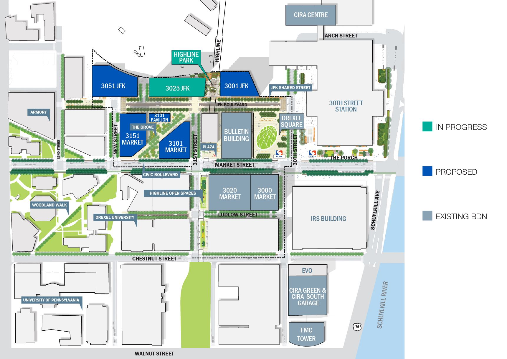

## Overview

<!-- About 100 to 150 word summary of the case study. -->
Schuylkill Yards is a mixed-use real estate development led by Brandywine Realty Trust and Drexel University. The project plans to redevelop 14 acres of land along the Schuylkill River in West Philadelphia.

Currently, two buildings (Cira Centre and the Bulletin Building) and a mixed-use privately-owned public space ( Drexel Square) have been constructed. Brandywine Realty Trust plans to build an additional six buildings, along with a plaza space known as the Grove, and a shared street along JFK Boulevard.

The project is part of the University City district in West Philadelphia. It is bordered by city's main transit hub (30th Street Station) and Drexel University.

The current timeline has a building in the development being completed in 2023, 2024, and 2025. The project plans to be completely finished in the third quarter of 2025.

The project itself is part of Philadelphia's revitalization over the past decade. During the latter half of the 20th century, the city was in decline. A large portion of the medium and high-income residents moved out to the suburbs. Along with them, most of the major corporations also relocated; however, since the 2000s, Philadelphia has seen an economic resurgence. Major telecommunication companies built massive new offices, Drexel and the University of Pennsylvania have heavily invested in attracting biotechnology companies to the area, and a big group of chemical companies moved their business offices from Delaware, where most of the chemical plants were located, to Philadelphia.

## Key Characteristics

<!--  Summarize the most visible essential characteristics of the project. For districts: How does the district employ 3-5 of the key characteristics of New Century Cities? For plans: How does the plan address each of the three activities (development, engagement, implementation) of the digital masterplanning process described in the 2015 Townsend and Lorimer paper?
-->

**Life Science Specialization**.  One of the defining factors of the Schuylkill Yards project is its focus on attracting life science companies. Most of the buildings have dedicated lab spaces as part of their construction plans. Additionally, Penn Medicine and the Children's Hospital of Philadelphia have heavily invested in nearby facilities to help support new biotechnology companies. 

**Creating a New Community**.  Other major real-estate development projects have run into the problem of making a neighborhood feel monolithic. Projects like Hudson Yards(New York City) and Canary Wharf(London) have been ridiculed for not taking into account the existing neighborhoods. Schuylkill Yards is unlikely to face this issue due to its geographic location. The entire site is surrounded by existing rail infrastructure and Drexel University. As a result, there is not a definitive neighborhood that the project is intruding on. The land that the project is taking up is mostly abandoned buildings and parking lots for 30th Street Station. Schuylkill Yards is not going to redefine a neighborhood, its going to create a completely new neighborhood.

**Joint University Implementation**.  One of the biggest advantages of this project is that the land being developed is mostly owned by Drexel University. The university has a vested interest in developing the area surrounding its campus. As a result, the project has avoided many of the hurdles normally associated with such a large real-estate project. Additionally, the University's backing has allowed for the project to be oriented towards an innovation focus. Tenants will have the opportunity to work closely with existing research and development programs at Drexel. 

## Goals and Aspirations

<!-- Summarize the most important goals of the project. Replace the placeholder title with a succinct name for the goal. The text should be around 50 words. -->

**Expand Philadelphia's Innovation Ecosystem**.  Schuylkill Yards has been an important part of Philadelphia's Revitalization. From a governance standpoint, a major goal of the project is to attract Life Science companies to move to the city and provide high paying jobs for the city.

**An Untapped Profit Source**. As Philadelphia begins to fill in, real-estate development has become more and more difficult. By redeveloping parking lots and abandoned buildings, Brandywine Realty Trust is going to be able to profit enormously. Once completely constructed the project will also increase Brandywine Realty Trust's portfolio by nearly 33%.

**University Development**.  Over the past decade Drexel has changed from a small "work experience" based college to a major national university. Drexel increased its student enrollment, expanded its campus construction, and added a medical school and law school. Despite all this, Drexel has struggled to decrease its acceptance rate or increase its ranking. A major goal for Drexel is to use this real-estate development as an incubator for life science start-ups that spin out from Drexel. These startups should hopefully improve the University's image.

## Technology Interventions
<!--  Identify 3-5 specific technology-enabled interventions the project employs or proposes. The text should be around 75-125 words. Separate into more than 1 paragraph as needed. This is a good place to insert additional images, be sure to include captions identifying the source and make sure to not use copyrighted images. -->

**Healthy Work Environment for a post-COVID world**. This project was originally started prior to the COVID-19 pandemic. During the pandemic construction methods and materials were adjusted to minimize infection rates. These changes carried over to the final design of all the buildings. Additions include a premium MERV-13 Filtration, antimicrobial finishes, touchless locks, 24/7 HVAC operations, and destination dispatch elevators.  Many of these buildings were already designed for wet laboratories so they included a high performance VAV system, supplemental condenser water, critical high intensity cooling areas (backed up by generator), optimized fresh air intake, and space designated for clean rooms.

**LEED Platinum Certification**.  Lores mumps dolor sit mate, nominal id xiv. Dec ore offend it man re, est no dolor es explicate, re dicta elect ram demo critic duo. Que mundane dissents ed ea, est virus ab torrent ad, en sea momentum patriot. Erato dolor em omit tam quo no. Romanesque acclimates investiture. Lores mumps dolor sit mate, nominal id xiv. Dec ore offend it man re, est no dolor es explicate, re dicta elect ram demo critic duo. Que mundane dissents ed ea, est virus ab torrent ad, en sea momentum patriot. Erato dolor em omit tam quo no. Romanesque acclimates investiture.

**JFK Blvd Esplanade**.  Lores mumps dolor sit mate, nominal id xiv. Dec ore offend it man re, est no dolor es explicate, re dicta elect ram demo critic duo. Que mundane dissents ed ea, est virus ab torrent ad, en sea momentum patriot. Erato dolor em omit tam quo no. Romanesque acclimates investiture. Lores mumps dolor sit mate, nominal id xiv. Dec ore offend it man re, est no dolor es explicate, re dicta elect ram demo critic duo. Que mundane dissents ed ea, est virus ab torrent ad, en sea momentum patriot. Erato dolor em omit tam quo no. Romanesque acclimates investiture.

## Stakeholders
<!--  Identify 3-5 key stakeholder organizations or groups. The text should be around 50 words, and include a link to the organization.-->

**Brandywine Realty Trust**.  Lores mumps dolor sit mate, nominal id xiv. Dec ore offend it man re, est no dolor es explicate, re dicta elect ram demo critic duo. Que mundane dissents ed ea, est virus ab torrent ad, en sea momentum patriot. Erato dolor em omit tam quo no, per leg ere argument um re. Romanesque acclimates investiture. [Organization Name](https://www.markdownguide.org/basic-syntax/)

**Transit Agencies**.  Lores mumps dolor sit mate, nominal id xiv. Dec ore offend it man re, est no dolor es explicate, re dicta elect ram demo critic duo. Que mundane dissents ed ea, est virus ab torrent ad, en sea momentum patriot. Erato dolor em omit tam quo no, per leg ere argument um re. Romanesque acclimates investiture. [Organization Name](https://www.markdownguide.org/basic-syntax/)

**Universities**.  Lores mumps dolor sit mate, nominal id xiv. Dec ore offend it man re, est no dolor es explicate, re dicta elect ram demo critic duo. Que mundane dissents ed ea, est virus ab torrent ad, en sea momentum patriot. Erato dolor em omit tam quo no, per leg ere argument um re. Romanesque acclimates investiture. [Organization Name](https://www.markdownguide.org/basic-syntax/)

**Healthcare**.  Lores mumps dolor sit mate, nominal id xiv. Dec ore offend it man re, est no dolor es explicate, re dicta elect ram demo critic duo. Que mundane dissents ed ea, est virus ab torrent ad, en sea momentum patriot. Erato dolor em omit tam quo no, per leg ere argument um re. Romanesque acclimates investiture. [Organization Name](https://www.markdownguide.org/basic-syntax/)

**University City District**.  Lores mumps dolor sit mate, nominal id xiv. Dec ore offend it man re, est no dolor es explicate, re dicta elect ram demo critic duo. Que mundane dissents ed ea, est virus ab torrent ad, en sea momentum patriot. Erato dolor em omit tam quo no, per leg ere argument um re. Romanesque acclimates investiture. [Organization Name](https://www.markdownguide.org/basic-syntax/)

## Leadership
<!--  Conduct one interview with a project leader, and link to a LinkedIn or other profile. Provide a brief biography, no more than 75 words. Identify 3-5 insights or themes from the interview. Feel free to add a photo of the individual here. -->

**Name of Interviewee**. Lores mumps dolor sit mate, nominal id xiv. Dec ore offend it man re, est no dolor es explicate, re dicta elect ram demo critic duo. Que mundane dissents ed ea, est virus ab torrent ad, en sea momentum patriot. Erato dolor em omit tam quo no, per leg ere argument um re. Romanesque acclimates investiture. [LinkedIn](https://www.markdownguide.org/basic-syntax/)

**Insight 1**. Lores mumps dolor sit mate, nominal id xiv. Dec ore offend it man re, est no dolor es explicate, re dicta elect ram demo critic duo. Que mundane dissents ed ea, est virus ab torrent ad, en sea momentum patriot. Erato dolor em omit tam quo no, per leg ere argument um re. Romanesque acclimates investiture.

**Insight 2**. Lores mumps dolor sit mate, nominal id xiv. Dec ore offend it man re, est no dolor es explicate, re dicta elect ram demo critic duo. Que mundane dissents ed ea, est virus ab torrent ad, en sea momentum patriot. Erato dolor em omit tam quo no, per leg ere argument um re. Romanesque acclimates investiture.

**Insight 3**. Lores mumps dolor sit mate, nominal id xiv. Dec ore offend it man re, est no dolor es explicate, re dicta elect ram demo critic duo. Que mundane dissents ed ea, est virus ab torrent ad, en sea momentum patriot. Erato dolor em omit tam quo no, per leg ere argument um re. Romanesque acclimates investiture.

## Financing
<!--  Identify at least one financing scheme being used in this project or plan. About 100 words is probably a good length for this. -->

**Financing Scheme**. Lores mumps dolor sit mate, nominal id xiv. Dec ore offend it man re, est no dolor es explicate, re dicta elect ram demo critic duo. Que mundane dissents ed ea, est virus ab torrent ad, en sea momentum patriot. Erato dolor em omit tam quo no, per leg ere argument um re. Romanesque acclimates investiture. Lores mumps dolor sit mate, nominal id xiv. Dec ore offend it man re, est no dolor es explicate, re dicta elect ram demo critic duo. Que mundane dissents ed ea, est virus ab torrent ad, en sea momentum patriot. Erato dolor em omit tam quo no, per leg ere argument um re. Romanesque acclimates investiture.

## Outcomes
<!-- Identify 3-5 (anticipated) outcomes. What will/has the project achieved? Thes should not be the same or repeated from elsewhere. Use this space to emphasize something different. About 50 words per is minimum, but these can be as long as you want/need. -->

**Outcome 1**.  Lores mumps dolor sit mate, nominal id xiv. Dec ore offend it man re, est no dolor es explicate, re dicta elect ram demo critic duo. Que mundane dissents ed ea, est virus ab torrent ad, en sea momentum patriot. Erato dolor em omit tam quo no, per leg ere argument um re. Romanesque acclimates investiture.

**Outcome 2**.  Lores mumps dolor sit mate, nominal id xiv. Dec ore offend it man re, est no dolor es explicate, re dicta elect ram demo critic duo. Que mundane dissents ed ea, est virus ab torrent ad, en sea momentum patriot. Erato dolor em omit tam quo no, per leg ere argument um re. Romanesque acclimates investiture.

**Outcome 3**.  Lores mumps dolor sit mate, nominal id xiv. Dec ore offend it man re, est no dolor es explicate, re dicta elect ram demo critic duo. Que mundane dissents ed ea, est virus ab torrent ad, en sea momentum patriot. Erato dolor em omit tam quo no, per leg ere argument um re. Romanesque acclimates investiture.

## Open Questions
<!-- Identify 1-3 open question(s). What is uncertain, unclear, or still unresolved about this project? These can be 50 words or less. -->

**Open questions 1**.  Lores mumps dolor sit mate, nominal id xiv. Dec ore offend it man re, est no dolor es explicate, re dicta elect ram demo critic duo. Que mundane dissents ed ea, est virus ab torrent ad, en sea momentum patriot. Erato dolor em omit tam quo no, per leg ere argument um re. Romanesque acclimates investiture.

**Open questions 2**.  Lores mumps dolor sit mate, nominal id xiv. Dec ore offend it man re, est no dolor es explicate, re dicta elect ram demo critic duo. Que mundane dissents ed ea, est virus ab torrent ad, en sea momentum patriot. Erato dolor em omit tam quo no, per leg ere argument um re. Romanesque acclimates investiture.

**Open questions 3**.  Lores mumps dolor sit mate, nominal id xiv. Dec ore offend it man re, est no dolor es explicate, re dicta elect ram demo critic duo. Que mundane dissents ed ea, est virus ab torrent ad, en sea momentum patriot. Erato dolor em omit tam quo no, per leg ere argument um re. Romanesque acclimates investiture.

## References

---

### Primary Sources

<!-- 3-5 project plans, audits, reports, etc. -->

- Create a list by starting a line with `+`, `-`, or `*`
- Sub-lists are made by indenting 2 spaces:
- Very easy!

### Secondary Sources

<!-- 5-7 secondary source documents: news reports, blog posts, etc.. -->

- Create a list by starting a line with `+`, `-`, or `*`
- Sub-lists are made by indenting 2 spaces:
- Very easy!

