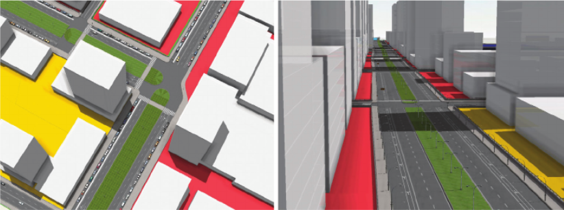

<!--
Allowed values:

type: district, plan

tags: Environment, Mobility, Buildings, Energy, InformationSystems, HealthEducation, InnovationSystems, CivicTech, CivicInnovation, Food

-->

## Overview

<!-- About 100 to 150 word summary of the case study. -->

The Chicago Lakeside Master Plan was an ambitious redevelopment project designed to transform a 600-acre former industrial site on the South Side of Chicago. Chicago’s South Side was home to the U.S. Steel South Works, once the largest producer of structural steel in the world, but it has remained vacant for nearly 30 years since the downsizing began in the 1970s due to various reasons. Key inspirations for the project included the distinctive city grid of Chicago, which is highlighted by street lights visible when flying into the city at night, and the city’s legacy of parklands as planned by the renowned urban planner, Daniel Burnham. As the developer of the Lakeside project, McCaffery was inspired by the vision of reconnecting this industrial area back into the city grid. Conceived by the international design firm Skidmore, Owings & Merrill LLP (SOM), the plan aimed to create a sustainable, mixed-use community focusing on renewable energy, zero waste, and biodiversity. The project sought to revitalize the Lakeside and create a model for future LEED-ND developments. The Chicago Lakeside Master Plan intended not only to boost the local economy but also set a standard in urban sustainability. However, the Chicago Lakeside Master Plan eventually failed after the U.S. Steel and McCaffery Interests parted ways on the agreements to proceed with the project.

## Goals and Aspirations

<!-- What is the project trying to achieve? Identify 3-5 high-level goals that define the entire project.Replace the placeholder title with a succinct name for the goal. -->

**Reconnect the area to the city**.  The project aimed to extend Chicago’s famous lakefront parks, creating a continuous "necklace" of green spaces through the site to the southern edge of the city. Additionally, the development included a new street network and zoning changes to transform the area from a manufacturing district into a mixed-use community more reflective of the broader city. A significant portion of the site was dedicated to the Chicago Park District, enhancing the city's park system. Another crucial aspect was the construction of Lakeshore Drive through the site, funded with substantial municipal investment, to ensure vital connectivity. Today, we can see a nice boulevard and road system designed to connect the area back to the city. These elements collectively aimed to fulfill future city needs by blending connectivity, green spaces, and urban integration.

**Sustainable development**. Other than the park system mentioned above, another sustainable goal was to deal with stormwater management, but was not completely executed. The Chicago Lakeside project aimed to transform an industrial "wasteland" into a sustainable development reflective of 21st-century goals. The project sought to break from Chicago's legacy of less sustainable infrastructure. The site itself, built on landfill material from steel production byproducts, is highly permeable and was considered in the innovative stormwater management plan. Instead of traditional infrastructure that channels stormwater into potentially overwhelmed sewers, the plan encouraged natural absorption into the landfill material, reducing the impact on Lake Michigan. This approach was part of a broader strategy to update utilities and infrastructure in ways that respect and preserve local resources, particularly water, in response to climate change and historical practices.

**Mixed-use community and Environmental leadership**.  The Chicago Lakeside Master Plan proposed a mixed-use community integrating a continuous lakefront park, residential buildings, commercial and civic districts, and connection to public transportation. This included 20 million square feet of retail, 15,000 new residential units, 130 acres of open spaces, and amenities. The project also aimed to set a standard for future urban development in terms of sustainability and innovation by achieving LEED ND certification.

## Key Characteristics

<!--  How is the project organized into specific activities that advance these goals? For plans: How does the plan address each of the three activities in digital master plans (development, engagement, implementation). For districts: How does the district employ 3-5 of the key characteristics of innovation hubs?
-->

**Development**. The development of the Master Plan focused on the infrastructural transformation of the Southworks site, achieving the goal of reconnecting the site back to the city. President Woodbury explained the comprehensive strategy to rezone and reconstruct the former industrial area. This included laying down a new street network and extending the park system and zoning regime, which facilitated a mixed-use environment that mimicked the diversity of Chicago itself. Other key infrastructural transformations include systems for renewable energy, water, and waste management, high-efficiency building envelopes, and MEP systems. Also, the Master Plan includes the development of commercial areas, residential areas, recreation facilities, and a living lab to make Chicago Lakeside a mixed-use space.

**Engagement**.  The Chicago Lakeside project is a joint venture between two private companies, McCaffery and U.S. Steel, and the project also involves the city of Chicago. McCaffery’s involvement began through an introduction by an attorney representing the U.S. Steel, emphasizing the strategic importance of connecting the site to the rest of the city and extending the legacy of Chicago's park systems designed by Daniel Burnham. The city of Chicago also actively participated in this project, and the former Mayor of Chicago Daley said “It was really a worthless piece of land without those roads connecting it.” The city approved the fund for the Lakeside project’s infrastructural development. Community engagement is also crucial for this kind of mega project. The projects gained support from most of the South Shore residents, while some residents still had questions about the development like how long the project will take.

**Implementation**.  Some activities would occur during the initial phase of the Lakeside project including eliminating the blighting conditions in the area, clearing and grading the land, provide adequate water, sewers, and electrical power for development. Then, some infrastructural development was implemented including rezoning, creating new road systems, and extending the park system which connected the area back to the city grid. Later, the project planned to construct new market rate and affordable units, construct new commercial buildings, and recreational facilities.

## Stakeholders
<!--  Who initiated the project? Who is leading the project forward? Who else has a say in how it unfolds? Who is directly affected but marginalized? Identify 3-5 key stakeholder organizations or groups. Identify 3-5 key individuals. These are people who are associated with the project as leaders, supporters, critics, or regulators. They are likely to be members of the stakeholder groups identified above. These are people you should try to contact for one or more interviews.-->

**McCaffery Interest**.  McCaffery is a real estate company developer partnered with U.S. Steel, focusing on the commercial aspects and the overall execution of the entire project. Ed Woodbury, as a leader in McCaffery Interest, is involved in pushing the project forward and ensuring the project’s progress.  [McCaffery Interest](https://www.mccafferyinc.com/)

**U.S. Steel**.  As the local government, the city of Chicago plays regulatory and supportive roles in this project, providing necessary approvals, funds, and facilitating community engagement in the project. [U.S. Steel](https://www.ussteel.com/)

**Skidmore, Owings & Merrill LLP (SOM)**. SOM is a architectural and urban planning firm behind the Lakeside Master Plan, playing an important role in designing and envisioning the entire project. They are responsible for sustainable and innovative development of the project. [SOM](https://www.som.com/)

## Technology Interventions
<!--  What specific technology-enabled interventions does the project propose? Identify 3-5 technology interventions. Describe use cases, value proposition, solution architecture, data created or consumed, key platforms and standards, business models, regulatory issues, etc. Separate into more than 1 paragraph as needed. This is a good place to insert additional images, be sure to include captions identifying the source and make sure to not use copyrighted images. -->

**LakeSim**. A prototype computational framework developed by SOM. University of Chicago and McCaffery. LakeSim would connect urban design tools with scientific computer models to create simulations for the project. Before LakeSim, designers had tools for planning single buildings or developments in 20 to 30 acres. LakeSim allows designers to simulate the influence of designs on various aspects such as the environment, transportation, and business for hundreds of acres and decades of years. For example, designers can change a residential block to a commercial and LakeSim can quickly analyze the impact of this change. Therefore, designers do not have to plan different pieces of infrastructure separately and can test changes efficiently on a wider range.

**District heating and cooling and battery technology**.  The Chicago Lakeside master plan wanted to use district heating and cooling systems to eliminate the need for boilers and chillers. Also, President Woodbury said that they had formed an alliance with the University of Chicago which controlled the Argonne National Lab on the research side to explore next-generation infrastructure concepts. One of the things they explored was how to create next-generation battery technology where they could take the electricity from the grid where the heat sources were waste from industry, geothermal and solar thermal energy, biomass power plants, and other sustainable sources. Then, they could store it and reuse it when you need it. Some of the battery technologies are well known today, but it was started back in 2008. Their plan was to build a few houses, put battery technologies into those houses, and create a solar grid based on these. With large-scale thermal energy storage, the system can provide flexibility to the energy grid. The ability to store and retrieve heat effectively allows these systems to act as a thermal battery, thus providing load-balancing services to the grid.

## Financing
<!--  How are the technology interventions identified to be financed? How does this fit into financing of the larger project? Identify at least one financing mechanism that is being used. -->

**Tax Increment Financing (TIF)**. Tax increment financing is a strategic tool used by the city of Chicago to fund public and private investment aimed to promote the economy and revitalize a specific area in the city. When a TIF district is created, all properties within the district are set to base EAV. As property values increase, any additional property tax generated over the base EAV is captured by TIF. In 2010, the city of Chicago approved this master plan proposed by McCaffery and U.S. Steel with 98M for phase 1.

## Outcomes
<!-- What results has the project produced to date? What outcomes and impacts are anticipated? Identify 3-5 (anticipated) outcomes. What will/has the project achieved? Thes should not be the same or repeated from elsewhere. Use this space to emphasize something different. -->

The ambitious Chicago Lakeside development ultimately did not proceed as planned. President Woodbury cited the realignment of priorities and changes in leadership at U.S. Steel, along with the extensive time and resources required, as primary reasons for the project's cessation. The departure from the partnership was described as amicable but necessary. He used the phrase “all that’s beyond our paygrade”, reflecting the complex nature of large-scale urban redevelopment projects.

## Open Questions
<!-- What is uncertain, unclear, or still unresolved about this project? Identify 1-3 open question(s). -->

- How could the Chicago Lakeside Master Plan impact the Chicago's economy if it was fully executed?

- How could this development affect the local communities, particualrly in terms of housing, employment, and infrastructure?

- How do you envision the Lakeside area evolving in the next decade?

## References

---

### Primary Sources

<!-- 3-5 project plans, audits, reports, etc. -->

- [Chicago Lakeside Master Plan](https://www.som.com/projects/lakeside-master-plan/#:~:text=Organized%20around%20a%20walkable%20compact,the%20area's%20existing%20transit%20stations.)
- [City of Chicago: Chicago Lakeside Phase 1 TIF](https://www.chicago.gov/city/en/depts/dcd/supp_info/tif/chicago_lakesidephase1.html)
- [Park 566 (USX) Framework Plan](https://assets.chicagoparkdistrict.com/s3fs-public/documents/page/Park_566_Framework_Plan_2015-4-30.pdf)
- [McCaffery: Chicago Lakeside Development](https://www.mccafferyinc.com/portfolio/chicago-lakeside-development)
- [Designing Future Cities – LakeSIM Integrated Design Tool For Assessing Short- and Long-Term Impacts of Urban Scale Conceptual Designs](https://www.researchgate.net/publication/281099639_Designing_Future_Cities_-_LakeSIM_Integrated_Design_Tool_For_Assessing_Short-_and_Long-Term_Impacts_of_Urban_Scale_Conceptual_Designs)

### Secondary Sources

<!-- 5-7 secondary source documents: news reports, blog posts, etc.. -->

- <https://archive.ph/20120707095227/http://columbiachronicle.com/huge-development-in-works/>
- <https://www.anl.gov/article/chicago-lakeside-development-to-benefit-from-computationenabled-design>
- <https://www.starconference.org.uk/star/2012/Smith.pdf>
- <https://chicago.curbed.com/2016/3/1/11140996/chicago-lakeside-development-project-abandoned>
- <https://www.cordoganclark.com/masterplanning/projects_master_planning_chicago_lakefront.html>
- <https://openhousechicago.org/sites/site/chicago-lakeside-development/>
- <https://voices.uchicago.edu/collaborativechicagoatlas/2019/12/23/96/>
