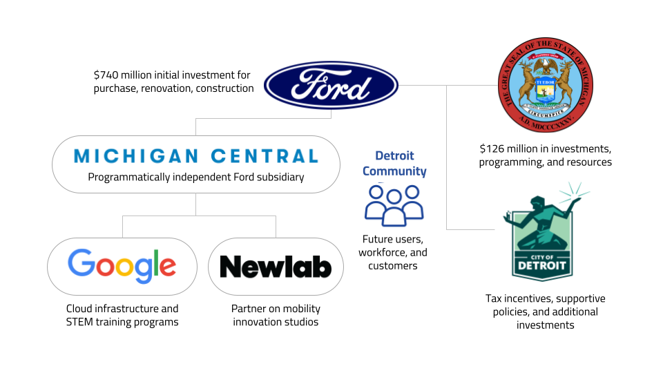
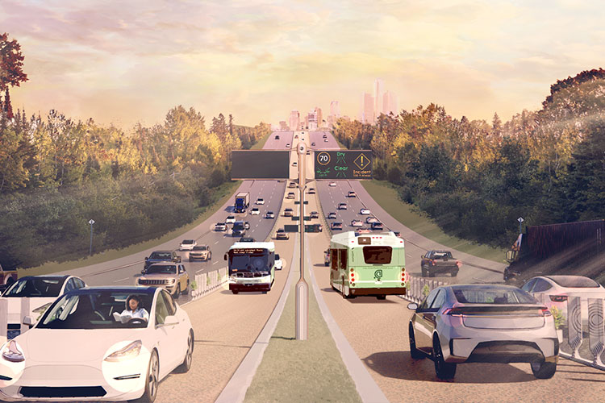

<!--
Allowed values:

type: district, plan
tags: Environment, Mobility, Buildings, Energy, InformationSystems, HealthEducation, InnovationSystems, CivicTech, CivicInnovation, Food

-->

## Overview

<!-- About 100 to 150 word summary of the case study. -->

Michigan Central Innovation District is a mobility innovation district anchored by the Michigan Central Train Station in Detroit’s historic Corktown neighborhood. The 30-acre campus is envisioned as a hub for talent, mobility innovation, entrepreneurship, sustainability, affordable housing, small business opportunities, and community engagement.

Located in a formerly derelict station out of use since 1989, the surge of public and private investment in the district following a period of industrial decline symbolizes a renewal of Detroit’s leadership in mobility.

The district features tech-enabled innovation labs and workspaces, testing infrastructure, restaurants, retail, community and event spaces, and plazas. The district includes Michigan Central Station, the Book Depository, Building West, and The Factory, a building housing Ford’s autonomous vehicle business unit. Michigan Central is funded and supported by a public-private partnership between Ford Motor Company and the State of Michigan and City of Detroit, and private partners including Google and NewLab.

## Goals and Aspirations

<!-- What is the project trying to achieve? Identify 3-5 high-level goals that define the entire project.Replace the placeholder title with a succinct name for the goal. -->

**Build the future of mobility technology.** The District's primary goal is to develop, test, and scale urban transportation solutions that advance a more sustainable and equitable future, including autonomous vehicles, electric vehicles, scooters, light rail, and drones. Michigan’s role in the auto industry positions Michigan Central to lead the transformation of the industry toward more fully electric and hybrid systems, autonomous driving, and increased connectivity. To support mobility innovation, the City of Detroit has designated Michigan Central as a Transportation Innovation Zone, streamlining the process for small businesses and entrepreneurs to safely develop, test, and deploy mobility technologies in real-world environments.

**Spur economic and community development through innovation.** The redevelopment of Michigan Central is anticipated to create jobs, housing, and programming that bolsters the city and state’s economy, with an emphasis on talent attraction and retention. State agencies will provide funding and resources to support workforce development training and infrastructure in the District. Michigan State Housing Development Authority (MSHDA) will promote housing and community development and civic engagement in a way that ties industry growth and innovation with neighborhood vitality and inclusiveness both in and around the Innovation District. MDOT will also assist in making roadways near the district more accessible and usable by all modes of transportation. The campus is designed to be an open platform with convening places to promote innovation between different people, companies, and sectors. Companies that are located at Michigan Central become part of a community of entrepreneurship and problem-solving, with proximity to the world’s most important mobility companies or have access to cutting-edge testing capabilities.

**Position Detroit and Michigan as an emerging leader in tech.** Powered by companies like Ford and General Motors, Detroit led automotive innovation for more than a century. Michigan Central repositions Detroit at the forefront of mobility innovation over the next century to define the future of transportation beyond the automobile. Michigan Central is a phoenix rising from the ashes of Detroit’s industrial decline, instilling hope for the city and the region’s economic future. Nearly every project leader has noted the importance of the project for the region and its future. Bill Ford has stated, "there's no place in the world more important for transportation's past, present and future than Detroit and Michigan… we don't plan to seed that future to anyone else." Michigan Governor Gretchen Whitmer announced, “We want to make it very clear - Michigan is the undisputed leader in the nation's automotive landscape." And Detroit Mayor Mike Duggan noted the area's transformation in the project's announcement: “Just a few years ago, [Michigan Central] was our city’s international symbol of abandonment. Now, it’s the symbol of our city’s resurgence."

## Key Characteristics

<!--  How is the project organized into specific activities that advance these goals? For plans: How does the plan address each of the three activities in digital master plans (development, engagement, implementation). For districts: How does the district employ 3-5 of the key characteristics of innovation hubs?
-->

**Mobility technology testing and development.** Michigan Central's main asset in advancing mobility technology is its infrastructure to enable different types of testing in real-world conditions. The district is a mile from the riverfront, directly faces the 6-lane interstate highway of Michigan Avenue, surrounded by expressways, and additional features such as tunnels between buildings. The district employs an open-platform model connecting start-ups with established companies, government entities, and innovators to collaborate and fast-track solutions. Michigan Central's mobility initiatives include its mobility pilot programs with Newlab, the Advanced Aerial Innovation Region designed to advance commercial drone development and testing, and the Michigan Mobility Corridor, a connected and autonomous (CAV) corridor between Detroit and Ann Arbor.

**Workforce development and digital skills training.** The district will provide programs and opportunities for high-skill job creation, startup company growth, risk capital, technology commercialization and other economic opportunities. Michigan Central Foundation will provide charitable and educational training, programming and research for residents, students and businesses in the area, as well as science activities Public-private partners are integral to this goal: Google offers mentorship and digital certification programs such as Code Next, a free coding education for high schoolers. The Michigan Department of Labor and Economic Opportunity will provide world-class training, post-secondary adult education and career readiness resources in the district, including a potential physical space to host apprentice programs, employer-led collaboratives, the Going Pro Talent Fund and more, to prepare local workers for high-tech jobs in mobility and other emerging fields.

**Community-oriented, mixed-use district design.** Designed as a walkable community plan, the district will prioritize the needs of community members and businesses in the region while connecting the Corktown neighborhood with the surrounding region. Michigan Central engaged with Detroit residents in an 18-month research project to inform a plan tailored around community needs which includes public plazas, walkways, and public art designed by local artists. Ford’s plans for the station to include restoration of the grand hall to its original luster; attraction of local shops and restaurants; and creating new residential options in the up-and-coming neighborhood. The station will serve as a public space for people to enjoy, with more details to come in the future. Ford is committed to working with Corktown residents and businesses to make certain its development efforts align with the historic nature of the community and complement other planned developments to revitalize the neighborhood.

## Stakeholders
<!--  Who initiated the project? Who is leading the project forward? Who else has a say in how it unfolds? Who is directly affected but marginalized? Identify 3-5 key stakeholder organizations or groups. Identify 3-5 key individuals. These are people who are associated with the project as leaders, supporters, critics, or regulators. They are likely to be members of the stakeholder groups identified above. These are people you should try to contact for one or more interviews.-->

**Michigan Central.** Michigan Central operates as a limited liability corporation, a subsidiary of Ford Motor Company, and the automaker's not-for-profit philanthropic arm and business association. Michigan Central operates programmatically independently from Ford. Since its formation in 2022, it has been led by CEO Joshua Sirefman and COO Carolina Pluszczynsky, and has a staff of about 50 including full-time employees and contractors. [Michigan Central] (<https://michigancentral.com/introducing-michigan-centrals-new-ceo-joshua-sirefman/>)

**Ford Motor Company.** Ford acquired Michigan Central Station and the surrounding property in 2018, and since then has invested $950 million in the campus. Ford leads research, testing, and launching of new mobility solutions. Ford's leadership in the project is spearheaded by Executive Chairman Bill Ford, CEO Jim Farley, and Ford Fund President Mary Culler. [Ford](https://michigancentral.com/collaborations/#collab-ford)

**City of Detroit and State of Michigan.** Ford entered a public-private partnership agreement to foster innovation, modernize regulations, build a safe and fast piloting process for new mobility solutions, provide infrastructure to support innovation. As part of a Memorandum of Understanding (MOU) with Ford, the state plans to align more than $126 million in new and existing investments, programming, and resources to support the district’s goals. This pledge involves the cross-departmental collaboration between the Michigan Office of Future Mobility and Electrification (OFME), the Michigan Economic Development Corporation (MEDC), Michigan Department of Labor and Economic Opportunity (LEO), Michigan State Housing Development Authority (MSHDA), Michigan Department of Transportation (MDOT), and the Michigan Department of Environment, Great Lakes, and Energy (EGLE). State led by Governor Gretchen Whitmer and Detroit led by Mayor Mike Duggan. [State of Michigan and City of Detroit](https://michigancentral.com/collaborations/#collab-mi-det)

**Google.**  As a Founding Member, Google is a private sector partner that contributes research and development to new mobility products and services, supports the district’s data management through Google Cloud technology, and provides workforce development programs such as coding classes and mentorship of entrepreneurs and local businesses. Google’s involvement in the project is designed to attract startups and investment, as well as expands Google’s presence in the Midwest beyond its existing 600 Michigan-based employees. Google's involvement in the project is led by Senior Vice President and Chief Financial Officer Ruth Porat. [Google](https://michigancentral.com/collaborations/#collab-google)

**NewLab.**  Michigan Central is partnering with Brooklyn-based Newlab on its studio model, which will serve as the catalyst for innovation in the district for pilot projects. Newlab has launched two studios: The Accessible Streets Studio, which has selected seven companies to pilot technology to meet community needs around mobility challenges, and The Mobility Studio, which selected five companies for their groundbreaking work with electric vehicles and other clean mobility tech.
[NewLab](https://michigancentral.com/collaborations/#newlab)

## Technology Interventions
<!--  What specific technology-enabled interventions does the project propose? Identify 3-5 technology interventions. Describe use cases, value proposition, solution architecture, data created or consumed, key platforms and standards, business models, regulatory issues, etc. Separate into more than 1 paragraph as needed. This is a good place to insert additional images, be sure to include captions identifying the source and make sure to not use copyrighted images. -->

**Commercial drone technology development.** In 2023, Michigan Central launched the Advanced Aerial Innovation Region, the nation’s first cross-sector aerial initiative to drive the commercialization and adoption of drone technology, which is projected to be a $30-50 billion industry by 2030. Covering a 3-mile radius around Michigan Central, the two-year project provides open, shared infrastructure and services that enable commercial drone development. Michigan Central will provide resources for foundational infrastructure, community engagement and skills training. MDOT will manage the network and define operating parameters, as well as data and safety protocols. Flight data from all pilots will feed the initiative’s overarching goal to drive drone operations beyond visual line of sight (BVLOS). Gaining Federal Aviation Administration (FAA) BVLOS approval reduces barriers to commercial development, allowing operators to fly drones without maintaining visual sightlines. Airspace Link will provide the platform and processes to support safe operations in a real-world urban environment. The project will also cultivate workforce development opportunities and skills programs to create a pipeline of talent prepared to join the emerging advanced aerial economy.

**Transition to electrification.** Electrification and grid decarbonization are driving several technological interventions in the district and further strengthening the state’s supply chain network. Israel-based Electreon partnered with the Michigan Department of Transportation and Michigan Central to create the nation’s first public, wireless, in-road charging system, allowing it to test its new technology and letting others use it to develop innovations of their own. EcoG, Inc. a Munich-based provider of electric vehicle level 3 charging technology, has also announced that it is establishing its U.S. headquarters in Michigan Central. The siting is part of the company’s goal to leverage the EV fast-charging capability in North America and promote Detroit as the hub of this  technology. Michigan was chosen for the project over competing sites in Georgia and Ohio due to the synergy and ease of collaboration with the mobility innovation ecosystem in Corktown. The project is expected to generate a total private investment of $14.4 million and create 45 high-wage jobs.

**Connected and autonomous vehicle (CAV) corridor.** Michigan Mobility Corridor is Michigan Central's pilot of an autonomous vehicle corridor on Michigan Avenue that will build or assign dedicated lanes for automated vehicles on 40 miles of the Interstate 94 corridor. The project will link the University of Michigan in Ann Arbor to Detroit’s downtown and Metropolitan Airport,  closing a gap in access to reliable public transportation across Southeast Michigan. The project is led by Cavnue, a company founded by Google subsidiary Sidewalk Infrastructure Partners, in partnership with the State of Michigan. A two-year study is currently being conducted to determine whether existing lanes can be used or new lanes will need to be built.

## Financing
<!--  How are the technology interventions identified to be financed? How does this fit into financing of the larger project? Identify at least one financing mechanism that is being used. -->

**Ford real estate investment.** In November 2018, then-Ford executive Joe Hinrichs said the project would cost an estimated $740 million for the purchase, renovation, and new construction of the station and neighboring properties, and the company plans to seek more than $238 million in tax incentives. The acquisition for the building cost roughly $90 million, represented the first major mixed-use expansion south of Detroit’s central business district in years.

**Public-private partnership and tax incentives.** As part of a Memorandum of Understanding (MOU) with Ford, the state of Michigan plans to align more than $126 million in new and existing investments, programming, and resources to support the district’s goals. This investment also includes the alignment of existing state assets, such as the reconstruction of Michigan Avenue and the development of new housing units around the district by the Michigan State Housing Development Authority.

**Venture capital.** In total, startups at Michigan Central have raised more than $500 million in venture capital funding. Additionally, there is a $1.5 million Michigan Central Scale Fund to help scale technology-based startups, with funding supported by the district's public-private partnership with the State of Michigan and the City of Detroit, the Michigan Strategic Fund.

**Ongoing revenue generation.** According to Michigan Central COO Carolina Pluszczynsky, the long-term objective for Michigan Central is to be self-sustaining through a combination of earned income, philanthropy, and public support.

## Outcomes
<!-- What results has the project produced to date? What outcomes and impacts are anticipated? Identify 3-5 (anticipated) outcomes. What will/has the project achieved? Thes should not be the same or repeated from elsewhere. Use this space to emphasize something different. -->

**Creation of 5,000 jobs.**  The project is anticipated to create 5,000 jobs, half of which will be Ford employees (most from the mobility team), and the other half non-Ford partners. These jobs include high-skilled jobs in technology and engineering, jobs to support the district's housing and commercial activity (including retail and small business on the campus), and jobs with Michigan Central on the management and operations of the district.

**1.2 million square feet of commercial real estate and 300,000 square feet of community, retail, and housing.** Three-quarters of the 1.2 million square feet will be split between Ford and its partners. More than 30 companies — half from Michigan, half from around the world — are already calling Michigan Central home. A third of these companies are led by founders from underrepresented communities. 300,000 square feet will serve as a mix of community and retail space, and residential housing.

**Upskilling and reskilling of local workforce**. One of the project's goals is building up local talent through workforce development and training programs with support from public and private partners. Several initiatives aims to equip Detroiters with skills for in-demand jobs, particularly for women and people of color in tech. One partnership with ChargerHelp, Henry Ford Community College, and the Society of Automotive Engineers is training its second cohort of training Detroiters to become electric vehicle supply technicians in 4-6 weeks. Google's Code Next Detroit at Michigan Central aims to train the next generation of Michigan entrepreneurs by providing a space where high schoolers will learn coding and other technical skills. The program focuses on Black, Latinx, and Indigenous students, and demonstrates the value of collaboration by offering hands-on training with state-of-the-art technology for Detroit teens, from laptops to virtual reality, with access to Google mentors and other industry experts.

**Innovation multiplier effect.** Ford's initial acquisition of the site is expected to be a catalytic investment, initiating exponential economic growth from the tech sector, public investment, additional real estate investment, and consumer spending on the campus. According to Ford Motor Cmpany's Fund President Mary Culler, “Innovation breeds innovation. The more that we’re in the front row of that innovation and we’re seeing what others are doing, it will up everyone’s game. And I think it’s going to be a game-changer for the city, state and the region.” According to Michigan COO Carolina Pluszczynsky, Michigan Central affords Ford a front seat to innovation to remain relevant and competitive in a changing automobile industry and global market.

## Open Questions
<!-- What is uncertain, unclear, or still unresolved about this project? Identify 1-3 open question(s). -->

**How will Michigan Central proactively prevent housing and cultural displacement from the influx of tech investment coming in?** In my interview with Director of Community Engagement Cornetta Lane-Smith, she mentioned the fear of physical as well as but cultural displacement and the importance of ensuring that housing prices do not increase. Part of Michigan Central's strategy to combat this will involve connecting with community land trusts and learning from other innovation hubs located in urban settings.

**What are the privacy and security risks with using Google’s cloud infrastructure for the district?** Are there privacy or security concerns with a single vendor providing the data management for the district? What data is Google collecting from district tenants and users?

**Will Michigan Central ultimately be self-sustaining?** As the project continues to attract tenants and investment, will Michigan Central become financially independent from Ford?

## References

---

### Primary Sources

<!-- 3-5 project plans, audits, reports, etc. -->

- [Ford: Michigan Central](https://corporate.ford.com/operations/locations/michigan-central.html)
- [Michigan Central: Michigan Central Innovation District Has Made Great Strides Since June 2018 Announcement](https://michigancentral.com/michigan-central-innovation-district-has-made-great-strides-since-june-2018-announcement/)
- [Michigan Department of Transportation: Michigan Central, MDOT launch Advanced Aerial Innovation Region in Detroit to accelerate commercial drone development](https://www.michigan.gov/mdot/news-outreach/pressreleases/2023/10/25/mi-central-mdot-launch-advanced-aerial-innovation-region-in-det-to-accelerate-commercial-drone-dev)
- [Michigan Central partners with MIT Mobility Initiative to tackle key mobility challenges](https://michigancentral.com/michigan-central-partners-with-mit-mobility-initiative-to-tackle-key-mobility-challenges/)
- [Michigan Economic Development Corporation: Gov. Whitmer Joins New Michigan Central Innovation Announcement](https://www.michiganbusiness.org/press-releases/2022/02/whitmer-joins-new-michigan-central-innovation-announcement/)
- [Michigan Economic Development Corporation: New Economic Development Projects Will Create Nearly 1,000 Jobs Across the State](https://www.michiganbusiness.org/press-releases/2024/01/msf/)
- [The Keyword: Investing in Detroit with Ford and Michigan Central](https://blog.google/outreach-initiatives/grow-with-google/michigan-central-ford/)
- [Michigan Economic Development Corporation: ChargerHelp!](https://michigancentral.com/chargerhelp/)

### Secondary Sources

<!-- 5-7 secondary source documents: news reports, blog posts, etc.. -->

- <https://www.michiganbusiness.org/press-releases/2022/02/whitmer-joins-new-michigan-central-innovation-announcement/>
- <https://www.fox2detroit.com/news/plans-for-first-self-driving-corridor-announced-in-michigan-from-detroit-to-ann-arbor>
- <https://www.bloomberg.com/news/articles/2022-02-04/google-to-work-with-ford-on-detroit-research-hub>
- <https://detroitisit.com/ford-michigan-central-project-mobility-innovation/>
- <https://www.freep.com/story/money/cars/ford/2022/02/21/ford-recruits-michigan-central-station-ceo-nyc-detroit-roots/6877283001/>
- <https://www.detroitnews.com/story/opinion/2023/06/06/michigan-central-will-help-state-thrive/70277283007/>
- <https://www.wired.com/story/ford-jump-starts-its-attempt-to-revive-detroit/>
- <https://www.costar.com/article/2096732110/ford-remakes-historic-michigan-central-train-station-into-innovation-district>
