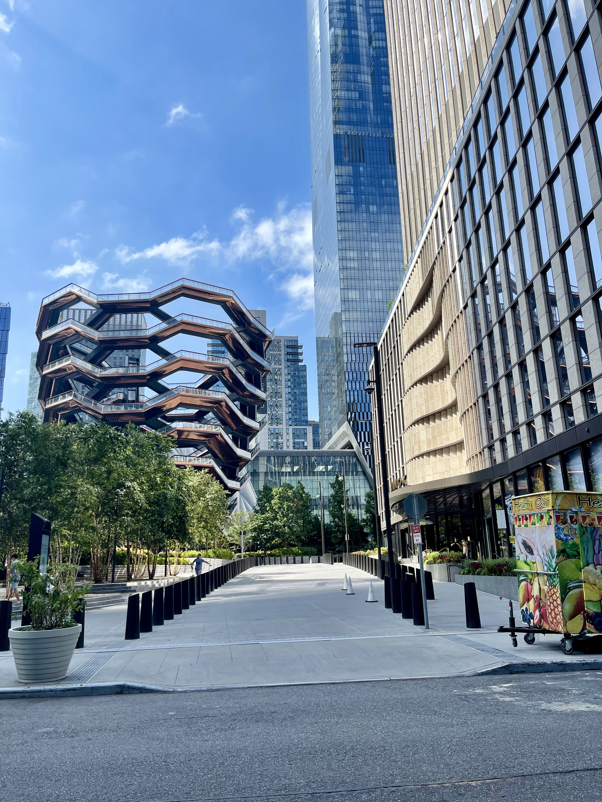

## Overview

<!-- About 100 to 150 word summary of the case study. -->

Hudson Yards, a $25 billion project, emerged from New York City's unsuccessful bid for the 2012 Olympics. It is the largest mixed-use private real estate development in US history, sprawling over 28 acres on Manhattan's West Side. Built over an active rail yard, its first phase was completed in 2019, integrating residential, commercial, and public spaces. The ongoing second phase raises issues about affordable housing and sustainability goals. Despite being acclaimed for its sustainability and connectivity, the project faces ongoing concerns about data privacy and its long-term environmental impact.

## Key Characteristics

<!--  Summarize the most visible essential characteristics of the project. For districts: How does the district employ 3-5 of the key characteristics of New Century Cities? For plans: How does the plan address each of the three activities (development, engagement, implementation) of the digital masterplanning process described in the 2015 Townsend and Lorimer paper?
-->

**Mixed-Use Development**. Hudson Yards combines diverse land uses to create a dynamic and vibrant neighborhood. It houses a variety of residential towers offering a spectrum of housing options to cater to multiple demographics. Commercial hubs like 10 and 30 Hudson Yards provide space for a mix of national and international companies, bolstering the area's economy. The development also includes a high-end hotel, enhancing its appeal to visitors and tourists. Moreover, the seven-story luxury shopping center, The Shops & Restaurants at Hudson Yards, offers a diverse range of high-end retail and dining options. The Shed, a unique cultural institution, alongside various art installations and event venues, enriches the cultural scene. Public plazas and landscaped parks encourage community interaction and engagement. Recent discussions propose adding a casino to the upcoming Phase 2 West Yards, potentially broadening the entertainment offerings and economic impact. This blend of residential, commercial, retail, cultural, and public spaces forms a self-sustaining neighborhood, reducing commute lengths, promoting walkability, and fostering a sustainable urban environment.

**Sustainability**.  Hudson Yards incorporates sustainability at the heart of its design and planning. Key buildings hold LEED certification, exemplifying commitment to eco-friendly practices. The site employs energy-efficient features such as advanced HVAC systems, intelligent building management systems, and energy-saving lighting to minimize greenhouse gas emissions and conserve energy.

- A notable feature of the development is its microgrid, which uses **combined heat and power (CHP) system** to capture and reuse waste heat from electricity production. Although it relies on fossil fuel, this independent energy system improves energy reliability, reduces overall energy costs, and decreases carbon emissions by optimizing energy production and distribution. The enhanced reliability and resilience ensures a continuous power supply even during broader grid outages.

- Water sustainability measures, such as green roofs, rainwater harvesting systems, and permeable pavements manage stormwater runoff, which ease the strain on city sewers and minimize water pollution.

- Public spaces are designed to promote greenery, open areas, and pedestrian accessibility, enhancing urban biodiversity and contributing to a healthier city environment. The development is also well-integrated into the city's transportation infrastructure, encouraging public transport use.

While Hudson Yards has made appreciable strides in sustainability, there is room for advancements, including wider use of renewable energy and stricter sustainability standards. Nevertheless, Hudson Yards stands as an environmentally conscious development in the urban landscape of New York City.

**Accessibility and Connectivity**. Hudson Yards promotes easy, sustainable commuting and a connected urban environment. Strategically located, Hudson Yards provides diverse, accessible transport options. Adjacent to Penn Station, one of NYC's busiest transit hubs, it offers direct access to multiple subway lines, commuter trains, and buses. The extension of the 7 Subway Line to 34th Street-Hudson Yards subway station within the development, further enhances connectivity. Several bus routes serve Hudson Yards, linking it to various Manhattan neighborhoods and other boroughs. The development's design promotes pedestrian-friendly sidewalks, crosswalks, and plazas. Additionally, it supports eco-friendly commuting through robust bicycle infrastructure, including bike lanes, parking facilities, and sharing stations.

## Goals and Aspirations

<!-- Summarize the most important goals of the project. Replace the placeholder title with a succinct name for the goal. The text should be around 50 words. -->

**Urban Revitalization**.  The primary goal of Hudson Yards was to transform an underutilized area into a vibrant new neighborhood. By creating a mixed-use space with commercial, residential, and public amenities, it aimed to revitalize the west side of Manhattan and spur economic growth in the area.

**Innovation and Sustainability**. Hudson Yards aspired to become a model of urban sustainability and resilience. The development incorporates advanced building technologies, energy-efficient design, and a pioneering waste management system, setting a new benchmark for environmentally responsible urban living.

**Community Integration**.  With an emphasis on public spaces, arts, and culture, Hudson Yards aimed to foster community spirit. The Public Square and Gardens, the Vessel, and the Shed were all designed to provide spaces for recreation, cultural expression, and community engagement.

## Technology Interventions
<!--  Identify 3-5 specific technology-enabled interventions the project employs or proposes. The text should be around 75-125 words. Separate into more than 1 paragraph as needed. This is a good place to insert additional images, be sure to include captions identifying the source and make sure to not use copyrighted images. -->

**Smart Energy Infrastructure**. Hudson Yards is equipped with a first-of-its-kind microgrid and co-generation plant. This system provides efficient, localized energy production and reduces reliance on the city's broader power grid. It not only provides electricity but also captures waste heat for use in heating and cooling, resulting in significant energy savings.

**Integrated Waste Management**.  The development utilizes pneumatic waste tubes, which transport waste from buildings to a central collection point. This automated process removes the need for conventional garbage trucks, reducing carbon emissions and contributing to cleaner streets.

**Green Building Technologies**.  Hudson Yards buildings are designed to meet LEED certification standards. Advanced technologies include high-performance glass to reduce heat gain, smart metering to monitor energy use, and green roofs that absorb rainwater and reduce heat island effects.

**Digital Connectivity**.  Hudson Yards has a high-capacity fiber network and offers free public Wi-Fi. The area is also equipped with sensors that track environmental factors, crowd movements, and other data to improve urban services.

**Adaptive Architecture**. The Shed, a $475 million, eight-story structure is designed for the city's arts community. Its unique feature is its capacity to shape-shift depending on the demands of exhibits or cultural events. The 120-foot telescopic shell, which can extend at the push of a button, doubles the building's footprint within minutes, accommodating up to 3000 guests. This design is not only adaptive, but is also eco-friendly, as it eliminates the need to heat or cool the expanded space when not in use, thus conserving energy. This innovative technology allows for a flexible, sustainable, and dynamic event space.

")

## Stakeholders
<!--  Identify 3-5 key stakeholder organizations or groups. The text should be around 50 words, and include a link to the organization.-->

**Related Companies**.  Related is one of the primary developers of Hudson Yards and responsible for overseeing the project's planning, design, and construction. [Related Companies](https://www.related.com)

**Oxford Properties Group**.  A partner developer in the Hudson Yards project, Oxford Properties Group is a global real estate investor and developer. [Oxford Properties Group](https://www.oxfordproperties.com)

**Metropolitan Transportation Authority (MTA)**.  The MTA played a significant role in extending the 7 Subway line to Hudson Yards, enabling improved public transportation access. [MTA](https://new.mta.info)

**New York City Department of City Planning**.  This department is responsible for overseeing land use, zoning, and urban design in New York City, ensuring the development aligned with citywide goals. [NYC Department of City Planning](https://www.nyc.gov/site/planning/index.page)

## Leadership
<!--  Conduct one interview with a project leader, and link to a LinkedIn or other profile. Provide a brief biography, no more than 75 words. Identify 3-5 insights or themes from the interview. Feel free to add a photo of the individual here. -->

**Luke Falk**. Luke Falk, an experienced energy and sustainability professional, began his career at Related Companies, focusing on building and improving structures. He played a key role in implementing digital technology at Hudson Yards. He now leads the $11B Clean Path NY project, developing wind and solar infrastructure across New York State. As the Chief Operating Officer, he dedicates his time to energyRe, a newly launched energy development company. Luke Falk's career exemplifies his commitment to advancing clean energy solutions.[LinkedIn](https://www.linkedin.com/in/luke-falk-49333530/)

**Technology-Driven User Experience**. One of Hudson Yards' primary goals is to create a highly responsive and seamless environment for people to live, work, and enjoy themselves. For instance, they've implemented a hand scanner system for office access that not only recognizes the user but also calls the appropriate elevator for them. They've also developed a system for guests to easily access the building using QR codes sent in their invites. Beyond physical access, they've developed residential and commercial versions of a mobile app, offering features like package notification, valet car requests, mobile keys, and amenity booking. This use of technology is designed to significantly enhance the resident or employee's experience, making their interactions with the building as smooth and effortless as possible.

**Energy Management**. Hudson Yards has put substantial focus on energy management, reflected by their central cogeneration facility that produces 13.5 MW of power. This facility is hooked up to a hot and chilled water loop, serving all five of the original buildings in Hudson Yards. To manage this system efficiently, they have implemented a range of energy analytics and optimization tools to build a self-aware carbon footprint community. This approach represents a commitment to sustainable practices and efficient energy usage within the buildings, reinforcing the role of technology in managing complex infrastructure.

**The Search for an Integrated System**. Falk acknowledges the need for a cohesive system to manage different aspects of the built environment, encompassing payments, access, preferences, and more. This comprehensive solution must prioritize user privacy and security. He suggests that a tech company may be better suited to lead this integration. This perspective highlights the ongoing challenge of creating a user-friendly and secure system that brings together diverse technological elements within the real estate context.

## Financing
<!--  Identify at least one financing scheme being used in this project or plan. About 100 words is probably a good length for this. -->

**Tax-Increment Financing**. TIF is a public financing method used to subsidize redevelopment, infrastructure, and other community-improvement projects, using future tax gains to finance current improvements. A key part of the Hudson Yards project that was funded using TIF was the extension of the Number 7 Subway line. This new line was vital for connecting the Hudson Yards area to the rest of the city, making it more attractive to potential residents, businesses, and investors. The expected future tax revenues from the new development and increased property values were pledged to repay the bonds issued to finance this infrastructure expansion and other upfront costs.

**EB-5 Investor Visa Program**. The EB-5 program allows immigrants to secure U.S. visas in exchange for substantial real estate investments, typically in distressed or high-unemployment areas. In the case of Hudson Yards, the developers included high-unemployment areas in Harlem to raise at least $1.2 billion through the EB-5 program.

## Outcomes
<!-- Identify 3-5 (anticipated) outcomes. What will/has the project achieved? Thes should not be the same or repeated from elsewhere. Use this space to emphasize something different. About 50 words per is minimum, but these can be as long as you want/need. -->

**Economic Boost for New York City**.  The development of Hudson Yards is expected to generate considerable economic activity and create thousands of jobs, directly and indirectly. With the blend of residential, commercial, retail, cultural, and public spaces, it's anticipated that Hudson Yards will attract both domestic and international businesses, leading to an increase in overall economic productivity and GDP of the city.

**Model for Future Sustainable Urban Developments**.  Hudson Yards' commitment to sustainability, from LEED-certified buildings to the incorporation of a microgrid for energy efficiency, positions it as a model for future urban development projects. Its success could encourage other cities to prioritize similar sustainable design principles and technologies in their urban planning.

**Increased Tourism**.  With its blend of cultural, commercial, and public spaces, Hudson Yards is expected to attract tourists from around the world. The unique attractions like the Vessel and the Shed, coupled with the luxurious shopping center and potential casino, could make Hudson Yards a significant tourist destination, boosting the city's tourism industry.

**Innovation Hub**. With its high-capacity fiber network, advanced infrastructure, and mix of commercial spaces, Hudson Yards is well-positioned to attract innovative companies and startups. This could lead to the area becoming a hub for innovation, fostering entrepreneurship and technological advancements.

## Open Questions
<!-- Identify 1-3 open question(s). What is uncertain, unclear, or still unresolved about this project? These can be 50 words or less. -->

**Data Privacy and the Future of the Vessel**.  Given the repeated closures due to safety concerns, the future of the Vessel as a public attraction remains uncertain. Will it reopen, and if so, what additional safety measures will be put in place? Additionally, Hudson Yards' extensive use of data collection and digital technologies raises unresolved questions about data privacy. How is visitor data being stored, used, and protected?

**Phase 2 Development and Affordable Housing**.  The plans for Phase 2, also known as the Western Yard, are still unclear. Initial proposals suggest a mixed-use development similar to Phase 1, with the addition of a school or potentially a casino. However, specifics about its timeline, financing, and exact features remain unresolved. Additionally, Hudson Yards has faced criticism for its lack of affordable housing options. As part of the Phase 2 development, there's an open question about how the project will address this issue and meet its obligations under the inclusionary housing program.

**Sustainability Goals**.  While Hudson Yards has shown a commitment to sustainability, it's unclear how it plans to achieve wider use of renewable energy and stricter sustainability standards. How will it address such future sustainability challenges?

## References

---

### Primary Sources

<!-- 3-5 project plans, audits, reports, etc. -->

- <https://www.hudsonyardsnewyork.com/sites/default/files/2019-03/HY_PressKit_General_030819_web.pdf>
- <https://www.citylandnyc.org/guest-commentary-hudson-yards-setting-the-record-straight-or-dont-doubt-its-success/>
- <https://www.nyc.gov/site/hyic/index.page>
- <https://www.kpf.com/project/10-30-hudson-yards>
- <https://www.nyc.gov/assets/planning/download/pdf/plans/hudson-yards/mtadeterminationfindings.pdf>
- <https://dsrny.com/project/the-shed>
- <https://www.nyc.gov/assets/hyic/downloads/bond-statements/2022/hyic-2022a.pdf>

### Secondary Sources

<!-- 5-7 secondary source documents: news reports, blog posts, etc.. -->

- <https://www.pmi.org/most-influential-projects-2020/50-most-influential-projects/hudson-yards>
- <https://todresources.org/blog/hudson-yards-a-value-capture-case-study/>
- <https://www.engadget.com/2014-05-07-hudson-yards-smart-neighborhood.html?guccounter=1&guce_referrer=aHR0cHM6Ly93d3cuZ29vZ2xlLmNvbS8&guce_referrer_sig=AQAAAGOWbt3LDS83-TKblWDdxMttbaJQd6kCeVPtXqUv-VzMRf_pvEYRywkYFikkCnyM8x7bX2DRxrGg3j_UEyLVz8IS1lARf-CYY4rHXyvF3qChBconQ3let0enu6y3aUG-WKQsgaDe6xqI2fsECbFQgyQTah2JAL9lDCzHrT9dNOZP>
- <https://www.dezeen.com/2007/11/26/hudson-yards-masterplan-by-steven-holl/>
- <https://newtowntosmartcity.tumblr.com/post/159708846276/week-9-a-testing-ground-for-applied-urban-data>
- <https://handler-re.com/wp-content/uploads/2017/09/property-week-interview-re-hudson-yards-9.29.17.pdf>
- <https://www.bloomberg.com/news/articles/2019-04-12/the-visa-program-that-helped-pay-for-hudson-yards#:~:text=The%20Hidden%20Horror%20of%20Hudson,to%20help%20poverty%2Dstricken%20areas>.
- <https://ibo.nyc.ny.us/iboreports/as-hudson-yards-refinances-old-debt-need-for-nearly-100-million-in-additional-funding-emerges-as-costs-continue-to-exceed-plan.pdf>
- <https://averyreview.com/issues/22/hudson-yards-a-sustainable-micropolis>
- <https://www.independent.co.uk/news/world/americas/new-york-vessel-suicide-teenager-b1895125.html>
- <https://gothammag.com/hudson-yards-neighorhood-guide>
- <https://academiccommons.columbia.edu/doi/10.7916/d8-ztpf-d527>
- <https://www.nytimes.com/interactive/2019/03/14/arts/design/hudson-yards-nyc.html>
- <https://www.hydc.org/affordable-housing>
