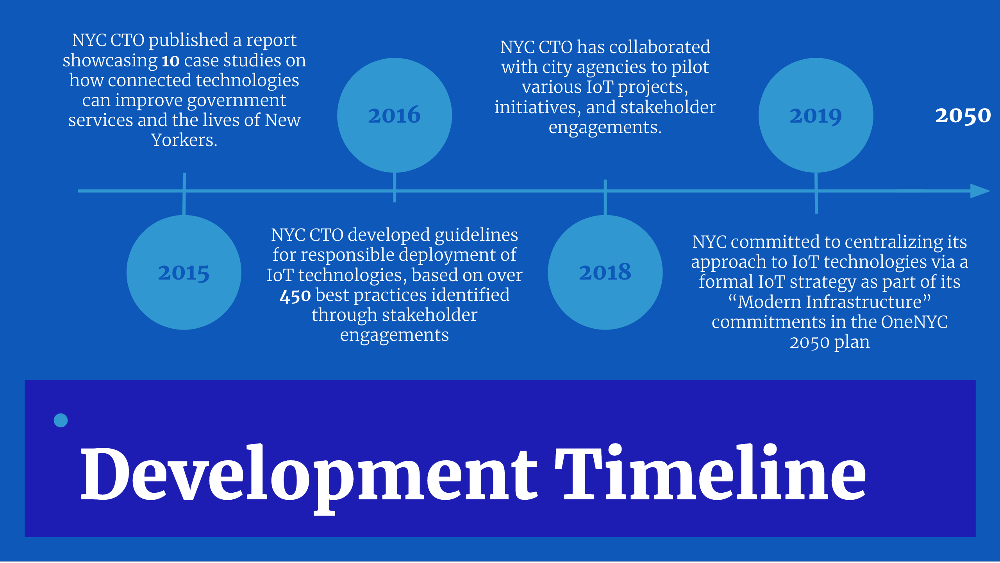
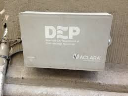
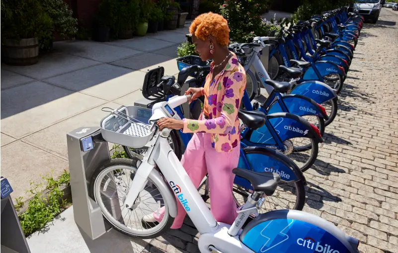
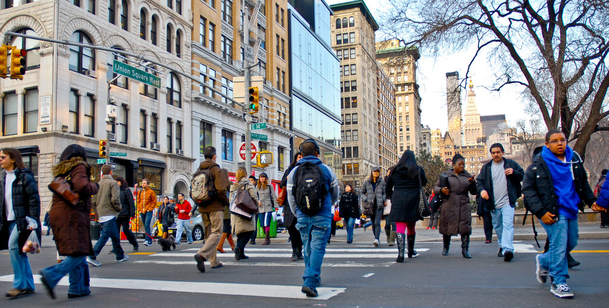

## Overview

<!-- About 100 to 150 word summary of the case study. -->

The New York City's Internet of Things (IoT) Strategy is a comprehensive blueprint designed by the NYC Office of Technology and Innovation to leverage the potential of IoT technologies and enhance the quality of life for its inhabitants. The strategy revolves around three key areas: improving government operations, enhancing public services, and promoting economic growth. The plan encompasses initiatives such as utilizing sensors to monitor air quality, traffic patterns, and building energy consumption, as well as deploying intelligent waste management systems and expanding public Wi-Fi access. Additionally, the city aims to encourage innovation in the IoT sector by building a network of research institutions, startups, and investors. Overall, the New York City IoT Strategy aims to position the city as a pioneer in the rapidly evolving field of IoT while making certain that technology advances the well-being of all its residents.

## Key Characteristics

<!--  Summarize the most visible essential characteristics of the project. For districts: How does the district employ 3-5 of the key characteristics of New Century Cities? For plans: How does the plan address each of the three activities (development, engagement, implementation) of the digital masterplanning process described in the 2015 Townsend and Lorimer paper?
-->

In 2015, NYC CTO published a foundational report entitled “Building a Smart + Equitable City,” which included ten case studies about how IoT can help improve government services and better the lives of all New Yorkers. This document was the first to highlight IoT projects undertaken by the City.

In 2016, NYC CTO conducted a wide-ranging engagements with stakeholders from the public sector, private sector, and academia, as well as a survey of government agencies across the world and identified more than 450 best practices for IoT use. These findings were distilled into a set of “Guidelines for the Internet of Things” for New York City to follow.

Since 2018, NYC CTO has partnered with City agencies to implement an array of pilot projects, initiatives, and stakeholder engagements that have also informed the IoT Strategy.

In 2019, Mayor Bill de Blasio released his OneNYC 2050 plan, outlining a broad vision for the future of New York City. As part of a set of commitments for “Modern Infrastructure,” the City pledged to “centralize its approach to internet-connected sensing” via a formal Internet of Things strategy.

## Goals and Aspirations

<!-- Summarize the most important goals of the project. Replace the placeholder title with a succinct name for the goal. The text should be around 50 words. -->

NYC IoT strategy provides an important framework about how to build a healthy IoT ecosystem. The framework has 6 principles across Governance + Coordination, Privacy + Transparency, Security + Safety, Fairness + Equity, Efficiency + Sustainability, and Openness +
Public Engagement.

**Governance + Coordination**.  To ensure the effectiveness and sustainability of IoT technologies and systems, it is important to design and deploy them thoughtfully. Ongoing oversight should be performed to ensure responsible and equitable use, as well as to anticipate emerging opportunities and risks.

It is also essential to optimize coordination among entities involved in IoT efforts to ensure interoperability, efficiency, and maximum impact. This will help to streamline efforts and ensure that resources are being used effectively.

**Privacy + Transparency**. IoT projects should be open about the whole process of data collection, transmission and processing, and should also protect the privacy of users.

**Security + Safety**. Cybersecuirty should be considered when implementing IoT projects, and IoT projects should be designed to promote the security and safety of public.

**Fairness + Equity**. Every resident in New York City should have equal access to IoT services.

**Efficiency + Sustainability**. IoT infrastructure should be designed and deployed efficiently, and the resources should be shareable and reusable. Entities should also utilize IoT projects to promote a more sustainable environment.

**Openness + Public Engagementy**. Collected data should be made accessible when reasonable, and device owners or users should have ownership of data.

## Technology Interventions
<!--  Identify 3-5 specific technology-enabled interventions the project employs or proposes. The text should be around 75-125 words. Separate into more than 1 paragraph as needed. This is a good place to insert additional images, be sure to include captions identifying the source and make sure to not use copyrighted images. -->

**Wireless Water Meters**. Wireless water meters are the city's largest-scale IoT project initiated by the Department of Environmental Protection (DEP). Wirelessly connected water meters are integrated to buildings, allowing DEP to monitor water usage in over 800,000 buildings across the city. Wireless water meters eliminate the need to send physical inspectors to read meters, and alert residents when they might have a leak based on tracked increases in use or whether a building is inhabited when it isn’t supposed to be.

**Responsive Traffic Management**. New York City has 6,000 miles of streets which are used by more than 5,000 public buses, 13,000 yellow taxis, countless vehicles, and millions of commuters daily. Midtown in Motion is a technology-enabled traffic management system that uses real-time traffic information from a variety of sources such as microwave sensors, traffic video cameras, and EZPass readers to gather traffic flow information. The system uses this information to monitor and respond to traffic conditions and strategically adjust green light times to optimize transportation efficiency.

**Citi Bike**. Citi Bike has transformed the ways that New Yorkers travel around the city, and the system is constantly expanding into previously underserved areas. The bike sharing program features internet-connected, solar-powered docking stations that allow users to access bikes using RFID key fobs, the CitiBike smartphone application, or by entering a code at a station kiosk. Smartphone users can use the app to check for bike and docking station availability and process payments as well. Citi Bike also publishes data report monthly with the intention of being open and transparent with customers and residents.

## Stakeholders
<!--  Identify 3-5 key stakeholder organizations or groups. The text should be around 50 words, and include a link to the organization.-->

**Government**. The city government is responsible for providing and managing a wide range of IoT services and IoT technologies that have the potential to improve the efficiency, effectiveness, and quality of public services. The city government has a vested interest in leveraging these technologies to better serve its residents.

**Business and Community Organizations**. The business community is a key stakeholder in the New York City IoT Strategy because IoT technologies have the potential to drive economic growth and create new business opportunities. The plan includes initiatives to support the development of startups and encourage investment in the IoT industry. Community organizations, such as local non-profits, advocacy groups, and neighborhood associations, are also important stakeholders because they represent the interests and needs of the community. These organizations can provide input and feedback on the plan, help ensure that vulnerable populations have access to the benefits of IoT technologies, and advocate for the protection of data privacy.

**Residents**.  Residents of New York City are key stakeholders in the plan because they will be the most directly affected by IoT initiatives. It is essential to engage with residents to understand their needs, concerns, and priorities, and to ensure that the benefits of IoT technologies are accessible to all residents.

## Leadership
<!--  Conduct one interview with a project leader, and link to a LinkedIn or other profile. Provide a brief biography, no more than 75 words. Identify 3-5 insights or themes from the interview. Feel free to add a photo of the individual here. -->

**Haotian Jiang**. Haotian works as a Architectural Designer at Robert A.M. Stern Architects. He got his bachelors degree from Cornell University College of Architecture, Art & Planning. He is passionate about architecture and design.  [LinkedIn](https://www.linkedin.com/in/haotian-jiang-4a51a2173/)

**Responsible IoT**. The NYC IoT Strategy takes a holistic approach to deploying IoT solutions. The city considers a range of factors beyond just the technology itself, including cybersecurity, data privacy, equity, and accessibility. By taking a holistic approach, the city aims to ensure that its use of IoT is responsible, sustainable, and meets the needs of all its citizens.

**Interdisciplinary Collaboration**. The city should promote opportunities for architects and urban designers to collaborate with technologists and other stakeholders. These groups can work together to develop effective IoT solutions that are both functional and visually appealing.

## Financing
<!--  Identify at least one financing scheme being used in this project or plan. About 100 words is probably a good length for this. -->

**Financing Scheme**. The financing scheme for the NYC IoT strategy is not explicitly outlined in the strategy document. However, the strategy mentions that funding will come from a variety of sources, including government budgets, grants, private investment, and partnerships with academic and research institutions.

## Outcomes
<!-- Identify 3-5 (anticipated) outcomes. What will/has the project achieved? Thes should not be the same or repeated from elsewhere. Use this space to emphasize something different. About 50 words per is minimum, but these can be as long as you want/need. -->

**Support Economic Growth**.  The plan aims to support the development of the IoT industry in New York City, creating new business opportunities for entrepreneurs, startups, and established companies in different sectors to drive the city's overall economic growth. Entrepreneurs, startups, and established companies can also benefit from the growth of the IoT industry by developing new products and services, entering new markets, and collaborating with other businesses and stakeholders in the IoT ecosystem.

**Build a Connected City**.  All residents in the city deserve equal access to the connected city, including access to affordable high-speed internet and digital devices and services. The goal of providing equal access to the digital economy and society is important because it can create more job opportunities, enhance educational experiences, and improve access to services for all residents of New York City.

**Harness the Power of Data**.  One of the goals of NYC's IoT strategy is to promote data sharing across City agencies and the public. This data enables organizations to gain valuable insights, make informed decisions, improve operational efficiency, enhance customer experiences, and drive innovation.

## Open Questions
<!-- Identify 1-3 open question(s). What is uncertain, unclear, or still unresolved about this project? These can be 50 words or less. -->

**Sustainable Funding**.  The plan relies heavily on public and private funding sources, but it is unclear how sustainable these funding sources are over the long term. How will the city ensure that these initiatives are cost-effective and sustainable?

**Public-Private Partnerships**.  The strategy covers a wide range of stakeholders, how will the city promote collaborative partnerships among theses parties, especially between the private and public sectors?

## References

### Primary Sources

<!-- 3-5 project plans, audits, reports, etc. -->

- The New York City Internet of Things Strategy <https://www.nyc.gov/assets/cto/downloads/iot-strategy/nyc_iot_strategy.pdf>
- The New York City Internet of Things Progress Report <https://www.nyc.gov/assets/cto/downloads/iot-strategy/nyc_iot_progress_report.pdf>
- NYC IoT Guidelines, <https://iot.cityofnewyork.us/#guidelines>

### Secondary Sources

<!-- 5-7 secondary source documents: news reports, blog posts, etc.. -->

- Sarah Wray, *New York gears up for IoT growth with new strategy*, <https://cities-today.com/new-york-gears-up-for-iot-growth-with-new-strategy/>
- Rachel Brown, *Fostering Innovation with NYC’s IoT
Strategy*, <https://medium.com/intelligent-cities/fostering-innovation-with-nycs-iot-strategy-b7ee331fae15>
- Peter Bihr, *New York’s new NYC IoT Strategy*, <https://thewavingcat.com/2021/03/new-yorks-new-nyc-iot-strategy/>
