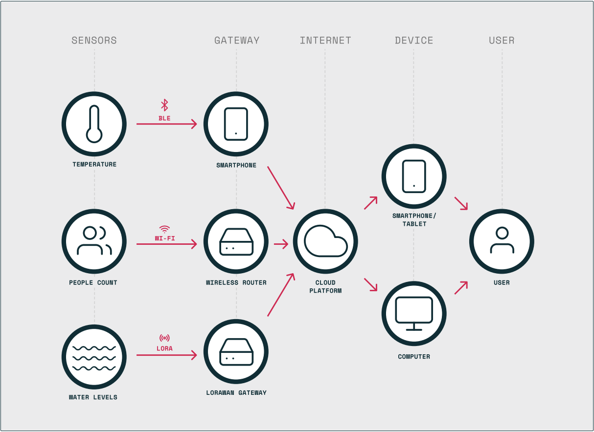
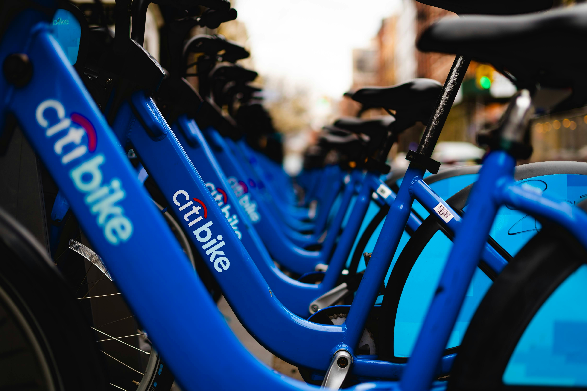

<!--
Allowed values:

type: district, plan

tags: 
- Environment
- Mobility
- Buildings
- Energy
- InformationSystems
- HealthEducation
- InnovationSystems
- CivicTech
- Food

-->

## Overview

<!-- About 100 to 150 word summary of the case study. -->

The NYC IoT Strategy, led by the Mayor’s Office of the Chief Technology Officer and published in March 2021, aims to leverage IoT technologies to enhance the lives of New Yorkers. It outlines the current landscape of IoT usage across society, including its applications in government, industry, and community organizations, while highlighting both the benefits and challenges associated with its implementation. The strategy emphasizes the importance of collaboration among various stakeholders, including government agencies, academia, non-profits, the private sector, and community-based organizations. It identifies key obstacles and offers recommendations to foster innovation, promote data sharing and transparency, improve governance and coordination, and derive value from cross-sector partnerships. Lastly, the strategy outlines specific actions and initiatives to build a healthy, cross-sector IoT ecosystem in NYC, focusing on capacity building, innovation, partnerships, data sharing, coordination, public awareness, workforce development, policy advocacy, local sourcing, and collaboration for community benefit.

## Goals and Aspirations

<!-- What is the project trying to achieve? Identify 3-5 high-level goals that define the entire project.Replace the placeholder title with a succinct name for the goal. -->

**Enhancing Quality of Life**. The overarching goal is to utilize IoT technologies to improve the overall quality of life for New Yorkers. This involves initiatives aimed at boosting health and wellness, reducing costs and energy consumption, increasing convenience, and addressing community needs.

**Fostering Innovation and Collaboration**.  The project seeks to foster innovation within the IoT sector by encouraging collaboration among various stakeholders, including government agencies, academia, industry players, and community organizations. By creating a collaborative ecosystem, the goal is to drive technological advancements and create solutions that benefit the city and its residents.

**Ensuring Responsible and Equitable Implementation**.  Another key objective is to ensure that IoT initiatives are implemented in a responsible and equitable manner. This includes prioritizing principles such as governance, privacy, security, fairness, and transparency. The project aims to address concerns regarding data privacy and security while ensuring that the benefits of IoT are distributed equitably across all communities.

**Optimizing Government Operations and Public Services**.  The project aims to optimize government operations and enhance public services through the strategic deployment of IoT technologies. This involves initiatives such as monitoring air quality, traffic patterns, and energy consumption to improve efficiency and effectiveness in government operations, as well as providing better services to residents.

**Building a Sustainable and Resilient City**.  Lastly, the project seeks to contribute to building a sustainable and resilient city by leveraging IoT technologies to address environmental challenges, improve infrastructure management, and enhance emergency response capabilities. This involves initiatives such as monitoring environmental conditions, optimizing energy usage, and implementing real-time flood monitoring systems.

## Key Characteristics

<!--  How is the project organized into specific activities that advance these goals? For plans: How does the plan address each of the three activities in digital master plans (development, engagement, implementation). For districts: How does the district employ 3-5 of the key characteristics of innovation hubs?
-->

The IoT plan offers recommendations and outlines five broad goals for near-term City action.

**Foster Innovation**.  Encourage Innovation through the establishment of frameworks and initiatives that facilitate research, experimentation, and testing of IoT technologies. This involves creating structures and programs that provide support and resources to individuals and organizations interested in exploring the potential of IoT in various domains.

**Promote Data Sharing and Transparency**.  Enhance Data Sharing and Transparency regarding the implementation of IoT in the city by actively involving residents in discussions about IoT initiatives. Additionally, aggregate information and data generated from the city's IoT projects to make them accessible across different government agencies and to the public, ensuring transparency and accountability where applicable.

**Improve Governance and Coordination**.  Strengthen Governance and Coordination of the city's utilization of connected technologies through the development of new policies and processes. This includes establishing guidelines and protocols to govern the deployment and management of IoT systems, ensuring consistency and efficiency in their implementation.

**Derive Value from Cross-Sector Partnerships**.  Extract Value from Collaborative Partnerships across sectors by actively supporting and pursuing new opportunities for collaboration. This involves fostering relationships and partnerships between government agencies, academic institutions, industry players, and community organizations to maximize the impact and effectiveness of IoT initiatives.

**Engage with Industry and Advocate for Communities**.  Engage with Industry and Champion Community Rights by establishing channels for communication and collaboration with industry stakeholders. Additionally, advocate for the protection of digital rights and privacy while ensuring that communities have a voice in the development and deployment of IoT technologies that affect their lives.

## Stakeholders
<!--  Who initiated the project? Who is leading the project forward? Who else has a say in how it unfolds? Who is directly affected but marginalized? Identify 3-5 key stakeholder organizations or groups. Identify 3-5 key individuals. These are people who are associated with the project as leaders, supporters, critics, or regulators. They are likely to be members of the stakeholder groups identified above. These are people you should try to contact for one or more interviews.-->

**The Mayor's Office of the CTO**.  The Mayor’s Office of the Chief Technology Officer (NYC CTO) launched a set of efforts to organize the City’s approach to IoT. The City can help ensure potential partners in academia, industry, and the broader community have clear paths to engage with the City to demonstrate the efficacy of new technologies [NYC Office of Technology and Innovation](https://www.nyc.gov/content/oti/pages/)

**Residents**.  NYC residents play a critical role in the adoption of IoT strategies, and a large portion of the plan is dedicatied to the transparency and collaboration with redidents. Resident feedback is collected and used to shape the policies and pilot tests in for future IoT projects.

**Businesses and Community-Based Organizations**.  Private companies exert significant influence on New York City's IoT ecosystem through various means. They utilize IoT technologies for their own business operations, develop and market products and services used across different sectors, and employ local residents to carry out these activities. Similarly, community groups engage with IoT technologies, collaborate with the city on projects, and utilize public data to advance their initiatives. These community groups also play a role in promoting public engagement in IoT projects and educating the public about the broader implications and impacts of IoT across society.

## Technology Recommendations
<!--  What specific technology-enabled interventions does the project propose? Identify 3-5 technology interventions. Describe use cases, value proposition, solution architecture, data created or consumed, key platforms and standards, business models, regulatory issues, etc. Separate into more than 1 paragraph as needed. This is a good place to insert additional images, be sure to include captions identifying the source and make sure to not use copyrighted images. -->

**Recommendations in Government**. The government aims to strengthen its capacity in IoT by fostering a culture of knowledge sharing and resource utilization. This involves establishing a Smart City Collaborative to facilitate information exchange among city agencies and developing internal consultancy programs to support IoT projects. Additionally, the government plans to expand its "Rapid IoT" program for quick and cost-effective technology demonstrations.

In terms of innovation, the city intends to explore emerging technologies and test new sensing and power technologies through pilot programs. It plans to create a municipal testbed for experimentation and support the development of IoT wireless communication networks.

Furthermore, the government emphasizes the importance of partnerships by providing clear pathways for engagement with academia, industry, and community organizations. It aims to foster collaboration opportunities and establish continuous pilot programs within the testbed framework.

Data sharing is a priority, with efforts to maximize the use of government data and establish a real-time IoT data platform for agencies and the public.

Lastly, coordination and oversight are crucial, with the government working through the IoT Working Group to update inventories, standardize device reviews, and develop broader deployment procedures for IoT projects.

**Recommendations for Residents**.  Residents play a crucial role in the city's IoT initiatives, with efforts focused on public awareness, education, and training. This involves educating residents about IoT benefits, risks, and best practices through accessible information and coordinated training programs with local digital literacy providers. The city aims to support access to IoT tools and information across education and training providers and create a public Smart City Catalog to share project successes with the public.

Transparency and accountability are emphasized to ensure residents have visibility into how IoT is being used. This includes deploying public notices of IoT use in public spaces and offering mechanisms for public input before, during, and after long-term city IoT deployments.

Workforce development is vital, with the city taking action to support IoT skill-building and participation in the workforce. This includes exploring local IoT workforce needs among employers, identifying opportunities for local hiring across agencies, and promoting certification efforts for companies using industry best practices.

Furthermore, the city engages in policy, advocacy, legislative, and regulatory actions by fostering dialogue between government and industry, supporting certification efforts, and advocating for state and federal legislation aligned with city IoT goals.

**Recommendations for Businesses and Comunity Organizations**.  Business and community organizations play a significant role in the city's IoT ecosystem, focusing on industry policies, standards, and best practices. Companies are encouraged to develop and adopt internal ethical standards and policies, including those related to data collection, management, usage, sharing, and storage. Regular communication between government and industry is established to foster collaboration and ensure alignment with city goals.

Local sourcing is emphasized to identify opportunities for supporting local and Minority/Women-owned Business Enterprise (M/WBE) product sourcing for city IoT needs whenever feasible.

Collaboration for community benefit involves establishing structures for regular communication between government and community groups. This includes working with community-based organizations to support engagement with residents and facilitating data sharing between the city and community groups to ensure transparency and accountability.

## Financing
<!--  How are the technology interventions identified to be financed? How does this fit into financing of the larger project? Identify at least one financing mechanism that is being used. -->

**Financing Scheme**. The NYC Office of Innnovation and Technology is set to recieve $775.2 million in expense funds for the fiscal year 2025. This budget goes towards privding salaries for the OIT employees as well as funding various pilot projects and initiatives. [NYC Office of Technology and Innovation: Fiscal Year 2025 Preliminary Budget](https://www.nyc.gov/content/oti/pages/testimony/oti-testimony-city-council-committee-technology-fiscal-year-2025-preliminary-budget)

Additionally, private companies and academic institutions generate their own sources of funding for various projects realted to IoT innovation and research. The collaboration between these organizations provide enough financing to deploy and test IoT propducts throughout the city.

## Outcomes
<!-- What results has the project produced to date? What outcomes and impacts are anticipated? Identify 3-5 (anticipated) outcomes. What will/has the project achieved? Thes should not be the same or repeated from elsewhere. Use this space to emphasize something different. -->

In December of 2021, the NYC Office of Technology and Innovation release a Progress Report. This report updates on the city's strides since March, detailing engagements with stakeholders and soliciting feedback. It charts upcoming initiatives and fresh commitments grounded in community input. The city reaffirms its dedication to transparent governance, striving for positive impact, trust-building, safeguarding digital rights, and fostering equitable opportunities for all residents.

**Fostering Innovation**.  To foster innovation, the city initiated a rapid IoT data insights program and conduct tests of new technologies and approaches through pilot or challenge-based programs. One of the initiatives to promote innovation includes the Smart City Testbed, a program inspiring innovation within City government by streamlining and accelerating the citywide process for piloting emerging technologies. [NYC Smart City Testbed](https://testbed.cityofnewyork.us/)

**Promote Data Sharing and Transparency**.  In order to promote data sharing and transparency, the city actively sought community feedback on the NYC IoT Strategy and endeavor to incorporate it into future initiatives. Four key findings emerged from this process: the need for more accessible information to reach a broader audience, appreciation for the strategy's emphasis on digital rights and public engagement, challenges faced by the academic and private sectors in forming partnerships due to a lack of appropriate channels, and an expressed interest in understanding longer-term plans.

**Improve Governance and Coordination**.  To improve governance and coordination, the city plans to launch a Smart City Collaborative and host a biannual IoT forum for city agencies. Additionally, new standards, policies, and procedures will be developed for City IoT deployments.

**Engage with Industry and Advocate for Communities**.  Finally, to engage with industry and advocate for communities, the city will conduct research to better understand the need for IoT skills among local employers.

## Open Questions
<!-- What is uncertain, unclear, or still unresolved about this project? Identify 1-3 open question(s). -->

**Open questions 1**.  What does the future of IoT in NYC look like with the advancement of AI and Machine Learning? How will LLMs impact the strategy and implementation of IoT throughout NYC?

**Open questions 2**.  How will the city ensure productive collaboration amoung the different stakeholders, who may have varying priorities and needs?

**Open questions 3**.  How can the Office of Technology and Innovation continue its prgoress despite changes in city government and the mayoral adminstration?

## References

---

### Primary Sources

- [NYC IoT Strategy](https://www.nyc.gov/assets/cto/downloads/iot-strategy/nyc_iot_strategy.pdf)
- [IoT Progress Report](https://www.nyc.gov/assets/cto/downloads/iot-strategy/nyc_iot_progress_report.pdf)
- [NYC Office of Technology and Innovation](https://testbed.cityofnewyork.us/)

### Secondary Sources

- NYC Smart City Testbed (<https://testbed.cityofnewyork.us/>)
- NYC Open Data (<https://opendata.cityofnewyork.us/>)
- New York gears up for IoT growth with new stategy (<https://opendata.cityofnewyork.us/>)
- Fostering Innovation with NYC's IoT Strategy (<https://medium.com/intelligent-cities/fostering-innovation-with-nycs-iot-strategy-b7ee331fae15>)
