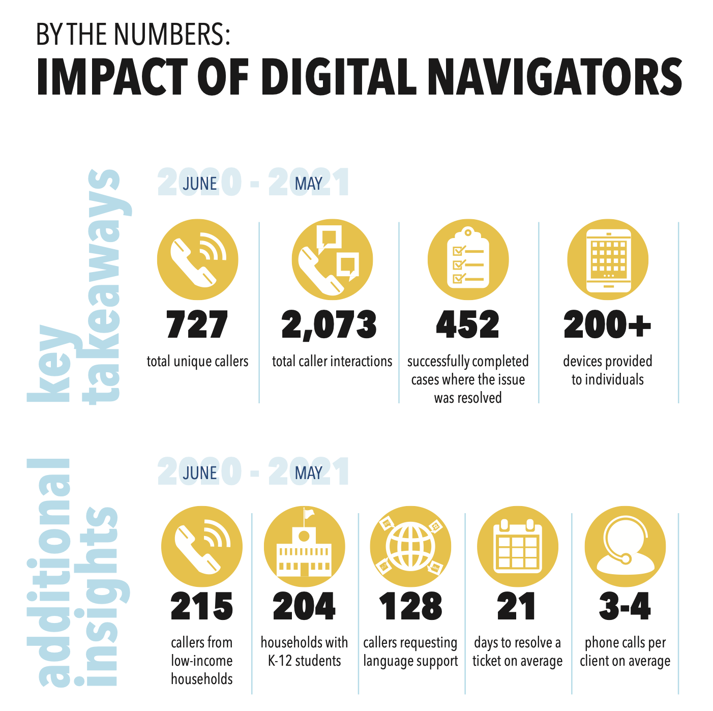
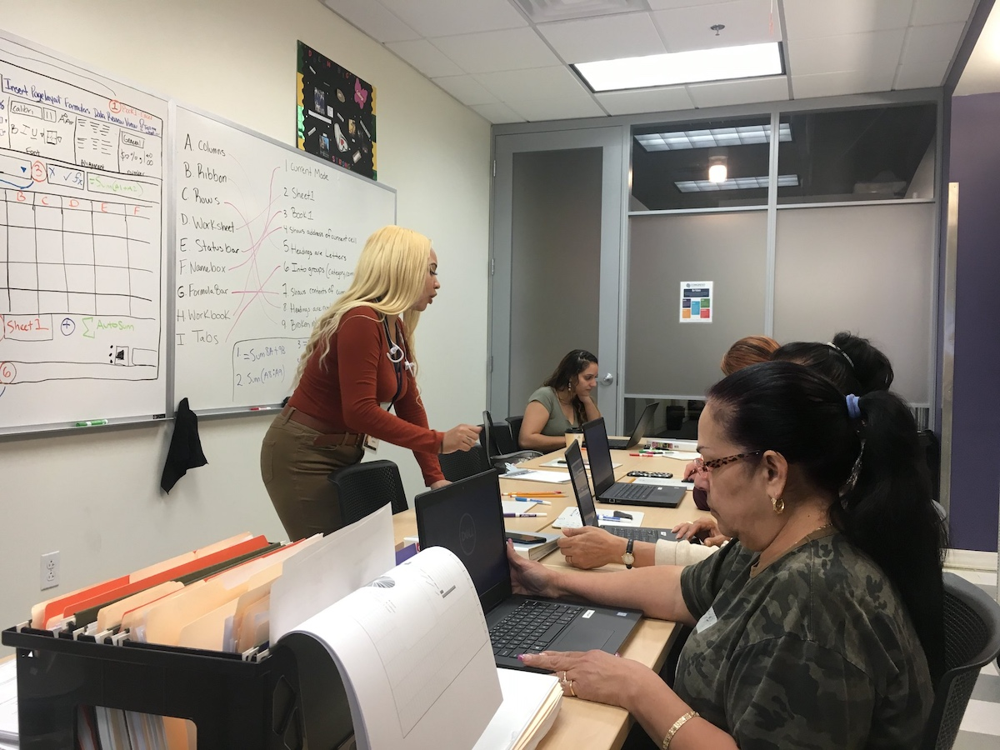
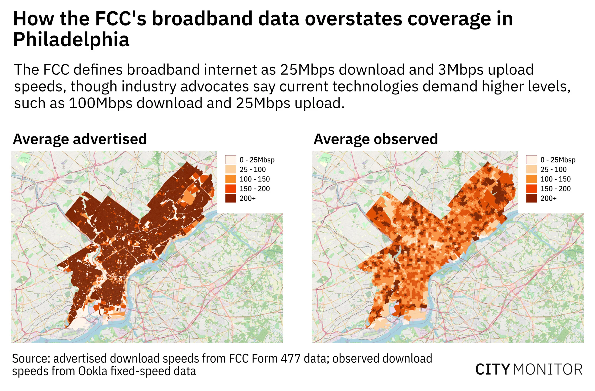

## Overview

<!-- About 100 to 150 word summary of the case study. -->

The City of Philadelphia, through its Office of Innovation and Technology, has developed a roadmap to achieve a baseline of digital equity across the city over the next five years, starting from 2022. This initiative is driven by several factors, including the lack of working desktops or laptops in 25% of households and a significant gap in labor force participation between individuals with and without broadband access. Over the past fifteen years, the city of Philadelphia has implemented various digital equity initiatives, such as the Wireless Philadelphia Initiative, aimed at providing affordable internet services to its residents. Despite these efforts, digital inequity persists in the city. To address this issue, the Office of Technology and Innovation has released this comprehensive plan, which consists of four main goals, each accompanied by key strategies and initiatives that the city must adopt to achieve them.

## Key Characteristics
  
<!--  Summarize the most visible essential characteristics of the project. For districts: How does the district employ 3-5 of the key characteristics of New Century Cities? For plans: How does the plan address each of the three activities (development, engagement, implementation) of the digital masterplanning process described in the 2015 Townsend and Lorimer paper?
-->

**Development**.  The development of Philadelphia's digital inclusion ecosystem is addressed in the final goal of the plan. It defines the characteristics of a digital inclusion ecosystem and outlines the necessary programs and policies. The specific policies mentioned, such as affordable broadband services and subsidized device options, are part of the 5-year initiatives of preceding goals. The last goal emphasizes how the combined efforts of these initiatives contribute to a stronger digital inclusion ecosystem. Additionally, the plan's 5-year initiatives for this goal include fostering collaborations between city departments and external partners at the local, state, and federal levels to support the digital inclusion ecosystem. One proposed initiative is to establish a revenue-generating stream that can sustain the city's digital equity programs. Achieving this requires securing financial support from both federal and state funding sources, as well as identifying and supporting a non-city entity dedicated to digital equity work. The plan also outlines initiatives aimed at improving data benchmarking to strengthen the information systems that support new and existing infrastructure.

**Engagement**.
To enhance technology accessibility, the plan emphasizes collaboration with local education agencies to ensure a 1:1 device ratio in pre-K-12 classrooms for all students. Additionally, devices will be provided to adult literacy, digital literacy, and workforce classrooms. Responding to the expressed needs of Philadelphia residents, who highlighted the importance of human touchpoints in utilizing technology, the city intends to expand public computing centers. These centers will cater not only to populations facing digital literacy challenges but also to multilingual communities.

Furthermore, the city aims to partner with local educational agencies to establish best practices and leverage federal resources for offering digital skill support services. They also seek to train school staff on identifying appropriate referrals for students when they require digital literacy assistance. Lastly, the city plans to collaborate with workforce partners to increase representation of underrepresented populations in technology careers.

**Implementation**.
To ensure the success of the Digital Equity Plan, the city must focus on three key advocacy points. Firstly, it is crucial to secure reliable funding for a range of initiatives. PHLConnectED, a program offering free internet access to pre-K-12 students, digital literacy providers, Keystone Innovation and Technology centers that provide technology access at recreation centers, and low-cost community-led wireless networks are some of the programs that are integral to fighting digital inequity.

Secondly, the city needs to ensure that federal funding allocated to the Commonwealth of Pennsylvania is appropriately distributed to the City of Philadelphia. Working closely with the commonwealth, negotiations must be conducted to address policies that impact the distribution of federal resources. Lastly, the city must actively engage private industry partners in digital equity endeavors. It is imperative to ensure their participation and collaboration in advancing digital equity goals.

## Goals and Aspirations

<!-- Summarize the most important goals of the project. Replace the placeholder title with a succinct name for the goal. The text should be around 50 words. -->

**Access to Technology**. Some 19% of Philadelphians do not have a functional computer, laptop, desktop, or tablet, resulting in approximately 75,000 households needing a device. Low-income residents, seniors, and Spanish-speaking Hispanic residents face significant challenges in accessing devices primarily due to cost. Efforts will be made to ensure that Philadelphians can access appropriate and affordable technology.

**Internet Connectivity**. Disparities in internet access persist, particularly among low-income residents, Black and Hispanic residents, and older residents. Philadelphia has limited wired broadband options, with only one provider covering the entire city and one low-cost program. 75% of residents consider internet costs over $20/month as too expensive.  The plan aims to enable Philadelphians to access and afford the internet connectivity they need.

**Skill Development**. In Philadelphia, about 7 out of 10 adults are likely to struggle with complex literacy or numeracy tasks. Training on foundational digital skills is important, and the City aims to expand its digital literacy efforts and connect residents with Philadelphia's adult literacy and workforce systems.

**Digital Inclusion Ecosystem**. Creating a strong digital inclusion ecosystem involves coordinating entities working together to tackle all aspects of the digital divide, including affordable broadband, device ownership options, multilingual digital literacy training, technical support, and digital navigation services. To support these systems/initiatives, efforts will be made to sustain and grow the infrastructure required to increase digital equity.

## Technology Interventions
<!--  Identify 3-5 specific technology-enabled interventions the project employs or proposes. The text should be around 75-125 words. Separate into more than 1 paragraph as needed. This is a good place to insert additional images, be sure to include captions identifying the source and make sure to not use copyrighted images. -->

**Digital Navigation Services**. In Philadelphia, a digital navigator is a digital support specialist who provides in-person or remote assistance to individuals needing help with technology access or usage. They also assist residents in finding free or low-cost devices and internet access, while serving as a starting point for enhancing digital literacy training. Following the meeting of the Digital Health Equity Taskforce, it was recognized that patients encounter difficulties with online forms and navigating telehealth visits. As a result, increased focus will be placed on training digital navigators to provide assistance in these specific areas.

*Digital Navigator Impact Statistics from the 2021 Digital Navigator Report*

**Standardize Digital Literacy Assessments**.
The Office of Children and Families' Adult Education program, in collaboration with the Free Library of Philadelphia and Philadelphia Works, will use the Northstar Digital Literacy Assessment to establish a uniform digital literacy curriculum, assessments, and training across all service providers. The absence of a standardized digital literacy assessment prevents the city from accurately gauging the level of digital literacy proficiency among Philadelphia residents. The city will develop a website for digital literacy courses and establish a comprehensive database for referring individuals to suitable digital literacy programs.

*Digital Literacy Class at Anchor Institution run by Keyspot Instructor - PHOTO VIA TWITTER.COM/PHILLYKEYSPOTS*

**Create sustainable community-based networks**. To address the limited internet options in the city, the plan suggests unifying the internet connectivity across Philadelphia's 200+ recreation centers into a single high-capacity fiber network. This unified network is expected to enhance Wi-Fi coverage in the surrounding neighborhoods. Drawing inspiration from successful initiatives in New York City and Baltimore, Philadelphia intends to collaborate with public and private partners to establish fixed wireless networks at transportation hubs, municipal buildings, street fixtures, and other locations throughout the city.

## Stakeholders
<!--  Identify 3-5 key stakeholder organizations or groups. The text should be around 50 words, and include a link to the organization.-->

**Digital Literacy Alliance**.
The Digital Literacy Alliance in Philadelphia brings together leaders from various sectors who have been involved in digital equity work. Their mission is to create a coalition of stakeholders dedicated to bridging the digital divide in the city. The alliance includes representatives from agencies, corporations, and entities such as AT&T, Comcast, Drexel University, Federal Reserve Bank of PA, Free Library of Philadelphia, and Mayor's Fund. [Digital Literacy Alliance](https://www.phila.gov/programs/digital-literacy-alliance/)

**Digital Health Equity Taskforce**.
The Digital Health Equity Taskforce met three times in 2021, bringing together representatives from various departments in hospital systems and universities. In total, 40 individuals working in healthcare participated in discussions with the Office of Innovation and Technology.

**Digital Equity Coordinating Committee**.
The Digital Equity Coordinating Committee in Philadelphia consists of individuals from various city departments and agencies dedicated to ensuring digital equity for all residents. The committee collaborates across departments to develop and implement a digital equity strategy for the city. Their mission is to provide reliable, high-speed internet access and necessary devices to all households in need.  

## Leadership
<!--  Conduct one interview with a project leader, and link to a LinkedIn or other profile. Provide a brief biography, no more than 75 words. Identify 3-5 insights or themes from the interview. Feel free to add a photo of the individual here. -->

**Ashley Pollard**.
Ashley Pollard is a digital inclusion manager with the city of Philadelphia. She has been working with the city since 2020 and was a part of the digital equity coordinating committee that helped put together the digital equity plan.
[LinkedIn](https://www.linkedin.com/in/pollardashley/)

**Sustaining the Interventions**. Over a third of Philadelphians are eligible for the affordable connectivity plan, which was implemented to provide low-cost internet access for residents. Unfortunately, this program has a limited duration, and as we approach 2024, there is uncertainty regarding its future funding. The city now acknowledges the program's significant value to residents and is actively seeking ways to preserve it.

**Standardizing Offerings Citywide**. Many of the public computing centers in Philadelphia are libraries, and what they have found is that these libraries differ across the city. Since the resources at these places can vary, it becomes difficult to develop a standard for what a public computing center is. Standardization of practices is a big part of the digital equity plan, and having to work around this posed another challenge for the team.

**Importance of Accessibility**. The city knows that in order to support a digital inclusion ecosystem, digital tools must be accessible. For instance, when another department such as Parks and Recreation develops a free food finder, it is essential to consider whether the population in need of free food can effectively utilize the map. Because of this, the city is trying to determine how to create digital tools that are fully accessible to all residents, ensuring inclusivity throughout their development.

## Financing
<!--  Identify at least one financing scheme being used in this project or plan. About 100 words is probably a good length for this. -->

**Multiple Funding Sources**.
Through the Digital Literacy Alliance, the city was able to seed funds and was philanthropically funded through grants. Although most of the funding still comes from donations made to the Digital Literacy Alliance, the city also contributed $2 million of its CARE's act dollars to the plan and some of the educational partners contributed as well. The plan should be included in the city's operating budget but council has to vote. Although the Digital Literacy Alliance has a good relationship with its philanthropic partners, the programs proposed in the plan need to demostrate their value so it can be sustained and moved forward.  They also need to keep an eye on the money coming from the bipartisan infrastructure law. This will be billions of dollars dedicated to broadband and digital equity.

## Outcomes
<!-- Identify 3-5 (anticipated) outcomes. What will/has the project achieved? Thes should not be the same or repeated from elsewhere. Use this space to emphasize something different. About 50 words per is minimum, but these can be as long as you want/need. -->

**PHLConnectEd**.
Established in mid-2020, PHLConnectEd benefited from a $17 million investment in the program and collaboration among philanthropic partners, private businesses, and educational institutions such as the School District of Philadelphia. As a result, the city successfully provided free internet connections to 23,100 pre-K-12 students and households. This shows an increase of 4,100 connections compared to the reported 19,000 connections in the fall of 2021. Multi-lingual digital skill classes also began spring of 2023, and pre-K-12 parents can choose to take classes at any of the anchor institutions - Temple University, Drexel, Congreso etc.

**Device Distribution**.
The city received a federal grant from the emergency connectivity fund to provide free tablets to residents across Philadelphia (of all ages) and was a sucessful distribution effort. The city also just launched a partnership with PCs for People, an organization that is being funded to provide recycled and refurbished devices to Philadelphians at an affordable price.

**Digital Equity Team**.
The city recently hired two full time employees that will focus their work solely on digital equity. They have also hired someone that will split their time between the digital equity team and the smart cities team. What they have found is that lack of broadband connectivity in Philadelphia is an issue for both the smart cities team and the digital equity team, many of the things the smart cities team wants to implement cannot be done without robust broadband connectivity.

## Open Questions
<!-- Identify 1-3 open question(s). What is uncertain, unclear, or still unresolved about this project? These can be 50 words or less. -->

**The Role of Comcast**. I am unclear about the extent of Comcast's role in the execution of some of the initiatives (specifically the ones about internet connectivity). Comcast has an affordable connectivity program which provides connection in two tiers - 9.95/mo for 50 Mbps and 29.95/mo for 100 Mbps. Since the city discovered that an overwhelming majority of residents (75%) cannot afford more than $20 a month for internet and the PHLConnectEd program is only targeting pre-K-12 households, in what vein is the city negotiating with the largest ISP in Philadelphia about their programs? The plan only states that the city will push ISPs to provide more affordable options, but I was expecting to see more input from Comcast in this area, as they did help in the creation of this plan.

**Sustainable Funding Sources**. The plan talks about funding very loosely, and I was only able to learn about the financing scheme through my interview. I would have liked to see more about the projected cost that the initiatives will be, especially since long-term funding is a big concern and vital for the plan's success.

## References

### Primary Sources

- [Philadelphia Digital Equity Plan](https://www.phila.gov/media/20220215130307/Digital-Equity-Plan.pdf)
- [Philadelphia IT Strategic Plan](https://www.phila.gov/media/20191016132244/IT-Strategic-Plan-2019.pdf)
- [SmartCityPHL Roadmap](https://www.phila.gov/media/20190204121858/SmartCityPHL-Roadmap.pdf)
- [Connecting Philadelphia: 2021 Household Internet Assessment Survey](https://www.phila.gov/media/20211019110414/Connecting-Philadelphia-2021-Household-Internet-Assessment-Survey.pdf)
- [Philadelphia Digital Navigator Report](https://www.phila.gov/media/20211206155728/DigitalNavigatorReport.pdf)

### Secondary Sources

- [PHLConnectEd](https://www.phila.gov/2020-08-06-phlconnected-connecting-k-12-students-to-the-internet/)
- [Philadelphia Office of Innovation and Technology](https://www.phila.gov/departments/office-of-innovation-and-technology/)
- ["What's New in Digital Equity: Philly to Use City Assets for Digital Equity"](https://www.govtech.com/civic/whats-new-in-digital-equity-philly-to-use-city-assets-for-digital-equity)
- [Emergency Connectivity Fund](https://libwww.freelibrary.org/blog/post/4859)
- [Northstar Digital Literacy Assessment](https://www.digitalliteracyassessment.org)
- [Comcast Affordable Connectivity Program](https://www.xfinity.com/learn/internet-service/internet-essentials)
