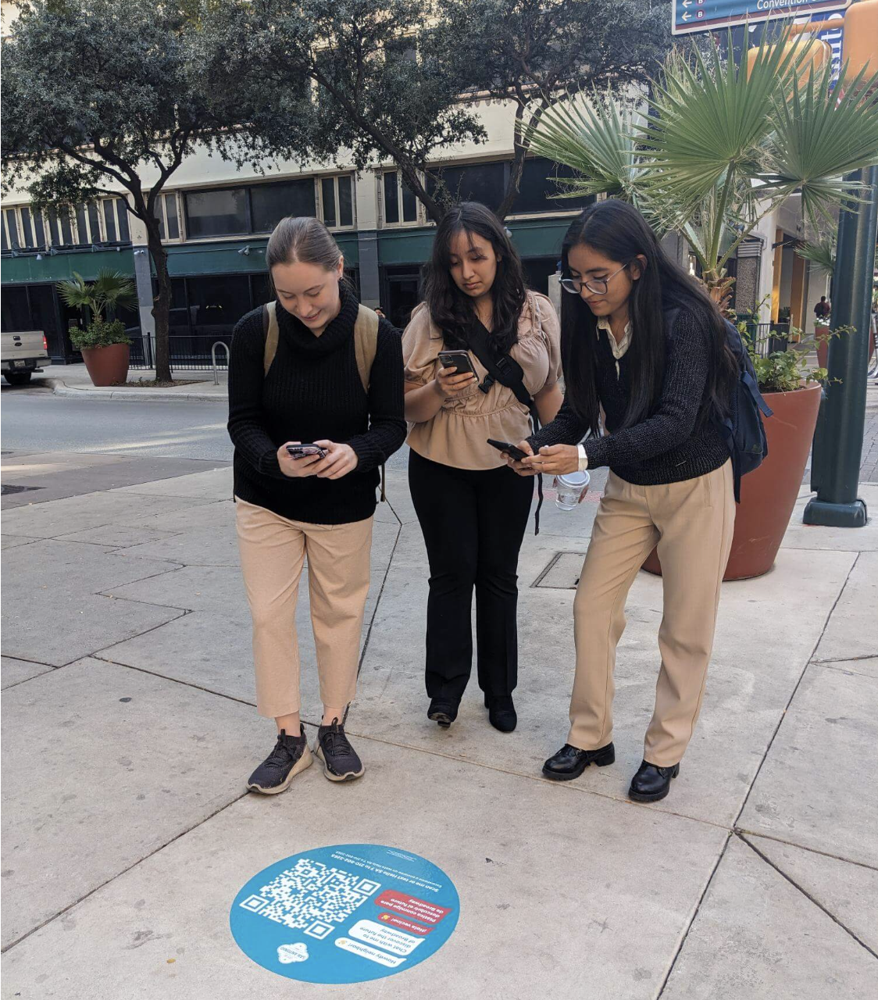
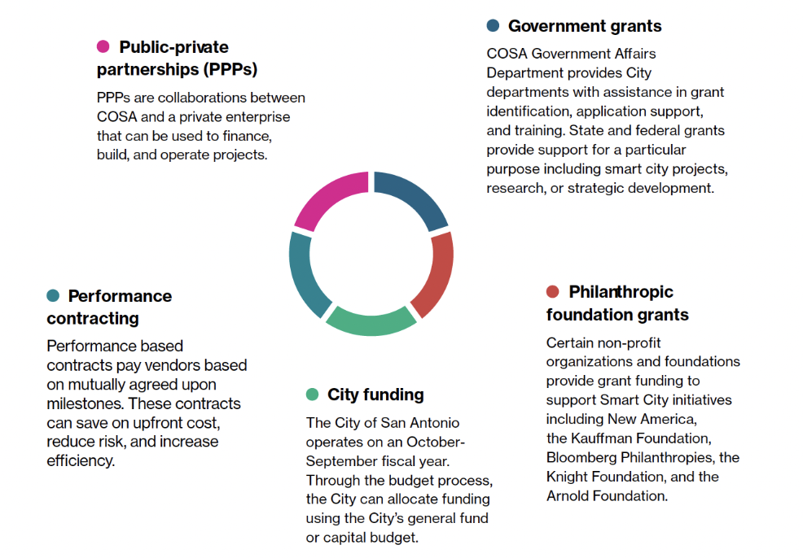

<!--
Allowed values:

type: district, plan

tags: Environment, Mobility, Buildings, Energy, InformationSystems, HealthEducation, InnovationSystems, CivicTech, CivicInnovation, Food

-->

## Overview

<!-- About 100 to 150 word summary of the case study. -->

The Smart Cities team at the Office of Innovation was launched in 2017 to advance San Antonio’s use of innovation, data, and technology to improve quality of life. The City Council designated three Innovation Zones (Downtown, Brooks and the Medical Center). In 2018 the SmartSA Partnership was established and a survey of residents who live, work, and play in the Innovation Zones was conducted. Leveraging the SmartSA Partnership and Innovation Zones, the Smart Cities team executed more than 30 pilots and projects in response to resident challenges since 2018, earning national recognition. This roadmap represents a bold and innovative approach for building an accessible, connected, and efficient city that keeps residents informed and safe. It uses a “people-centered” model for smart city development, where residents drive guiding-principles for how city government should use technology, data, and innovation to solve problems and increase quality of life.

## Goals and Aspirations

<!-- What is the project trying to achieve? Identify 3-5 high-level goals that define the entire project.Replace the placeholder title with a succinct name for the goal. -->

**Access to Public Information**.  San Antonio aims to share relevant data with residents in accessible, understandable, and convenient ways.

**Public Safety**. San Antonio wants to utilize connected and responsive tools to help create safe public spaces for San Antonio residents.

**Resilience & Environmental Quality**.  San Antonio aims to explore and utilize innovative approaches to mitigate the impacts of climate change and increase access to data about environmental quality.

**Safe Infrastructure**.  San Antonio wants to modernize and digitize their growing city infrastructure, including roads, bridges, sidewalks and pedestrian walkways.

**Access to Transportation**.  San Antonio aims to improve resident access to safe, convenient, affordable, and reliable public transportation to improve health outcomes, air quality, quality of life, and economic activity

## Key Characteristics

<!--  How is the project organized into specific activities that advance these goals? For plans: How does the plan address each of the three activities in digital master plans (development, engagement, implementation). For districts: How does the district employ 3-5 of the key characteristics of innovation hubs?
-->

**People centered**. San Antonio’s smart city approach puts emphasis on community engagement. They focused on defining problems with stakeholders and then identified the best way to solve those challenges, rather than leading with a new technology and retroactively trying to find ways to force that technology to address a need. They value buy-in from their community, partners, and city staff, and put effort in including them in the process of setting expectations and values for the role that technology plays in the community.

**Commitment to open data principles and transparent data governance policies**.  San Antonio was one of the first cities to create an Interlocal Data Sharing Agreement amongst public agencies. The IDSA provides a transfer and security protocol for data sharing across nine public agencies that are signatories to the agreement including: CPS-Energy, VIA Metropolitan Transit, San Antonio Water System, UTSA, Opportunity Home, San Antonio River Authority, Bexar County Appraisal District, Edwards Aquifer Authority and the City of San Antonio. The SmartSA partnership meets monthly to identify opportunities for collaboration and projects that can be powered by the data sharing agreement. For example, the SmartSA Smart Streetlight Pilot Program used the agreement to share sensor data from smart streetlights between CPS-Energy and the City of San Antonio to provide on its open data platform, data.sanantonio.gov.

**Smart city as a service**.  San Antonio’s smart cities team put their focus on leveraging innovation, data and technology to improve public services. The roadmap is backed by a governance process they built in collaboration with their IT and procurement departments, which quickens how smart city solutions can be prototyped within the City. The Team carved out this process with IT and it brings forward all required inputs/approvals from relevant City stakeholders to ensure that if a prototype is successful, that the City department sponsoring it can fund/scale it thereafter. This allows them to institutionalize smart cities as a process within government, and deliver their model that aims to leverage their expertise in emerging technologies and innovation as a service providing to residents and city departments.

## Stakeholders
<!--  Who initiated the project? Who is leading the project forward? Who else has a say in how it unfolds? Who is directly affected but marginalized? Identify 3-5 key stakeholder organizations or groups. Identify 3-5 key individuals. These are people who are associated with the project as leaders, supporters, critics, or regulators. They are likely to be members of the stakeholder groups identified above. These are people you should try to contact for one or more interviews.-->

**SmartSA Smart City Team**.  Established in 2017, the Smart Cities team's vision is to leverage new and emerging technologies and data to improve the quality of life for residents. Their objective is for San Antonio to be a people-centered smart city that is connected, inclusive, and resilient. The Smart Cities team also manages the SmartSA partnership which is comprised of eight partners, including, but not limited to CPS Energy, SAWS, VIA, and the San Antonio Housing Authority. This partnership is intended to ensure that the City of San Antonio is taking an inclusive, community-driven approach as it collaborates with partners to build a city of the future.
 [SmartSA](https://www.sanantonio.gov/smartsa/)

**Information Technology Services Department (ITSD)**.  ITSD is the closest and most critical collaborator with the SmartSA Smart City Team. All technology projects at the City of San Antonio are processed through the IT Governance Committee, which includes the Chief Information Officer, Chief Technology Officer, Chief Data Officer, and Chief Security Officer. Each proposal submitted by a department is subjected to rigorous review by the Committee, including compliance with the City’s security, data governance, and procurement policies.

**Diversity, Equity, Inclusion, and Accessibility Department (DEIA)**.  DEIA works closely with the Smart Cities team to ensure all hardware and software solutions are accessible to all users. Their team provides technical assistance, resources, and educational materials on universal design, accessibility standards, usability reviews, and community engagement support.

**Emily Royall, Smart City Administrator**.  Emily works at the intersection of urban planning, data and technology to build inclusive futures for cities.Currently, Emily leads San Antonio’s Smart City Team, which supports a multi-stakeholder smart city partnership “SmartSA”, and coordinates several projects in alignment with San Antonio’s Smart City Roadmap.

**Geoffrey Urbach, Smart City Senior Manager**.  Geoffrey is passionate about how civically minded and collaboratively built technology can help provide better services, improve resiliency, and create more equitable communities. Before joining the Office of Innovation, Geoffrey worked for a civic technology company in New York City managing partnerships with cities across 15 states to enable more efficient municipal public works operations. Geoffrey also spent six years in Washington, D.C. advocating, at the federal level, on behalf of public and private sector entities on legislative and regulatory issues specific to transportation, economic development, natural resources, and energy and environmental policy matters. There he launched and developed the firm’s smart cities practice. Geoffrey also has several years of public sector experience working as Legislative Aide and District Director for the Texas House of Representatives.

**Lauren Tarin, Smart City Specialist**.  Born and raised in San Antonio, TX, Lauren is driven by working with communities to strive for equitable change. To be of service is where her passion and career began. Before joining the Innovation Office, she supported and managed AmeriCorps volunteer programs supporting nonprofit organizations across Texas through capacity building initiatives. She received her Bachelor of Science in Advertising from the University of Texas at Austin and is currently working towards a Master of Science in Strategic Foresight through the University of Houston.

## Technology Interventions

<!--  What specific technology-enabled interventions does the project propose? Identify 3-5 technology interventions. Describe use cases, value proposition, solution architecture, data created or consumed, key platforms and standards, business models, regulatory issues, etc. Separate into more than 1 paragraph as needed. This is a good place to insert additional images, be sure to include captions identifying the source and make sure to not use copyrighted images. -->

**Smart Street Lights**. The SmartSA Smart Streetlight program pilots remote lighting controls, and five environmental sensor use-cases on up to 40 streetlights in each of the three Innovation Zones: Downtown, Brooks and the Medical Center for a total of up to 120 streetlights. The goal of the program was to evaluate smart streetlights for their cost effectiveness, feasibility, and benefit to the public. CPS-Energy and the City of San Antonio will determine the possibility of scaling the solutions city-wide. Smart streetlights incorporate energy saving LED lights, remote controls, and can optionally support sensor applications. SmartSA and City of San Antonio stakeholders identified five priority smart streetlight technologies to test during the pilot, including air quality sensing, temperature sensing, ambient noise detection, parking sensing and flood sensing.

**Digital Kiosks**.  This project provided the City with 25 digital community kiosks. They include hyper-local information on way finding, public transit, b-cycle, events, jobs and serve as Wi-Fi hotspots, have air quality and pedestrian sensors, and provide emergency communications. The digital kiosks provide citizens better access to public information and also improve public safety.

**Talkin' Broadway**.  The tool uses custom QR codes to initiate text message-based conversations with residents to receive messages, and can engage in interactive messaging with a ChatBot system providing customized information. The purpose of an on-site prototype is to improve communications about 2017 bond construction at specific sites along the lower Broadway corridor.

## Financing
<!--  How are the technology interventions identified to be financed? How does this fit into financing of the larger project? Identify at least one financing mechanism that is being used. -->

**Financing Scheme**. The Smart Cities team works closely with the Finance Department to secure funding for projects, prototypes, pilots, and RFPs. They have a range of financing options at their disposal, including public-private partnerships, government grants, philanthropic funding, performance contracting, vendor financing, and City funding.

## Outcomes
<!-- What results has the project produced to date? What outcomes and impacts are anticipated? Identify 3-5 (anticipated) outcomes. What will/has the project achieved? Thes should not be the same or repeated from elsewhere. Use this space to emphasize something different. -->

**Improve accessibility of public information**.  A huge part of the Smart Cities’ projects and effort focus on helping residents better access public information. The implemented digital kiosks provide public and community information including wayfinding, public transit, b-cycle, events, jobs and serve as Wi-Fi hotspots. The Talkin' Broadway project provided residents with customized information using chatbot. There was also a new online dashboard rolled out to keep residents informed about the status of projects to improve transparency and open communication, which encompass a range of projects, including streets, drainage, parks, and facilities.

**Safer and more robust infrastructure**.  San Antonio utilizes technology to ensure safe and reliable infrastructure for its citizens. The Smart Streetlight program pilots remote lighting controls and helps to determine the possibility of scaling the solutions city-wide. The anticipated outcome is to improve the daily quality of life for San Antonians, and also to impact the city’s economic growth and competitiveness.

**More resilient environment and better environmental quality**.  San Antonio emphasizes using technology to help access clean air, water, food and a resilient natural environment. San Antonio has implemented a series of projects including Smart Farm, Food Forest, and Foodways. Foodways will develop main features and capabilities of the digital suite to address accessibility to healthy food sources in an inclusive and sustainable manner to prevent obesity and diabetes. The anticipated outcome is to help in the efforts to reduce food insecurity, enhance nutrition in our community and connect residents to transportation options.

## Open Questions
<!-- What is uncertain, unclear, or still unresolved about this project? Identify 1-3 open question(s). -->

**Inclusivity**.  Many current projects include digital platforms and usage of smart devices. How will the projects ensure the accessibility of the smart cities technology to a diverse range of people, for example, elders and people with different social backgrounds?

## References

---

### Primary Sources

<!-- 3-5 project plans, audits, reports, etc. -->
- Smarter Together Roadmap 2023—San Antonio
- [SmartSA website](https://www.sanantonio.gov/smartsa/)
- [SmarterTogether SA website](https://www.smartertogethersa.com/sanantonio)

### Secondary Sources

<!-- 5-7 secondary source documents: news reports, blog posts, etc.. -->
- San Antonio Succeeds By Putting People at the Center of Smart Cities
<https://smartcitiesconnect.org/san-antonio-succeeds-by-putting-people-at-the-center-of-smart-cities/>
- Smart city ‘sandbox’ lets San Antonio residents play with technology\
<https://www.smartcitiesdive.com/news/smart-city-sandbox-san-antonio-residents-technology-community-engagement-outreach/705006/>
- Building a People-Centered Smart City: San Antonio Aligns Tech with Resident & Staff Input
<https://the-atlas.com/projects/building-a-people-centered-smart-city--san-antonio-aligns-tech-with-resident---staff-input-1698>
- How San Antonio is innovating on workforce development
<https://sanantonioreport.org/listen-san-antonio-workforce-development-city-services-big-city-small-town-podcast/>
- San Antonio launches new dashboards to update citizens on projects
<https://cities-today.com/san-antonio-launches-new-dashboards-to-update-citizens-on-projects/>
