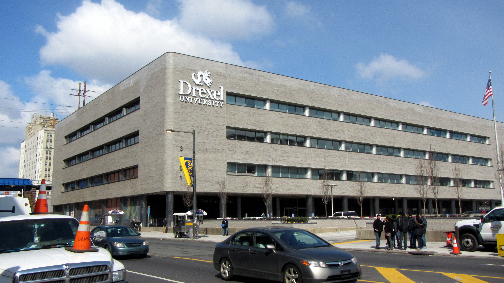
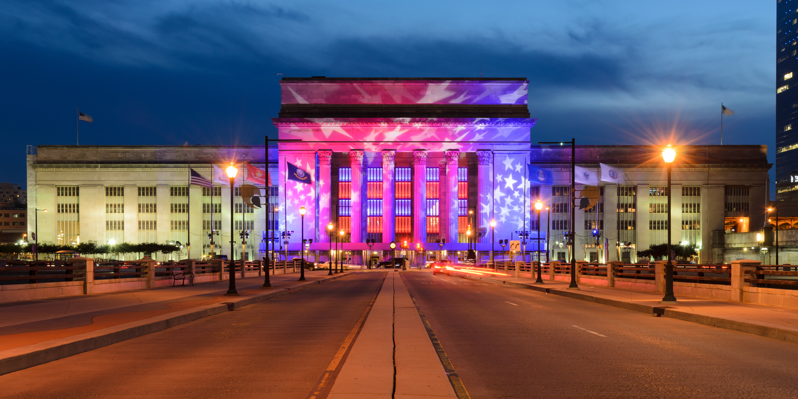
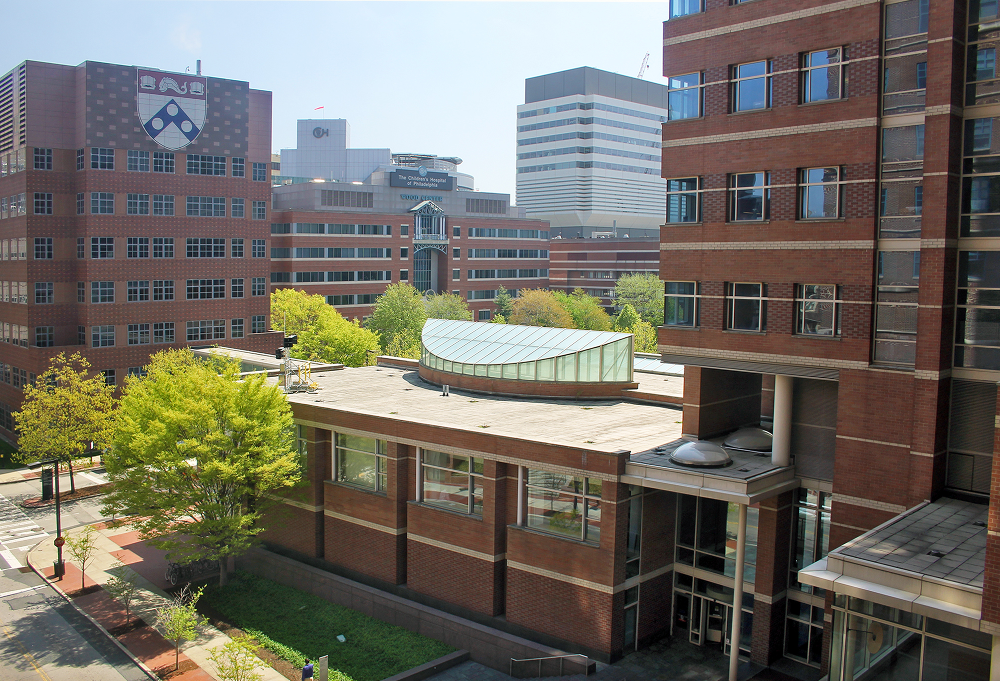

## Overview

<!-- About 100 to 150 word summary of the case study. -->
Schuylkill Yards is a mixed-use real estate development led by Brandywine Realty Trust and Drexel University. The project plans to redevelop 14 acres of land along the Schuylkill River. Schuylkill Yards is expected to include ten buildings and a network of greenspaces. The project location is part of the University City district in West Philadelphia. It is surrounded by the city's main transit hub (30th Street Station) and Drexel University. The project plans to be completely finished by the third quarter of 2025.

The project itself is a major part of Philadelphia's revitalization over the past decade. During the latter half of the 20th century, the city was in decline. A large portion of the medium and high-income residents moved out to the suburbs, and most of the major corporations also relocated. This was due to a number of factors including a loss in manufacturing jobs, an increase in organized crime, and the expansion of regional rail systems that made suburbanization even easier.

That being said, since the 2000s Philadelphia has seen an economic resurgence. Major telecommunication companies built massive new offices, Drexel and the University of Pennsylvania have heavily invested in their campuses, and many biotech startups have begun placing roots around the major hospitals.

## Key Characteristics

<!--  Summarize the most visible essential characteristics of the project. For districts: How does the district employ 3-5 of the key characteristics of New Century Cities? For plans: How does the plan address each of the three activities (development, engagement, implementation) of the digital masterplanning process described in the 2015 Townsend and Lorimer paper?
-->

**Life Science Specialization**.  One of the defining factors of the Schuylkill Yards project is its focus on attracting life science companies. Most of the buildings have dedicated lab spaces as part of their construction plans. Two major healthcare networks, Penn Medicine and the Children's Hospital of Philadelphia, have heavily invested in nearby facilities to help support new biotechnology companies.

**Creating a New Community**.  Real-estate projects often fight with the existing neighborhoods that surround them. Projects like Hudson Yards(New York City) and Canary Wharf(London) have been ridiculed for not taking into account existing neighborhoods. Schuylkill Yards is unlikely to face this issue due to its geographic location. The entire site is surrounded by existing rail infrastructure and Drexel University. The land that the project is being developed on is mostly abandoned buildings and parking lots for 30th Street Station. How Schuylkill Yards tackles this situation will be interesting because it is on a pseudo island.

**Joint University Implementation**.  One of the biggest advantages of this project is that the land being developed is mostly owned by Drexel University. The university has a vested interest in developing the area surrounding its campus. Due to Drexel's participation, the project has avoided many of the hurdles normally associated with such a large real-estate project. Additionally, the University's backing has allowed for the project to be oriented towards an innovation focus. Tenants will have the opportunity to work closely with existing research and development programs at Drexel.

## Goals and Aspirations

<!-- Summarize the most important goals of the project. Replace the placeholder title with a succinct name for the goal. The text should be around 50 words. -->

**Expand Philadelphia's Innovation Ecosystem**.  Schuylkill Yards will likely be an important part of Philadelphia's Revitalization. Due to the investment made by both the University of Pennsylvania and the Children’s Hospital of Philadelphia, the city is becoming a center for medical research and development. From a governance standpoint, a major goal of the project is to attract Life Science companies to move to the city and provide high paying jobs for the city.

**An Untapped Profit Source**. As Philadelphia begins to fill in, real-estate development has become more and more difficult. By redeveloping parking lots and abandoned buildings, Brandywine Realty Trust is going to be able to massively increase the land value of the project site. Similarly to the goals of Sidewalk Toronto, Schuylkill Yards will be able to create its own core ecosystem and then control a broader service economy around the site.

**University Development**.  Over the past decade Drexel has changed from a small "work experience" focused college to a major national university. Drexel has expanded its student enrollment, campus footprint, and existing professional graduate programs. Despite all this, Drexel has struggled to decrease its acceptance rate or increase its ranking. A major goal for Drexel is to use Schuylkill Yards as a jumping off point to attract better faculty and students by providing better facilities for research. This will hopefully solve its issues related to acceptance rate and ranking.

## Technology Interventions
<!--  Identify 3-5 specific technology-enabled interventions the project employs or proposes. The text should be around 75-125 words. Separate into more than 1 paragraph as needed. This is a good place to insert additional images, be sure to include captions identifying the source and make sure to not use copyrighted images. -->

**Healthy Work Environment for a post-COVID world**. Schuylkill Yards was originally started prior to the COVID-19 pandemic. During the pandemic construction methods and materials were adjusted to minimize infection rates. These changes carried over to the final design of all the buildings. Additions include a premium MERV-13 Filtration, antimicrobial finishes, touchless locks, 24/7 HVAC operations, and destination dispatch elevators.  Many of these buildings were already designed for wet laboratories so they included a high performance VAV system, supplemental condenser water, critical high intensity cooling areas (backed up by generator), optimized fresh air intake, and space designated for clean rooms.

**LEED Platinum Certification**.  One of the main goals of the project is to include at least one Leadership in Energy and Environmental Design (LEED) Platinum certified building. LEED is a certification that rates the environmental sustainability of a building. To achieve this certification Schuylkill Yards has promised a climate response design that includes advanced solar control. This system would dynamically change the facades to maximize thermal insulation. For example, when the internal building temperature needs to be cooled the facades can adjust and provide more shade. Another promise is the reduction in the amount of potable water being used in the building. This will likely be achieved through storm water capture and greywater recycling.

**JFK Blvd Esplanade**.  A defining part of the project is the network of greenspaces being constructed. These interconnected greenspaces should allow pedestrians to move across the entire neighborhood on foot. The unified greenspaces will also create a campus-like feel to the project site. The crux of these greenspaces is the JFK Blvd Esplanade. This stretch of road is modeled off the chaotic streets of southeast Asia. The general concept is that chaotic road traffic does not necessarily result in traffic congestion. Many plazas in southeast Asia house multiple modes of transit with no signalization or markings, yet people still manage to flow through them with minimal accidents. Schuylkill Yards plans to take this concept and redevelop JFK Blvd. This stretch of road will have the same grade elevation for vehicles and pedestrians. Vehicles will be expected to yield to pedestrians without any signals or markings. This project could also be interesting for autonomous vehicle development. The chaotic roadway would serve as challenge for all autonomous vehicles as they attempt to navigate an anarchical roadway.

## Stakeholders
<!--  Identify 3-5 key stakeholder organizations or groups. The text should be around 50 words, and include a link to the organization.-->

**[Brandywine Realty Trust](https://www.brandywinerealty.com/)**.  The Brandywine Realty Trust is the main real-estate organization in charge of developing and renting out the commercial and residential space. The company itself is responsible for 23 million square feet of real estate. The trust has historically focused on developing emerging American markets like Philadelphia, Austin, and the District of Columbia.

**Transit Agencies**.  [Amtrak](https://www.amtrak.com/home.html), [SEPTA](https://www5.septa.org/), and [NJ Transit](https://www.njtransit.com/) operate at the nearby 30th Street Station. The station is Amtrak’s third busiest station, one of SEPTA's only centrally located heavy rail station, and NJ Transit's only heavy rail terminal in Pennsylvania.  

**Universities**.  [Drexel University](https://drexel.edu/) has been an obvious partner in the Schuylkill Yards project. Most of the land that is part of Schuylkill Yards is still owned by the University. Drexel also has a major interest in seeing the city as a whole further develop. [The University of Pennsylvania](https://www.upenn.edu/) (UPenn) has a similar interest in the development of Schuylkill Yards. UPenn’s proximity to the project allows for cross collaboration between University researchers and companies at Schuylkill Yards.  

**Healthcare**.  Due to the life science specialization of Schuylkill Yards the existing medical research centers are important stakeholders. There are two major destination hospitals near the site. The first is the [Hospital at the University of Pennsylvania](https://www.pennmedicine.org/for-patients-and-visitors/penn-medicine-locations/hospital-of-the-university-of-pennsylvania) (HUP). The second is the [Children’s Hospital of Philadelphia](https://www.chop.edu/) (CHOP). Both of these hospitals also have extensive research divisions that will likely coordinate with companies at Schuylkill Yards.  

**University City District**.  Schuylkill Yards is part of the [University City District](https://www.universitycity.org/) (UCD). UCD is a joint economic development council. The organization works similarly to a business improvement district, but it does not hold the same designation because UCD also represents non-profits and universities. The UCD famously runs the Loop through University City (LUCY) shuttle that provides service around West Philadelphia and through Schuylkill Yards.

## Leadership
<!--  Conduct one interview with a project leader, and link to a LinkedIn or other profile. Provide a brief biography, no more than 75 words. Identify 3-5 insights or themes from the interview. Feel free to add a photo of the individual here. -->

### [Adriaan Geuze](https://www.linkedin.com/in/adriaan-geuze-19199812b/)

Adriaan is the founder of West 8. His team was responsible for designing Drexel Square as part of Schuylkill Yards.

**Informal Integrated Communities**. One of the biggest challenges, with many large scale business parks, is the approachability of the site. Drexel Square is designed to soften Schuylkill Yards by providing an informal space for people to congregate.

### [Della Clark](https://www.linkedin.com/in/della-clark-4973595/)

Della is the President of the Enterprise Center. The Enterprise Center aims to help promote economic development in West Philadelphia. They have specifically focused on providing resources for small businesses in the area.

**Localism to Globalism**. A key tenant of the Schuylkill Yards is to create a service industry surrounding the core economy. Many small business owners hope that the project will bring customers to support existing businesses.

### [Vishaan Chakrabarti](https://www.linkedin.com/in/vishaan-chakrabarti-faia-a004b9113/)

Vishaan is the founder of Practice for Architecture and Urbanism (PAU).  PAU are the lead designers for the first phase of Schuylkill Yards.

**A New Downtown for America’s First City**. Schuylkill yards is uniquely positioned to fit the “walkable city” mantra. Within 20 minutes you can get to arts and culture (Philadelphia Art Museum), a central business district, regional transit (30th St Station), nature (Schuylkill River Parkway), educational institutions (Drexel & Penn), and hospitals (HUP and CHOP).

### [James Timberlake](https://www.linkedin.com/in/james-timberlake-70bbb9/)

James is a Partner at the Architecture firm Kieran Timberlake. His company was responsible for the renovation of the first building in Schuylkill Yards, the Bulletin Building.

**Redeveloping an Icon**. The Bulletin building was originally designed by George Howe with iconic lettering across the facade. The building degraded over time, but as part of Schuylkill Yards it was renovated. The new design includes a glass facade with ceramic fit lettering that harkens back to the original text on the building.

## Financing
<!--  Identify at least one financing scheme being used in this project or plan. About 100 words is probably a good length for this. -->

**Qualified Opportunity Zone**. The objective of a Qualified Opportunity Zone is to allow for more investment in a distressed community through tax incentives. This is a federal program run by the Internal Revenue Service (IRS) to improve development in impoverished communities. In the case of Schuylkill Yards, because the project site was originally a series of abandoned buildings and parking lots, it is classified as a Qualified Opportunity Zone. The project specifically pertains to any investment in companies that are housed within the zone.

The zone allows for investors to decrease the amount of capital gains tax by 10% if they hold the investment for more than 5 years, and if the person holds their investment for 10 years then no capital gains taxes are applied once sold.

**Keystone Opportunity Zone**. The Keystone Opportunity Zone is similar to the Qualified Opportunity Zone, but it is specific to Pennsylvania State and Philadelphia taxes.  Tenets have the opportunity to get Philadelphia tax abatements on business income & receipts, net profits, real estate, use and occupancy, and sales tax. They can also receive Pennsylvania abatements on corporate net income, personal income, bank and trust company share, sales and use, and mutual thrift institution taxes.

## Outcomes
<!-- Identify 3-5 (anticipated) outcomes. What will/has the project achieved? Thes should not be the same or repeated from elsewhere. Use this space to emphasize something different. About 50 words per is minimum, but these can be as long as you want/need. -->

**An Enclosed Community**.  Many other life science-based initiatives run into the problem of self-isolation. This is usually a result of life science companies holding onto the notion that innovation can only occur at a lab bench. Due to the already isolated nature of the project site, we can expect similar problems to occur. It is likely that over time community engagement will decrease, and we may end up with an apocalyptic version of the 15-minute city.

**An Established Industry**.  Philadelphia has slowly been positioning itself to become the country’s center for medical research. The Hospital at the University of Pennsylvania’s advancements in proton therapy and immunology have made it a destination hospital. This success has spilled over to the rest of West Philadelphia. Over the next few years Schuylkill Yards will provide the capacity for biotech startups to move to the region and change the industrial landscape of the city.

**A Second Central Business District**.  It is quite rare for a city to have more than one central business district (CBD). Outside of New York City (which had four CBDs), most cities have a single downtown area. Schuylkill Yards could create a competing CBD for Philadelphia. Although Schuylkill yards is close to Center City from a Euclidean standpoint, the Schuylkill River is a major geographic barrier that separates West Philadelphia from Center City. This means Schuylkill Yards could compete with Center City from an economic and cultural standpoint.

## Open Questions
<!-- Identify 1-3 open question(s). What is uncertain, unclear, or still unresolved about this project? These can be 50 words or less. -->

**Is the concentration on Life Sciences too much?**. Looking at this project from a high level, it has many parallels with the existing infrastructure of many tech companies in Silicon Valley. It is a single-minded community, designed to support a single industry. Although this strategy has managed to make the bay area a major economic powerhouse, it has also led to a lack of adaptability. Currently, the bay area is experiencing a reckoning due to a shift in remote work. Could Schuylkill Yards eventually be dealt the same cards? Does the project’s reliance on Life Sciences pigeon-hole its future?

**How will an isolated community be different?**. A defining part of this project's development has been its location. The majority of Schuylkill Yards sits on undeveloped or abandoned land. This gives them the unique opportunity to create their own community. The project is also surrounded by 30th street station and Drexel University. 30th Street station extends until the Schuylkill River which creates a natural barrier between the development and Logan Square. In a similar vein, Drexel University mostly consists of glass covered academic buildings, and does not focus on long-standing community development. As a result, Schuylkill Yards is not required to mold itself to an existing community.

**Is this an Innovation District or a Real Estate Project?**. A fundamental part of this atlas is to curate projects that would be considered “Smart City Districts”. Schuylkill Yards sits on the fence between an innovation district and just another real estate project. Although the scale of the project is beyond anything the city has experienced in the past few decades, the project itself does not explicitly push innovative technologies or advance building methods. This is not surprising, it is important to remember that Schuylkill Yards is a real estate project at the end of the day. The project is not designed to spark smart cities innovation, it is designed to provide the highest margin of profit to its shareholders.

## References

### Primary Sources

<!-- 3-5 project plans, audits, reports, etc. -->

- [Brandywine Realty Trust](https://schuylkillyards.com)
  - [Vision & Timeline](https://schuylkillyards.com)
  - [General Brochure](https://schuylkillyards.com/sites/default/files/downloads/2022-03/Schuylkill%20Yards%20Brand%20Elevation%20Book%20-%202021_2.pdf)
  - [Life Science Brochure](https://schuylkillyards.com/sites/default/files/downloads/2022-07/Brandywine%20Life%20Sciences%20-%20August2021%20Digital_3.pdf)
  - [Retail Brochure](https://schuylkillyards.com/sites/default/files/downloads/2019-10/SY%20Gen%20Brochure%20Anchor%20Tenant%20CBRE%2020190911.pdf)
  - [Bulletin Building](https://schuylkillyards.com/lease-space/bulletin-building-3025-market-street)
  - [3025 JFK](https://schuylkillyards.com/sites/default/files/downloads/2023-02/3025%20JFK%20Brochure_Feb2023%20Web.pdf)
  - [3151 Market](https://schuylkillyards.com/sites/default/files/downloads/2022-11/3151%20Market%20Brochure_OCT2022_WEB.pdf)
  - [3001 JFK](https://schuylkillyards.com/sites/default/files/downloads/2022-11/3151%20Market%20Brochure_OCT2022_WEB.pdf)
- [Drexel University](https://drexel.edu/facilities/real-estate/schuylkill-yards/)
- [West8](https://drexel.edu/facilities/real-estate/schuylkill-yards/)
- [SHoP](https://www.shoparc.com/projects/schuylkill-yards/)

### Secondary Sources

<!-- 5-7 secondary source documents: news reports, blog posts, etc.. -->

- [Phillymag.com](https://www.phillymag.com/sponsor-content/schuylkill-yards-university-citys-biggest-boldest-project-yet/)
- [Real Estate Weekly](https://rew-online.com/the-gotham-organization-and-brandywine-realty-trust-reveal-the-first-look-at-new-residential-project-avira-in-schuylkill-yards/)
- [ArchDaily](https://www.archdaily.com/search/all?q=schuylkill%20yards&ad_source=jv-header)
  - [Masterplan](https://www.archdaily.com/783648/shop-and-west-8-to-masterplan-philadelphias-schuylkill-yards?ad_source=search&ad_medium=projects_tab&ad_source=search&ad_medium=search_result_all)
  - [JFK Towers](https://www.archdaily.com/923700/pau-reveals-new-jfk-towers-for-philadelphias-schuylkill-yards?ad_source=search&ad_medium=projects_tab&ad_source=search&ad_medium=search_result_all)
  - [First Renders](https://www.archdaily.com/923700/pau-reveals-new-jfk-towers-for-philadelphias-schuylkill-yards?ad_source=search&ad_medium=projects_tab&ad_source=search&ad_medium=search_result_all)
  - [SOM](https://www.archdaily.com/791628/som-designs-new-urban-district-around-philadelphias-30th-street-station)
