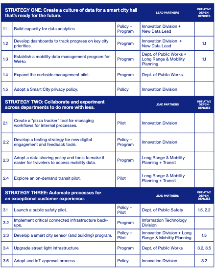
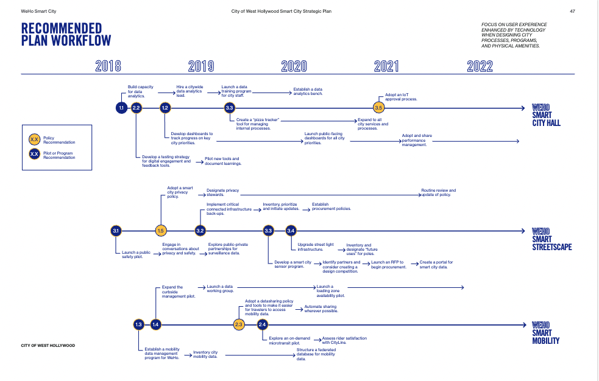
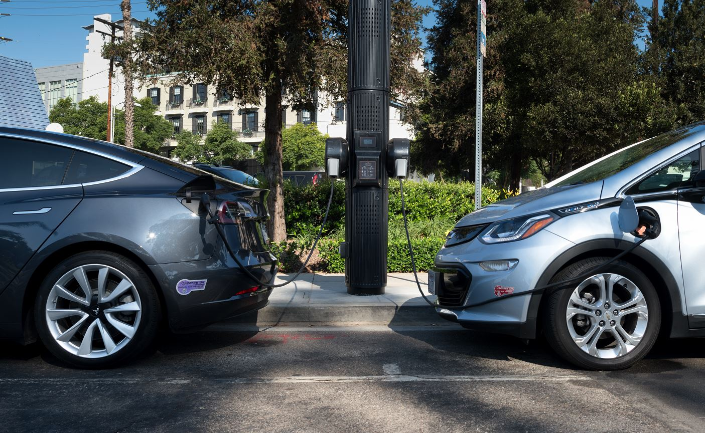
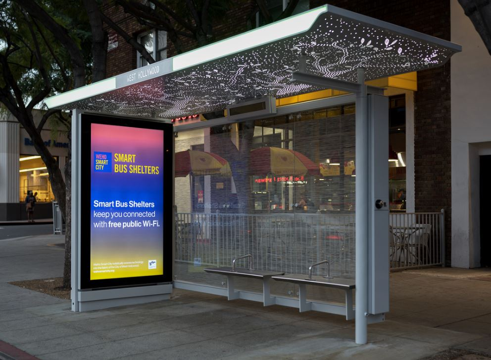

<!--
Allowed values:

type: district, plan

tags: Environment, Mobility, Buildings, Energy, InformationSystems, HealthEducation, InnovationSystems, CivicTech, CivicInnovation, Food

-->

## Overview

<!-- About 100 to 150 word summary of the case study. -->

The West Hollywood Smart City Strategic Plan is a digital master plan developed by the City of West Hollywood (WeHo) with the overarching goal of incorporating technology to enhance the experience of both residents and visitors. The plan aspires to do this by incorporating data driven decision making into government, enhancing collaboration across city departments, and automating processes. Within each of these goals, the plan outlines how it plans to address each of its five key values: Sustainability, Mobility, Accessibility, Resiliency, and Transparency. The plan includes initiatives to train employees about the usage of data within the city, a proposal for a tracker for managing internal processes, and strategies for launching pilots for technologies like smart bus shelters,

## Goals and Aspirations

<!-- What is the project trying to achieve? Identify 3-5 high-level goals that define the entire project.Replace the placeholder title with a succinct name for the goal. -->

**1. Create a culture of data as a smart city hall ready for the future**.  This goal focuses on building a capacity for data-focused decision making. Because the City of West Hollywood does not have dedicated data analysts or data scientists, a critical part of this goal is employee data education. Additionally, there is an emphasis on implementing a dashboard for the general public to be able to track progress on city initiatives.

**2. Collaborate and experiment across departments to do more with less**. A key component of this goal is to create a culture of collaboration across city departments. As mentioned during an interview with Ashley Hand of CityFi, an example of a task falling under this goal was to find data that can be reused across departments to avoid recollecting repetitive data. It also involves implementing a data sharing process for mobility data for travellers, and trackers for internal city processes.

**3. Automate processes for an exceptional customer experience**.  The detailing of the bulk of "smart technologies" for the city fall within this goal. Within this strategy lies the detailing for plans regarding public safety pilots, smart sensor implementation, and upgrading street light infrastructure.

## Key Characteristics

<!--  How is the project organized into specific activities that advance these goals? For plans: How does the plan address each of the three activities in digital master plans (development, engagement, implementation). For districts: How does the district employ 3-5 of the key characteristics of innovation hubs?
-->

The WeHo Smart City Strategic Plan is broken down into the three goals highlighted in the prior section. Within each goal, there are smaller subgoals related to each overarching goal. Each of these subgoals are more specific, with implementation actions and details surrounding the goal. For example, a subgoal within Goal 3 is to upgrade the city's street light infrastructure.

Additionally, the plan highlights five key values: Sustainability, Mobility, Accessibility, Resiliency, and Transparency. Each subgoal describes which of the five key values that subgoal targets.

**Development**. The project was developed as a way to build upon existing initiatives begun by WeHo with the hopes of making a detailed, actionable plan to measure progress in the city's technological endeavors.

**Engagement**. In 2017 before the plan was published, the city put on an event called the Smart City Pop-Up Open House to educate residents about smart city technologies and hear citizen feedback on initiatives. Additionally, in November 2017 the city hosted a WeHo Smart City Symposium during Innovate LA which was a celebration of regional innovation providing lectures and events.

**Implementation**. Within the plan, there are explicit timelines of goal implementation, including dependencies between goals. Subgoals that require other goals to be completed before being started are clearly defined.

## Stakeholders
<!--  Who initiated the project? Who is leading the project forward? Who else has a say in how it unfolds? Who is directly affected but marginalized? Identify 3-5 key stakeholder organizations or groups. Identify 3-5 key individuals. These are people who are associated with the project as leaders, supporters, critics, or regulators. They are likely to be members of the stakeholder groups identified above. These are people you should try to contact for one or more interviews.-->

**City of West Hollywood**.  This project was spearheaded by the City of West Hollywood itself. The contributors within the city itself include:

- [Former City of WeHo Innovation Manager Francisco Contreras](https://www.linkedin.com/in/scocontreras/)
- [Former City of WeHo Senior Innovation Analyst Kate Kigongo](https://www.linkedin.com/in/katekigongo/)
- [West Hollywood City Council](https://www.weho.org/city-government/city-council)
- West Hollywood Mayors

**Consultant Relationships**.  Because the city itself is so small, the City of West Hollywood relied heavily on it's consultant relationships to develop the plan. The primary consulting agencies involved in the plan are as follows, with CityFi acting as the lead of the consultant team:

- [Cityfi](https://www.cityfi.co/) (urban change management)
  - [Cityfi co-founder Ashley Hand](https://www.linkedin.com/in/ashleyzhand/)
- [Skidmore, Owings & Merrill](https://www.som.com/) (architecture/ urban planning firm)
- [Iteris](https://www.iteris.com/) (applied informatics for urban systems)
- [Steer Davies Gleave](https://us.steergroup.com/en-us) (mobility consulting)

## Technology Interventions
<!--  What specific technology-enabled interventions does the project propose? Identify 3-5 technology interventions. Describe use cases, value proposition, solution architecture, data created or consumed, key platforms and standards, business models, regulatory issues, etc. Separate into more than 1 paragraph as needed. This is a good place to insert additional images, be sure to include captions identifying the source and make sure to not use copyrighted images. -->

**Dashboards for tracking city initiatives**. One of the fundamental interventions outlined within the plan involves the creation of a dashboard aimed at tracking progress on city initiatives.
Key performance indicators will be determined based on the department. These key performance indicators by department will aid in measuring progress on city initiatives, which will then be displayed to the public via dashboard on the city's website. One of the main goals with this intervention is to provide accountaibility and transparency to the general public, and also to help city staff remain informed and troubleshoot city services.  

**Smart Street Light Infrastructure**. This intervention involves upgrading the current WeHo street light infrastructure to incorporate IoT (Internet of Things) capabilities to provide additional services to residents and visitors. The plan highlights that they plan to use these poles to offload city computing tasks. While the plans for upgrading the street light infrastructure in the plan are intentionally vague, the city has posted concrete updates in regards to street light pilots. In 2019, the city debuted two Smart.Node street lights. The street lights provide the following: electric vehicle charging, WiFi, camera sensors to detect pedestrian and traffic levels, environmental sensors, smartphone charging, and more.

**Smart Bus Shelters**.  Another significant intervention, smart bus shelters, relates to the city's goal to enhance the transit experience and make mobility easier for both visitors and residents. In 2019, the city launched a smart bus shelter pilot. These smart bus shelters provide visual and audio real time information about bus arrivals on screens, USB charging ports, WiFi, and information relevant to the city. Because bus information can often be unpredictable or not up to date on maps applications, these bus shelters will serve to be a source of truth for mobility in West Hollywood.

## Financing
<!--  How are the technology interventions identified to be financed? How does this fit into financing of the larger project? Identify at least one financing mechanism that is being used. -->

**Innovation Fund**. The project is funded by the City of West Hollywood's Innovation Fund. The plan indicates that they plan to get additional funding through grants if needed.

## Outcomes
<!-- What results has the project produced to date? What outcomes and impacts are anticipated? Identify 3-5 (anticipated) outcomes. What will/has the project achieved? Thes should not be the same or repeated from elsewhere. Use this space to emphasize something different. -->

**Employee Data Education**.  The most significant outcome related to the first goal of the project is the WeHo Data Academy which took place in 2019 and was launched by the city's Innovation Division. One of the most significant aspects of the first strategy was to increase data fluency among city employees and empower them to incorporate data into their day to day jobs. Because the city did not have any employees dedicated to data roles, it was critical to provide existing employees with data education. The WeHo data academy provided a 15 hour training for 27 employees introducing them to data, data storytelling, data visualization, data refinement and interpretation, and data automation. This training empowered employees to confidently incorporate data into their daily jobs.

**Digital Contract Portal**. The second strategy of the plan emphasized the need to collaborate more effectively across departments, and the creation of a digital contract portal displays success in that area. Previously, contracts created within the city were reviewed in hard copy format. It was difficult to be able to track the status of contracts, as the hard-copy nature of the task meant there was a lot of back and forth between employees. The digital contract portal allowed employees to review and submit contracts within 4 business days, whereas it used to take 10 business days. This was especially critical and a step forward during the beginning of the coronavirus pandemic, and employees reported high satisfaction with this platform.  

**IoT Implementation and Further Planning**. As of 2020, the city has made significant progress implementing pilots like the Smart Bus Shelters and Smart Street Light infrastructure. Additionally, a group called the Smart City Infrastructure Working group was created to further the discussion and brainstorming of new smart city infrastructure projects. This is an interdepartmental group that meets every two weeks to further similar initiatives and incorporate technology meangingfully into the city's landscape.

## Open Questions
<!-- What is uncertain, unclear, or still unresolved about this project? Identify 1-3 open question(s). -->

**Progress Update**.  Has there been an update of progress since the official update provided in 2020? Given that this was a five year plan, it would be interesting to have an official document reflecting progress and completion of initiatives.

**Political Leadership Changes**.  How does the city maintain the plan with changes of political leadership and ensure technology is a priority despite those changes?

**Changing Technological Landscape**.  How will the city deal with the rise of generative AI given limited city resources?

## References

---

### Primary Sources

<!-- 3-5 project plans, audits, reports, etc. -->
- City of West Hollywood Strategic Plan
- [WeHo Smart City Strategic Plan Progress Update](https://weho.granicus.com/MetaViewer.php?view_id=16&clip_id=3540&meta_id=191347)

### Secondary Sources

<!-- 5-7 secondary source documents: news reports, blog posts, etc.. -->
- Cityfi West Hollywood Smart City Strategic Plan Profile <https://www.cityfi.co/portfolio/west-hollywood-smart-city-strategic-plan>
- SOM Smart City Strategic Plan <https://www.som.com/projects/weho-smart-city-strategic-plan/>
- WeHo Smart City Open House <https://www.weho.org/Home/Components/News/News/7075/>
- WeHo Smart Street Light Update <https://www.weho.org/Home/Components/News/News/8904/>
- WeHo Smart Bus Shelter Update <https://www.weho.org/Home/Components/News/News/8508/#:~:text=The%20City%20of%20West%20Hollywood's,reimagines%20the%20digital%20urban%20experience>.
