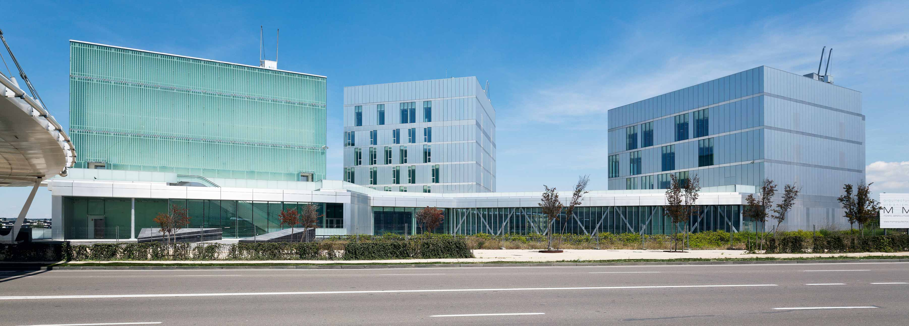
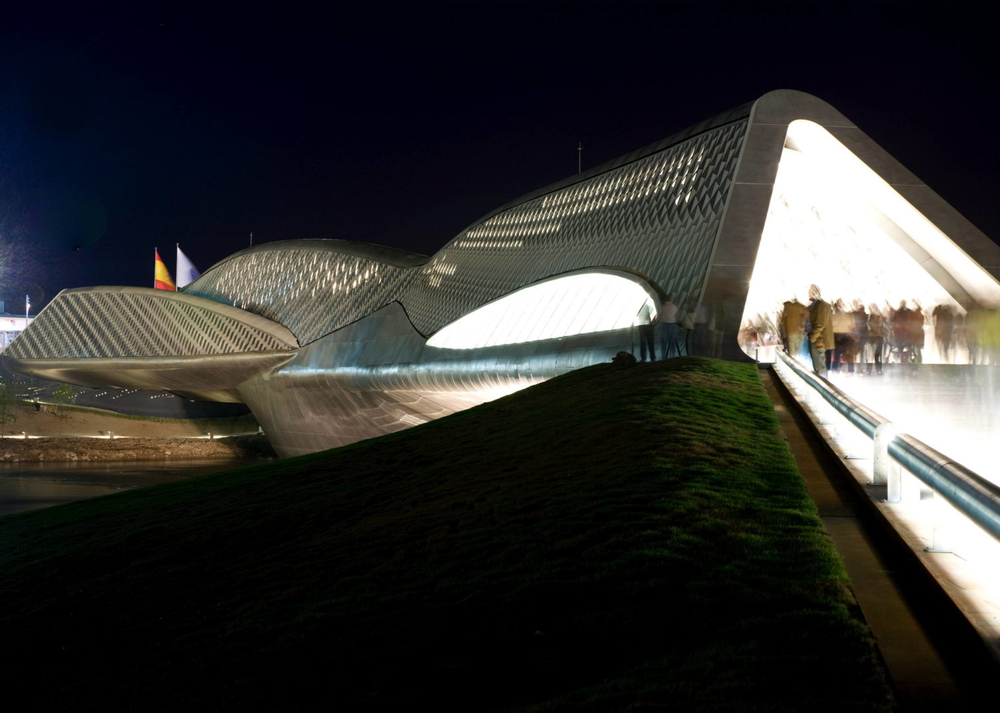
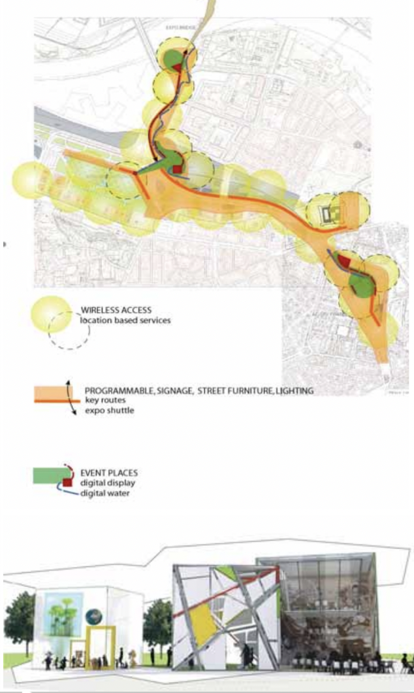

## Overview

<!-- About 100 to 150 word summary of the case study. -->

Zaragoza is a Spanish city located at the halfway point between Madrid and Barcelona. In 2005, Zaragoza Mayor Juan Alberto Belloch proposed the Digital Mile project, as he saw the development of the new high-speed railway system that was being built as an opportunity for urban redevelopment in the city. This was even more so as the new railway system now placed Zaragoza within commuting distance of Spain's two largest cities.

Not long after the project was set in motion, Zaragoza was appointed to be the location of the international exposition. As a result, plans for the Digital Mile were put on hold until after the exposition. However, coincidentally on the day of the exposition, the 2008 economic crisis hit, and one of the Digital Mile’s biggest investors, the Lehman brothers, went bankrupt, which halted a majority of their development. Since then, the Digital Mile as a project is no longer active, however it has been broken down into mini projects that are happening around the city. 

## Key Characteristics

<!--  Summarize the most visible essential characteristics of the project. For districts: How does the district employ 3-5 of the key characteristics of New Century Cities? For plans: How does the plan address each of the three activities (development, engagement, implementation) of the digital masterplanning process described in the 2015 Townsend and Lorimer paper?
-->

**Etopia Center for Arts and Technology**. The Etopia Center for Arts and Technology was designed to be an expressive building merging research, art, economics, communication, culture, and technology in the city. Spanning 16,000 square meters, with three large sections, it acts as an open space for where artists, engineers, and the general public can come together. Additionally, it connects Zaragoza to the former international exposition grounds, as well as the high-speed railway station and a surrounding park. Its role is really to act as a place for the community to gather and share knowledge, as well as a technological and innovation hub. It does so by housing two startup incubators, a residence for creators and researchers, audiovisual and technological creative laboratories, as well as university research. 

**Bridge Pavilion by Zaha Hadid**.  The Zaha Hadid Bridge Pavilion connects one of the main neighborhoods of Zaragoza, La Almozara, to the exposition site, and spans the Ebro River. The walls are made of digitally controlled water droplets, which can generate writing or patterns or access to spaces. The result is a space that is interactive and reconfigurable in that each wall can potentially become an entrance or exit, while the internal parts can shift depending on the number of people present. At the end of the bridge at the entrance of the expo site, there is the digital water pavilion by Carlo Ratti, which all come together to act as an interactive exhibition area focusing on water sustainability, as well as a public event space with many digital elements. 

**Paseo del Agua**.  The last key characteristic I will discuss is one that was included in the initial proposal, but has yet to be implemented- the Paseo del Agua, or Water Wall. The Paseo del Agua would act as an interactive fountain where people could digitally control the streams of water. With a command – for example by jumping into the water or sending a message through their phone – the water could start and stop or change in pressure. This is a significant urban element, similar to a canal running through the city, except twisted into a vertical plane so that people can experience it from a distance as a landmark or interact with it directly. Anchored between the two significant event places Almozara and Portillo, it would work with the bridges and event spaces to knit together the Digital Mile and act as a tool to facilitate flow in the community. The Paseo del Agua would act as a place for the community to gather and enjoy the natural resources, while learning more about sustainability and the environment. 

## Goals and Aspirations

<!-- Summarize the most important goals of the project. Replace the placeholder title with a succinct name for the goal. The text should be around 50 words. -->

**Social Connection**. The first goal of the Digital Mile was social connection. The city aimed to visually and funcitonally weave together the ciy's diverse residents, both long-term residents and immigrants from places like South America, Eastern Europe, and North Africa alike. They aimed to do this through initiatives such as integrated educational and communal facilities, as well as public spaces that would draw in different types of users through digital media and features.

**City of Innovation and Knowledge**. Another goal of the Digital Mile project was to establish Zaragoza as a strong city known for being at the forefront of technology and innovation. By doing that, they would create a global name for Zaragoza, drawing in more residents that were interested in innovation, and thus creating a progressive community of innovators. 

**Build Local Skills and Spaces**.  Lastly, an initial goal of the Digital Mile was to help cultivate local skills in the innovation of information technology. They would do so by optimizing the use of their urban spaces, creating centers and initiatives where the community could come together, research, learn, and innovate in digital-forward spaces that could adapt to its people.

## Technology Interventions
<!--  Identify 3-5 specific technology-enabled interventions the project employs or proposes. The text should be around 75-125 words. Separate into more than 1 paragraph as needed. This is a good place to insert additional images, be sure to include captions identifying the source and make sure to not use copyrighted images. -->

**Intelligent Lighting System**. The first technological intervention I want to discuss is the intelligent and interactive street lighting systems, whose goal is to facilitate public use and draw the community to these areas, as well as create a greater understanding of the environment. It creates a distinctive atmosphere along the Mile by changing color or intensity in response to the time of day, demands for use, or artistic desires. In tandem, digital street furniture - like café tables, bus stops, and signage - would display information about practical matters as menus, bus arrivals, or the location of available parking spaces.

**Open Source Public Spaces**.  This was an idea included in the initial proposal where the public would have a level of access to the technological developments in the city. It applies open source ethics to the governance of public places in trying to make the public spaces more open/transparent, with the goal of democratizing the programming of public spaces. Users can access the programmable elements through personal or commonly shared devices (such as kiosks or programmable tabletops or wall surfaces) to modify them to address their interests and needs. This also makes these public spaces more interactive, catering to a variety of different users and communities. This is currently being explored on a small scale in Etopia, but the eventual goal is for it to apply to other digital spaces in the city. 

**Ambient Technology**. All of the public spaces along the Digital Mile, and across almost the entire city now, have access to free, public wifi. Still in the works, the initial proposal also included location-based services that would offer customized content to individuals at key locations throughout the city, through their phones and/or other digital devices. For example, if an individual is at the Aljaferia, they can read about its history and significance, or get directions to their destinations while at the train station.   

**Drone Expirmentation Area**.  Just announced a few months ago, the city of Zaragoza has received funding to create a drone experimentation area, and is being developed by a private company. This helps further support the idea of an innovation district, acting as a test bed for new developments in the area, and supporting research. This will establish Zaragoza as the first and only European city to authorize a space for the experimentation and training of drones in an urban city, with a strategic focus on the future of mobility. 

<!--   -- Image Broken -->

## Stakeholders
<!--  Identify 3-5 key stakeholder organizations or groups. The text should be around 50 words, and include a link to the organization. -->

**Ebrópolis**.  Ebrópolis acts the strategic think tank of the city, where things like the industrial world, trade unions, political parties, universities, are all represented. They are responsible for the strategic agenda for the city 10 years in advance, and are the ones that had the original idea for the Digital Mile Project. [Ebrópolis](https://ebropolis.es/)

**Spanish Government and City Hall**.  The Spanish government, and City Hall in particular were a key stakeholder as well. Apart from owning the land that the project was going to be built on, as well as the National Railway Company land, they also were responsible for a large majority of the public funding that made this project .  [Zaragoza City Hall](https://www.zaragoza.es/sede/)

**Ibercaja Banco**.  They were and still are the main regional bank for Zaragoza, and are the main private investors for many of the projects built.  [Ibercaja Banco](https://www.ibercaja.es/)

**University of Zaragoza**.  The University of Zaragoza gave a small fund to the project, alongside an agreement where they would fund the main researchers for the Foblabs and citizens’ science projects, and have them integrated into Etopia. This would give more citizens opportunities to do the research, as well as expand the university’s research.  [Universidad de Zaragoza](https://www.unizar.es/)

**Neighborhood Associations**.  The local neighborhood associations had a big influence on the masterplan, as they acted in the interest of the current residents. For example, some things they advocated for were more green spaces and less residential buildings, and a large community park. 

## Leadership
<!--  Conduct one interview with a project leader, and link to a LinkedIn or other profile. Provide a brief biography, no more than 75 words. Identify 3-5 insights or themes from the interview. Feel free to add a photo of the individual here. -->

**Daniel Sarasa Funes**. Daniel Sarasa Funes is an urban innovation and smart cities strategist. He first got involved with the Digital Mile when he was working in the Spanish Government to digitize rural areas, and joined the project at the end of 2008. He is now director of the zaragoza city Fundacion Zaragoza Ciudad del Conocimiento, which aims to help the city of Zaragoza get funding for various urban projects. [LinkedIn](https://www.linkedin.com/in/daniel-sarasa-funes-1315431/)

**Failure to Create Social Connection**. One interesting insight from my interview was when Daniel mentioned that he feels like a main failure of the projects has been to create a greater social connection within the city. He discussed how the team originally had a sociologist to target this gap between the technology and urban development, and the public, however she passed away at the beginning of the project and the gap was never filled. I find that really interesting, because this seems like it would be something that is important to the city, particularly as its people will be key to creating the innovative environment they are looking to achieve. As a result though, the public did not quite understand why this project was necessary, even though it would create digital innovation in addition to more jobs, supporting the local economy. Additionally, not all political parties were involved in this project, which added to the issue of lacking legitimacy. If they were to do it again, they would need to create a more solid foundation, even if it meant slower progress, as it would be important to create a strong sense of complicity around the project. I also thought it was an interesting insight, because as an outside observer, it would seem like a lot of the projects would have garnered a lot of public support and greater social connection within the city. The Etopia center in particular seems like a great hub for researchers, startup founders, and innovators alike to connect, as well as the digital-forward public spaces they are looking to build. 

**Renewable Energy**. Another interesting insight from my interview that Daniel mentioned was that the sector of clean energy and sustainability has not really been touched on by neither the Digital Mile plans, nor the current mini projects. This all comes despite the city of Zaragoza experiencing some of its highest temperatures ever, which I found interesting, because one would think that such a digital-forward, future-looking city plan would entail some vision for renewable energy. This may be due to the city’s greater focus on creating digital environments, that this sector partially got left behind. However looking forward, I think this gives the city of Zaragoza great potential to further research, explore, and tackle issues such as climate change with renewable energy and systems. There is also a relatively large area that could possibly be used to build something like a green park. This also means that the landscape project that was written in 2008 likely needs to be redone to reflect the current situations and technologies.

**Digital Rights**. The last insight that I gathered from my interview surrounds the topic of digital rights. This is something that the city has become more conscious of more recently. Zaragoza recently joined the City Coalition of Digital Rights, who New York City is actually a founding member of, alongside Amsterdam and Barcelona. This coalition is actually responsible for launching an artificial intelligence department in New York City. I found this really interesting but also in line with their efforts, because this is something I thought about after learning about the open source public spaces the city has been planning to implement. Thinking about things such as how to preserve digital rights, who can own what in the open source public spaces, and the hierarchy of rights will be important going forward as the city further develops into digital-forward spaces.

## Financing
<!--  Identify at least one financing scheme being used in this project or plan. About 100 words is probably a good length for this. -->

**Mix of Public and Private Sources**. 
These projects are being funded both publicly and privately. On the public front, one of the biggest stakeholders in the project, City Hall, is providing a large bulk of the financial support. There is also the main bank of the region, and they are the main private contributor to the project. They also work with the Fundacion Zaragoza Ciudad del Conocimiento, which my interviewee was the founder of, to get competitive funding for proposals. They mainly work with European municipalities to get funding, as well as recovery funds. Lastly, they also received a small amount of funding from the University, as a result of an agreement where they would manage the research labs and citizens science projects that would be integrated into the Etopia Center. 

## Outcomes
<!-- Identify 3-5 (anticipated) outcomes. What will/has the project achieved? These should not be the same or repeated from elsewhere. Use this space to emphasize something different. About 50 words per is minimum, but these can be as long as you want/need. -->

**Connect with other big cities**. The first anticipated outcome that I haven’t seen explored is how making Zaragoza a digital city and connecting it so closely with Spain’s two biggest cities- Madrid and Barcelona- will affect the ecosystem of Spain as a whole. Aside from the increase in innovation and connection within Zaragoza itself, this should allow for both physical and economic connection throughout a greater region of Spain, resulting in even larger labor markets, increased employment opportunities, reduced traffic costs. Additionally, this gives the chance to bring digital innovation from Zaragoza to these large cities with larger resources, making way for even more of a digital impact. 

**Beginnings of Sustainability**.  The idea of building a technology-forward city around a nation-wide high speed railway station is really interesting, because this also gives the city the ability to further explore the realm of sustainability and efficient transportation. Additionally, it opens the possibility for further development of a sustainable, carbon-neutral public transportation network in the future that will weave throughout the city, which would greatly help them establish themselves as an environmentally friendly digital city. This may lead to even greater growth and innovation within the city, positively impacting Spain as a whole.

**Resident Privacy**.  With technology becoming an increasingly larger part of Zaragoza's residents' daily lives, something they haven’t really addressed is how they will protect citizen privacy. Technology such as the open source public spaces, location-based digital services, and a large concentration of drones in the area, how does the city plan to cater to each individual’s personal preferences when it comes to how much data is taken from them. How will this data be used in other ways? Will it be sold? What about the data of people who cannot consent, such as children? I believe an anticipated outcome as the city becomes more and more digital will be an increasingly greater discomfort among citizens about the level of technology involved in their lives, and what may feel like a lack of digital privacy. The city will have to adapt to the people’s preferences and address them in a way that is fair to everyone. 

## Open Questions
<!-- Identify 1-3 open question(s). What is uncertain, unclear, or still unresolved about this project? These can be 50 words or less. -->

**Role of Sustainablity**. Despite the numerous technological interventions and proposals, the Digital Mile project and plans that followed have yet to explore the topic of sustainability. What are ways the city could look into tapping into their potential for renewable energy systems?

**Public Perception**. In my interview, Daniel Sarasa Funes discussed how there seemed to be a disconnect between the public and the urban development. Many people didn't quite understand the significance of what was being developed, nor did they understand how the communities would benefit, or why they were necessary. With regional elections coming up, what should politicians do to create a new narrative to garner more public support for further urban regeneration projects?

## References

### Primary Sources

<!-- 3-5 project plans, audits, reports, etc. -->

* [MIT's New Century City Developments by Michael Joroff, Dennis Frenchman, Francisca Rojas and the NCCs Massachusetts Institute of Technology](http://web.mit.edu/newcenturycity/new-century-city-developments.pdf)
* [LUIS CANIZO
11.947 New Century Cities: CRE – CDD DUSP – Media Lab Joint Faculty-Student Seminar](https://ocw.mit.edu/courses/11-947-new-century-cities-real-estate-digital-technology-and-design-fall-2004/ca287a75ffed700a679ea3cbb44fd9ec_canizo_final.pdf)
* [Zaragoza's Digital Mile: Place-Making in a New Public Realm [Media and the City] by Frenchman, Dennis;Rojas, Francisca](https://escholarship.org/uc/item/5dm2932p)
* [Zaragoza Milla Digital: Designing a New Century Public Realm by MIT School of Architecture and Planning](https://www.cideu.org/wp-content/uploads/2019/12/mitesp.pdf)
* [The high-speed rail project as an urban redevelopment tool by Carmen Bellet Sanfeliu et Luis Santos Ganges](https://journals.openedition.org/belgeo/18153)

### Secondary Sources

<!-- 5-7 secondary source documents: news reports, blog posts, etc.. -->

* http://senseable.mit.edu/biennale/pdfs/zaragoza_01.pdf
* [Zaragoza, Spain by Jess Blanch, Lauren Keene](https://sdstudio.be.uw.edu/wp-content/uploads/sites/51/downloads/Winter2010/zaragoza.pdf)
* [Zaragoza Bridge Pavilion by Zaha Hadid by Marcus Fairs](https://www.dezeen.com/2008/06/16/zaragoza-bridge-pavilion-by-zaha-hadid/) 
* [Zaragoza Smart City: Sourcing the Code to Citizen Co-Creation by Vineeta Shetty](https://urbequity.com/en/zaragoza-smart-city-open-source/)
* [Zaragoza City to conduct second round of drone testing for Flying Forward 2020 by USA Traffic Management News and Urban Air Mobility](https://www.unmannedairspace.info/latest-news-and-information/zaragoza-city-to-conduct-second-round-of-drone-testing-for-flying-forward-2020/)
