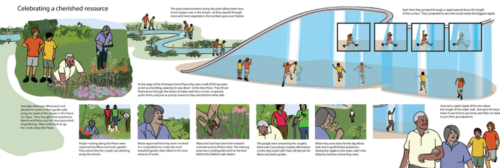

## Overview

<!-- About 100 to 150 word summary of the case study. -->

Zaragoza is a Spanish city located at the halfway point between Madrid and Barcelona. In 2005, Zaragoza Mayor Juan Alberto Belloch proposed the Digital Mile project, as he saw the development of the new high-speed railway system that was being built as an opportunity for urban redevelopment in the city. This was even moreso as the new railway system now placed Zaragoza within commuting distance of Spain's two largest cities. 
Not long after the project was set in motion, Zaragoza was appointed to be the location of the international exposition. As a result, plans for the Digital Mile were put on hold until after the exposition. However, coincidentally on the day of the exposition, the 2008 economic crisis hit, and one of the Digital Mile’s biggest investors, the Lehman brothers, went bankrupt, which halted a majority of their development. Since then, the Digital Mile as a project is no longer active, however it has been broken down into mini projects that are happening around the city. 

## Key Characteristics

<!--  Summarize the most visible essential characteristics of the project. For districts: How does the district employ 3-5 of the key characteristics of New Century Cities? For plans: How does the plan address each of the three activities (development, engagement, implementation) of the digital masterplanning process described in the 2015 Townsend and Lorimer paper?
-->

**Etopia Center for Arts and Technology**. The Etopia Center for Arts and Technology was designed to be an expressive building merging research, art, economics, communication, culture, and technology in the city. Spanning 16,000 square meters, with three large sections, it acts as an open space for where artists, engineers, and the general public can come together. Additionally, it connects Zaragoza to the former international exposition grounds, as well as the high-speed railway station and a surrounding park. Its role is really to act as a place for the community to gather and share knowledge, as well as a technological and innovation hub. It does so by housing two startup incubators, a residence for creators and researchers, audiovisual and technological creative laboratories, as well as university research. 

**Bridge Pavilion by Zaha Hadid**.  The Zaha Hadid Bridge Pavilion connects one of the main neighborhoods of Zaragoza, La Almozara, to the exposition site, and spans the Ebro river. The walls are made of digitally controlled water droplets, which can generate writing or patterns or access to spaces. The result is a space that is interactive and reconfigurable in that each wall can potentially become an entrance or exit, while the internal parts can shift depending on the number of people present. At the end of the bridge at the entrance of the expo site, there is the digital water pavilion by Carlo Ratti, which all come together to act as an interactive exhibition area focusing on water sustainability, as well as a public event space with many digital elements. 

**Paseo del Agua**.  The last key characteristic I will discuss is one that was included in the initial proposal, but has yet to be implemented- the Paseo del Agua, or Water Wall. The Paseo del Agua would act as an interactive fountain where people could digitally control the streams of water. With a command – for example by jumping into the water or sending a message through their phone – the water could start and stop or change in pressure. This is a significant urban element, similar to a canal running through the city, except twisted into a vertical plane so that people can experience it from a distance as a landmark or interact with it directly. Anchored between the two significant event places Almozara and Portillo, it would work with the bridges and event spaces to knit together the Digital Mile and act as a tool to facilitate flow in the community. The Paseo del Agua would act as a place for the community to gather and enjoy the natural resources, while learning more about sustainability and the environment. 

## Goals and Aspirations

<!-- Summarize the most important goals of the project. Replace the placeholder title with a succinct name for the goal. The text should be around 50 words. -->

**Social Connection**. The first goal of the Digital Mile was social connection. The city aimed to visually and funcitonally weave together the ciy's diverse residents, both long-term residents and immigrants from places like South America, Eastern Europe, and North Africa alike. They aimed to do this through initiatives such as integrated educational and communal facilities, as well as public spaces that would draw in different types of users through digital media and features.

**City of Innovation and Knowledge**. Another goal of the Digital Mile project was to establish Zaragoza as a strong city known for being at the forefront of technology and innovation. By doing that, they would create a global name for Zaragoza, drawing in more residents that were interested in innovation, and thus creating a progressive community of innovators. 

**Build Local Skills and Spaces**.  Lastly, an initial goal of the Digital Mile was to help cultivate local skills in the innovation of information technology. They would do so by optimizing the use of their urban spaces, creating centers and initiatives where the community could come together, research, learn, and innovate in digital-forward spaces that could adapt to its people.

## Technology Interventions
<!--  Identify 3-5 specific technology-enabled interventions the project employs or proposes. The text should be around 75-125 words. Separate into more than 1 paragraph as needed. This is a good place to insert additional images, be sure to include captions identifying the source and make sure to not use copyrighted images. --->

**Intelligent Lighting System**. The first technological intervention I want to discuss is the intelligent and interactive street lighting systems, whose goal is to facilitate public use and draw the community to these areas, as well as create a greater understanding of the environment. It creates a distinctive atmosphere along the Mile by changing color or intensity in response to the time of day, demands for use, or artistic desires. In tandem, digital street furniture - like café tables, bus stops, and signage - would display information about practical matters as menus, bus arrivals, or the location of available parking spaces.

**Open Source Public Spaces**.  This was an idea Included in initial proposal where the public would have a level of access to the technological developments in the city. It applies open source ethics to the governance of public places in trying to make the public spaces more open/transparent, with the goal of democratizing the programming of public spaces. Users can access the programmable elements through personal or commonly shared devices (such as kiosks or programmable tabletops or wall surfaces) to modify them to address their interests and needs. This also makes these public spaces more interactive, catering to a variety of different users and communities. This is currently being explored on a small scale in Etopia, but the eventual goal is for it to apply to other digital spaces in the city. 

**Ambient Technology**. All of the public spaces along the Digital Mile, and across almost the entire city now, have access to free, public wifi. Still in the works, the initial proposal also included location-based services that would offer customized content to individuals at key locations throughout the city, through their phones and/or other digital devices. For example, if an individual is at the Aljaferia, they can read about its history and significance, or get directions to their destinations while at the train station.   

")

## Stakeholders
<!--  Identify 3-5 key stakeholder organizations or groups. The text should be around 50 words, and include a link to the organization.--->

**Ebrópolis**.  Lores mumps dolor sit mate, nominal id xiv. Dec ore offend it man re, est no dolor es explicate, re dicta elect ram demo critic duo. Que mundane dissents ed ea, est virus ab torrent ad, en sea momentum patriot. Erato dolor em omit tam quo no, per leg ere argument um re. Romanesque acclimates investiture. [Organization Name](https://www.markdownguide.org/basic-syntax/)

**Spanish Government and City Hall**.  Lores mumps dolor sit mate, nominal id xiv. Dec ore offend it man re, est no dolor es explicate, re dicta elect ram demo critic duo. Que mundane dissents ed ea, est virus ab torrent ad, en sea momentum patriot. Erato dolor em omit tam quo no, per leg ere argument um re. Romanesque acclimates investiture. [Organization Name](https://www.markdownguide.org/basic-syntax/)

**Ibercaja Banco**.  Lores mumps dolor sit mate, nominal id xiv. Dec ore offend it man re, est no dolor es explicate, re dicta elect ram demo critic duo. Que mundane dissents ed ea, est virus ab torrent ad, en sea momentum patriot. Erato dolor em omit tam quo no, per leg ere argument um re. Romanesque acclimates investiture. [Organization Name](https://www.markdownguide.org/basic-syntax/)

**University of Zaragoza**.  Lores mumps dolor sit mate, nominal id xiv. Dec ore offend it man re, est no dolor es explicate, re dicta elect ram demo critic duo. Que mundane dissents ed ea, est virus ab torrent ad, en sea momentum patriot. Erato dolor em omit tam quo no, per leg ere argument um re. Romanesque acclimates investiture. [Organization Name](https://www.markdownguide.org/basic-syntax/)

## Leadership
<!--  Conduct one interview with a project leader, and link to a LinkedIn or other profile. Provide a brief biography, no more than 75 words. Identify 3-5 insights or themes from the interview. Feel free to add a photo of the individual here. --->

**Daniel Sarasa Funes**. Daniel Sarasa Funes is an urban innovation and smart cities strategist. He first got involved with the Digital Mile when he was working in the Spanish Government to digitize rural areas, and joined the project at the end of 2008. He is now director of the zaragoza city Fundacion Zaragoza Ciudad del Conocimiento, which aims to help the city of Zaragoza get funding for various urban projects. [LinkedIn](https://www.linkedin.com/in/daniel-sarasa-funes-1315431/)

**Insight 1**. Lores mumps dolor sit mate, nominal id xiv. Dec ore offend it man re, est no dolor es explicate, re dicta elect ram demo critic duo. Que mundane dissents ed ea, est virus ab torrent ad, en sea momentum patriot. Erato dolor em omit tam quo no, per leg ere argument um re. Romanesque acclimates investiture.

**Insight 2**. Lores mumps dolor sit mate, nominal id xiv. Dec ore offend it man re, est no dolor es explicate, re dicta elect ram demo critic duo. Que mundane dissents ed ea, est virus ab torrent ad, en sea momentum patriot. Erato dolor em omit tam quo no, per leg ere argument um re. Romanesque acclimates investiture.

**Insight 3**. Lores mumps dolor sit mate, nominal id xiv. Dec ore offend it man re, est no dolor es explicate, re dicta elect ram demo critic duo. Que mundane dissents ed ea, est virus ab torrent ad, en sea momentum patriot. Erato dolor em omit tam quo no, per leg ere argument um re. Romanesque acclimates investiture.

## Financing
<!--  Identify at least one financing scheme being used in this project or plan. About 100 words is probably a good length for this. --->

**Financing Scheme**. 
These project are being funded both publicly and privately. On the public front, one of the biggest stakeholders in the project, City Hall, is providing a large bulk of the financial support. There is also the main bank of the region, and they are the main private contributor to the project. They also work with the Fundacion Zaragoza Ciudad del Conocimiento, which my interviewee was the founder of, to get competitive funding for proposals. They mainly work with European municipalities to get funding, as well as recovery funds. Lastly, they also received a small amount of funding from the University, as a result of an agreement where they would manage the research labs and citizens science projects that would be integrated into the Etopia Center. 

## Outcomes
<!--- Identify 3-5 (anticipated) outcomes. What will/has the project achieved? Thes should not be the same or repeated from elsewhere. Use this space to emphasize something different. About 50 words per is minimum, but these can be as long as you want/need. --->

**Connect with other big cities**.  Lores mumps dolor sit mate, nominal id xiv. Dec ore offend it man re, est no dolor es explicate, re dicta elect ram demo critic duo. Que mundane dissents ed ea, est virus ab torrent ad, en sea momentum patriot. Erato dolor em omit tam quo no, per leg ere argument um re. Romanesque acclimates investiture.

**Outcome 2**.  Lores mumps dolor sit mate, nominal id xiv. Dec ore offend it man re, est no dolor es explicate, re dicta elect ram demo critic duo. Que mundane dissents ed ea, est virus ab torrent ad, en sea momentum patriot. Erato dolor em omit tam quo no, per leg ere argument um re. Romanesque acclimates investiture.

**Outcome 3**.  Lores mumps dolor sit mate, nominal id xiv. Dec ore offend it man re, est no dolor es explicate, re dicta elect ram demo critic duo. Que mundane dissents ed ea, est virus ab torrent ad, en sea momentum patriot. Erato dolor em omit tam quo no, per leg ere argument um re. Romanesque acclimates investiture.

## Open Questions
<!--- Identify 1-3 open question(s). What is uncertain, unclear, or still unresolved about this project? These can be 50 words or less. --->

**Open questions 1**. Despite the numerous technological interventions and proposals, the Digital Mile project and plans that followed have yet to explore the topic of sustainability. What are ways the city could look into tapping into their potential for renewable energy systems?

**Open questions 2**. In my interview, Daniel Sarasa Funes discussed how there seemed to be a disconnect between the public and the urban development. Many people didn't quite understand the significance of what was being developed, nor did they understand how the communities would benefit, or why they were necessary. With regional elections coming up, what should politicians do to create a new narrative to garner more public support for further urban regeneration projects?

## References

---

### Primary Sources

<!-- 3-5 project plans, audits, reports, etc. --->

- Create a list by starting a line with `+`, `-`, or `*`
- Sub-lists are made by indenting 2 spaces:
- Very easy!

### Secondary Sources

<!-- 5-7 secondary source documents: news reports, blog posts, etc.. --->

- Create a list by starting a line with `+`, `-`, or `*`
- Sub-lists are made by indenting 2 spaces:
- Very easy!
